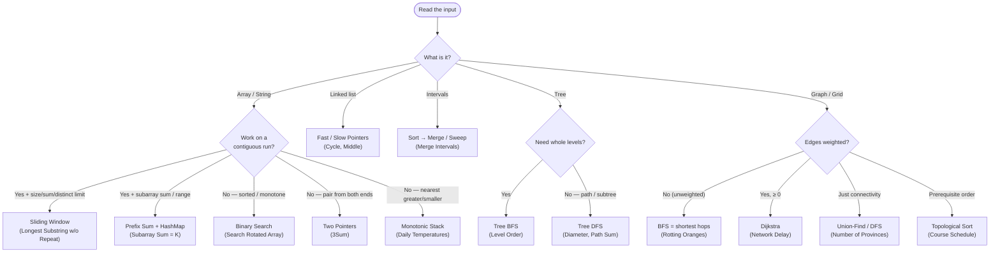
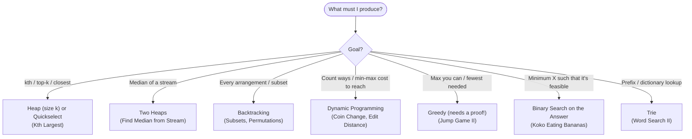

Part II

The 21 Core Patterns

The heart of the book — one deep chapter per pattern. Opens with the <b>recognition framework</b> (a decision tree and signal-to-pattern trigger tables) that route any new problem to the right technique in the first two minutes. Each of the 21 patterns then gets its own chapter: why it exists, when to use it, how to use it, when NOT to use it, canonical problems, and variations. Data structures (Arrays, Hashing containers, Linked Lists, Trees, Heaps, Trie, Graphs) live in <b>Part III</b>.

# The "Which Pattern?" Decision Tree

Most interview problems are a familiar pattern in disguise. The hard part is *recognizing* which one in the first two minutes. This chapter turns that into a mechanical routine: ask three questions in order, and the pattern falls out.

> [key] **The three questions, always in this order** — (1) **What is the input shaped like?** (a contiguous run? a sorted array? a tree? a graph? intervals?) (2) **What am I asked to produce?** (find one thing? count? optimize a number? generate everything?) (3) **What do the constraints allow?** (the size of `n` fixes the complexity class — see Part I). Input shape usually narrows you to two or three candidates; the goal picks the winner.

### Route 1 — start from the *input shape*

<b>How to read it:</b> Start at the top and answer one question at a time. First, <b>what is the input?</b> — that picks a branch (array, linked list, tree, graph, intervals). Then a follow-up narrows it further (e.g. for an array: "are we working on a contiguous run?"). Each leaf names the pattern <i>and</i> a real example problem to anchor it. You're not memorizing — you're walking a couple of yes/no questions from the shape of the input to the technique.

### Walking each branch — what the questions actually mean

Let's slow down and walk each yes/no path from the top, defining every term with concrete examples.

**Branch 1 — Contiguous run? → *yes* → size / sum / distinct limit? → *yes* → Sliding Window**

- **"Contiguous run"** means the answer is a block of **adjacent** elements — a subarray or substring — not a scattered selection. In `[5, 2, 3, 1, 7]`, the piece `[2, 3, 1]` is contiguous; `[5, 3, 7]` is not.
- **The "limit"** is the rule the window must obey, and it comes in three flavours:
  - **size** — a fixed window *length* `k`. *Example:* **Maximum Sum Subarray of Size K** — slide a width-`k` window and keep the best sum.
  - **sum** — a target on the window's *total*. *Example:* **Smallest Subarray with Sum ≥ target** — grow until the sum qualifies, then shrink to minimise.
  - **distinct** — a cap on how many *different* values may sit inside. *Example:* **Longest Substring with At Most K Distinct Characters** — shrink the moment a `(k+1)`-th distinct character appears.
- **Why the window works:** as it slides one step, only one element enters and one leaves, so you update the running sum/counts in O(1) instead of rescanning — that's the illustrated idea at the top of the Sliding Window chapter.

**Branch 2 — Contiguous run? → *yes* → subarray *sum / range query*? → Prefix Sum (+ HashMap)**

- You care about the **total over a range** — often for many queries, or with **negative** numbers (which break a sliding window). A *prefix sum* precomputes running totals so any range sum is a single subtraction.
- *Example:* **Subarray Sum Equals K** with negatives — store each prefix sum in a hash map and look up `prefix − k`.

**Branch 3 — Contiguous run? → *no* → sorted / monotone? → Binary Search**

- **"Sorted"** = values already in order. **"Monotone"** = some yes/no test flips from false to true exactly once as a value grows. Either one lets you discard half the search space each step.
- *Examples:* **Search in Rotated Sorted Array** (sorted-ish values); **Koko Eating Bananas** (monotone *feasibility* → binary search on the answer, even though the array itself isn't the thing being searched).

**Branch 4 — Contiguous run? → *no* → a pair / triplet from both ends? → Two Pointers**

- You need two positions satisfying a relation, and moving one end in a known direction can't make things worse — usually on a **sorted** array.
- *Example:* **3Sum** — fix one number, then converge two pointers inward for the other two.

**Branch 5 — Contiguous run? → *no* → nearest greater / smaller element? → Monotonic Stack**

- The question is "for each element, what is the next (or previous) *bigger/smaller* one?" A stack kept in sorted order answers all of them in a single pass.
- *Example:* **Daily Temperatures** — how many days until a warmer temperature.

**Linked list → Fast / Slow Pointers.** Two pointers at different speeds. Signals: detect a **cycle**, find the **middle**, or the **n-th from the end**. *Example:* **Linked List Cycle II**.

**Intervals → Sort + Merge / Sweep.** You have ranges `[start, end]` that may overlap. Sort by start and merge touching ones, or sweep +1/−1 events to count overlaps. *Examples:* **Merge Intervals**, **Meeting Rooms II**.

**Tree → BFS / DFS / BST.** *Need whole levels?* → **BFS** (level-order). *Path or subtree aggregate?* → **DFS** (post-order). *Values ordered (a BST)?* → **in-order** gives them sorted. *Examples:* **Binary Tree Level Order**, **Diameter of Binary Tree**, **Kth Smallest in a BST**.

**Graph → BFS / Dijkstra / Union-Find / Topo.** *Unweighted* shortest path? → **BFS**. *Weighted ≥ 0?* → **Dijkstra**. *Just "are these connected / how many groups?"* → **Union-Find**. *Ordering with prerequisites?* → **Topological Sort**. *Examples:* **Rotting Oranges**, **Network Delay Time**, **Number of Provinces**, **Course Schedule**.

### Route 2 — start from the *goal*

When the input shape is ambiguous, the **question being asked** routes you instead:

<b>How to read it:</b> Sometimes the input is just "an array" and shape alone doesn't decide anything — so ask instead <b>what am I being asked to produce?</b> The phrasing gives it away: "kth / top-k" → a heap; "generate every…" → backtracking; "how many ways / min cost to reach" → DP; "minimum X such that it works" → binary search on the answer. Match the phrase to the branch and you land on the pattern.

### How to read the tree — a worked routing

> [note] **Worked routing — Example 1.** Problem: *"Given a string, find the length of the longest substring with at most K distinct characters."* **Q1 · Is it a contiguous run?** Yes — a "substring" is contiguous. **Q2 · Is there a size / sum / distinct limit?** Yes — "at most K distinct." → Route 1 lands on **Sliding Window**. **Q3 · Does the input size agree?** `n` up to 10⁵ rules out O(n²), which confirms the O(n) window. **Verdict:** Sliding Window — classified in seconds.

> [note] **Worked routing — Example 2.** Problem: *"Minimum eating speed so Koko finishes all bananas in H hours."* **Q1 · What's the phrasing?** "**minimum X such that a condition holds**" → use Route 2 (start from the goal). **Q2 · Does the order of the data matter?** No — it's the *answer* (the speed) that is **monotone**: any speed ≥ the answer still finishes in time, so feasibility has a single true/false boundary. **Verdict:** **Binary Search on the Answer.**

### Recognition cards — trigger → pattern → example

The fastest lookup of all: match the **trigger** you feel in the prompt to a pattern. (This blends the compact trigger/invariant style readers liked in earlier editions.)

| You'll recognize it because… (trigger) | → Pattern | Example problem |
|---|---|---|
| "contiguous", "window", "substring" + a limit | [Sliding Window](#sliding-window) | Longest Substring w/o Repeat |
| "subarray sums to k", "count subarrays" (esp. with negatives) | [Prefix Sum + HashMap](#prefix-sum-difference-arrays) | Subarray Sum Equals K |
| array is **sorted / rotated**, or you need a boundary | [Binary Search](#binary-search-search-on-answer) | Search in Rotated Sorted Array |
| **"minimum/maximum X such that feasible"** (huge range) | [Binary Search on the Answer](#binary-search-search-on-answer) | Koko Eating Bananas |
| a **pair/triplet** with a target in a sortable array | [Two Pointers](#two-pointers) | 3Sum |
| "next/previous greater or smaller", spans, histogram | [Monotonic Stack](#monotonic-stack) | Daily Temperatures |
| cycle / middle / nth-from-end in a **linked list** | [Fast / Slow Pointers](#linked-lists) | Linked List Cycle II |
| array holds **1..n**, find missing/duplicate in O(1) space | [Cyclic Sort](#cyclic-sort) | Find the Missing Number |
| **"kth"**, "top k", "k closest", "k most frequent" | [Heap (size k) / Quickselect](#heaps-priority-queues) | Kth Largest Element |
| **median of a stream** | [Two Heaps](#heaps-priority-queues) | Find Median from Data Stream |
| merge **k** sorted lists / smallest covering range | [K-way Merge](#heaps-priority-queues) | Merge k Sorted Lists |
| **"intervals"**, "meetings", "overlap", "rooms" | [Sort + Merge / Sweep](#intervals-sweep-line) | Merge Intervals |
| **"prerequisites"**, "build order", cycle in a digraph | [Topological Sort](#graphs) | Course Schedule II |
| "islands", "provinces", "connected", "accounts" | [Union-Find / DFS/BFS](#graphs) | Number of Provinces |
| shortest path, **unweighted** | [BFS](#graphs) | Word Ladder |
| shortest path, **weighted ≥ 0** | [Dijkstra](#graphs) | Network Delay Time |
| "generate **all** …", place N queens, partitions | [Backtracking](#recursion-backtracking) | Subsets, N-Queens |
| "**how many ways**", "min/max cost to reach" | [Dynamic Programming](#dynamic-programming) | Coin Change |
| "prefix", "dictionary", "autocomplete" | [Trie](#tries-prefix-trees) | Implement Trie |
| set over **n ≤ 20**, "visit all", "assign each" | [Bitmask DP](#dynamic-programming) | Travelling Salesman |
| "single number", parity, XOR of pairs | [Bit Manipulation](#bit-manipulation) | Single Number |

## When two signals collide

<b>What &amp; why:</b> the decision tree and the recognition table above resolve almost every problem. This closes with the two judgement calls people still trip on.

> [key] **Key Insight** — Classification order that resolves 90% of problems: (1) read the **input shape** (contiguous? sorted? tree? graph? intervals?), (2) read the **objective** (find? count? optimize a scalar? enumerate all?), (3) read the **constraints** (n's magnitude picks the complexity class). Shape narrows the column, objective picks the row, constraints confirm the target O(·).

> [trap] **Common Trap** — Two signals can collide. "Longest substring without repeats" reads like DP but is **sliding window** (contiguous + monotone shrink). When a contiguous window with a monotone validity condition exists, prefer the O(n) window over O(n²) DP. Likewise "shortest path" defaults many to Dijkstra when **unweighted graphs want plain BFS**.

# The 21 Core Patterns — recognition &amp; navigation map

The rest of Part II is 21 pattern chapters, one per row of the master table below. This page is the **index and recognition guide** — start here, pick a pattern, jump straight to its chapter.

### Which structures does each pattern build on?

<b>What &amp; why:</b> patterns are the grammar; data structures are the vocabulary each one needs. Rusty on a structure? Jump to its <b>primer</b> in Part I. Want the deep dive on that structure? Jump to <b>Part III</b>. Every pattern chapter itself lives in Part II below.

| Pattern | Built on (jump to primer) | Container deep-dive (Part III) |
|---|---|---|
| Sliding Window | [Array](#array-int-t) · [HashMap](#hashmapkv-hashsete) | — |
| Two Pointers | [Array](#array-int-t) | — |
| Fast / Slow Pointers | [Linked list](#linked-list-nodes-and-javas-linkedlist) | [Linked Lists](#linked-lists) |
| Prefix Sum / Diff Array | [Array](#array-int-t) · [HashMap](#hashmapkv-hashsete) | — |
| Hashing | [HashMap / HashSet](#hashmapkv-hashsete) | — |
| Monotonic Stack | [ArrayDeque](#arraydequet-stack-and-queue-in-one) | — |
| Binary Search (+ on answer) | [Array](#array-int-t) | — |
| Top-K / Heap · K-way Merge | [PriorityQueue](#priorityqueuet-the-binary-heap) | [Heaps](#heaps-priority-queues) |
| Merge Intervals / Sweep | [Array](#array-int-t) sort · [TreeMap](#treemapkv-treesete-sorted-keys) | — |
| Topological Sort · Union-Find | [ArrayDeque](#arraydequet-stack-and-queue-in-one) · [Array](#array-int-t) | [Graphs](#graphs) |
| Greedy | [PriorityQueue](#priorityqueuet-the-binary-heap) | — |
| Backtracking | [Array](#array-int-t) + recursion | — |
| Divide &amp; Conquer · Quickselect | [Array](#array-int-t) | — |
| Dynamic Programming | [Array](#array-int-t) (dp table) | — |
| Trie | [Trie](#trie-prefix-tree-a-preview) | [Tries](#tries-prefix-trees) |
| Bit Manipulation / Bitmask | `int` as a bitset | — |

### The 21 patterns — master index

*What problem does each solve, why is the technique the right fit, and where to read its full chapter.* Every pattern chapter follows the same structure: **Why exists → When to use → How to use → When NOT to use → False friends → Canonical problems → Variations → Practice**.

| # | Pattern | The problem it solves (example) | How / why the pattern fits | Full chapter (Part II) |
|---|---|---|---|---|
| 1 | Sliding Window | Longest/shortest contiguous run under a limit — *"longest substring with ≤ K distinct chars."* | The window's validity is monotone, so you expand and only shrink when broken — visiting each index once instead of re-checking every substring. | [→ Sliding Window](#sliding-window) |
| 2 | Two Pointers | Find a pair/triplet or partition in a sorted array — *"3 numbers summing to 0."* | Sortedness means a too-big sum can only shrink by moving the right pointer left — each move eliminates a whole set of pairs. | [→ Two Pointers](#two-pointers) |
| 3 | Fast/Slow Pointers | Cycle, middle, or nth-from-end of a linked list — *"does this list loop?"* | Two speeds must meet inside any loop; with no extra memory, the meeting point plus algebra locates the cycle's start. | [→ Linked Lists · Fast/Slow](#linked-lists) |
| 4 | Prefix Sum / Diff Array | Many range sums or "count subarrays with sum k" — *even with negatives.* | A range sum becomes a subtraction of two prefixes; storing prefixes in a map turns "= k" into an O(1) lookup a window can't do. | [→ Prefix Sum](#prefix-sum-difference-arrays) |
| 5 | Hashing (pattern) | Membership/frequency/complement — *"two numbers adding to target."* | Trading memory for O(1) recall of what you've seen collapses a nested O(n²) scan to one pass. | [→ Hashing pattern](#arrays-hashing) |
| 6 | Monotonic Stack | Nearest greater/smaller, spans, histograms — *"days until a warmer day."* | Keeping the stack sorted means each element you pop has just found its answer; every index is pushed/popped once → O(n). | [→ Monotonic Stack](#monotonic-stack) |
| 7 | Binary Search | Locate a value/boundary in sorted/monotone data — *"first position of x."* | A single true/false test on the midpoint discards half the space each step. | [→ Binary Search](#binary-search-search-on-answer) |
| 8 | Binary Search on Answer | "Least capacity/speed/time that works" — *"slowest speed Koko can eat at."* | Feasibility flips false→true exactly once, so you binary-search the threshold and test each guess in O(n). | [→ Binary Search & Search-on-Answer](#binary-search-search-on-answer) |
| 9 | Top-K / Heap | k largest/smallest/most-frequent — *"3 most frequent words."* | A size-k heap of the opposite polarity keeps exactly the best k, evicting the worst in O(log k). | [→ Heaps · Top-K](#heaps-priority-queues) |
| 10 | K-way Merge | Merge k sorted lists / smallest covering range — *"merge k sorted linked lists."* | A heap of each list's current head always surfaces the global next-smallest. | [→ Heaps · K-way Merge](#heaps-priority-queues) |
| 11 | Merge Intervals | Combine/insert overlapping intervals — *"merge [1,3],[2,6] → [1,6]."* | Sort by start, then overlap with the running interval is a single comparison. | [→ Intervals · Merge](#intervals-sweep-line) |
| 12 | Sweep Line | Peak concurrency / coverage — *"minimum meeting rooms."* | Turn intervals into +1/−1 events and sweep; the running sum is the live count at each point. | [→ Intervals · Sweep Line](#intervals-sweep-line) |
| 13 | Topological Sort | Order tasks with prerequisites — *"course schedule with deps."* | Repeatedly emit a node whose prerequisites are all done; if you can't finish, a cycle exists. | [→ Graphs · Topological Sort](#graphs) |
| 14 | Union-Find (DSU) | Dynamic connectivity/grouping — *"how many friend circles?"* | Path-compressed parent pointers answer "same group?" in ~O(1) as edges arrive. | [→ Graphs · Union-Find](#graphs) |
| 15 | Greedy | "Fewest/most you can" with a safe local choice — *"minimum jumps to the end."* | When an exchange argument proves the locally-best choice is never regretted, commit and never backtrack. | [→ Greedy](#greedy) |
| 16 | Backtracking | Generate all valid arrangements — *"all subsets / N-Queens."* | DFS the choice tree: choose → recurse → undo, pruning dead branches so the exponent stays tame. | [→ Recursion & Backtracking](#recursion-backtracking) |
| 17 | Divide & Conquer | Answer composes from independent halves — *"count smaller elements to the right."* | Solve halves, then a clever O(n) combine (e.g. counting during a merge) yields the whole. | [→ Divide & Conquer](#divide-conquer) |
| 18 | Dynamic Programming | "How many ways / min-max cost" with reuse — *"fewest coins to make N."* | Overlapping subproblems + optimal substructure: define a state, solve each once, reuse. | [→ Dynamic Programming](#dynamic-programming) |
| 19 | Trie (pattern) | Prefix/dictionary queries — *"autocomplete / does any word start with 'ca'?"* | A path spells a prefix; shared prefixes give O(L) queries independent of dictionary size. | [→ Tries](#tries-prefix-trees) |
| 20 | Bit Manipulation / Bitmask | Parity/sets over ≤ 20 items — *"the one number that isn't duplicated."* | Bits are a set/vector: XOR cancels pairs; a mask encodes "which elements are used." | [→ Bit Manipulation](#bit-manipulation) |
| 21 | Quickselect | kth smallest/largest, one-shot — *"kth largest element."* | Partition puts the pivot at its final rank; recurse only into the side containing k → O(n) average. | [→ Quickselect](#quickselect) |

> [key] **How to use this book** — patterns (the algorithmic *techniques*) are Part II. Data structures (the *containers*: Arrays, Strings, Linked Lists, Trees, Heaps, Trie, Graphs) are Part III. When you're learning a pattern that uses a specific container, jump to Part III for the container's mechanics. When you already know both, work the pattern chapter end-to-end.

