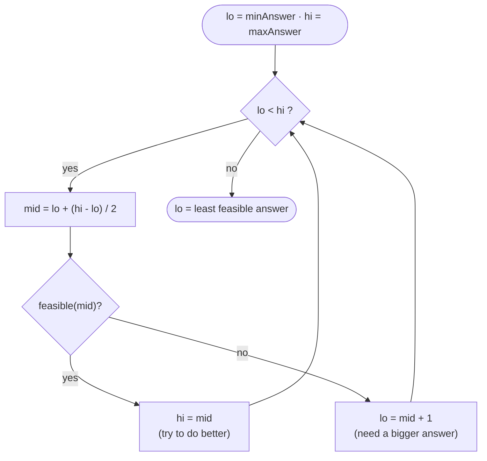

# Binary Search &amp; Search-on-Answer


<PatternVideo pattern-name="Binary Search" duration="8–12 min" />

<PatternProgress pattern-id="binary-search" problems="binary-search-rotated-sorted, binary-search, find-minimum-in-rotated-sorted-array, find-peak-element, search-in-rotated-sorted-array-ii" />


## Why binary search exists — the story

You get an on-call ping at 3 AM: the payments service is misbehaving on a specific `order_id`. Your logs are sorted by `order_id`. There are **50 million rows**. You need to find one.

The honest first attempt is linear scan: read each row, compare, move on. It's a `while` loop and a print statement. Correct. And for a small file — say, the last hour's traffic, 100,000 rows — you're done in a second. That is the *reason* linear scan survived so long as an interview answer: it works, it's easy to prove correct, and for small n it's actually the fastest thing (branch predictors love it).

But at 50 million rows, linear scan takes about **half a second** — and 20 alerts fire in parallel while you wait. At 5 *billion* rows, you're waiting a minute. Every one of those comparisons is throwing away the fact that your logs are *sorted*: after checking row 500 and seeing `order_id = 42_000`, you've just proven every row before 500 has a smaller id. Ignoring that fact is what makes linear scan wasteful.

Binary search is the fix. Look at the *middle* row. If its `order_id` matches, you're done. If it's too big, the target must be in the left half — throw the right half away. Too small? Symmetric. Each step **halves** the search space, so 50 million rows collapse to `log₂(5·10⁷) ≈ 25` steps. **Half a second → 25 nanoseconds.** A 20-million-times speedup for four lines of code.

## The core idea — halving is not enough; you need an *invariant*

<BinarySearchAnim />

Every real binary-search bug — and there are many — comes from one root cause: **the writer had a fuzzy idea of what the loop invariant was**. Before you write `int mid = (lo + hi) / 2`, you must be able to state precisely:

> "At every iteration, the answer (if it exists) lies inside the interval `[lo, hi]` (or `[lo, hi)` — pick one **and stick with it**)."

Half the interview candidates I've watched code binary search on a whiteboard don't pass this test. They know the shape of the loop, they can write `lo + (hi - lo) / 2`, but when I ask *"what does `hi` mean after the loop exits?"* they freeze. If you cannot answer that in one sentence, your loop will infinite-loop or return an off-by-one answer.

There are three template families, each with a different invariant. Pick one, memorize it cold, and use it everywhere. Switching templates mid-problem is where careers go to die.

## When to use it — recognition signals

Binary search is applicable when your input has any of these shapes:

- **Sorted or monotonic data** — the classic. Sorted array, sorted list of files, sorted rows in a DB index.
- **Monotonic predicate on an unsorted-looking domain** — this is the "search on answer" pattern. If you can define a boolean function `feasible(x)` that is `false` for `x < answer` and `true` for `x ≥ answer` (or vice-versa), binary-search the domain of `x`. Classic examples: "smallest capacity that ships packages in `D` days", "minimum time Koko needs to eat all bananas", "smallest maximum sub-array sum with `k` splits."
- **Rotated sorted array** — at least one half around `mid` is sorted; check which and recurse.
- **Boundary problems** — "find the first index where `a[i] ≥ target`" or "the last index where `a[i] ≤ target`". These are *lower_bound* / *upper_bound* variants and appear in every leveling-guide problem.
- **A function has a valley or peak** — ternary or binary search on derivative-sign.
- **Constants that make O(log n) matter** — DB indexes, geometric algorithms with tight n·log n bounds, streaming median with sorted multiset.

If the interviewer says the words *"sorted"*, *"monotonic"*, *"minimum X such that ..."*, or *"maximum X such that ..."*, binary search should be your first hypothesis.

## When NOT to use it

- **Unsorted data with no monotonic predicate** — sorting to enable binary search costs O(n log n), which is worse than a straight O(n) hash-map lookup. Only sort-then-binary-search if you'll do many queries against the same data.
- **You need every match, not the first** — plain iteration is easier and often just as fast (or a range query with `lower_bound` + `upper_bound`).
- **The array is small (`n ≤ 32`)** — linear scan is faster in practice: no branch misprediction, cache-friendly, and the `log₂ 32 = 5` comparisons plus overhead lose to a straight loop.
- **The data has duplicates and the interviewer wants *all* occurrences** — do a lower-bound binary search followed by linear expansion, or use two binary searches (lower + upper). Don't try to hack it inside one loop.
- **The interval's "feasibility" is not monotonic** — e.g., "smallest `x` such that some non-monotone metric is minimized." Binary search silently returns the wrong answer here. Verify monotonicity on paper first.
- **Floating-point ranges without a stopping criterion** — you must fix either an epsilon tolerance or an iteration cap, otherwise the loop never terminates.

> [inv] **Invariant — the target (if it exists) always lies in `[lo, hi]` (or `[lo, hi)` — pick one).** This is the single most important sentence in binary search. Before writing the loop, state it out loud. On every branch of the update logic, verify: did I preserve the invariant, or did I possibly discard the target?

> [inv] **Invariant — `hi - lo` strictly decreases every iteration.** For closed-interval `[lo, hi]` with `lo <= hi`, either `lo` increases (via `mid + 1`) or `hi` decreases (via `mid - 1`) on every iteration. The interval shrinks until empty. If your loop can iterate without shrinking `hi - lo`, you have an infinite loop.

> [inv] **Invariant — for lower-bound `[lo, hi)`, after the loop `lo == hi == first index where P is true`.** Every index `< lo` fails predicate `P`; every index `≥ hi` satisfies `P`. When `lo == hi`, the boundary is found. If no index satisfies `P`, `lo == a.length` (an off-the-end sentinel).

## The three templates — memorize *one* form of each

### Template 1: closed interval `[lo, hi]`

The most common. The interval always contains valid indices. Loop while `lo ≤ hi`.

```java
int binarySearchClosed(int[] a, int target) {
    int lo = 0, hi = a.length - 1;             // closed interval [lo, hi]
    while (lo <= hi) {                          // <= because [lo, hi] includes hi
        int mid = lo + (hi - lo) / 2;           // safe against int overflow
        if      (a[mid] == target) return mid;
        else if (a[mid] < target)  lo = mid + 1;   // discard [lo..mid], now [mid+1, hi]
        else                       hi = mid - 1;   // discard [mid..hi], now [lo, mid-1]
    }
    return -1;                                  // interval empty; target not present
}
```

**Invariant:** if `target` exists in `a`, its index lies in `[lo, hi]`. When `lo > hi`, the interval is empty → not found.
**When to reach for it:** you need to *find an exact match* on a sorted array. Simple, symmetric, no boundary trickery.

### Template 2: half-open interval `[lo, hi)` — lower bound

Returns the smallest index `i` such that `a[i] ≥ target`. Returns `a.length` if no such index exists. This is Java's `Collections.binarySearch` semantic and C++ `std::lower_bound`.

```java
int lowerBound(int[] a, int target) {
    int lo = 0, hi = a.length;                  // half-open [lo, hi); hi = n is *past* last index
    while (lo < hi) {                            // < because [lo, hi) excludes hi
        int mid = lo + (hi - lo) / 2;
        if (a[mid] < target) lo = mid + 1;      // [mid..hi) still valid, mid itself is < target
        else                 hi = mid;          // a[mid] ≥ target — mid might be the answer; keep it
    }
    return lo;                                   // lo == hi == first index with a[i] ≥ target
}
```

**Invariant:** every index `< lo` has `a[i] < target`; every index `≥ hi` has `a[i] ≥ target`. On exit, `lo == hi` is the boundary.
**When to reach for it:** *boundary problems*. "Find the first / last occurrence", "count values ≥ X", "insertion point." This is the most reusable template — nearly every "at what index does X first become true?" problem reduces to it.

### Template 3: search on answer (feasibility)

The pattern that makes staff engineers. You are not searching an array — you're binary-searching the *answer*.

```java
int searchOnAnswer(int lo, int hi) {          // lo = min plausible answer; hi = max
    while (lo < hi) {                          // half-open convention
        int mid = lo + (hi - lo) / 2;
        if (feasible(mid)) hi = mid;           // mid works — but maybe smaller works too
        else               lo = mid + 1;       // mid doesn't work — answer is strictly larger
    }
    return lo;                                 // smallest feasible value
}
// feasible(x) must be monotonic: false for x < answer, true for x ≥ answer.
```

**Invariant:** every `x < lo` is infeasible; every `x ≥ hi` is feasible. On exit `lo` is the boundary — the *smallest* feasible answer.
**When to reach for it:** the problem statement is a minimization or maximization with a "verify a candidate answer in linear time" structure. Koko Eating Bananas, Capacity to Ship Packages, Split Array Largest Sum — the entire Wave 2 chapter on this pattern.

### Complexity summary

| Template | Time | Space | Best use |
|---|---|---|---|
| Closed `[lo, hi]` | O(log n) | O(1) | Exact match on sorted array |
| Lower bound `[lo, hi)` | O(log n) | O(1) | Boundary / first-occurrence / count |
| Search on answer | O(log(hi − lo) × Θ(feasibility)) | O(1) | Feasibility-based optimization |

## Traps & gotchas — the 5 that fail candidates on interview day

> [trap] **Trap 1 — `int mid = (lo + hi) / 2` overflows.** For `lo = hi = 2·10⁹`, `lo + hi = 4·10⁹` — larger than `Integer.MAX_VALUE`, wraps negative, and `mid` becomes negative. Your program then reads `a[-1]`, throws, or worse, silently returns the wrong answer. **Every implementation of `binarySearch` in the JDK had this bug for 9 years** until Josh Bloch fixed it in 2006 (Google's blog post: *"Nearly All Binary Searches and Mergesorts are Broken"*). Fix: `int mid = lo + (hi - lo) / 2;` — never subtract instead of adding. Say the words *"Bloch overflow fix"* aloud in your interview.

> [trap] **Trap 2 — Mixing `<` and `<=` between templates.** If you use `lo ≤ hi` (closed template) but write `hi = mid` (half-open update), you infinite-loop when `lo == hi == mid`. If you use `lo < hi` but write `hi = mid - 1`, you may skip the answer when it lies at `mid`. The fix is a rule: **pick one interval convention, and every branch of your update logic must respect it.** Do not switch conventions inside a single function.

> [trap] **Trap 3 — `feasible(mid)` returns the wrong direction of monotonicity.** In search-on-answer, you must be 100% sure whether "feasible" grows as `x` grows or shrinks. Get this backwards and you binary-search into the wrong half. **Sanity check on paper:** try `feasible(lo)` and `feasible(hi)`; verify one is true and the other false. If both agree, you have a boundary problem — not a feasibility problem.

> [trap] **Trap 4 — Off-by-one on the return value.** After the loop exits with `lo == hi`, is that the answer, or the answer + 1, or `-1` if not found? This depends on your template. **Interview move:** after coding the loop, write a comment above the `return` line stating what `lo` (or `hi`) *means* in your invariant language. That comment forces you to notice off-by-one errors *before* running tests.

> [trap] **Trap 5 — Rotated array template contamination.** When solving "search in a rotated sorted array", candidates copy the plain binary-search template and add branches for rotation. This gets messy fast (5–6 branches) and produces subtle bugs. **Cleaner:** first binary-search the *pivot* (the smallest element's index) with a boundary-style template, then binary-search the correct rotated half using the plain template. Two clean searches beat one messy one.

## History — 30 years of broken implementations

Binary search was first described by **John Mauchly in 1946**, one of the earliest algorithms ever formally analyzed. Yet in 2006, Josh Bloch published *"Nearly All Binary Searches and Mergesorts are Broken"* on the Google Research blog, revealing that essentially every JDK implementation (Java 1.0 through Java 5) contained the `mid = (lo + hi) / 2` overflow bug — for arrays larger than about a billion elements, the answer was wrong. Bloch had co-authored *Java: The Java Programming Language* and *Effective Java*; he found the bug while reading the code of his own book's `Arrays.binarySearch`.

Bloch's exact quote: *"the general point that I want to make is much larger. It is that even careful programmers make horrible mistakes."* Mention this in an interview and the seasoned interviewer will smile — because you just signaled that you understand binary search is deceptively simple *and* dangerously bug-prone.

The full technique family — including search-on-answer — was formalized by **Nimrod Megiddo** in 1979 as *"parametric search"*. His paper on optimization by binary-searching the answer space became the template for a generation of geometric algorithms (nearest-neighbor, minimum-enclosing-circle).

## Canonical problem walkthrough — Search in Rotated Sorted Array

**Problem** ([↗ LeetCode](https://leetcode.com/problems/search-in-rotated-sorted-array/)): You have a sorted array of distinct integers that has been rotated at an unknown pivot — e.g., `[4,5,6,7,0,1,2]` was originally `[0,1,2,4,5,6,7]` rotated. Given a target, return its index or -1. Must run in O(log n).

### Approach 1 — Brute force (the reference)

Linear scan. O(n). This is what your junior teammate writes.

```java
int searchLinear(int[] a, int target) {
    for (int i = 0; i < a.length; i++) if (a[i] == target) return i;
    return -1;
}
```

Correct but doesn't meet the O(log n) constraint. State it, then move on.

### Approach 2 — Find pivot, then two searches (the modular one)

**Step 1:** binary-search the pivot index (position of the smallest element). The rotated array has *two* monotonic halves; the pivot is where they meet.

**Step 2:** binary-search the correct half.

```java
int searchByPivot(int[] a, int target) {
    int n = a.length;
    int pivot = findPivot(a);                   // index of smallest
    // Two sorted halves: [0, pivot) and [pivot, n). Search the right one.
    if (pivot == 0 || target < a[0]) {
        return binarySearch(a, target, pivot, n - 1);
    } else {
        return binarySearch(a, target, 0, pivot - 1);
    }
}

int findPivot(int[] a) {
    int lo = 0, hi = a.length - 1;
    while (lo < hi) {
        int mid = lo + (hi - lo) / 2;
        if (a[mid] > a[hi]) lo = mid + 1;       // pivot in right half
        else                hi = mid;           // pivot at mid or left
    }
    return lo;
}
```

**Complexity:** O(log n) time, O(1) space. Two clean binary searches.
**Trade-off:** twice the code, but each half is a template you can recite from memory. Much easier to debug live in an interview.

### Approach 3 — Single-pass modified binary search (the compact one)

At each step, at least one half of `[lo, mid]` and `[mid, hi]` is sorted. Determine which, check if target lies in the sorted half, and shrink accordingly.

```java
int searchOnePass(int[] a, int target) {
    int lo = 0, hi = a.length - 1;
    while (lo <= hi) {
        int mid = lo + (hi - lo) / 2;
        if (a[mid] == target) return mid;
        // Which half is sorted?
        if (a[lo] <= a[mid]) {                          // left half [lo..mid] is sorted
            if (target >= a[lo] && target < a[mid]) hi = mid - 1;
            else                                     lo = mid + 1;
        } else {                                        // right half [mid..hi] is sorted
            if (target > a[mid] && target <= a[hi])  lo = mid + 1;
            else                                     hi = mid - 1;
        }
    }
    return -1;
}
```

**Complexity:** O(log n) time, O(1) space. Half the LOC, but you must trace through the branch logic to convince yourself of correctness.
**Interview delivery:** implement Approach 2 first (safer). Say *"I could compact this into a single-pass loop by determining which half is sorted at each step; happy to do that if we have time."* Only write Approach 3 if the interviewer explicitly asks.

### Complexity ladder

| Approach | Time | Space | Best use |
|---|---|---|---|
| Linear scan | O(n) | O(1) | State only; violates the problem constraint |
| Find pivot + two searches | O(log n) | O(1) | Clean, modular, debuggable — interview default |
| Single-pass modified BS | O(log n) | O(1) | Compact but requires care; contest / follow-up |


<BinarySearchAnim />

```svg
<svg width="720" height="176" viewBox="0 0 720 176" xmlns="http://www.w3.org/2000/svg" font-family="Segoe UI, Arial, sans-serif">
  <rect x="0" y="0" width="720" height="176" fill="var(--dsa-bg)"/>
  <text x="20" y="26" font-size="13" font-weight="700" fill="var(--dsa-primary)">search for a value — each guess throws away half</text>

  <!-- step 1: whole range, mid in middle -->
  <text x="20" y="58" font-size="11" fill="var(--dsa-neutral)">step 1</text>
  <rect x="70"  y="44" width="580" height="24" rx="5" fill="var(--dsa-primary-soft)" stroke="var(--dsa-primary-line)"/>
  <rect x="350" y="42" width="30" height="28" rx="5" fill="var(--dsa-primary-soft)" stroke="var(--dsa-primary)" stroke-width="1.6"/>
  <text x="365" y="61" text-anchor="middle" font-size="11" font-weight="700" fill="var(--dsa-primary)">mid</text>
  <rect x="70" y="44" width="280" height="24" rx="5" fill="var(--dsa-danger-soft)" fill-opacity="0.55" stroke="none"/>
  <text x="210" y="61" text-anchor="middle" font-size="10" fill="var(--dsa-danger)">discard (target is bigger)</text>

  <!-- step 2: right half, new mid -->
  <text x="20" y="98" font-size="11" fill="var(--dsa-neutral)">step 2</text>
  <rect x="384" y="84" width="266" height="24" rx="5" fill="var(--dsa-primary-soft)" stroke="var(--dsa-primary-line)"/>
  <rect x="503" y="82" width="30" height="28" rx="5" fill="var(--dsa-primary-soft)" stroke="var(--dsa-primary)" stroke-width="1.6"/>
  <text x="518" y="101" text-anchor="middle" font-size="11" font-weight="700" fill="var(--dsa-primary)">mid</text>
  <rect x="533" y="84" width="117" height="24" rx="5" fill="var(--dsa-danger-soft)" fill-opacity="0.55" stroke="none"/>
  <text x="591" y="101" text-anchor="middle" font-size="10" fill="var(--dsa-danger)">discard</text>

  <!-- step 3: small range -->
  <text x="20" y="138" font-size="11" fill="var(--dsa-neutral)">step 3</text>
  <rect x="384" y="124" width="119" height="24" rx="5" fill="var(--dsa-success-soft)" stroke="var(--dsa-success)"/>
  <text x="443" y="141" text-anchor="middle" font-size="10" fill="var(--dsa-success)">found — range is tiny</text>

  <text x="20" y="170" font-size="11" fill="var(--dsa-neutral)" font-style="italic">3 steps have already shrunk the space to ~1/8 — that halving is why it's O(log n).</text>
</svg>
```
<div class="readfig"><b>How to read it:</b> Each blue bar is "what's still in play." You check the <b>mid</b> element; comparing it to the target tells you which half can't contain the answer (shaded red), so you drop it and repeat on the survivor. Three steps in, the search space is already down to about an eighth. Because every step halves it, you reach a single element in <code>log₂ n</code> steps.</div>

Here's the subtlety that unlocks the *hard* problems: the data doesn't have to be sorted **by value** — it only has to be **monotone by feasibility**. That is, there's some yes/no test that is false, false, …, false, then true, true, … and never flips back. Then you're just hunting for that single false→true boundary. That reframing is what turns "guess the answer and check it" problems (like *Koko Eating Bananas*) into binary search.

> [key] **Key Insight** — Stop thinking "find x in sorted array." Think: *there is a boundary where a boolean predicate `P` switches false→true; find it.* Every variant is "find the first index where `P` holds."


<div class="figcap">Binary search on the answer — feasibility is monotone, so the false→true boundary is the optimum.</div>
<div class="readfig"><b>How to read it:</b> We're not searching the array — we're searching over *possible answers*. Guess a middle value and ask a yes/no question: "does this value work?" (e.g. "can Koko finish in time at this speed?"). Because the answer flips from "no" to "yes" exactly once as the value grows, every "yes" lets us try something smaller and every "no" forces something bigger — halving the range each time until we land on the smallest value that works.</div>

### Recognize by
- "first / last index of x in a sorted array"
- "search rotated sorted array", "find peak", "minimum in rotated"
- "first true / last false" — any binary boundary in monotone data

### When NOT to use it
The data isn't sorted / monotone — you can't halve safely. Sort first (O(n log n)) or scan linearly. Also skip when random-access lookup is expensive (linked lists) — walking to `mid` is O(n) there, killing the log advantage.

---

## Search in Rotated Sorted Array <span class="diff diff-m">Medium</span>

*[↗ LeetCode: Search in Rotated Sorted Array](https://leetcode.com/problems/search-in-rotated-sorted-array/)*

<ProgressCheck id="search-in-rotated-sorted-array" />

```svg
<svg viewBox="0 0 400 250" xmlns="http://www.w3.org/2000/svg" font-family="var(--dsa-font)">
  <defs>
    <marker id="ar-rot-primary" markerWidth="9" markerHeight="9" refX="6" refY="3" orient="auto">
      <path d="M0,0 L6,3 L0,6 Z" fill="var(--dsa-primary)"/>
    </marker>
  </defs>
  <rect x="0" y="0" width="400" height="250" rx="12" fill="var(--dsa-bg)"/>
  <text x="200" y="28" text-anchor="middle" font-size="12" font-weight="700" fill="var(--dsa-primary)">rotated array: one half is still sorted</text>

  <rect x="28" y="69" width="204" height="62" rx="10" fill="var(--dsa-primary-soft)" stroke="var(--dsa-primary)" stroke-width="2.4" opacity="0.62"/>
  <rect x="232" y="69" width="156" height="62" rx="10" fill="var(--dsa-success-soft)" stroke="var(--dsa-success)" stroke-width="2.4" opacity="0.62"/>
  <text x="130" y="61" text-anchor="middle" font-size="12" font-weight="700" fill="var(--dsa-primary)">sorted 4..7</text>
  <text x="310" y="61" text-anchor="middle" font-size="12" font-weight="700" fill="var(--dsa-success)">target range</text>

  <g text-anchor="middle">
    <rect x="34" y="78" width="44" height="44" rx="7" fill="var(--dsa-primary-soft)" stroke="var(--dsa-primary-line)" stroke-width="1.6"/>
    <rect x="82" y="78" width="44" height="44" rx="7" fill="var(--dsa-primary-soft)" stroke="var(--dsa-primary-line)" stroke-width="1.6"/>
    <rect x="130" y="78" width="44" height="44" rx="7" fill="var(--dsa-primary-soft)" stroke="var(--dsa-primary-line)" stroke-width="1.6"/>
    <rect x="178" y="78" width="44" height="44" rx="7" fill="var(--dsa-primary-soft)" stroke="var(--dsa-primary)" stroke-width="1.6"/>
    <rect x="238" y="78" width="44" height="44" rx="7" fill="var(--dsa-success-soft)" stroke="var(--dsa-success)" stroke-width="1.6"/>
    <rect x="286" y="78" width="44" height="44" rx="7" fill="var(--dsa-success-soft)" stroke="var(--dsa-success-line)" stroke-width="1.6"/>
    <rect x="334" y="78" width="44" height="44" rx="7" fill="var(--dsa-success-soft)" stroke="var(--dsa-success-line)" stroke-width="1.6"/>
    <g font-size="17" font-weight="700" fill="var(--dsa-ink)">
      <text x="56" y="106">4</text><text x="104" y="106">5</text><text x="152" y="106">6</text><text x="200" y="106">7</text>
      <text x="260" y="106">0</text><text x="308" y="106">1</text><text x="356" y="106">2</text>
    </g>
    <g font-size="11" fill="var(--dsa-neutral)">
      <text x="56" y="142">0</text><text x="104" y="142">1</text><text x="152" y="142">2</text><text x="200" y="142">3</text>
      <text x="260" y="142">4</text><text x="308" y="142">5</text><text x="356" y="142">6</text>
    </g>
  </g>
  <line x1="200" y1="166" x2="200" y2="124" stroke="var(--dsa-primary)" stroke-width="2" marker-end="url(#ar-rot-primary)"/>
  <text x="200" y="184" text-anchor="middle" font-size="12" font-weight="700" fill="var(--dsa-primary)">mid = 3, value 7</text>
  <text x="200" y="216" text-anchor="middle" font-size="11.5" font-style="italic" fill="var(--dsa-neutral)">identify sorted half → binary-search there or the other</text>
</svg>
```

<div class="readfig"><b>How to read it:</b> The left half is sorted, but the target value 0 cannot lie between 4 and 7, so binary search discards that half and continues on the green side.</div>

### Problem
A sorted array was **rotated** at an unknown pivot. Find the index of `target` (or -1) in **O(log n)**.

**Constraints:** `1 ≤ n ≤ 5000`; all values distinct; must be O(log n).

**Example 1:** `[4,5,6,7,0,1,2], target = 0` → `4`.

<ExamplePreview compact :input="['4', '5', '6', '7', '0', '1', '2', '|', '0']" :output="['4']" />

**Example 2:** `[4,5,6,7,0,1,2], target = 3` → `-1`.

<ExamplePreview compact :input="['4', '5', '6', '7', '0', '1', '2', '|', '3']" :output="['-1']" />

### Solution — brute force
Brute force scans the array from left to right and returns the index whose value equals `target`. It is O(n) time and O(1) space, which is acceptable for tiny arrays but misses the required logarithmic guarantee. The optimized version keeps binary search alive by noticing that at least one half around `mid` is sorted, then discarding the half where the target cannot live.

```java
int searchBrute(int[] a, int target) {
    for (int i = 0; i < a.length; i++) {
        if (a[i] == target) return i;
    }
    return -1;
}
```

O(n) time, O(1) space — too slow when the prompt explicitly requires logarithmic search.

### Solution — optimized
One half of a rotated array is always sorted; decide which, then whether the target lies in it.

> [key] **Key Insight** — Compare `a[mid]` to `a[lo]`. If `a[lo] ≤ a[mid]`, the left half is sorted; check if target is inside `[a[lo], a[mid])`. Otherwise the right half is sorted. Discard the half that provably cannot contain the target.

The optimized version is still binary search, but each iteration first identifies the sorted half. Once you know which half is ordered, one range check tells you whether the target can be there; if not, safely discard that half.

#### Steps
1. Binary-search with a twist: at every `mid`, decide **which half is sorted**, then check if `target` falls in it.
2. `mid = lo + (hi - lo) / 2`. If `a[mid] == target`, return `mid`.
3. If `a[lo] <= a[mid]` — left half `[lo..mid]` is sorted. If `a[lo] <= target < a[mid]` → `hi = mid - 1`; else `lo = mid + 1`.
4. Otherwise the right half `[mid..hi]` is sorted. If `a[mid] < target <= a[hi]` → `lo = mid + 1`; else `hi = mid - 1`.
5. Loop while `lo <= hi`; return `-1` if not found.

The optimized Java implementation:
```java
int search(int[] a, int target) {
    int lo = 0, hi = a.length - 1;
    while (lo <= hi) {
        int mid = lo + (hi - lo) / 2;
        if (a[mid] == target) return mid;
        if (a[lo] <= a[mid]) {                       // left sorted
            if (a[lo] <= target && target < a[mid]) hi = mid - 1;
            else lo = mid + 1;
        } else {                                     // right sorted
            if (a[mid] < target && target <= a[hi]) lo = mid + 1;
            else hi = mid - 1;
        }
    }
    return -1;
}
```

> [note] **Trace it** — `[4,5,6,7,0,1,2], target=0`. `mid=7`; the left half `[4..7]` is sorted but `0` isn't inside it, so search right → find `0` at index 4.

<CodeTrace
  title="Search in Rotated Sorted Array — nums=[4,5,6,7,0,1,2], target=0"
  :values="[4,5,6,7,0,1,2]"
  :windowKeys="['lo', 'hi']"
  :cellWidth="38"
  :steps='[
    { pointers: { lo: 0, mid: 3, hi: 6 }, vars: { target: 0 }, note: "mid=7. left half [4..7] sorted, target not in it → lo=mid+1" },
    { pointers: { lo: 4, mid: 5, hi: 6 }, vars: { target: 0 }, note: "mid=1. right half [1..2] sorted, target not in it → hi=mid-1" },
    { pointers: { lo: 4, mid: 4, hi: 4 }, vars: { target: 0 }, note: "mid=0 == target → return 4", added: [4] }
  ]'
/>

### Time Complexity
O(log n), because every iteration discards one half of the current range after proving the target cannot be there.

### Space Complexity
O(1), because the algorithm keeps only `lo`, `hi`, and `mid` plus a few comparisons.

> [note] **Interview script** — "I first confirm values are distinct and the array is a sorted array rotated once. I start with brute force by scanning every index, which is O(n) time and O(1) space. I optimize by binary-searching the sorted half at each step, discarding half the array for O(log n) time and O(1) space."


> [trap] **Common Trap** — Wrong inclusivity on the "sorted-half" test. *Example:* `nums=[3,1]`, `target=1`, `lo=0, hi=1, mid=0`. With strict `a[lo] < a[mid]`, a single-element left half `[3]` isn't marked sorted and the algorithm misroutes. Use `a[lo] <= a[mid]`.

<CodeTrace
  title="Trap — Rotated BS inclusivity: nums=[3,1], target=1"
  :values="[3,1]"
  :windowKeys="['lo','hi']"
  :cellWidth="52"
  :steps='[
    { pointers: { lo: 0, hi: 1, mid: 0 }, vars: { "a[lo]": 3, "a[mid]": 3 }, note: "single-element left half. a[lo]==a[mid]" },
    { pointers: { lo: 0, hi: 1 }, vars: { "test a[lo] lt a[mid]": "3lt3 → FALSE" }, note: "BUG: strict → left half marked unsorted → search wrong side" },
    { pointers: { lo: 1, hi: 1 }, vars: { "test a[lo] lt= a[mid]": "3lt=3 → TRUE" }, note: "FIX: use lt= → left half correctly sorted → find 1", added: [1] }
  ]'
/>

### Learning notes
- **Strict vs inclusive** on the sorted-half test — use `a[lo] <= a[mid]` so a length-1 left half is treated as sorted.
- **Comparing target inclusively on the wrong endpoint** — the target-in-range checks must match the sorted-half boundary.
- **Overflow on `(lo+hi)/2`** for large indices — use `lo + (hi-lo)/2`.
- **Assumes no duplicates**; with duplicates (LC 81), shrink both ends when `a[lo]==a[mid]==a[hi]`.
- Why `while (lo <= hi)`? — this is a closed interval search, so `lo == hi` is still one valid candidate to check.
- Why return immediately on `a[mid] == target`? — unlike lower-bound search, this problem asks for any exact index.
- Why check the sorted half first? — rotation breaks global ordering, but at least one side around `mid` remains locally sorted.

> [pat] **Pattern Connection** — *Find Minimum in Rotated Sorted Array* is the same "which half is sorted" logic reduced to locating the inflection point.

### Same pattern, new tweaks

The engine is "one half is always sorted — decide which, then which half to keep":

| Variation | The one thing that changes | Time |
|---|---|---|
| [Find Minimum in Rotated Sorted Array](https://leetcode.com/problems/find-minimum-in-rotated-sorted-array/) | no target; steer toward the unsorted half, which is where the rotation point (the minimum) hides | — |
| [Search in Rotated Array II (with duplicates)](https://leetcode.com/problems/search-in-rotated-sorted-array-ii/) | when `a[lo] == a[mid] == a[hi]` you can't tell which half is sorted, so shrink both ends by one (worst case degrades to O(n)) | O(n) |
| [Find Peak Element](https://leetcode.com/problems/find-peak-element/) | no sorted array at all — just move toward the larger neighbour; you're guaranteed to climb to a peak | — |
| [Order-Agnostic Binary Search](https://leetcode.com/problems/binary-search/) | first peek at the ends to detect ascending vs descending, then flip the comparison accordingly | — |

---

## Check your understanding

<Quiz
  pattern-id="binary-search"
  :questions='[{"q": "What is the danger of using `mid = (lo + hi) / 2`?", "choices": [{"text": "Integer overflow when lo + hi > Integer.MAX_VALUE", "correct": true, "explanation": "Use `mid = lo + (hi - lo) / 2` to avoid this."}, {"text": "Off-by-one error", "correct": false}, {"text": "Nothing; it’s always safe", "correct": false}, {"text": "It divides by zero", "correct": false}]}, {"q": "In Rotated Sorted Array search, how do you decide which half is sorted?", "choices": [{"text": "Compare `nums[mid]` with `nums[lo]` (or nums[hi])", "correct": true, "explanation": "If `nums[mid] > nums[lo]`, the left half is sorted; else the right half is."}, {"text": "Always search the left half first", "correct": false}, {"text": "Random guess", "correct": false}, {"text": "Sort the array first", "correct": false, "explanation": "Defeats the log n requirement."}]}, {"q": "For Find Peak Element, which comparison guides the BS?", "choices": [{"text": "`nums[mid] < nums[mid+1]` → climb right; else → left", "correct": true, "explanation": "A climbing side must eventually peak (nums[n] = -∞)."}, {"text": "`nums[mid] < nums[0]`", "correct": false}, {"text": "`nums[mid] > target`", "correct": false}, {"text": "Nothing; use linear scan", "correct": false}]}, {"q": "Half-open BS returns `lo` after the loop. What does `lo` represent?", "choices": [{"text": "The lower_bound: smallest index i with nums[i] ≥ target", "correct": true, "explanation": "Extensible to first-true / first-occurrence variants."}, {"text": "Always the answer", "correct": false, "explanation": "Not for closed-interval BS."}, {"text": "The middle of the array", "correct": false}, {"text": "Nothing; the loop iterates forever", "correct": false}]}, {"q": "When can binary search NOT be applied?", "choices": [{"text": "When there is no monotonic property", "correct": true, "explanation": "BS requires that you can eliminate half the search space each step, which needs monotonicity."}, {"text": "When n is large", "correct": false, "explanation": "BS is BEST for large n."}, {"text": "When elements are integers", "correct": false}, {"text": "When there are duplicates", "correct": false, "explanation": "Duplicates change some variants but not the general applicability."}]}]'
/>

<PrintButton />

<RelatedPatterns pattern-id="binary-search" />
