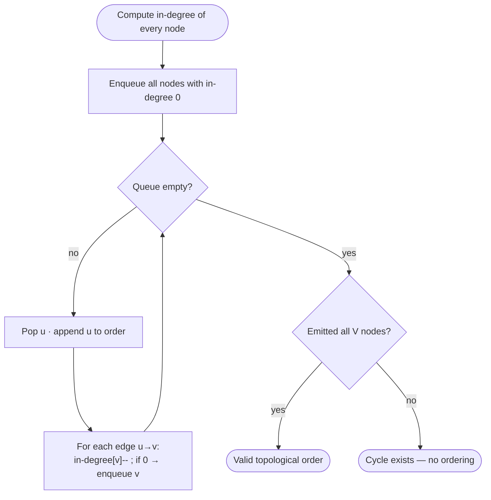

# Topological Sort

## Why topological sort exists — the story

Some tasks are not about shortest paths or reachability. They are about order. You cannot take Algorithms before Data Structures, cannot deploy before tests pass, and cannot compile a file before its dependencies compile. When the rules are directed prerequisites — "B must happen before A" — you are looking for a topological ordering.

Take four courses: `0` has no prerequisites, `1` needs `0`, `2` needs `0`, and `3` needs both `1` and `2`. One valid order is `0,1,2,3`; another is `0,2,1,3`. The exact order is not unique, but every valid answer respects the arrows. If you add one more rule, `0` needs `3`, the graph becomes a cycle: `0 → 1 → 3 → 0` or `0 → 2 → 3 → 0`. Now no course can be first, because each course in the loop waits for another.

> [key] **Key Insight** — Topological sort exists iff the graph is a DAG. If Kahn's queue empties before you've emitted all V nodes, the remaining nodes form a cycle.

There are two standard algorithms, and they feel mechanically different. **Kahn's BFS** repeatedly removes nodes with zero remaining prerequisites; it is like saying, "what can I do right now?" **DFS post-order** dives down prerequisites and appends a node after all of its descendants are done; reversing that finish order gives a valid topo order. Both are O(V+E), both detect cycles as a side-effect, and interviewers often accept either if you explain the invariant clearly.

## When to use it — and when not to

### Recognize by
- *directed graph with prerequisites* — "course schedule", "build order", "task dependencies".
- "return any valid ordering" subject to constraints.
- "detect whether all tasks can be completed" where impossibility means a dependency cycle.
- "alien dictionary" — infer letter order from sorted words, then topologically sort.
- "some items have zero prerequisites first, then unlock others" — Kahn's algorithm language.
- "DAG dynamic programming" — process nodes only after their predecessors are ready.

### When NOT to use it
The graph is *undirected* — topological sort is undefined. For "reach everything from x" use BFS/DFS. For "is this graph a DAG?" use DFS with a 3-colour visitor. If dependencies come with weights (build times, delays), reach for critical-path DP instead.

Also avoid it when:
- edges do not represent precedence; shortest path, connected components, and MSTs are different problems.
- the graph can contain cycles but you still need a best effort ordering; use SCC condensation first.
- you need a unique order; topo sort may return many valid orders unless extra rules are added.
- prerequisites change online after every query; maintaining a topo order dynamically is a separate problem.
- the input is really a tree parent relationship; a simple traversal may be enough.

## How to use it — templates

**Kahn's BFS template:**

```java
List<List<Integer>> adj = new ArrayList<>();
int[] indeg = new int[n];
for (int i = 0; i < n; i++) adj.add(new ArrayList<>());
for (int[] e : edges) { adj.get(e[0]).add(e[1]); indeg[e[1]]++; }
Queue<Integer> q = new ArrayDeque<>();
for (int i = 0; i < n; i++) if (indeg[i] == 0) q.offer(i);
List<Integer> order = new ArrayList<>();
while (!q.isEmpty()) {
    int u = q.poll(); order.add(u);
    for (int v : adj.get(u)) if (--indeg[v] == 0) q.offer(v);
}
boolean acyclic = order.size() == n;
```

**DFS post-order template:**

```java
boolean dfs(int u, List<List<Integer>> adj, int[] state, List<Integer> order) {
    if (state[u] == 1) return false;        // back-edge: cycle
    if (state[u] == 2) return true;         // already finished
    state[u] = 1;
    for (int v : adj.get(u)) if (!dfs(v, adj, state, order)) return false;
    state[u] = 2;
    order.add(u);                           // post-order
    return true;
}
```

Prefer Kahn when the problem naturally talks about prerequisites, semesters, waves, or "available now" nodes. Prefer DFS when you are already doing graph recursion, need a compact cycle detector, or want post-order for DAG DP. In Java interviews, Kahn is often easier to debug because the in-degree array makes the invariant visible.


## Kahn vs DFS — same answer, different proof

Kahn's algorithm proves validity from the front of the order. When a node leaves the queue, every prerequisite has already been emitted, because its in-degree has dropped to zero. DFS proves validity from the back of the order. A DFS call appends `u` only after every node reachable from `u` has already been appended, so reversing the post-order places `u` before its dependents.

Cycle detection also appears differently. In Kahn, a cycle shows up as "no node has zero remaining prerequisites," so the emitted count is too small. In DFS, a cycle shows up as a back-edge to a node currently in the recursion stack, which is why the three states are `0 = unvisited`, `1 = visiting`, and `2 = done`. If you only use a boolean visited set in DFS, you can miss the difference between "already safely processed" and "currently on my path," and cycle detection becomes wrong.

A tiny cycle trace makes this concrete: prerequisites `[0,1]` and `[1,0]` create edges `1→0` and `0→1`. Kahn starts with no zero-in-degree node, so it emits nothing. DFS starts at `0`, marks it visiting, goes to `1`, marks it visiting, and then sees edge `1→0` into a visiting node. Both algorithms report impossible, but they discover the problem through different mechanical signals.


## Building the graph is often the real problem

In Course Schedule, the graph is handed to you as pairs. In Alien Dictionary, you must infer it. Compare adjacent words in the sorted dictionary and find the first differing character; if word `w1` has `x` and word `w2` has `y` at that position, add edge `x → y`. Then stop comparing that pair, because later characters tell you nothing once the first difference explains the order. If no differing character exists and the first word is longer, like `"abc"` before `"ab"`, the dictionary is invalid immediately; topo sort cannot fix a bad prefix rule.

This is a common interview twist: topological sort is only half the solution. The other half is translating the domain into nodes and directed edges without inventing edges that the input does not prove. When in doubt, say what a node represents, what an edge means, and why each edge is justified by the problem statement.

---

## Course Schedule (Topological Sort) <span class="diff diff-m">Medium</span>

*[↗ LeetCode: Course Schedule II](https://leetcode.com/problems/course-schedule-ii/)*

<ProgressCheck id="course-schedule-topological-sort" />

### Problem
Given `numCourses` and prerequisite pairs `[a,b]` (finish `b` before `a`), return a **valid order** to take all courses, or an empty array if impossible (a cycle exists).

**Constraints:** `1 ≤ numCourses ≤ 2000`; up to `5000` prerequisite pairs.

**Example 1:** 4 courses, prereqs `1→0, 2→0, 3→1, 3→2` → `[0,1,2,3]`.

**Example 2:** `numCourses = 2`, prerequisites `[[1,0],[0,1]]` → `[]` because the cycle makes an order impossible.

### Solution — brute force
A simple but slow approach repeatedly scans all courses looking for one whose prerequisites are already completed.

```java
// Pseudocode baseline:
// while order has fewer than numCourses:
//     find an uncompleted course whose every prerequisite is completed
//     if none exists, return [] because a cycle blocks progress
//     mark it completed and append it to order
```

This is conceptually Kahn's algorithm without the in-degree bookkeeping. Each round may scan every course and every prerequisite again, so it can degrade toward O(VE). Kahn optimizes the same idea by storing "remaining prerequisite count" and updating only neighbours of the course you just completed.

### Solution — optimized
Kahn's algorithm: repeatedly remove in-degree-0 nodes. If you can't emit all nodes, a cycle exists.

> [inv] **Invariant** — A node enters the queue only when every prerequisite is already emitted; the emission order is a valid topological order.


<div class="figcap">Kahn's algorithm — repeatedly remove in-degree-0 nodes; incompleteness proves a cycle.</div>
<div class="readfig"><b>How to read it:</b> "In-degree" is how many prerequisites a task still has. Start by queueing every task with zero prerequisites — those are safe to do now. Each time you finish one (pop it), you remove it as a prerequisite from its dependents, and any dependent that drops to zero becomes free, so it joins the queue. Follow the loop and you emit a valid order. If you get stuck before finishing everything, the leftover tasks depend on each other in a circle — a cycle — so no order exists.</div>

#### Steps
1. Build the adjacency list `graph[prereq] → [course]` and an `inDegree[]` counter.
2. Enqueue every node with `inDegree == 0` — they can start immediately.
3. Repeatedly pop, add to the order, and decrement each neighbour's in-degree. Enqueue neighbours whose in-degree hits 0.
4. After the loop, if `order.size() < V` — there was a cycle → return `[]` (or `false` for the boolean variant).
5. Otherwise return the order. O(V + E) time.

#### Java
```java
int[] findOrder(int numCourses, int[][] prereqs) {
    List<List<Integer>> adj = new ArrayList<>();
    for (int i = 0; i < numCourses; i++) adj.add(new ArrayList<>());
    int[] indeg = new int[numCourses];
    for (int[] p : prereqs) { adj.get(p[1]).add(p[0]); indeg[p[0]]++; }
    Queue<Integer> q = new ArrayDeque<>();
    for (int i = 0; i < numCourses; i++) if (indeg[i] == 0) q.offer(i);
    int[] order = new int[numCourses]; int k = 0;
    while (!q.isEmpty()) {
        int u = q.poll(); order[k++] = u;
        for (int v : adj.get(u)) if (--indeg[v] == 0) q.offer(v);
    }
    return k == numCourses ? order : new int[0];    // incomplete => cycle
}
```

> [note] **Trace it** — `numCourses=4`, prerequisites `[1,0], [2,0], [3,1], [3,2]`.
>
> | step | queue | emitted | in-degree changes | order |
> |---|---|---|---|---|
> | init | `[0]` | — | `indeg=[0,1,1,2]` | `[]` |
> | 1 | `[0]` | `0` | `1:1→0`, `2:1→0` | `[0]` |
> | 2 | `[1,2]` | `1` | `3:2→1` | `[0,1]` |
> | 3 | `[2]` | `2` | `3:1→0` | `[0,1,2]` |
> | 4 | `[3]` | `3` | none | `[0,1,2,3]` |
>
> All four courses were emitted, so no cycle exists.


#### Edge-building intuition
The most common Course Schedule bug is direction. Pair `[a,b]` means "to take `a`, first take `b`." So the unlock direction is `b → a`: completing `b` reduces the remaining prerequisite count of `a`. If you reverse it, your graph still has the same nodes and the code still runs, which makes the bug feel sneaky, but the queue now represents courses unlocked by their dependents instead of by their prerequisites.

Isolated courses matter too. If `numCourses = 4` and only course `3` appears in prerequisites, courses `0`, `1`, and `2` are still valid zero-in-degree courses. Initialize adjacency for every course from `0` to `numCourses-1`, not just for keys seen in the edge list. A topo order must include all vertices, including the boring ones.

#### What if multiple nodes are available?
When the queue contains `[1,2]`, either order is valid unless the problem asks for lexicographically smallest order. For standard Course Schedule II, returning `[0,1,2,3]` or `[0,2,1,3]` is fine. If a problem wants the smallest valid order, replace the FIFO queue with a min-heap. The pattern is unchanged: remove a zero-in-degree node, emit it, and unlock neighbours. Only the policy for choosing among currently-free nodes changes.

### Time Complexity
Time O(V + E). Building adjacency touches each prerequisite once, and Kahn processes every node and edge once.

### Space Complexity
Space O(V + E) for the adjacency list, in-degree array, queue, and output order.

### Learning notes
- Why add edge `p[1] → p[0]`? — finishing the prerequisite unlocks the dependent course.
- Why maintain `indeg[]`? — it is the remaining prerequisite count for each node.
- Why enqueue only `indeg == 0`? — those courses are safe to take immediately.
- Why `--indeg[v] == 0`? — a neighbour becomes available exactly when its last prerequisite is removed.
- Why compare `k == numCourses`? — emitting fewer nodes means a cycle blocked the queue.
- Why Kahn over DFS here? — the BFS queue makes cycle detection and “available now” reasoning visible.

Additional notes:

Time O(V+E) · Space O(V+E). Building the graph touches each edge once, and the queue loop removes each node and edge once.

> [trap] **Common Trap** — Not detecting cycles. *Example:* prerequisites `0→1` and `1→0`. Kahn's queue starts empty (no in-degree-0 node); if `order.size() < V` at the end, report "impossible" rather than a partial order.

> [note] **Interview script** — First, I'd restate the edge direction: pair `[a,b]` means `b` must come before `a`, so I add edge `b → a`. The brute force is to repeatedly scan for a course whose prerequisites are all done, but that repeats work. I optimize with Kahn's algorithm: maintain in-degrees, queue all zero-in-degree courses, and decrement neighbours as I emit courses. If I emit fewer than `numCourses`, I know a cycle prevented completion; otherwise the order is valid in O(V+E).

#### Common Mistakes
- **Edge direction reversed**: `prereq → course`, not `course → prereq`. Reverse it and cycle detection breaks.
- **Not detecting the cycle**: if `order.size() < V` at the end, report impossible — don't return a partial order.
- **Building the graph off `numCourses` instead of the max node index**: initialize adjacency for all `numCourses` even if some are isolated.
- **DFS variant needs 3-state marking**: unvisited / in-progress / done — a back-edge into an in-progress node is the cycle.

> [pat] **Pattern Connection** — DFS post-order (reversed) is the alternative; three-color DFS detects the cycle. *Alien Dictionary* builds the graph from adjacent-word char differences, then topo-sorts.


#### Layered Kahn for semesters
Sometimes the question is not "what is one order?" but "how many rounds are needed if all currently-free tasks can run together?" Use the same queue, but process it level by level. At the start of a semester, the queue contains every course whose prerequisites were finished in earlier semesters. Pop exactly that many nodes, unlock neighbours, then increment the semester count. This is still Kahn's algorithm; the answer you record changes from a flat list to a number of waves.

#### Uniqueness check
If a problem asks whether a proposed sequence is the only possible reconstruction, watch the queue size. In Kahn's algorithm, a queue with two or more nodes means you have a choice, so multiple valid orders exist. A unique topo order requires exactly one available node at every step, and that node must match the proposed sequence. This is a small tweak, but it shows how much information the "available now" frontier gives you.

#### DFS variant in interview words
If I choose DFS instead, I would say: "I mark a node as visiting when it enters the recursion stack. If I ever reach a visiting node again, that is a directed cycle. After all neighbours are safely processed, I mark the node done and append it to post-order. At the end I reverse post-order to get prerequisites before dependents." This version uses the call stack instead of an explicit queue, but the output contract and O(V+E) complexity are the same.

#### Same pattern, new tweaks

"Repeatedly remove what has no remaining prerequisites" (Kahn) adapts by changing what the nodes/edges mean:

| Variation | The one thing that changes |
|---|---|
| [Course Schedule II](https://leetcode.com/problems/course-schedule-ii/) | Emit the actual order, not just "is it possible?" |
| [Alien Dictionary](https://leetcode.com/problems/alien-dictionary/) | Build edges by comparing adjacent words' first differing character, then topo-sort the alphabet. |
| [Minimum Height Trees](https://leetcode.com/problems/minimum-height-trees/) | Peel leaves layer by layer on an undirected tree; this is Kahn-shaped but not true directed topo sort. |
| [Parallel Courses](https://leetcode.com/problems/parallel-courses/) | Count Kahn "waves"; each wave is one semester of courses that can run together. |
| [Sequence Reconstruction](https://leetcode.com/problems/sequence-reconstruction/) | Require the queue to have exactly one choice at every step to prove the order is unique. |

---

## 🧠 Check your understanding

<Quiz patternId="topological-sort" :questions='[
  {
    "q": "A course schedule problem gives prerequisite edges. What property must exist for a valid order?",
    "choices": [
      {
        "text": "The graph is a DAG",
        "correct": true,
        "explanation": "Yes. Topological order exists exactly when the directed graph has no cycle."
      },
      {
        "text": "Every node has degree two"
      },
      {
        "text": "All edges are undirected"
      },
      {
        "text": "Weights are nonnegative"
      }
    ]
  },
  {
    "q": "In Kahn algorithm, how do you detect a cycle?",
    "choices": [
      {
        "text": "The queue starts large"
      },
      {
        "text": "Emitted nodes are fewer than V",
        "correct": true,
        "explanation": "Correct. Remaining nodes never reached in-degree zero because a cycle kept them locked."
      },
      {
        "text": "All nodes have zero outdegree"
      },
      {
        "text": "The graph has no edges"
      }
    ]
  },
  {
    "q": "Which case is not a topological-sort problem?",
    "choices": [
      {
        "text": "Alien alphabet precedence"
      },
      {
        "text": "Prerequisite ordering"
      },
      {
        "text": "Undirected connectivity groups",
        "correct": true,
        "explanation": "Right. Connectivity groups call for DFS, BFS, or Union-Find, not directed ordering."
      },
      {
        "text": "Build tasks with dependencies"
      }
    ]
  }
]' />
