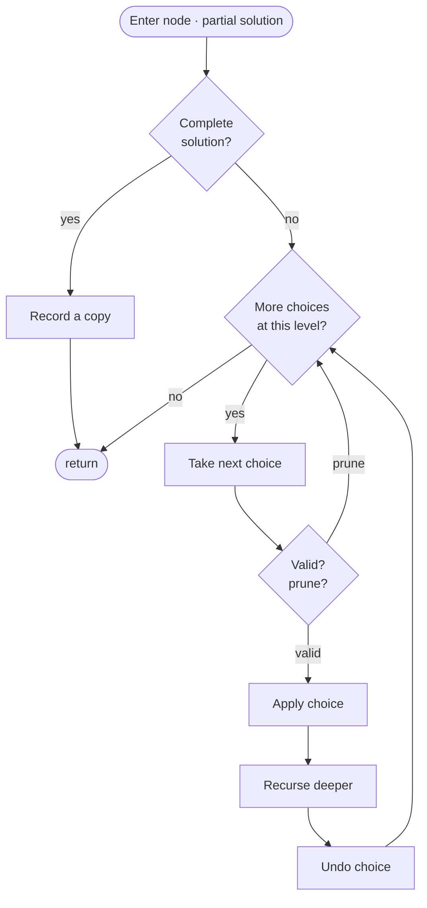

# Recursion &amp; Backtracking

Backtracking is how you say *"try everything — but be smart about it."* Picture a tree of decisions: at each step you pick an option, dive deeper, and when you come back up you **undo** that pick before trying the next one — leaving the world exactly as you found it. That undo is the whole trick; it's what lets a single piece of code walk every combination, permutation, or board layout without them bleeding into each other. Left unchecked this is exponential, so the real skill is **pruning**: the instant a partial choice can't possibly lead to a valid answer, you abandon that branch instead of exploring it all the way down.

```text
                      []                     Subsets of [1,2,3]
        ┌──────────────┼──────────────┐
       [1]            [2]            [3]
     ┌──┴──┐         ┌─┘
   [1,2] [1,3]     [2,3]
     │
  [1,2,3]
```

> [key] **Key Insight** — The template is invariant across problems: `choose → recurse → un-choose`. What changes is (a) the **choice set** at each level, (b) the **constraint/prune**, and (c) what makes a node a **complete solution**.

```svg
<svg width="720" height="260" viewBox="0 0 720 260" xmlns="http://www.w3.org/2000/svg" font-family="Segoe UI, Arial, sans-serif">
  <defs>
    <marker id="bt-ar-grn" markerWidth="8" markerHeight="8" refX="5" refY="3" orient="auto"><path d="M0,0 L6,3 L0,6 Z" fill="#16a34a"/></marker>
    <marker id="bt-ar-red" markerWidth="8" markerHeight="8" refX="5" refY="3" orient="auto"><path d="M0,0 L6,3 L0,6 Z" fill="#dc2626"/></marker>
    <marker id="bt-ar-mute" markerWidth="8" markerHeight="8" refX="5" refY="3" orient="auto"><path d="M0,0 L6,3 L0,6 Z" fill="#94a3b8"/></marker>
    <filter id="bt-s1" x="-10%" y="-10%" width="120%" height="140%"><feDropShadow dx="0" dy="1.2" stdDeviation="1.2" flood-color="#94a3b8" flood-opacity="0.5"/></filter>
  </defs>
  <rect x="0" y="0" width="720" height="260" fill="#fbfcfe"/>
  <text x="360" y="22" text-anchor="middle" font-size="13" font-weight="700" fill="#0b1220">subsets of [1,2,3]: include / exclude each element</text>
  <g stroke-width="1.6" fill="none">
    <line x1="360" y1="50" x2="220" y2="82" stroke="#16a34a" marker-end="url(#bt-ar-grn)"/><line x1="360" y1="50" x2="500" y2="82" stroke="#94a3b8" marker-end="url(#bt-ar-mute)"/>
    <line x1="220" y1="104" x2="130" y2="132" stroke="#16a34a" marker-end="url(#bt-ar-grn)"/><line x1="220" y1="104" x2="288" y2="132" stroke="#94a3b8" marker-end="url(#bt-ar-mute)"/>
    <line x1="500" y1="104" x2="432" y2="132" stroke="#16a34a" marker-end="url(#bt-ar-grn)"/><line x1="500" y1="104" x2="590" y2="132" stroke="#94a3b8" marker-end="url(#bt-ar-mute)"/>
    <line x1="130" y1="154" x2="74" y2="188" stroke="#16a34a" marker-end="url(#bt-ar-grn)"/><line x1="130" y1="154" x2="130" y2="188" stroke="#94a3b8" marker-end="url(#bt-ar-mute)"/>
    <line x1="288" y1="154" x2="250" y2="188" stroke="#16a34a" marker-end="url(#bt-ar-grn)"/><line x1="288" y1="154" x2="306" y2="188" stroke="#94a3b8" marker-end="url(#bt-ar-mute)"/>
    <line x1="432" y1="154" x2="414" y2="188" stroke="#16a34a" marker-end="url(#bt-ar-grn)"/><line x1="432" y1="154" x2="470" y2="188" stroke="#94a3b8" marker-end="url(#bt-ar-mute)"/>
    <line x1="590" y1="154" x2="590" y2="188" stroke="#16a34a" marker-end="url(#bt-ar-grn)"/><line x1="590" y1="154" x2="646" y2="188" stroke="#94a3b8" marker-end="url(#bt-ar-mute)"/>
  </g>
  <g font-size="10" font-weight="700" text-anchor="middle">
    <text x="286" y="69" fill="#16a34a">include 1</text><text x="435" y="69" fill="#5b6472">exclude 1</text>
    <text x="172" y="121" fill="#16a34a">include 2</text><text x="255" y="121" fill="#5b6472">exclude 2</text>
    <text x="466" y="121" fill="#16a34a">include 2</text><text x="548" y="121" fill="#5b6472">exclude 2</text>
  </g>
  <path d="M72,212 C85,230 124,224 130,206 C132,184 128,168 127,154 C152,151 206,130 219,104 C262,90 335,69 359,51" fill="none" stroke="#dc2626" stroke-width="2" stroke-dasharray="6 4" marker-end="url(#bt-ar-red)"/>
  <text x="152" y="235" font-size="11" font-weight="700" fill="#dc2626">dashed = un-choose while backing up</text>
  <g filter="url(#bt-s1)" text-anchor="middle" font-weight="700">
    <rect x="334" y="30" width="52" height="28" rx="7" fill="#eff6ff" stroke="#2563eb"/><text x="360" y="49" font-size="12" fill="#0b1220">[]</text>
    <rect x="194" y="82" width="52" height="28" rx="7" fill="#f0fdf4" stroke="#16a34a"/><text x="220" y="101" font-size="12" fill="#0b1220">[1]</text>
    <rect x="474" y="82" width="52" height="28" rx="7" fill="#f8fafc" stroke="#cbd5e1"/><text x="500" y="101" font-size="12" fill="#0b1220">[]</text>
    <rect x="97" y="132" width="66" height="28" rx="7" fill="#f0fdf4" stroke="#16a34a"/><text x="130" y="151" font-size="11" fill="#0b1220">[1,2]</text>
    <rect x="262" y="132" width="52" height="28" rx="7" fill="#f8fafc" stroke="#cbd5e1"/><text x="288" y="151" font-size="11" fill="#0b1220">[1]</text>
    <rect x="406" y="132" width="52" height="28" rx="7" fill="#f0fdf4" stroke="#16a34a"/><text x="432" y="151" font-size="11" fill="#0b1220">[2]</text>
    <rect x="564" y="132" width="52" height="28" rx="7" fill="#f8fafc" stroke="#cbd5e1"/><text x="590" y="151" font-size="11" fill="#0b1220">[]</text>
    <rect x="35" y="188" width="78" height="28" rx="7" fill="#f0fdf4" stroke="#16a34a"/><text x="74" y="207" font-size="10.5" fill="#0b1220">[1,2,3]</text>
    <rect x="98" y="188" width="64" height="28" rx="7" fill="#f8fafc" stroke="#cbd5e1"/><text x="130" y="207" font-size="10.5" fill="#0b1220">[1,2]</text>
    <rect x="216" y="188" width="68" height="28" rx="7" fill="#f0fdf4" stroke="#16a34a"/><text x="250" y="207" font-size="10.5" fill="#0b1220">[1,3]</text>
    <rect x="280" y="188" width="52" height="28" rx="7" fill="#f8fafc" stroke="#cbd5e1"/><text x="306" y="207" font-size="10.5" fill="#0b1220">[1]</text>
    <rect x="377" y="188" width="74" height="28" rx="7" fill="#f0fdf4" stroke="#16a34a"/><text x="414" y="207" font-size="10.5" fill="#0b1220">[2,3]</text>
    <rect x="444" y="188" width="52" height="28" rx="7" fill="#f8fafc" stroke="#cbd5e1"/><text x="470" y="207" font-size="10.5" fill="#0b1220">[2]</text>
    <rect x="564" y="188" width="52" height="28" rx="7" fill="#f0fdf4" stroke="#16a34a"/><text x="590" y="207" font-size="10.5" fill="#0b1220">[3]</text>
    <rect x="620" y="188" width="52" height="28" rx="7" fill="#f8fafc" stroke="#cbd5e1"/><text x="646" y="207" font-size="10.5" fill="#0b1220">[]</text>
  </g>
  <text x="586" y="235" text-anchor="middle" font-size="11" font-weight="700" fill="#5b6472">8 leaves = 2³ subsets</text>
</svg>
```
<div class="readfig"><b>How to read it:</b> Each level decides whether to include or exclude the next number. A root-to-leaf path is one subset, so three binary choices produce <b>2³ = 8</b> leaves. The dashed red path shows backtracking: after recording <code>[1,2,3]</code>, the algorithm un-chooses <b>3</b>, then backs up to try the sibling branches without stale state.</div>


<div class="figcap">Backtracking control flow — choose / recurse / undo, pruning invalid branches before descending.</div>
<div class="readfig"><b>How to read it:</b> This is a depth-first walk through all the choices. At each node you ask "is this a complete answer?" — if so, record a copy and back out. Otherwise you try the next available choice: skip it if it's invalid (that's the pruning), otherwise apply it, recurse deeper, and — crucially — *undo* it when you return so the next sibling starts from a clean slate. The loop back to "more choices?" is you trying each option in turn; the deep chain is you committing to one and exploring it fully.</div>

> [inv] **Invariant** — On entry and exit of each recursive call the shared state (`path`, board, `used[]`) is identical; every mutation is paired with its undo. Violating this is the #1 backtracking bug.

### Recognize by
- "enumerate all" — subsets, permutations, combinations, N-Queens boards
- constraint satisfaction — Sudoku, word search on a grid, expression evaluation
- n ≤ ~15 (2ⁿ ≤ 32 K) so exponential search is affordable with pruning

### When NOT to use it
You want *one* answer, not all — a pruned DFS or DP is faster than enumerating every branch. Also skip when the state space is polynomial (n·k tuples) and DP fits — an exponential search is unnecessary.

---

## Subsets &amp; Combinations (the start-index template)
*[↗ LeetCode: Subsets](https://leetcode.com/problems/subsets/)*

### Problem
Return **all subsets** (the power set) of a set of distinct integers, in any order.

**Constraints:** `1 ≤ n ≤ 10`; values distinct; there are `2ⁿ` subsets.

**Example:** `[1,2,3]` → `[[],[1],[2],[3],[1,2],[1,3],[2,3],[1,2,3]]`.

### Brute force
Brute force is the full include/exclude decision tree: for each element, choose to take it or skip it, then record the subset at the leaf. That is already O(n·2ⁿ) time and O(n) recursion space, which matches the output-size lower bound. The optimized template is not asymptotically faster; it organizes the search with a `start` index so combinations appear once and duplicate permutations never get generated.

### Pattern
Use a `start` index so each element is considered once in order — this prevents permutations of the same set.

### Java
```java
List<List<Integer>> subsets(int[] a) {
    List<List<Integer>> res = new ArrayList<>();
    dfs(a, 0, new ArrayList<>(), res);
    return res;
}
void dfs(int[] a, int start, List<Integer> path, List<List<Integer>> res) {
    res.add(new ArrayList<>(path));          // every node is a valid subset
    for (int i = start; i < a.length; i++) {
        path.add(a[i]);                      // choose
        dfs(a, i + 1, path, res);            // explore (i+1: no reuse)
        path.remove(path.size() - 1);        // un-choose
    }
}
```

> [note] **Trace it** — `[1,2,3]`. Advancing `start` builds `[]→[1]→[1,2]→[1,2,3]→[1,3]→[2]…` — all **8** subsets, each set once (never `[2,1]` as a duplicate of `[1,2]`).

### Complexity
Subsets: O(n·2ⁿ). Combinations C(n,k): O(k·C(n,k)).

> [note] **Interview script** — "I first confirm the input values are distinct and output order does not matter. I start with brute force include/exclude recursion, which is O(n·2ⁿ) time because the output itself has 2ⁿ subsets. I optimize the presentation with a `start` index and backtracking, preserving O(n·2ⁿ) time while avoiding duplicate orderings."


> [trap] **Common Trap** — Forgetting to un-choose. *Example:* generating subsets of `[1,2]`. If you `add(1)` and recurse but don't `remove(1)`, the sibling branch `[2]` starts with path `[1]` and you emit `[1,2]` twice. `remove(path.size()-1)` is the whole discipline.

> [pat] **Pattern Connection** — `start` = "consider items left-to-right, no repeats" — the backbone of *Combination Sum*, *Palindrome Partitioning*, and subset-sum enumeration. **Dedup with duplicates:** sort, then `if (i > start && a[i]==a[i-1]) continue;`.

### Same pattern, new tweaks

The choose → recurse → undo loop stays fixed; what changes is the choice set and the "done" test:

| Variation | The one thing that changes | Time |
|---|---|---|
| [Subsets II (with duplicates)](https://leetcode.com/problems/subsets-ii/) | sort first, then skip equal siblings (`i > start && a[i] == a[i-1]`) so you don't emit the same subset twice | — |
| [Combination Sum / Combination Sum II](https://leetcode.com/problems/combination-sum-ii/) | carry a remaining-target budget; allow reuse by recursing with the same `i` (unbounded) or forbid it with `i+1` (each item once) | — |
| [Permutations](https://leetcode.com/problems/permutations/) | order matters, so drop the `start` index and instead track a `used[]` array, scanning all positions each level | — |
| [Palindrome Partitioning](https://leetcode.com/problems/palindrome-partitioning/) | a "choice" is a prefix that happens to be a palindrome; recurse on the rest | — |

## Permutations (the used[] template)
*[↗ LeetCode: Permutations](https://leetcode.com/problems/permutations/)*

### Problem
Return **all orderings** (permutations) of a list of distinct integers.

**Constraints:** `1 ≤ n ≤ 6`; values distinct; there are `n!` permutations.

**Example:** `[1,2,3]` → the 6 orderings `123, 132, 213, 231, 312, 321`.

### Brute force
Brute force builds every ordering by placing each remaining number in the next slot. There are `n!` leaves and copying each permutation costs O(n), so the unavoidable output cost is O(n·n!) with O(n) recursion state. The optimized template is mainly about clean state management: `used[]` tells which values are already in the path, and the undo step restores the state for the next sibling.

### Pattern
No `start` index — every unused element is a candidate at every position; track membership with `used[]`.

### Java
```java
List<List<Integer>> permute(int[] a) {
    List<List<Integer>> res = new ArrayList<>();
    dfs(a, new boolean[a.length], new ArrayList<>(), res);
    return res;
}
void dfs(int[] a, boolean[] used, List<Integer> path, List<List<Integer>> res) {
    if (path.size() == a.length) { res.add(new ArrayList<>(path)); return; }
    for (int i = 0; i < a.length; i++) {
        if (used[i]) continue;
        used[i] = true; path.add(a[i]);
        dfs(a, used, path, res);
        path.remove(path.size() - 1); used[i] = false;
    }
}
```

> [note] **Trace it** — `[1,2,3]`. Position 0 tries each of 1/2/3; with 1 fixed, position 1 tries 2 then 3 → `123,132,213,231,312,321` — all **6** orderings.

### Complexity
O(n·n!).

> [note] **Interview script** — "I first confirm all numbers are distinct and every ordering must be returned. I start with brute force by trying every unused number at every position, which is O(n·n!) time and O(n) recursion space. I optimize the implementation with a `used[]` array and choose/recurse/unchoose discipline, which keeps the same output-bound complexity without corrupting sibling branches."


> [key] **Key Insight** — **Combinations vs permutations = `start` vs `used[]`.** Order-insensitive → `start`. Order-sensitive → `used[]`. For unique permutations of a multiset: sort and skip `i>0 && a[i]==a[i-1] && !used[i-1]`.

> [inv] **Invariant** — `path` is always a valid partial permutation and `used[]` marks exactly its members; on return both are restored, so siblings explore a clean slate.

> [trap] **Common Trap** — Duplicates without sort-and-skip. *Example:* `nums=[1,1,2]` without `if (i>0 && a[i]==a[i-1] && !used[i-1]) continue;` — you emit `[1,1,2]` twice (once for each `1` picked first). Sort + the `used[i-1]` guard eliminates the twin.

> [pat] **Pattern Connection** — `used[]` generalizes to N-Queens (column/diagonal occupancy) and Sudoku (row/col/box occupancy) — all "place items respecting constraints."

### Same pattern, new tweaks

No `start` index — every unused element is a candidate at every position:

| Variation | The one thing that changes | Time |
|---|---|---|
| [Permutations II (with duplicates)](https://leetcode.com/problems/permutations-ii/) | sort, then skip `i>0 && a[i]==a[i-1] && !used[i-1]` to avoid duplicate orderings | — |
| [Letter Case Permutation](https://leetcode.com/problems/letter-case-permutation/) | at each letter, branch into lower/upper case | — |
| [Next Permutation](https://leetcode.com/problems/next-permutation/) | in-place — find the pivot, swap with its next-larger suffix element, reverse the suffix | — |
| [Beautiful Arrangement](https://leetcode.com/problems/beautiful-arrangement/) | place numbers `1..n` where position `i` must divide (or be divided by) the value | — |

## Combination Sum (reuse &amp; pruning)
*[↗ LeetCode: Combination Sum](https://leetcode.com/problems/combination-sum/)*

### Problem
Return all **combinations** of the candidates that sum to `target`; each candidate may be **reused unlimited** times. No duplicate combinations.

**Constraints:** `1 ≤ candidates ≤ 30`, distinct, each `≥ 1`; `target ≤ 40`.

**Example:** `candidates = [2,3,6,7], target = 7` → `[[2,2,3],[7]]`.

### Brute force
Brute force tries every candidate at every step, subtracting it from the remaining target until the sum hits zero or goes negative. Without ordering, it generates the same combination in many permutations and may explore a large exponential tree. The optimized backtracking sorts candidates, carries a `start` index to enforce nondecreasing combinations, recurses with the same index for reuse, and breaks as soon as a candidate exceeds the remaining target.

### Pattern
Unlimited reuse → recurse with the same `i`; prune when the remaining target goes negative.

### Java
```java
List<List<Integer>> combinationSum(int[] cand, int target) {
    Arrays.sort(cand);                        // enables the break-prune
    List<List<Integer>> res = new ArrayList<>();
    dfs(cand, 0, target, new ArrayList<>(), res);
    return res;
}
void dfs(int[] c, int start, int remain, List<Integer> path, List<List<Integer>> res) {
    if (remain == 0) { res.add(new ArrayList<>(path)); return; }
    for (int i = start; i < c.length; i++) {
        if (c[i] > remain) break;             // sorted: no later candidate fits either
        path.add(c[i]);
        dfs(c, i, remain - c[i], path, res);  // i (not i+1): reuse allowed
        path.remove(path.size() - 1);
    }
}
```

> [note] **Trace it** — `candidates=[2,3,6,7], target=7`. Reusing 2 gives `2+2+3`; 7 alone also works → `[[2,2,3],[7]]`. Branches where the remainder drops below 0 are cut immediately.

### Complexity
Exponential in target/min-candidate; pruning dominates practical cost.

> [note] **Interview script** — "I first confirm candidates are distinct and each candidate may be reused unlimited times. I start with brute force by trying all candidate sequences until the remaining target is zero or negative, which is exponential. I optimize by sorting, using `start` to avoid duplicate orders, and pruning when a candidate is too large, keeping exponential worst-case time but much less search."


> [trap] **Common Trap** — Passing `i+1` when reuse is allowed. *Example:* `candidates=[2,3]`, `target=6`. You need `[2,2,2]` and `[3,3]`, which requires re-picking the same index. Recurse with `i` (not `i+1`) — otherwise you only get `[3,3]`.

> [pat] **Pattern Connection** — Sorted-input + `break` when the choice overshoots is the universal backtracking prune; it converts many TLE solutions into passing ones.

### Same pattern, new tweaks

| Variation | The one thing that changes | Time |
|---|---|---|
| [Combination Sum II](https://leetcode.com/problems/combination-sum-ii/) | each number used once → recurse with `i+1`, and skip equal siblings to avoid duplicate combos | — |
| [Combination Sum III](https://leetcode.com/problems/combination-sum-iii/) | exactly `k` numbers drawn from `1..9` summing to `n` | — |
| [Palindrome Partitioning](https://leetcode.com/problems/palindrome-partitioning/) | a "choice" is a prefix that is a palindrome; recurse on the rest | — |
| [Combination Sum IV](https://leetcode.com/problems/combination-sum-iv/) | it *counts ordered* ways → drop backtracking for a 1-D DP (`dp[t] += dp[t-num]`) | — |

## N-Queens (constraint occupancy)
*[↗ LeetCode: N-Queens](https://leetcode.com/problems/n-queens/)*

### Problem
Place `n` queens on an `n×n` board so that **none attack** another (no shared row, column, or diagonal). Return all valid boards.

**Constraints:** `1 ≤ n ≤ 9`.

**Example:** `n = 4` → `2` distinct solutions.

### Brute force
Brute force places queens on arbitrary cells and checks every completed board for row, column, and diagonal conflicts. Choosing `n` squares from `n²` and validating them is enormous, and even row-by-row placement is O(n!) before pruning. The optimized backtracking commits to one queen per row and uses column plus diagonal occupancy arrays so each proposed placement is checked in O(1) before descending.

### Pattern
Place one queen per row; track occupied columns and both diagonals with sets/booleans for O(1) validity.

> [key] **Key Insight** — Cells on the same ↘ diagonal share `row−col` (constant, offset to stay non-negative); same ↙ diagonal share `row+col`. Three boolean arrays make each placement check O(1).

> [inv] **Invariant** — At row `r`, all rows `< r` hold exactly one non-attacking queen; the occupancy arrays reflect precisely those placements.

### Steps
1. Represent the board as a `queens[N]` array where `queens[row] = col`.
2. Maintain three bit-sets: `cols`, `antiDiag` (keyed by `row - col + N`), `mainDiag` (keyed by `row + col`).
3. Recurse row by row. For each `col`, if all three bitsets say the cell is free, place and recurse.
4. On return, un-set the three bits (backtrack).
5. When `row == N`, translate `queens[]` into the string board and record it.
6. O(N!) time — the branching factor shrinks fast due to the three constraints.

### Java
```java
int totalNQueens(int n) {
    return dfs(0, n, new boolean[n], new boolean[2*n], new boolean[2*n]);
}
int dfs(int r, int n, boolean[] col, boolean[] diag, boolean[] anti) {
    if (r == n) return 1;
    int count = 0;
    for (int c = 0; c < n; c++) {
        int d = r - c + n, a = r + c;
        if (col[c] || diag[d] || anti[a]) continue;         // attacked
        col[c] = diag[d] = anti[a] = true;                  // place
        count += dfs(r + 1, n, col, diag, anti);
        col[c] = diag[d] = anti[a] = false;                 // remove
    }
    return count;
}
```

> [note] **Trace it** — `n=4`. Row-by-row placement backtracks past dead ends and finds exactly **2** valid boards (e.g. queens at columns `1,3,0,2`).

### Complexity
O(n!) with heavy pruning.

> [note] **Interview script** — "I first confirm one queen is needed per row and no two queens may share a column or diagonal. I start with brute force by trying board placements and checking conflicts, which is exponential and roughly O(n!) once row-by-row. I optimize with row-wise backtracking plus column and diagonal occupancy arrays, keeping exponential O(n!) search but O(1) conflict checks."


> [trap] **Common Trap** — Wrong diagonal keys. *Example:* queens at `(0,0)` and `(1,1)` — same anti-diagonal (`row-col = 0`). Use **two** bitsets keyed by `row-col` (anti) and `row+col` (main). Swapping them rejects valid boards.

### Common Mistakes
- **Wrong diagonal keys**: anti-diagonal `row - col` (offset by `N` for non-negative), main diagonal `row + col`. Swapping them rejects valid boards.
- **Placing before checking**: check all three occupancy bits *first*, then place.
- **Forgetting to undo** any of the three bits on return.
- **Copying the board on every step** — mutate in place, snapshot only on success.

> [pat] **Pattern Connection** — Constraint occupancy arrays reappear in Sudoku (9 rows/cols/boxes) and *Word Search* (a `visited` grid). The diagonal-index trick generalizes any "same-diagonal" 2D constraint.

### Same pattern, new tweaks

"Place items one slot at a time, using O(1) occupancy sets to reject conflicts" scales up:

| Variation | The one thing that changes | Time |
|---|---|---|
| [N-Queens II](https://leetcode.com/problems/n-queens-ii/) | just *count* the valid placements instead of listing boards | — |
| [Sudoku Solver](https://leetcode.com/problems/sudoku-solver/) | three occupancy sets (row, column, 3×3 box); place a digit, recurse, undo | — |
| [Valid Sudoku](https://leetcode.com/problems/valid-sudoku/) | no search at all — only check the occupancy sets for conflicts | — |
| [Letter Combinations of a Phone Number](https://leetcode.com/problems/letter-combinations-of-a-phone-number/) | the "constraint" is just the digit→letters map; place one letter per position | — |

## Word Search (grid backtracking)
*[↗ LeetCode: Word Search](https://leetcode.com/problems/word-search/)*

### Problem
Given a grid of letters, decide whether a `word` can be spelled by walking through **adjacent** cells (up/down/left/right), never reusing a cell.

**Constraints:** grid up to ~`6×6`, word length ≤ 15 (backtracking with pruning).

**Example:** grid `[[A,B,C],[S,F,C],[A,D,E]]`, word `"ABCCED"` → `true`.

### Brute force
Brute force starts a DFS from every cell and explores all four directions for each next character, tracking visited cells so no cell is reused. The worst case is O(R·C·4^L) time with O(L) path state, because many prefixes can match before failing. The optimized version is still backtracking, but it prunes immediately on character mismatch and marks the board in place to avoid an extra visited matrix.

### Pattern
DFS from each cell, matching the word char by char; mark visited, recurse in 4 directions, unmark.

> [key] **Key Insight** — Mutate the grid in place (`board[r][c] = '#'`) to mark visited, then restore on return — an O(1)-space visited set. Prune the moment the current char mismatches.

### Java
```java
boolean exist(char[][] b, String word) {
    for (int r = 0; r < b.length; r++)
        for (int c = 0; c < b[0].length; c++)
            if (dfs(b, r, c, word, 0)) return true;
    return false;
}
boolean dfs(char[][] b, int r, int c, String w, int k) {
    if (k == w.length()) return true;
    if (r < 0 || c < 0 || r >= b.length || c >= b[0].length || b[r][c] != w.charAt(k))
        return false;
    char tmp = b[r][c]; b[r][c] = '#';                       // mark visited
    boolean found = dfs(b, r+1, c, w, k+1) || dfs(b, r-1, c, w, k+1)
                 || dfs(b, r, c+1, w, k+1) || dfs(b, r, c-1, w, k+1);
    b[r][c] = tmp;                                           // restore
    return found;
}
```

> [note] **Trace it** — grid `[[A,B,C],[S,F,C],[A,D,E]]`, word `"ABCCED"`. DFS traces `A(0,0)→B→C→C(1,2)→E→D` through adjacent cells → **found**; the unmark step frees cells for other start points.

### Complexity
O(R·C·4^L), L = word length.

> [note] **Interview script** — "I first confirm movement is four-directional and a cell cannot be reused within one path. I start with brute force DFS from each cell over all possible paths, which is O(R·C·4^L) time and O(L) space. I optimize by pruning mismatches immediately and marking visited cells in place, keeping the same worst-case time but using O(1) extra grid space besides recursion."


> [trap] **Common Trap** — Not restoring the cell on the way back up. *Example:* board `[[A,B],[C,D]]` searching `"AB"`. If you mark `A` visited via `#` but forget to restore it after the recursive call, a sibling path can't reuse `A`. Overwrite → recurse → restore.

> [pat] **Pattern Connection** — In-place visited marking is the memory-lean cousin of a `boolean[][] visited`; the Trie-backed variant is a canonical "combine two data structures" staff question.

### Same pattern, new tweaks

| Variation | The one thing that changes | Time |
|---|---|---|
| [Word Search II](https://leetcode.com/problems/word-search-ii/) | many target words → back the grid DFS with a **Trie** so all words are pruned at once | — |
| [Number of Islands](https://leetcode.com/problems/number-of-islands/) | no target string — just flood each land component and mark it visited | — |
| [Unique Paths III](https://leetcode.com/problems/unique-paths-iii/) | backtrack across the grid, requiring you visit *every* empty cell exactly once | — |
| [Robot Room Cleaner](https://leetcode.com/problems/robot-room-cleaner/) | same visited-set DFS, but you only know relative moves (turn/forward) | — |
