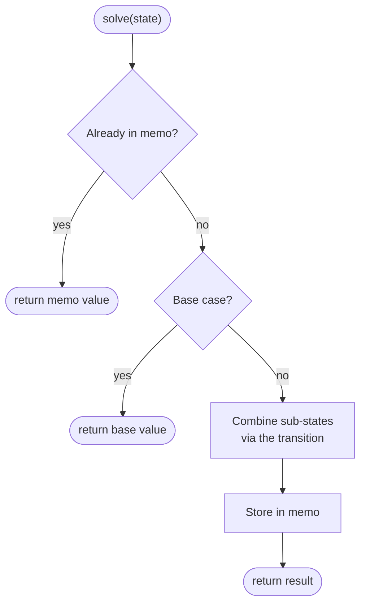

# Dynamic Programming


<PatternVideo pattern-name="Dynamic Programming" duration="8–12 min" />

<PatternProgress pattern-id="dp" problems="house-robber, climbing-stairs, house-robber-ii, delete-and-earn, min-cost-climbing-stairs, coin-change, coin-change-ii, longest-increasing-subsequence, longest-common-subsequence, edit-distance, longest-palindromic-subsequence, partition-equal-subset-sum, target-sum, unique-paths-ii, maximal-square, burst-balloons, regular-expression-matching, palindrome-partitioning-ii, best-time-to-buy-and-sell-stock-with-cooldown, best-time-to-buy-and-sell-stock-with-transaction-fee, best-time-to-buy-and-sell-stock-iv, partition-to-k-equal-sum-subsets, perfect-squares, maximum-sum-circular-subarray, dungeon-game, paint-house-ii, minimum-falling-path-sum, shortest-path-visiting-all-nodes, find-the-shortest-superstring, number-of-ways-to-wear-different-hats-to-each-other, last-stone-weight-ii, minimum-cost-to-merge-stones" />


## Why dynamic programming exists — the story

You're solving Fibonacci for `n = 40`. You write the elegant recursive solution: `fib(n) = fib(n-1) + fib(n-2)`. It's beautiful. It compiles. You run it — and it takes **17 seconds**.

Why? Look at what `fib(40)` computes: `fib(40) = fib(39) + fib(38)`. `fib(39) = fib(38) + fib(37)`. Now `fib(38)` gets computed **twice** — once directly, once via `fib(39)`. `fib(37)` gets computed **three** times. `fib(2)` gets computed roughly `10⁸` times. The recursion is a beautifully-drawn tree where the same subproblems repeat exponentially. Fibonacci with plain recursion is O(2^n) — for `n = 60` it takes **over a year**.

The obvious fix — the one every mathematician yells at their screen watching this — is: **write down the answer once you compute it.** Compute `fib(2)` and store it. When another branch asks for `fib(2)`, look it up instead of re-computing. Fibonacci collapses from 2^n to n. Seventeen seconds to nanoseconds.

That's the entire idea of dynamic programming: **recursion whose subproblems overlap gets fast when you memoize the answers.** Two conditions have to hold for it to apply: (1) **overlapping subproblems** — the same smaller question recurs many times, and (2) **optimal substructure** — the best answer combines from the best sub-answers.

DP shows up everywhere in interviews: Coin Change, Longest Common Subsequence, Edit Distance, Longest Increasing Subsequence, Knapsack, Buy-and-Sell-Stock, Palindrome Partitioning, Word Break, Burst Balloons. Half of the LeetCode Hard problems are DP variants. What makes DP feel intimidating isn't the technique — it's the **modeling**: naming the right subproblem, defining the right state. Every DP problem you've ever gotten stuck on was a state-definition failure disguised as an algorithm failure.

## The core idea — name the state, cache the answer

<DpFillAnim />

Every DP problem you'll ever see reduces to four decisions:

```text
1. STATE        what parameters uniquely identify a subproblem?  dp[...] = ?
2. TRANSITION   how does a state combine smaller states?         dp[i] = f(dp[<i])
3. BASE CASE    the smallest states, answered directly.
4. ORDER        iterate so every dependency is computed first (or memoize top-down).
   (+ SPACE     collapse dimensions the recurrence doesn't need.)
```

Get **state** right, and everything else falls into place. Get state wrong, and no amount of optimization saves you.

**The state-definition workflow (memorize this):**

1. **Ask "what varies as I recurse?"** — that's the state.
2. **Ask "what does dp[state] represent?"** — write it as an English sentence, e.g., *"dp[i] = the length of the longest increasing subsequence ending at index i"*.
3. **Derive the transition** — for each way to reach state `s`, express `dp[s]` in terms of smaller states.
4. **Identify the base case** — the smallest state(s), answered without recursion.
5. **Pick an iteration order** so dependencies are ready when needed.

Half of your DP interview time should be state-definition talk, on paper, before any code.

## When to use it — recognition signals

The problem statement usually contains one of these:

- **"Minimum / maximum X"** — often DP. Minimum edit distance, maximum path sum, minimum coins.
- **"Count the number of ways"** — usually DP. Number of ways to climb stairs, number of paths in a grid.
- **"Longest / shortest X subsequence / substring"** — LCS, LIS, longest palindromic subsequence.
- **"Can we partition / cover / express X"** — subset sum, coin change, word break.
- **Decision at each step affects future steps** — buy-and-sell-stock (must hold before you can sell), house robber (can't rob adjacent).
- **The recursion tree has overlapping subproblems** — a naive recursive solution TLE's; memoization or tabulation makes it fit.
- **The state space is polynomial** — number of subproblems is `O(n)`, `O(n²)`, or `O(n·k)`, not `O(2^n)`. If subproblems are exponential, DP with bitmask sometimes helps (bitmask DP is a distinct subpattern).

Trigger phrases: *"maximum sum", "minimum cost", "count ways", "longest / shortest", "return true if possible", "you can make choices at each step, what's the best..."*

## When NOT to use it

- **Greedy works** — if a local best choice leads to a global best, greedy is O(n) or O(n log n) and much simpler. Fractional knapsack is greedy; 0/1 knapsack is DP.
- **Number of subproblems is exponential** — pure DP doesn't help. Consider bitmask DP for small n, or a different algorithm entirely.
- **The problem is decidable in constant time** — closed-form formulas beat DP asymptotically.
- **The answer is a graph reachability or shortest path in an unweighted graph** — BFS is simpler and faster than DP over states.
- **State transitions depend on future information** — DP works only when subproblems form a DAG. If dependencies cycle, need SCC decomposition first or a different approach.
- **You have huge state (memory > 1 GB)** — even O(n²) at n = 10⁵ is 10¹⁰ entries — infeasible. Reformulate with a smaller state or use divide-and-conquer optimization.

## The four DP archetypes

Every DP problem is a variant of one of four archetypes. Learning them is 80% of the pattern.

### Archetype 1: 1D DP (Fibonacci-like)

```java
// House Robber: max money robbing houses, no two adjacent
int rob(int[] nums) {
    int prev = 0, curr = 0;
    for (int x : nums) {
        int next = Math.max(curr, prev + x);   // skip or take
        prev = curr;
        curr = next;
    }
    return curr;
}
```

**State:** `dp[i] = max money robbing among houses 0..i`.
**Transition:** `dp[i] = max(dp[i-1], dp[i-2] + nums[i])`.
**Space collapse:** only need last 2 values → O(1) space.

### Archetype 2: 2D DP on strings (LCS, edit distance)

```java
// Longest Common Subsequence
int lcs(String a, String b) {
    int m = a.length(), n = b.length();
    int[][] dp = new int[m + 1][n + 1];
    for (int i = 1; i <= m; i++)
        for (int j = 1; j <= n; j++)
            dp[i][j] = a.charAt(i-1) == b.charAt(j-1)
                     ? dp[i-1][j-1] + 1
                     : Math.max(dp[i-1][j], dp[i][j-1]);
    return dp[m][n];
}
```

**State:** `dp[i][j] = LCS of a[0..i) and b[0..j)`.
**Transition:** match → diagonal + 1; else max of left and up.
**Space collapse:** only need previous row → O(min(m, n)) space.

### Archetype 3: DP on decisions (buy-and-sell-stock, coin change)

```java
// Coin Change: fewest coins to reach amount
int coinChange(int[] coins, int amount) {
    int[] dp = new int[amount + 1];
    Arrays.fill(dp, amount + 1);           // sentinel for "impossible"
    dp[0] = 0;
    for (int a = 1; a <= amount; a++)
        for (int c : coins)
            if (c <= a) dp[a] = Math.min(dp[a], dp[a - c] + 1);
    return dp[amount] > amount ? -1 : dp[amount];
}
```

**State:** `dp[a] = fewest coins to make amount a`.
**Transition:** `dp[a] = 1 + min over c of dp[a-c]`.
**Base case:** `dp[0] = 0`.

### Archetype 4: Interval DP (matrix chain, Burst Balloons)

```java
// Burst Balloons: max coins from choosing burst order
int maxCoins(int[] nums) {
    int n = nums.length;
    int[] arr = new int[n + 2];
    arr[0] = arr[n + 1] = 1;
    for (int i = 0; i < n; i++) arr[i + 1] = nums[i];
    int[][] dp = new int[n + 2][n + 2];
    for (int len = 1; len <= n; len++)              // interval length
        for (int lo = 1; lo + len - 1 <= n; lo++) {
            int hi = lo + len - 1;
            for (int k = lo; k <= hi; k++)          // last balloon to burst
                dp[lo][hi] = Math.max(dp[lo][hi],
                    dp[lo][k-1] + arr[lo-1]*arr[k]*arr[hi+1] + dp[k+1][hi]);
        }
    return dp[1][n];
}
```

**State:** `dp[lo][hi] = max coins from bursting all balloons in [lo, hi]`.
**Transition:** iterate over `k` = which balloon is burst LAST in the interval.
**Order:** by interval length, smallest to largest.

## Traps & gotchas — the 5 that fail candidates on interview day

> [trap] **Trap 1 — State is too small.** You define `dp[i] = best answer up to index i`, but the "best answer" depends on some extra fact — you're holding stock or not, you've used k coins so far, you have j characters remaining. If the interviewer's follow-up test case breaks your DP, the state is usually missing a dimension. **Rule: before coding, enumerate every state a subproblem depends on. If two states differ in something not captured, add a dimension.**

> [trap] **Trap 2 — Iteration order breaks dependencies.** For LCS you fill `dp[i][j]` using `dp[i-1][j-1]`, `dp[i-1][j]`, `dp[i][j-1]` — those must be *already computed*. If you iterate `for (i = n; i >= 0; i--)` when the recurrence needs `dp[i-1]`, you read garbage. **Rule: draw the dependency arrow on paper first.**

> [trap] **Trap 3 — Off-by-one in base cases.** `dp[0]` often means "empty prefix" — value 0, or "impossible" (large sentinel). Getting this wrong shifts every answer by 1. **Rule: write the English sentence for `dp[0]` before writing any recurrence.**

> [trap] **Trap 4 — Integer overflow in "count number of ways" problems.** Path-counting DPs can produce astronomical values. `dp[i][j] = dp[i-1][j] + dp[i][j-1]` for a 30×30 grid hits `2 · 10¹⁶` — outside `int`. **Rule: use `long`, or take modulo per problem statement.**

> [trap] **Trap 5 — Memoized top-down is easier to debug but slower.** For competitive programming, iterative bottom-up is 2-5× faster (no function-call overhead, better cache behavior). For interviews, whichever is easier to explain. **Rule: prototype with top-down memoization, convert to bottom-up if performance matters.**

## History — Bellman, 1952, and the hostile boss

Dynamic programming was invented by **Richard Bellman** at RAND Corporation in 1952. He needed a term to describe his work on multi-stage decision optimization. His problem was political: his boss, Charles Wilson (US Secretary of Defense), *"had a pathological fear and hatred of the word 'research'"*. Bellman later wrote:

> *"I thought dynamic programming was a good name. It was something not even a Congressman could object to. So I used it as an umbrella for my activities."*

That's a real quote from Bellman's 1984 autobiography *Eye of the Hurricane*. The technique had nothing to do with programming (in the software sense) and nothing to do with dynamics (in the physics sense). Bellman literally invented a name that would slip past a boss allergic to the word "research." Half of computer science's most-used technique exists under a linguistically defensive shield.

Bellman also formalized the **principle of optimality**: *"An optimal policy has the property that whatever the initial state and initial decision are, the remaining decisions must constitute an optimal policy with regard to the state resulting from the first decision."* That's the mathematical statement of "optimal substructure" — the second precondition for DP.

Modern DP applications range from **Viterbi's algorithm** (1967, used in every phone modem and speech-recognition engine ever built) to **CYK parsing** (context-free-grammar recognition) to **dynamic time warping** (Netflix video encoding, audio alignment). Every autocomplete engine and every spell-checker on Earth is Levenshtein distance — pure edit-distance DP.

## Canonical problem walkthrough — Coin Change

**Problem** ([↗ LeetCode](https://leetcode.com/problems/coin-change/)): You have unlimited coins of denominations `coins = [1, 2, 5]`. Return the **fewest number of coins** needed to make amount `n`. If it's not possible, return -1.

### Approach 1 — Brute-force recursion

Try every coin at every step.

```java
int minCoinsBrute(int[] coins, int n) {
    if (n == 0) return 0;
    if (n < 0)  return -1;
    int best = Integer.MAX_VALUE;
    for (int c : coins) {
        int sub = minCoinsBrute(coins, n - c);
        if (sub >= 0) best = Math.min(best, sub + 1);
    }
    return best == Integer.MAX_VALUE ? -1 : best;
}
```

**Complexity:** O(k^n) where k = number of coins. For `n = 30`, k = 3 → exponential blowup. TLE for `n > 25`.

### Approach 2 — Top-down memoization

Add a cache. Each subproblem is computed once.

```java
Integer[] memo;
int minCoins(int[] coins, int n) {
    memo = new Integer[n + 1];
    return dfs(coins, n);
}
int dfs(int[] coins, int n) {
    if (n == 0) return 0;
    if (n < 0)  return -1;
    if (memo[n] != null) return memo[n];
    int best = Integer.MAX_VALUE;
    for (int c : coins) {
        int sub = dfs(coins, n - c);
        if (sub >= 0) best = Math.min(best, sub + 1);
    }
    return memo[n] = (best == Integer.MAX_VALUE ? -1 : best);
}
```

**Complexity:** O(n · k), O(n) space + O(n) recursion stack.

### Approach 3 — Bottom-up tabulation (the interview answer)

Fill an array from `dp[0]` up to `dp[n]`.

```java
int coinChange(int[] coins, int amount) {
    int[] dp = new int[amount + 1];
    Arrays.fill(dp, amount + 1);              // sentinel for "impossible"
    dp[0] = 0;
    for (int a = 1; a <= amount; a++)
        for (int c : coins)
            if (c <= a) dp[a] = Math.min(dp[a], dp[a - c] + 1);
    return dp[amount] > amount ? -1 : dp[amount];
}
```

**Complexity:** O(n · k) time, O(n) space.
**Why bottom-up:** no recursion overhead, better cache behavior, no risk of stack overflow.

**Interview commentary:**
- *"Brute-force recursion is O(k^n) — too slow."*
- *"Notice `minCoins(n-1)` and `minCoins(n-2)` both call `minCoins(n-6)` — overlapping subproblems, that's the DP signal."*
- *"State: `dp[a] = fewest coins to reach amount a`. Transition: `dp[a] = 1 + min over c of dp[a-c]`."*
- *"Base: `dp[0] = 0`. Iterate a from 1 to n."*
- *"O(n·k) time, O(n) space. Sentinel `amount + 1` marks impossible."*

### Complexity ladder

| Approach | Time | Space | When |
|---|---|---|---|
| Brute-force recursion | O(k^n) | O(n) stack | Reference only |
| Top-down memoization | O(n·k) | O(n) + O(n) stack | If iterating up is unnatural |
| **Bottom-up tabulation** | **O(n·k)** | **O(n)** | **Interview default** |

---

**Grokking arc:** The motivating problem is recursion that asks the same smaller question again and again. Brute force branches over choices. **Can we do better?** Name the repeated state, cache or tabulate it once, then choose an order where dependencies are already known.

DP is what you use when brute-force recursion keeps solving the *same* smaller problem over and over — you compute each little answer once, write it down, and reuse it. Two conditions have to hold for it to apply: **overlapping subproblems** (the same smaller question keeps recurring) and **optimal substructure** (a best overall answer is assembled from best sub-answers). The scary part is really just bookkeeping, and it always comes down to the same four decisions:

```text
1. STATE        what parameters uniquely identify a subproblem?  dp[...] = ?
2. TRANSITION   how does a state combine smaller states?         dp[i] = f(dp[<i])
3. BASE CASE    the smallest states, answered directly.
4. ORDER        iterate so every dependency is computed first (or memoize top-down).
   (+ SPACE     collapse dimensions the recurrence doesn't need.)
```


<div class="figcap">Top-down DP — memoization turns an exponential recursion into O(#states) by returning cached results.</div>
<div class="readfig"><b>How to read it:</b> This is ordinary recursion with one addition: a cache. Before doing any work for a state, we check the memo — if we've solved this exact subproblem before, we return the stored answer instantly. Otherwise we handle the base case or combine smaller states, then *store* the result before returning. Because each distinct state is computed only once, an otherwise exponential tree of repeated calls collapses to work proportional to the number of states.</div>

> [note] **Video walkthrough coming soon** — a 5-10 minute Loom will be embedded here once recorded. If you'd like to be notified, [subscribe on GitHub](https://github.com/abhisinghal/dsa-master-reference/subscription).

> [key] **Key Insight** — Design the **state** first and get it right: it must capture *everything* that distinguishes futures. If two situations with the same state can lead to different optimal continuations, the state is missing a dimension. Everything else (transition, order) follows mechanically.

> [inv] **Invariant** — A DP value is final once written; this requires an acyclic dependency graph among states. If states depend cyclically, DP order is impossible — rethink the state or use a different method.

**Top-down vs bottom-up** — memoized recursion mirrors the recurrence directly and computes only reachable states (great for sparse/irregular spaces); tabulation removes call overhead and enables rolling-array space cuts. Prefer whichever makes the transition clearest, then optimize.

<DpFillAnim />

### Recognize by
- "how many ways / min-max cost / can I reach" over discrete choices
- overlapping subproblems — the naive recursion re-solves f(n−1), f(n−2) exponentially
- families: 1D DP · knapsack · grid · subsequence (LIS/LCS/edit distance) · interval DP · state-machine · tree DP · bitmask DP

### When NOT to use it
Subproblems don't repeat — pure recursion is fine. Also skip when a **greedy** local choice is provably safe (simpler, same complexity). If state count blows up beyond ~10⁷, DP is too slow — look for structural insights or Kadane-style running-aggregate tricks.

---

## 1D DP — Climbing Stairs &amp; House Robber <span class="diff diff-m">Medium</span>

*[↗ LeetCode: House Robber](https://leetcode.com/problems/house-robber/)*

<ProgressCheck id="1d-dp-climbing-stairs-amp-house-robber" />

```svg
<svg role="img" viewBox="0 0 400 250" xmlns="http://www.w3.org/2000/svg" aria-label="Diagram illustrating: 1D DP — Climbing Stairs &amp; House Robber Medium">
  <rect x="0" y="0" width="400" height="250" rx="12" fill="var(--dsa-bg)"/>
  <text x="200" y="24" text-anchor="middle" font-family="var(--dsa-font)" font-size="13" font-weight="700" fill="var(--dsa-primary)">House Robber: choose take vs skip</text>
  <g font-family="var(--dsa-font)" text-anchor="middle">
    <text x="28" y="79" font-size="12" font-weight="700" fill="var(--dsa-neutral)">nums</text>
    <text x="28" y="149" font-size="12" font-weight="700" fill="var(--dsa-neutral)">dp</text>
    <g font-size="17" font-weight="700" fill="var(--dsa-ink)">
      <rect x="52" y="52" width="44" height="44" rx="7" fill="var(--dsa-neutral-soft)" stroke="var(--dsa-neutral-line)" stroke-width="1.6"/><text x="74" y="80">2</text>
      <rect x="104" y="52" width="44" height="44" rx="7" fill="var(--dsa-neutral-soft)" stroke="var(--dsa-neutral-line)" stroke-width="1.6"/><text x="126" y="80">7</text>
      <rect x="156" y="52" width="44" height="44" rx="7" fill="var(--dsa-success-soft)" stroke="var(--dsa-success)" stroke-width="1.6"/><text x="178" y="80">9</text>
      <rect x="208" y="52" width="44" height="44" rx="7" fill="var(--dsa-neutral-soft)" stroke="var(--dsa-neutral-line)" stroke-width="1.6"/><text x="230" y="80">3</text>
      <rect x="260" y="52" width="44" height="44" rx="7" fill="var(--dsa-success-soft)" stroke="var(--dsa-success)" stroke-width="1.6"/><text x="282" y="80">1</text>
      <rect x="52" y="122" width="44" height="44" rx="7" fill="var(--dsa-neutral-soft)" stroke="var(--dsa-neutral-line)" stroke-width="1.6"/><text x="74" y="150">2</text>
      <rect x="104" y="122" width="44" height="44" rx="7" fill="var(--dsa-neutral-soft)" stroke="var(--dsa-neutral-line)" stroke-width="1.6"/><text x="126" y="150">7</text>
      <rect x="156" y="122" width="44" height="44" rx="7" fill="var(--dsa-neutral-soft)" stroke="var(--dsa-neutral-line)" stroke-width="1.6"/><text x="178" y="150">11</text>
      <rect x="208" y="122" width="44" height="44" rx="7" fill="var(--dsa-neutral-soft)" stroke="var(--dsa-neutral-line)" stroke-width="1.6"/><text x="230" y="150">11</text>
      <rect x="260" y="122" width="44" height="44" rx="7" fill="var(--dsa-primary-soft)" stroke="var(--dsa-primary)" stroke-width="1.6"/><text x="282" y="150">12</text>
    </g>
    <g font-size="11" fill="var(--dsa-neutral)">
      <text x="74" y="110">0</text><text x="126" y="110">1</text><text x="178" y="110">2</text><text x="230" y="110">3</text><text x="282" y="110">4</text>
    </g>
  </g>
  <path d="M178,98 C196,113 248,112 266,125" fill="none" stroke="var(--dsa-success)" stroke-width="var(--dsa-arrow-stroke)" stroke-dasharray="5 4"/>
  <path d="M230,166 C246,184 272,184 282,168" fill="none" stroke="var(--dsa-primary)" stroke-width="var(--dsa-arrow-stroke)"/>
  <text x="200" y="205" text-anchor="middle" font-family="var(--dsa-font)" font-size="12" font-weight="700" fill="var(--dsa-primary)">dp[i] = max(dp[i-1], dp[i-2] + nums[i])</text>
  <text x="200" y="225" text-anchor="middle" font-family="var(--dsa-font)" font-size="11.5" font-style="italic" fill="var(--dsa-neutral)">rob 2 + 9 + 1 ⇒ best = 12</text>
</svg>
```

<div class="readfig"><b>How to read it:</b> take or skip; look 2 back.</div>

### Problem
Rob houses in a line to maximize loot, but you **can't rob two adjacent** houses.

**Constraints:** `1 ≤ n ≤ 100`; values `0…400`.

**Example 1:** `[2,7,9,3,1]` → `12` (rob 2, 9, 1).

<ExamplePreview compact :input="['2', '7', '9', '3', '1']" :output="['12']" />

**Example 2:** `[1,2,3,1]` → `4` (rob 1 and 3).

<ExamplePreview compact :input="['1', '2', '3', '1']" :output="['4']" />

### Solution — brute force
Brute force recursion branches at each house: either skip it or rob it and jump over the adjacent house. That explores overlapping choices repeatedly, giving O(2ⁿ) time and O(n) recursion depth. The optimized DP stores the best answer up to each position, then collapses the recurrence to two rolling values because only `i-1` and `i-2` are needed.

**Brute-force sketch:**

```text
solve(i):
    if i >= n: return 0
    return max(solve(i + 1), a[i] + solve(i + 2))
```

**Baseline complexity:** O(2ⁿ) time and O(n) recursion depth without memoization.

### Solution — optimized
The optimized solution keeps the original Java intact and explains the pattern that removes the brute-force bottleneck.

#### Pattern
`dp[i]` depends on a constant window of earlier states; collapse to O(1) variables.

> [key] **Key Insight** — *House Robber*: at each house choose rob (`val + dp[i-2]`) or skip (`dp[i-1]`). The state is "best loot considering houses `0..i`"; the non-adjacency constraint is exactly why `dp[i-2]` (not `dp[i-1]`) feeds the rob branch.

#### Java
```java
int rob(int[] a) {
    int prev2 = 0, prev1 = 0;                 // dp[i-2], dp[i-1]
    for (int x : a) {
        int cur = Math.max(prev1, prev2 + x); // skip vs rob
        prev2 = prev1; prev1 = cur;
    }
    return prev1;
}
```

> [note] **Trace it** — House Robber on `[2,7,9,3,1]`. At each house, `dp[i] = max(skip = dp[i-1], rob = dp[i-2]+val)`. Best non-adjacent pick is `2+9+1 = 12`.

<CodeTrace
  title="House Robber — nums=[2,7,9,3,1]"
  :values="[2,7,9,3,1]"
  :windowKeys="['i']"
  :cellWidth="40"
  :steps='[
    { pointers: { i: 0 }, vars: { prev2: 0, prev1: 2, choice: "rob" }, note: "dp[0] = max(0, 0+2) = 2", added: [0] },
    { pointers: { i: 1 }, vars: { prev2: 2, prev1: 7, choice: "rob" }, note: "dp[1] = max(2, 0+7) = 7", added: [1] },
    { pointers: { i: 2 }, vars: { prev2: 7, prev1: 11, choice: "rob" }, note: "dp[2] = max(7, 2+9) = 11", added: [2] },
    { pointers: { i: 3 }, vars: { prev2: 11, prev1: 11, choice: "skip" }, note: "dp[3] = max(11, 7+3) = 11 — skip wins" },
    { pointers: { i: 4 }, vars: { prev2: 11, prev1: 12, choice: "rob" }, note: "dp[4] = max(11, 11+1) = 12 — final", added: [4] }
  ]'
/>

Time O(n) · Space O(1).

> [note] **Interview script** — "I first confirm adjacent houses cannot both be robbed and values are nonnegative. I start with brute force pick-or-skip recursion, which is O(2ⁿ) time and O(n) stack space. I optimize with `dp[i] = max(dp[i-1], dp[i-2] + value)` and roll it to O(n) time and O(1) space."


> [pat] **Pattern Connection** — The shared idea is **"at each position, pick or skip, where picking forbids the neighbour."** Recognize the family whenever a choice excludes its immediate neighbour: *Climbing Stairs* (`dp[i]=dp[i-1]+dp[i-2]`), *Min Cost Climbing Stairs*, *Delete and Earn* (bucket equal values → this becomes House Robber over value counts), *House Robber II* (circular → run the same 1-D DP twice, once excluding the first house, once the last, and take the max). Spotting "adjacent choices conflict" instantly gives you the `dp[i-2]` transition.

> [trap] **Common Trap** — Missing a base case. *Example:* `nums=[5]` for House Robber. If `dp[i-2]` is unseeded (e.g. `dp[-1]`), the transition breaks. Seed `prev1 = a[0]`, `prev2 = 0` — the single-house answer is `a[0]`.

<CodeTrace
  title="Trap — House Robber base case: nums=[5]"
  :values="[5]"
  :windowKeys="['i']"
  :cellWidth="52"
  :steps='[
    { pointers: { i: 0 }, vars: { prev2: "UNSEEDED", prev1: "UNSEEDED" }, note: "BUG: dp[i-2] = dp[-2] undefined → NPE or 0" },
    { pointers: { i: 0 }, vars: { cur: "max(0, 0+5)=5", "but transition broken": "" }, note: "BUG: for single-house case, answer may return 0 or crash" },
    { pointers: { i: 0 }, vars: { prev2: 0, prev1: 5 }, note: "FIX: seed prev1=a[0]=5, prev2=0 → cur=max(5,0+5)=5", added: [0] }
  ]'
/>

#### Same pattern, new tweaks
| Variation | The one thing that changes | Time |
|---|---|---|
| [Climbing Stairs](https://leetcode.com/problems/climbing-stairs/) | `dp[i] = dp[i-1] + dp[i-2]` (count ways, no conflict) | — |
| [House Robber II](https://leetcode.com/problems/house-robber-ii/) | houses in a circle → run the linear DP twice (exclude first, exclude last) and take the max | — |
| [Delete and Earn](https://leetcode.com/problems/delete-and-earn/) | bucket the array by value, then it's House Robber over `value × count` | — |
| [Min Cost Climbing Stairs / Paint Fence](https://leetcode.com/problems/min-cost-climbing-stairs/) | the same 1-D recurrence with a per-step cost or an adjacency constraint | — |

### Time Complexity
O(n): one pass over houses, constant work per house.

### Space Complexity
O(1): only `prev2`, `prev1`, and `cur` are kept.

### Learning notes
- Why `prev2 = 0, prev1 = 0`? — before any house, the best loot from the previous two positions is zero.
- Why `Math.max(prev1, prev2 + x)`? — the only legal choices are skip this house or rob it with the best answer two houses back.
- Why update `prev2 = prev1` before `prev1 = cur`? — the rolling variables shift one position after each house.
- Why no full `dp[]` array? — the recurrence needs only the two previous states.
- Why `return prev1`? — after the last update, it represents the best loot through all houses.

## Maximum Subarray (Kadane) — the running-optimum DP <span class="diff diff-m">Medium</span>

*[↗ LeetCode: Maximum Subarray](https://leetcode.com/problems/maximum-subarray/)*

### Try it yourself

Edit the Java code below and click **▶ Run tests** to check it against real examples. Powered by [Judge0](https://ce.judge0.com); your code auto-saves in your browser.

<JavaRunner problemSlug="maximum-subarray" :tests='[{ input: "9\n-2 1 -3 4 -1 2 1 -5 4", expected: "6" }, { input: "1\n1", expected: "1" }]' />
 — **Medium**

<ProgressCheck id="maximum-subarray-kadane-the-running-optimum-dp" />

```svg
<svg role="img" viewBox="0 0 720 260" xmlns="http://www.w3.org/2000/svg" aria-label="Diagram illustrating: Try it yourself">
  <rect x="0" y="0" width="720" height="260" rx="12" fill="var(--dsa-bg)"/>
  <text x="360" y="24" text-anchor="middle" font-family="var(--dsa-font)" font-size="13" font-weight="700" fill="var(--dsa-primary)">Kadane keeps best ending here, then global best</text>
  <g font-family="var(--dsa-font)" text-anchor="middle">
    <text x="52" y="72" font-size="12" font-weight="700" fill="var(--dsa-neutral)">a[i]</text>
    <text x="52" y="136" font-size="12" font-weight="700" fill="var(--dsa-neutral)">current</text>
    <text x="52" y="200" font-size="12" font-weight="700" fill="var(--dsa-neutral)">best</text>
    <g font-size="15" font-weight="700" fill="var(--dsa-ink)">
      <rect x="86" y="44" width="44" height="44" rx="7" fill="var(--dsa-neutral-soft)" stroke="var(--dsa-neutral-line)" stroke-width="1.6"/><text x="108" y="72">-2</text>
      <rect x="138" y="44" width="44" height="44" rx="7" fill="var(--dsa-neutral-soft)" stroke="var(--dsa-neutral-line)" stroke-width="1.6"/><text x="160" y="72">1</text>
      <rect x="190" y="44" width="44" height="44" rx="7" fill="var(--dsa-neutral-soft)" stroke="var(--dsa-neutral-line)" stroke-width="1.6"/><text x="212" y="72">-3</text>
      <rect x="242" y="44" width="44" height="44" rx="7" fill="var(--dsa-success-soft)" stroke="var(--dsa-success)" stroke-width="1.6"/><text x="264" y="72">4</text>
      <rect x="294" y="44" width="44" height="44" rx="7" fill="var(--dsa-success-soft)" stroke="var(--dsa-success)" stroke-width="1.6"/><text x="316" y="72">-1</text>
      <rect x="346" y="44" width="44" height="44" rx="7" fill="var(--dsa-success-soft)" stroke="var(--dsa-success)" stroke-width="1.6"/><text x="368" y="72">2</text>
      <rect x="398" y="44" width="44" height="44" rx="7" fill="var(--dsa-primary-soft)" stroke="var(--dsa-primary)" stroke-width="1.6"/><text x="420" y="72">1</text>
      <rect x="450" y="44" width="44" height="44" rx="7" fill="var(--dsa-neutral-soft)" stroke="var(--dsa-neutral-line)" stroke-width="1.6"/><text x="472" y="72">-5</text>
      <rect x="502" y="44" width="44" height="44" rx="7" fill="var(--dsa-neutral-soft)" stroke="var(--dsa-neutral-line)" stroke-width="1.6"/><text x="524" y="72">4</text>

      <rect x="86" y="108" width="44" height="44" rx="7" fill="var(--dsa-neutral-soft)" stroke="var(--dsa-neutral-line)" stroke-width="1.6"/><text x="108" y="136">-2</text>
      <rect x="138" y="108" width="44" height="44" rx="7" fill="var(--dsa-neutral-soft)" stroke="var(--dsa-neutral-line)" stroke-width="1.6"/><text x="160" y="136">1</text>
      <rect x="190" y="108" width="44" height="44" rx="7" fill="var(--dsa-neutral-soft)" stroke="var(--dsa-neutral-line)" stroke-width="1.6"/><text x="212" y="136">-2</text>
      <rect x="242" y="108" width="44" height="44" rx="7" fill="var(--dsa-success-soft)" stroke="var(--dsa-success)" stroke-width="1.6"/><text x="264" y="136">4</text>
      <rect x="294" y="108" width="44" height="44" rx="7" fill="var(--dsa-success-soft)" stroke="var(--dsa-success)" stroke-width="1.6"/><text x="316" y="136">3</text>
      <rect x="346" y="108" width="44" height="44" rx="7" fill="var(--dsa-success-soft)" stroke="var(--dsa-success)" stroke-width="1.6"/><text x="368" y="136">5</text>
      <rect x="398" y="108" width="44" height="44" rx="7" fill="var(--dsa-primary-soft)" stroke="var(--dsa-primary)" stroke-width="1.6"/><text x="420" y="136">6</text>
      <rect x="450" y="108" width="44" height="44" rx="7" fill="var(--dsa-neutral-soft)" stroke="var(--dsa-neutral-line)" stroke-width="1.6"/><text x="472" y="136">1</text>
      <rect x="502" y="108" width="44" height="44" rx="7" fill="var(--dsa-neutral-soft)" stroke="var(--dsa-neutral-line)" stroke-width="1.6"/><text x="524" y="136">5</text>

      <rect x="86" y="172" width="44" height="44" rx="7" fill="var(--dsa-neutral-soft)" stroke="var(--dsa-neutral-line)" stroke-width="1.6"/><text x="108" y="200">-2</text>
      <rect x="138" y="172" width="44" height="44" rx="7" fill="var(--dsa-warning-soft)" stroke="var(--dsa-warning)" stroke-width="1.6"/><text x="160" y="200">1</text>
      <rect x="190" y="172" width="44" height="44" rx="7" fill="var(--dsa-neutral-soft)" stroke="var(--dsa-neutral-line)" stroke-width="1.6"/><text x="212" y="200">1</text>
      <rect x="242" y="172" width="44" height="44" rx="7" fill="var(--dsa-warning-soft)" stroke="var(--dsa-warning)" stroke-width="1.6"/><text x="264" y="200">4</text>
      <rect x="294" y="172" width="44" height="44" rx="7" fill="var(--dsa-neutral-soft)" stroke="var(--dsa-neutral-line)" stroke-width="1.6"/><text x="316" y="200">4</text>
      <rect x="346" y="172" width="44" height="44" rx="7" fill="var(--dsa-warning-soft)" stroke="var(--dsa-warning)" stroke-width="1.6"/><text x="368" y="200">5</text>
      <rect x="398" y="172" width="44" height="44" rx="7" fill="var(--dsa-primary-soft)" stroke="var(--dsa-primary)" stroke-width="1.6"/><text x="420" y="200">6</text>
      <rect x="450" y="172" width="44" height="44" rx="7" fill="var(--dsa-neutral-soft)" stroke="var(--dsa-neutral-line)" stroke-width="1.6"/><text x="472" y="200">6</text>
      <rect x="502" y="172" width="44" height="44" rx="7" fill="var(--dsa-neutral-soft)" stroke="var(--dsa-neutral-line)" stroke-width="1.6"/><text x="524" y="200">6</text>
    </g>
  </g>
  <rect x="578" y="98" width="94" height="58" rx="10" fill="var(--dsa-primary-soft)" stroke="var(--dsa-primary)" stroke-width="2.4"/>
  <text x="625" y="122" text-anchor="middle" font-family="var(--dsa-font)" font-size="12" font-weight="700" fill="var(--dsa-primary)">peak badge</text>
  <text x="625" y="144" text-anchor="middle" font-family="var(--dsa-font)" font-size="20" font-weight="700" fill="var(--dsa-ink)">6</text>
  <text x="360" y="240" text-anchor="middle" font-family="var(--dsa-font)" font-size="11.5" font-style="italic" fill="var(--dsa-neutral)">current = max(a[i], current + a[i]); best tracks global peak.</text>
</svg>
```

<div class="readfig"><b>How to read it:</b> current = max(a[i], current + a[i]); best tracks global peak.</div>

### Problem
Find the contiguous subarray with the **largest sum** and return that sum (the array can contain negatives).

**Constraints:** `1 ≤ n ≤ 10⁵`; values `−10⁴…10⁴`; at least one element (the answer is never "empty").

**Example 1:** `[-2,1,-3,4,-1,2,1,-5,4]` → `6` (the subarray `[4,-1,2,1]`).

<ExamplePreview compact :input="['-2', '1', '-3', '4', '-1', '2', '1', '-5', '4']" :output="['6']" />

**Example 2:** `[5,4,-1,7,8]` → `23` (the whole array).

<ExamplePreview compact :input="['5', '4', '-1', '7', '8']" :output="['23']" />

### Solution — brute force
Brute force checks every subarray sum and keeps the maximum. Recomputing each sum directly is O(n³); carrying a running sum for each start improves the baseline to O(n²) time and O(1) space, still too slow for `10⁵`. Kadane's optimization realizes the only state needed is the best subarray ending at the current index, so a negative prefix is dropped immediately.

**Brute-force sketch:**

```text
best = -∞
for start in 0..n-1:
    sum = 0
    for end in start..n-1:
        sum += a[end]; best = max(best, sum)
```

**Baseline complexity:** O(n²) with running sums, O(1) extra space.

### Solution — optimized
The optimized solution keeps the original Java intact and explains the pattern that removes the brute-force bottleneck.

#### Pattern
1-D DP where the state is "best subarray **ending at `i`**." This is the archetype of *running-optimum* — the single most reused DP shape.

> [key] **Key Insight** — Let `best[i]` = max sum of a subarray ending exactly at `i`. Either extend the previous run or start fresh at `i`: `best[i] = max(a[i], best[i-1] + a[i])`. You start fresh precisely when the prefix so far is negative — carrying it could only hurt. Track the global max over all `best[i]`.

> [inv] **Invariant** — `cur` always equals the maximum sum of a subarray that *ends at the current index*; `best` is the max of all `cur` seen so far.

#### Java
```java
int maxSubArray(int[] a) {
    int cur = a[0], best = a[0];
    for (int i = 1; i < a.length; i++) {
        cur = Math.max(a[i], cur + a[i]);   // extend the run, or restart at a[i]
        best = Math.max(best, cur);
    }
    return best;
}
```

> [note] **Trace it** — `[-2,1,-3,4,-1,2,1,-5,4]`. `cur` walks `-2,1,-2,4,3,5,6,1,5`; the running `best` climbs to **6** at the `[4,-1,2,1]` window. The restart happens at index 3 because the prefix sum had gone negative (`-2`).

<CodeTrace
  title="Kadane (Maximum Subarray) — nums=[-2,1,-3,4,-1,2,1,-5,4]"
  :values="[-2,1,-3,4,-1,2,1,-5,4]"
  :windowKeys="['i']"
  :cellWidth="32"
  :steps='[
    { pointers: { i: 0 }, vars: { cur: -2, best: -2 }, note: "seed: cur=nums[0]" },
    { pointers: { i: 1 }, vars: { cur: 1, best: 1 }, note: "1 alone beats -2+1 — restart" },
    { pointers: { i: 2 }, vars: { cur: -2, best: 1 }, note: "1 + -3 = -2. best unchanged" },
    { pointers: { i: 3 }, vars: { cur: 4, best: 4 }, note: "prefix negative — restart with 4", added: [3] },
    { pointers: { i: 4 }, vars: { cur: 3, best: 4 }, note: "4 + -1 = 3" },
    { pointers: { i: 5 }, vars: { cur: 5, best: 5 }, note: "3 + 2 = 5" },
    { pointers: { i: 6 }, vars: { cur: 6, best: 6 }, note: "5 + 1 = 6 — new peak", added: [6] },
    { pointers: { i: 7 }, vars: { cur: 1, best: 6 }, note: "6 + -5 = 1" },
    { pointers: { i: 8 }, vars: { cur: 5, best: 6 }, note: "1 + 4 = 5. final best = 6" }
  ]'
/>

#### Same pattern, new tweaks
| Variation | The one thing that changes | Time |
|---|---|---|
| [Maximum Subarray](https://leetcode.com/problems/maximum-subarray/) | max **sum**, restart when prefix < 0 | O(n) |
| [Maximum Product Subarray](https://leetcode.com/problems/maximum-product-subarray/) | carry running **max and min** (a negative swaps them) | O(n) |
| [Maximum Sum Circular Subarray](https://leetcode.com/problems/maximum-sum-circular-subarray/) | answer = max(normal Kadane, total − **min**-subarray) | O(n) |
| [Best Time to Buy and Sell Stock](https://leetcode.com/problems/best-time-to-buy-and-sell-stock/) | Kadane on the difference array (track min-so-far) | O(n) |

> [note] **Interview script** — "I first confirm the subarray must be non-empty and contiguous, even if all numbers are negative. I start with brute force by evaluating all subarrays, which is O(n²) time with running sums and O(1) space. I optimize with Kadane's running best-ending-here state, giving O(n) time and O(1) space."

> [trap] **Common Trap** — Initializing `best = 0`. On an all-negative array like `[-3,-1,-2]` that wrongly returns `0`; seed both `cur` and `best` from `a[0]` so a single (least-negative) element can win.

> [pat] **Pattern Connection** — "Drop a prefix that can only hurt" is the same reset used by *Gas Station* (restart the tank when it dips below 0) and by the shrink step of a sliding window. The **product** variant (*Maximum Product Subarray*) must track **both** a running max and min, because a negative flips them.

### Time Complexity
Time O(n) · Space O(1).


O(n): each element updates the best-ending-here state once.


### Space Complexity
O(1): only `cur` and `best` are stored.

### Learning notes
- Why seed from `a[0]`? — the answer must be non-empty, so all-negative arrays cannot default to zero.
- Why `cur = Math.max(a[i], cur + a[i])`? — either extend the previous subarray or restart at the current value.
- Why can a negative prefix be dropped? — adding it to any future suffix only lowers that suffix sum.
- Why update `best` after `cur`? — the best subarray may end at the current index.
- Why no window shrink loop? — validity is not monotone; this is a DP choice to extend or restart.

## 0/1 Knapsack &amp; Subset-Sum family <span class="diff diff-m">Medium</span>

*[↗ LeetCode: Partition Equal Subset Sum](https://leetcode.com/problems/partition-equal-subset-sum/)*

<ProgressCheck id="0-1-knapsack-amp-subset-sum-family" />

### Problem
Can the array be split into **two subsets with equal sum**?

**Constraints:** `1 ≤ n ≤ 200`; values `1…100`.

**Example 1:** `[1,5,11,5]` → `true` (`11 = 5+5+1`).

<ExamplePreview compact :input="['1', '5', '11', '5']" :output="['true']" />

**Example 2:** `[1,2,3,5]` → `false` because total is 11 (odd).

<ExamplePreview compact :input="['1', '2', '3', '5']" :output="['false']" />

### Solution — brute force
Brute force chooses include or exclude for every number, then checks whether any selected subset reaches the target sum. That is O(2ⁿ) time and O(n) recursion space, and it repeats equivalent partial sums many times. The optimized boolean knapsack DP records which sums are reachable after each item; iterating capacities downward enforces the 0/1 rule that each item is used at most once.

**Brute-force sketch:**

```text
dfs(i, sum):
    if sum == target: return true
    if i == n or sum > target: return false
    return dfs(i+1, sum) or dfs(i+1, sum+nums[i])
```

**Baseline complexity:** O(2ⁿ) time and O(n) recursion depth.

### Solution — optimized
The optimized solution keeps the original Java intact and explains the pattern that removes the brute-force bottleneck.

#### Pattern
`dp[w]` = best value achievable with capacity `w`. Each item is used at most once → iterate capacity **descending** so an item can't be reused within the same pass.

> [key] **Key Insight** — The iteration direction encodes the constraint. **0/1** (each item once): capacity loop **downward**. **Unbounded** (unlimited copies): capacity loop **upward** (a fresh update may reuse the item just added).

#### Java (Partition Equal Subset Sum — boolean knapsack)
```java
boolean canPartition(int[] nums) {
    int sum = 0; for (int x : nums) sum += x;
    if ((sum & 1) == 1) return false;
    int target = sum / 2;
    boolean[] dp = new boolean[target + 1];
    dp[0] = true;                              // empty subset reaches 0
    for (int x : nums)
        for (int w = target; w >= x; w--)      // DOWNWARD => each item once
            dp[w] |= dp[w - x];
    return dp[target];
}
```

> [note] **Trace it** — Partition Equal Subset Sum on `[1,5,11,5]` (total 22 → target 11). A boolean `dp[w]` "is sum w reachable?" turns true at 11 via `5+5+1` → **true**, the set splits evenly.

<CodeTrace
  title="Partition Equal Subset Sum — nums=[1,5,11,5], target=11"
  :values="[1,5,11,5]"
  :windowKeys="['i']"
  :cellWidth="46"
  :steps='[
    { pointers: { i: 0 }, vars: { dp: "{0}", pick: 1 }, note: "consider 1 → dp{0,1}", added: [0] },
    { pointers: { i: 1 }, vars: { dp: "{0,1,5,6}", pick: 5 }, note: "consider 5 → adds 5 and 6", added: [1] },
    { pointers: { i: 2 }, vars: { dp: "{0,1,5,6,11,...}", pick: 11 }, note: "consider 11 → adds 11. TARGET HIT", added: [2] },
    { pointers: { i: 3 }, vars: { dp: "{0,1,5,6,10,11,...}", pick: 5 }, note: "consider 5 → many more (also 5+5+1=11). answer: true" }
  ]'
/>

#### Same pattern, new tweaks
The `dp[w] |= dp[w-item]` skeleton answers many "can we hit a total?" questions:

| Variation | The one thing that changes | Time |
|---|---|---|
| [Partition Equal Subset Sum](https://leetcode.com/problems/partition-equal-subset-sum/) | target = `sum/2`; the boolean knapsack asks if it's reachable | — |
| [Target Sum](https://leetcode.com/problems/target-sum/) | assigning ± signs reduces to "subset summing to `(sum+target)/2`" → count instead of boolean | — |
| [Last Stone Weight II](https://leetcode.com/problems/last-stone-weight-ii/) | minimize `|sum − 2·subset|` — subset-sum closest to `sum/2` | — |
| [Coin Change (min coins)](https://leetcode.com/problems/coin-change/) | unbounded items → loop capacity **upward**, take `min(dp[w], dp[w-coin]+1)` | — |

> [note] **Interview script** — "I first confirm each number can be used at most once and an odd total sum makes partition impossible. I start with brute force subset enumeration, which is O(2ⁿ) time and O(n) space. I optimize with boolean knapsack over target sum, iterating capacities downward, for O(n·target) time and O(target) space."

> [trap] **Common Trap** — Wrong capacity direction. *Example:* items=`[1]`, cap=2, 0/1 knapsack. Iterating capacity **ascending** lets `dp[2] = dp[1] + val`, using item 0 twice (illegal). Iterate **descending** for 0/1; ascending only for unbounded.

<CodeTrace
  title="Trap — Knapsack ascending capacity double-picks item: item=[1,val=5], cap=2"
  :values="[0,5,10]"
  :windowKeys="['w']"
  :cellWidth="46"
  :steps='[
    { pointers: { w: 1 }, vars: { direction: "ascending", "dp[1]": 5 }, note: "pick item 0 once", added: [1] },
    { pointers: { w: 2 }, vars: { "dp[2] = dp[1]+val": "5+5=10" }, note: "BUG: uses item 0 AGAIN → illegal in 0/1 knapsack", added: [2] },
    { pointers: { w: 2 }, vars: { direction: "descending", "dp[2] = dp[1]+val": "0+5=5" }, note: "FIX: descending → dp[1] not yet updated with item 0 → uses only once", added: [1] }
  ]'
/>

> [pat] **Pattern Connection** — *Target Sum* (assign ±) reduces to subset-sum; *Coin Change* (min coins, unbounded) and *Coin Change II* (count ways, unbounded) use the upward loop; *Last Stone Weight II* is subset-sum minimizing the gap.

### Time Complexity
Time O(n·target) · Space O(target).


O(n·target): every item scans possible sums up to half the total.


### Space Complexity
O(target): one boolean row of reachable sums.

### Learning notes
- Why return false when `(sum & 1) == 1`? — an odd total cannot split into two equal integer sums.
- Why `target = sum / 2`? — finding one subset of half the total proves the remaining numbers form the other half.
- Why `dp[0] = true`? — the empty subset always reaches sum zero and seeds all later transitions.
- Why iterate `w` downward? — each number may be used at most once; downward order prevents reusing it in the same item pass.
- Why `dp[w] |= dp[w - x]`? — sum `w` is reachable if it was already reachable or if `w-x` was reachable before this item.

## Coin Change (unbounded, min count) <span class="diff diff-m">Medium</span>

*[↗ LeetCode: Coin Change](https://leetcode.com/problems/coin-change/)*

### Try it yourself

Edit the Java code below and click **▶ Run tests** to check it against real examples. Powered by [Judge0](https://ce.judge0.com); your code auto-saves in your browser.

<JavaRunner problemSlug="coin-change" :tests='[{ input: "3\n1 2 5\n11", expected: "3" }, { input: "1\n2\n3", expected: "-1" }]' />


<ProgressCheck id="coin-change-unbounded-min-count" />

```svg
<svg role="img" viewBox="0 0 720 260" xmlns="http://www.w3.org/2000/svg" aria-label="Diagram illustrating: Try it yourself">
  <defs>
    <marker id="coin-ar" markerWidth="9" markerHeight="9" refX="6" refY="3" orient="auto">
      <path d="M0,0 L6,3 L0,6 Z" fill="var(--dsa-primary)"/>
    </marker>
  </defs>
  <rect x="0" y="0" width="720" height="260" rx="12" fill="var(--dsa-bg)"/>
  <text x="360" y="24" text-anchor="middle" font-family="var(--dsa-font)" font-size="13" font-weight="700" fill="var(--dsa-primary)">amount = 11, coins = [1,2,5]</text>
  <g font-family="var(--dsa-font)" text-anchor="middle">
    <g font-size="11" fill="var(--dsa-neutral)">
      <text x="50" y="88">i</text><text x="90" y="88">0</text><text x="134" y="88">1</text><text x="178" y="88">2</text><text x="222" y="88">3</text><text x="266" y="88">4</text><text x="310" y="88">5</text><text x="354" y="88">6</text><text x="398" y="88">7</text><text x="442" y="88">8</text><text x="486" y="88">9</text><text x="530" y="88">10</text><text x="574" y="88">11</text>
    </g>
    <text x="50" y="122" font-size="12" font-weight="700" fill="var(--dsa-neutral)">dp</text>
    <g font-size="15" font-weight="700" fill="var(--dsa-ink)">
      <rect x="68" y="98" width="44" height="44" rx="7" fill="var(--dsa-success-soft)" stroke="var(--dsa-success)" stroke-width="1.6"/><text x="90" y="126">0</text>
      <rect x="112" y="98" width="44" height="44" rx="7" fill="var(--dsa-neutral-soft)" stroke="var(--dsa-neutral-line)" stroke-width="1.6"/><text x="134" y="126">1</text>
      <rect x="156" y="98" width="44" height="44" rx="7" fill="var(--dsa-neutral-soft)" stroke="var(--dsa-neutral-line)" stroke-width="1.6"/><text x="178" y="126">1</text>
      <rect x="200" y="98" width="44" height="44" rx="7" fill="var(--dsa-neutral-soft)" stroke="var(--dsa-neutral-line)" stroke-width="1.6"/><text x="222" y="126">2</text>
      <rect x="244" y="98" width="44" height="44" rx="7" fill="var(--dsa-neutral-soft)" stroke="var(--dsa-neutral-line)" stroke-width="1.6"/><text x="266" y="126">2</text>
      <rect x="288" y="98" width="44" height="44" rx="7" fill="var(--dsa-neutral-soft)" stroke="var(--dsa-neutral-line)" stroke-width="1.6"/><text x="310" y="126">1</text>
      <rect x="332" y="98" width="44" height="44" rx="7" fill="var(--dsa-info-soft)" stroke="var(--dsa-info)" stroke-width="1.6"/><text x="354" y="126">2</text>
      <rect x="376" y="98" width="44" height="44" rx="7" fill="var(--dsa-neutral-soft)" stroke="var(--dsa-neutral-line)" stroke-width="1.6"/><text x="398" y="126">2</text>
      <rect x="420" y="98" width="44" height="44" rx="7" fill="var(--dsa-neutral-soft)" stroke="var(--dsa-neutral-line)" stroke-width="1.6"/><text x="442" y="126">3</text>
      <rect x="464" y="98" width="44" height="44" rx="7" fill="var(--dsa-warning-soft)" stroke="var(--dsa-warning)" stroke-width="1.6"/><text x="486" y="126">3</text>
      <rect x="508" y="98" width="44" height="44" rx="7" fill="var(--dsa-success-soft)" stroke="var(--dsa-success)" stroke-width="1.6"/><text x="530" y="126">2</text>
      <rect x="552" y="98" width="44" height="44" rx="7" fill="var(--dsa-primary-soft)" stroke="var(--dsa-primary)" stroke-width="1.6"/><text x="574" y="126">3</text>
    </g>
  </g>
  <g stroke="var(--dsa-primary)" stroke-width="var(--dsa-arrow-stroke)" fill="none" marker-end="url(#coin-ar)">
    <path d="M530,146 C542,168 558,168 570,146"/>
    <path d="M486,146 C510,188 550,186 570,146"/>
    <path d="M354,146 C420,216 540,206 570,146"/>
  </g>
  <g font-family="var(--dsa-font)" font-size="11" font-weight="700" text-anchor="middle">
    <text x="530" y="164" fill="var(--dsa-success)">coin 1</text>
    <text x="486" y="184" fill="var(--dsa-warning)">coin 2</text>
    <text x="354" y="214" fill="var(--dsa-info)">coin 5</text>
  </g>
  <rect x="610" y="88" width="92" height="74" rx="10" fill="var(--dsa-primary-soft)" stroke="var(--dsa-primary)" stroke-width="2.4"/>
  <text x="656" y="113" text-anchor="middle" font-family="var(--dsa-font)" font-size="12" font-weight="700" fill="var(--dsa-primary)">dp[11]</text>
  <text x="656" y="137" text-anchor="middle" font-family="var(--dsa-font)" font-size="11.5" fill="var(--dsa-ink)">min(10,9,6)+1</text>
  <text x="360" y="238" text-anchor="middle" font-family="var(--dsa-font)" font-size="11.5" font-style="italic" fill="var(--dsa-neutral)">dp[0] seeds every reusable coin transition.</text>
</svg>
```

<div class="readfig"><b>How to read it:</b> coins outer prevents double-counting; O(coins·amount).</div>

### Problem
Given coin denominations (each reusable) and an amount, return the **fewest coins** that make the amount, or -1 if impossible.

**Constraints:** `1 ≤ #coins ≤ 12`; `amount ≤ 10⁴`.

**Example 1:** `coins = [1,2,5], amount = 11` → `3` (`5+5+1`).

<ExamplePreview compact :input="['1', '2', '5', '|', '11']" :output="['3']" />

**Example 2:** `coins=[2], amount=3` → `-1`.

<ExamplePreview compact :input="['2', '|', '3']" :output="['-1']" />

### Solution — brute force
Brute force recursively tries every coin as the next pick until the remaining amount is zero or negative. Because the same remaining amounts recur through many orders, the search is exponential in the amount without memoization. The optimized DP treats each amount as a state, fills smaller amounts first, and uses each coin transition to compute the fewest coins for the current amount.

**Brute-force sketch:**

```text
solve(remain):
    if remain == 0: return 0
    if remain < 0: return infinity
    return 1 + min(solve(remain - coin) for each coin)
```

**Baseline complexity:** Exponential without memoization because the same remaining amounts repeat.

### Solution — optimized
The optimized solution keeps the original Java intact and explains the pattern that removes the brute-force bottleneck.

#### Pattern
`dp[a]` = fewest coins to make amount `a`; transition tries every coin.

> [inv] **Invariant** — `dp[a]` is optimal once all smaller amounts are; the upward loop over amounts guarantees `dp[a-coin]` is final before use.

#### Java
```java
int coinChange(int[] coins, int amount) {
    int[] dp = new int[amount + 1];
    Arrays.fill(dp, amount + 1);              // sentinel "infinity"
    dp[0] = 0;
    for (int a = 1; a <= amount; a++)
        for (int c : coins)
            if (c <= a) dp[a] = Math.min(dp[a], dp[a - c] + 1);
    return dp[amount] > amount ? -1 : dp[amount];
}
```

> [note] **Trace it** — coins `[1,2,5], amount=11`. Building up, `dp[11] = 1 + min(dp[10], dp[9], dp[6]) = 3` (that's `5+5+1`).

<CodeTrace
  title="Coin Change bottom-up — coins=[1,2,5], amount=11 (dp array indexed 0..11)"
  :values="[0,1,1,2,2,1,2,2,3,3,2,3]"
  :windowKeys="['w']"
  :cellWidth="30"
  :steps='[
    { pointers: { w: 1 }, vars: { dp: "min(inf, dp[0]+1)=1", picked: "coin 1" }, note: "1 = 1", added: [1] },
    { pointers: { w: 5 }, vars: { dp: "min(dp[4]+1, dp[3]+1, dp[0]+1)=1", picked: "coin 5" }, note: "5 = 5", added: [5] },
    { pointers: { w: 6 }, vars: { dp: "min(dp[5]+1, dp[4]+1, dp[1]+1)=2", picked: "5+1" }, note: "6 = 5+1" },
    { pointers: { w: 10 }, vars: { dp: "min(dp[9]+1, dp[8]+1, dp[5]+1)=2", picked: "5+5" }, note: "10 = 5+5", added: [10] },
    { pointers: { w: 11 }, vars: { dp: "min(dp[10]+1, dp[9]+1, dp[6]+1)=3", picked: "5+5+1" }, note: "11 = 5+5+1 — final answer 3", added: [11] }
  ]'
/>

Time O(amount·coins) · Space O(amount).

> [note] **Interview script** — "I first confirm coins are reusable and I need the minimum number of coins, not the number of combinations. I start with brute force recursion over coin choices, which is exponential because the same remaining amounts repeat. I optimize with `dp[amount]` over all smaller amounts, giving O(amount·coins) time and O(amount) space."


> [trap] **Common Trap** — Sentinel overflow. *Example:* if `dp[i-c] = Integer.MAX_VALUE` and you compute `dp[i-c]+1`, you wrap to `Integer.MIN_VALUE` — looks like the smallest answer. Use `amount+1` as the sentinel: bigger than any real answer, safe to add 1.

<CodeTrace
  title="Trap — Coin Change sentinel overflow"
  :values="[0,1,2]"
  :windowKeys="['w']"
  :cellWidth="52"
  :steps='[
    { pointers: { w: 5 }, vars: { "dp[5]": "MAX_VALUE" }, note: "state unreachable → sentinel MAX_VALUE" },
    { pointers: { w: 6 }, vars: { "dp[5]+1": "MIN_VALUE (wraps)" }, note: "BUG: MAX_VALUE + 1 wraps to MIN_VALUE — min() picks it as best!" },
    { pointers: { w: 6 }, vars: { "sentinel = amount+1": 12, "dp+1": "safe" }, note: "FIX: sentinel amount+1 stays gt any real answer. no overflow" }
  ]'
/>

> [pat] **Pattern Connection** — *Coin Change II* swaps the loop nesting (coins outer, amount inner) to count **combinations** not permutations — loop order controls whether order matters. *Perfect Squares* is Coin Change with square "coins".

#### Same pattern, new tweaks
The unbounded-knapsack recurrence `dp[a] = f(dp[a − coin])` bends to several questions just by changing what `dp` stores and how you loop:

| Variation | The one thing that changes | Time |
|---|---|---|
| [Coin Change II (count ways)](https://leetcode.com/problems/coin-change-ii/) | `dp[a] += dp[a−coin]`, with **coins in the outer loop** so each combination is counted once (order ignored) | — |
| [Combination Sum IV (count ordered sequences)](https://leetcode.com/problems/combination-sum-iv/) | same additive DP but with **amount in the outer loop**, so `1+2` and `2+1` count separately | — |
| [Perfect Squares](https://leetcode.com/problems/perfect-squares/) | the "coins" are the square numbers `1, 4, 9, 16, …`; minimize the count | — |
| **Minimum Cost / Number of ways with limits** | bound the copies per coin → it becomes bounded knapsack (loop capacity downward) | — |

### Time Complexity
O(amount · numberOfCoins): every amount tries every coin.

### Space Complexity
O(amount): one array stores the best answer for each amount.

### Learning notes
- Why `Arrays.fill(dp, amount + 1)`? — `amount+1` is a safe infinity bigger than any real coin count.
- Why `dp[0] = 0`? — zero coins are needed to make amount zero, and it seeds all reachable amounts.
- Why loop amounts upward? — `dp[a - c]` must already represent the best smaller amount.
- Why guard `if (c <= a)`? — negative indexes are invalid and a too-large coin cannot help this amount.
- Why return `-1` when `dp[amount] > amount`? — the sentinel survived, so no combination reached the amount.

## Grid DP — Unique Paths &amp; Minimum Path Sum <span class="diff diff-m">Medium</span>

*[↗ LeetCode: Unique Paths](https://leetcode.com/problems/unique-paths/)*

<ProgressCheck id="grid-dp-unique-paths-amp-minimum-path-sum" />

### Problem
Count the paths from the top-left to the bottom-right of an `m×n` grid, moving only **right or down**.

**Constraints:** `1 ≤ m, n ≤ 100`.

**Example 1:** `m = 3, n = 7` → `28`.

<ExamplePreview compact :input="['3, n = 7']" :output="['28']" />

**Example 2:** `grid=[[1,2,3],[4,5,6]]` minimum path sum → `12` (`1→2→3→6`).

### Solution — brute force
Brute force enumerates every path from the top-left to the bottom-right, branching right or down at each cell. The number of paths is exponential in path length, about O(2^(R+C)) before considering pruning, and recursion uses O(R+C) stack space. The optimized DP observes that each cell depends only on the top and left neighbors, so a rolling row computes all cells once.

**Brute-force sketch:**

```text
dfs(r,c):
    if outside grid: return infinity
    if at goal: return grid[r][c]
    return grid[r][c] + min(dfs(r+1,c), dfs(r,c+1))
```

**Baseline complexity:** Exponential in R+C without memoization; O(R+C) recursion depth.

### Solution — optimized
The optimized solution keeps the original Java intact and explains the pattern that removes the brute-force bottleneck.

#### Pattern
`dp[r][c]` from top and left neighbors; a single rolling row suffices.

> [key] **Key Insight** — Each cell's answer combines the cell above and to the left. Because a row depends only on itself (left) and the previous row (above), one 1D array updated left-to-right captures both.

#### Java (Minimum Path Sum, rolling row)
```java
int minPathSum(int[][] grid) {
    int C = grid[0].length;
    int[] dp = new int[C];
    dp[0] = grid[0][0];
    for (int c = 1; c < C; c++) dp[c] = dp[c-1] + grid[0][c];   // first row
    for (int r = 1; r < grid.length; r++) {
        dp[0] += grid[r][0];                                     // first column
        for (int c = 1; c < C; c++)
            dp[c] = grid[r][c] + Math.min(dp[c], dp[c-1]);       // above=dp[c], left=dp[c-1]
    }
    return dp[C-1];
}
```

> [note] **Trace it** — Unique Paths on a 3×7 grid. Each cell sums the paths from above and from the left; the bottom-right accumulates to **28** distinct paths.

<CodeTrace
  title="Unique Paths — 3×7 grid, bottom-right cell"
  :values="[1,1,1,1,1,1,1]"
  :windowKeys="['i']"
  :cellWidth="34"
  :steps='[
    { pointers: { i: 0 }, vars: { row: "top", dp: "[1,1,1,1,1,1,1]" }, note: "top row: 1 path each" },
    { pointers: { i: 0 }, vars: { row: "middle", dp: "[1,2,3,4,5,6,7]" }, note: "middle row: cumulative" },
    { pointers: { i: 0 }, vars: { row: "bottom", dp: "[1,3,6,10,15,21,28]" }, note: "bottom row: dp[i] = dp[i-1] + prev-row[i]. answer=28", added: [6] }
  ]'
/>

#### Same pattern, new tweaks
`dp[r][c]` built from `dp[r-1][c]` and `dp[r][c-1]` — only the combine changes:

| Variation | The one thing that changes | Time |
|---|---|---|
| [Unique Paths / Unique Paths II](https://leetcode.com/problems/unique-paths-ii/) | **add** the two neighbours to count paths (obstacles set the cell to 0) | — |
| [Minimum Path Sum / Minimum Falling Path Sum](https://leetcode.com/problems/minimum-falling-path-sum/) | **min** of the neighbours plus the cell | — |
| [Maximal Square](https://leetcode.com/problems/maximal-square/) | `dp = min(up, left, up-left) + 1` for the largest all-ones square | — |
| [Dungeon Game](https://leetcode.com/problems/dungeon-game/) | fill the grid **backwards** from the goal, because required health propagates in reverse | — |

> [note] **Interview script** — "I first confirm movement is restricted to right and down, so each cell only depends on earlier cells. I start with brute force by enumerating all paths, which is exponential in R+C and uses O(R+C) stack space. I optimize with grid DP from top and left, using a rolling row for O(R·C) time and O(C) space."

> [pat] **Pattern Connection** — *Unique Paths* (count), *Unique Paths II* (obstacles → 0), *Minimum Falling Path Sum*, *Maximal Square* (min of three neighbors + 1), *Dungeon Game* (DP **backwards** from the princess because health constraints propagate in reverse).

> [trap] **Common Trap** — Rolling-row overwritten in wrong order. *Example:* grid `[[1,2],[3,4]]`. When collapsing to one row, if you overwrite `dp[j]` before reading it for `dp[j+1]`, you lose the top-neighbour value. For sum-min, update `dp[j] = grid[i][j] + min(dp[j], dp[j-1])` left-to-right; for right-to-left transitions iterate the opposite way.

<TrapTrace title="Rolling-row overwritten in wrong order" input="[[1,2],[3,4]]" bug="grid '[[1,2],[3,4]]'. When collapsing to one row, if you overwrite 'dp[j]' before reading it for 'dp[j+1]', you lose the top-neighbour value. For sum-min, update 'dp[j] = grid[i][j] + min(dp[j], dp[j-1])' left-to-right; for right-to-left transitions iterate the opposite way." fix="See the guidance in the trap description and the code snippet." />

### Time Complexity
Time O(R·C) · Space O(C).


O(R·C): each cell is computed once.


### Space Complexity
O(C): the rolling row stores one value per column.

### Learning notes
- Why initialize `dp[0] = grid[0][0]`? — the start cell is the only cost/path seed.
- Why prefill the first row? — those cells can only be reached from the left.
- Why update `dp[0] += grid[r][0]` for each row? — the first column can only be reached from above.
- Why is `dp[c]` the above value? — before overwriting it, it still holds the previous row's answer for this column.
- Why is `dp[c-1]` the left value? — left-to-right iteration has already updated it for the current row.

## Subsequence DP — LIS, LCS, Edit Distance <span class="diff diff-h">Hard</span>

*[↗ LeetCode: Edit Distance](https://leetcode.com/problems/edit-distance/)*

<ProgressCheck id="subsequence-dp-lis-lcs-edit-distance" />

### Problem
Find the **minimum edits** (insert, delete, or replace one character) to turn word `A` into word `B`. (LIS and LCS are close cousins of this alignment DP.)

**Constraints:** `0 ≤ |A|, |B| ≤ 500`.

**Example 1:** `"horse" → "ros"` → `3`.

**Example 2:** `"intention" → "execution"` edit distance → `5`.

These three are the archetypes of "align/select over one or two sequences."

### Solution — brute force
Brute force for sequence problems enumerates choices or alignments: all subsequences for LIS/LCS, or all edit-operation paths for edit distance. That becomes exponential because the same prefix pairs are reconsidered repeatedly. The optimized approaches name the right state — `dp[i][j]` for two-prefix alignment, or `tails` plus binary search for LIS — so each subproblem or length boundary is handled once.

**Brute-force sketch:**

```text
for LIS: enumerate every subsequence
for edit distance: recursively try insert, delete, replace at each mismatch
for LCS: recursively include/skip characters
```

**Baseline complexity:** Exponential without memoization; O(n) or O(m+n) recursion depth depending on the variant.

### Solution — optimized
The optimized solution keeps the original Java intact and explains the pattern that removes the brute-force bottleneck.

#### Longest Increasing Subsequence
`dp[i]` = LIS ending at `i` (O(n²)); or patience sorting with binary search for **O(n log n)**.

> [key] **Key Insight** — The O(n log n) LIS keeps `tails[k]` = smallest possible tail of an increasing subsequence of length `k+1`. Binary-search the position to extend or replace. `tails` is not the LIS itself but its length is correct.

#### Java (LIS O(n log n))
```java
int lengthOfLIS(int[] a) {
    List<Integer> tails = new ArrayList<>();
    for (int x : a) {
        int lo = 0, hi = tails.size();
        while (lo < hi) {                     // lower_bound
            int mid = (lo + hi) >>> 1;
            if (tails.get(mid) < x) lo = mid + 1; else hi = mid;
        }
        if (lo == tails.size()) tails.add(x);
        else tails.set(lo, x);                // replace to keep tails minimal
    }
    return tails.size();
}
```

> [note] **Trace it** — `[10,9,2,5,3,7,101,18]`. The `tails` array evolves so its length tracks the LIS `2,3,7,101` → **4**.

<CodeTrace
  title="LIS (Patience) — nums=[10,9,2,5,3,7,101,18]"
  :values="[10,9,2,5,3,7,101,18]"
  :windowKeys="['i']"
  :cellWidth="34"
  :steps='[
    { pointers: { i: 0 }, vars: { tails: "[10]", len: 1 }, note: "seed" },
    { pointers: { i: 1 }, vars: { tails: "[9]", len: 1 }, note: "9 lt 10 → replace" },
    { pointers: { i: 2 }, vars: { tails: "[2]", len: 1 }, note: "2 lt 9 → replace" },
    { pointers: { i: 3 }, vars: { tails: "[2,5]", len: 2 }, note: "5 gt 2 → append", added: [2,3] },
    { pointers: { i: 4 }, vars: { tails: "[2,3]", len: 2 }, note: "3 lt 5 → replace at pos 1" },
    { pointers: { i: 5 }, vars: { tails: "[2,3,7]", len: 3 }, note: "7 gt 3 → append", added: [2,4,5] },
    { pointers: { i: 6 }, vars: { tails: "[2,3,7,101]", len: 4 }, note: "101 gt 7 → append", added: [2,4,5,6] },
    { pointers: { i: 7 }, vars: { tails: "[2,3,7,18]", len: 4 }, note: "18 lt 101 → replace. answer 4" }
  ]'
/>

#### Longest Common Subsequence
`dp[i][j]` over prefixes: if `a[i-1]==b[j-1]` then `1+dp[i-1][j-1]`, else `max(dp[i-1][j], dp[i][j-1])`.

#### Edit Distance
`dp[i][j]` = ops to turn `a[0..i)` into `b[0..j)`: match → carry `dp[i-1][j-1]`; else `1 + min(insert dp[i][j-1], delete dp[i-1][j], replace dp[i-1][j-1])`.

#### Java (Edit Distance)
```java
int minDistance(String a, String b) {
    int m = a.length(), n = b.length();
    int[][] dp = new int[m+1][n+1];
    for (int i = 0; i <= m; i++) dp[i][0] = i;    // delete all
    for (int j = 0; j <= n; j++) dp[0][j] = j;    // insert all
    for (int i = 1; i <= m; i++)
        for (int j = 1; j <= n; j++)
            dp[i][j] = (a.charAt(i-1) == b.charAt(j-1))
                ? dp[i-1][j-1]
                : 1 + Math.min(dp[i-1][j-1], Math.min(dp[i-1][j], dp[i][j-1]));
    return dp[m][n];
}
```

#### Same pattern, new tweaks
The two-string `dp[i][j]` grid (match → diagonal, else combine neighbours) covers a lot:

| Variation | The one thing that changes | Time |
|---|---|---|
| [Longest Common Subsequence](https://leetcode.com/problems/longest-common-subsequence/) | match → `dp[i-1][j-1]+1`, else `max(dp[i-1][j], dp[i][j-1])` | — |
| [Edit Distance](https://leetcode.com/problems/edit-distance/) | mismatch costs `1 + min(insert, delete, replace)` | — |
| [Longest Increasing Subsequence](https://leetcode.com/problems/longest-increasing-subsequence/) | single sequence → patience sorting with binary search for | O(n log n) |
| [Longest Palindromic Subsequence](https://leetcode.com/problems/longest-palindromic-subsequence/) | LCS of `s` and `reverse(s)` | — |
| [Regex / Wildcard Matching](https://leetcode.com/problems/regular-expression-matching/) | the same grid, with `*` allowing "skip" or "repeat" transitions | — |

> [note] **Interview script** — "I first confirm whether the problem is a single-sequence increasing subsequence or a two-sequence alignment. I start with brute force by enumerating subsequences or edit paths, which is exponential. I optimize with `dp[i][j]` for LCS/Edit in O(mn) time and rolling space, or LIS tails in O(n log n) time."

> [trap] **Common Trap** — Strict vs non-decreasing LIS. *Example:* `[1,3,3,5]`. Strict LIS = 3 (`1,3,5`); non-decreasing = 4. `Collections.binarySearch` returning the insertion point for `3` differs by one between strict (replace at first `≥`) and non-strict (replace at first `>`). Confirm the requirement.

<TrapTrace title="Strict vs non-decreasing LIS" input="[1,3,3,5]" bug="'[1,3,3,5]'. Strict LIS = 3 ('1,3,5'); non-decreasing = 4. 'Collections.binarySearch' returning the insertion point for '3' differs by one between strict (replace at first '≥') and non-strict (replace at first 'gt')" fix="Confirm the requirement." />

> [pat] **Pattern Connection** — This grid recurrence spans *Distinct Subsequences*, *Longest Palindromic Subsequence* (LCS of `s` and reverse `s`), *Regex/Wildcard Matching*, and *Shortest Common Supersequence*.

### Time Complexity
LCS/Edit: O(mn) time, O(min(m,n)) space with a rolling row.


LIS optimized: O(n log n). LCS/Edit Distance: O(mn).


### Space Complexity
LIS optimized: O(n) for `tails`. LCS/Edit: O(mn), reducible to O(min(m,n)) with rolling rows.

### Learning notes
- Why `tails[k]` stores the smallest tail? — a smaller tail leaves more room to extend future increasing subsequences.
- Why binary-search lower_bound? — for strict LIS, the first tail `>= x` is the length slot `x` can improve.
- Why replace instead of append when `lo < tails.size()`? — the LIS length is unchanged, but future extension becomes easier.
- Why `dp[i][0] = i` in edit distance? — converting a prefix to empty requires deleting every character.
- Why use diagonal on matching characters? — equal last characters need no edit, so the answer is the smaller prefix pair.

## Interval DP — Matrix Chain / Burst Balloons <span class="diff diff-h">Hard</span>

*[↗ LeetCode: Burst Balloons](https://leetcode.com/problems/burst-balloons/)*

<ProgressCheck id="interval-dp-matrix-chain-burst-balloons" />

### Problem
Bursting balloon `i` earns `nums[left]·nums[i]·nums[right]` (its current neighbours). Maximize the total coins from bursting all balloons.

**Constraints:** `1 ≤ n ≤ 300`; values `0…100`.

**Example 1:** `[3,1,5,8]` → `167`.

<ExamplePreview compact :input="['3', '1', '5', '8']" :output="['167']" />

**Example 2:** `[1,5]` → `10` (burst 1 then 5 with boundary 1s gives 5 + 5).

<ExamplePreview compact :input="['1', '5']" :output="['10']" />

### Solution — brute force
Brute force tries every possible order of operations, such as every balloon bursting order or every parenthesization of a matrix product. That is exponential because choosing the first action changes the neighboring context and creates many repeated intervals. The optimized interval DP flips the thinking: choose the last action inside an interval, combine already-solved left and right subintervals, and iterate by increasing length.

**Brute-force sketch:**

```text
try every balloon as the first burst
recursively solve the remaining changing neighbour problem for each order
```

**Baseline complexity:** Exponential over operation orders.

### Solution — optimized
The optimized solution keeps the original Java intact and explains the pattern that removes the brute-force bottleneck.

#### Pattern
`dp[i][j]` over a subarray, choosing a split/last-action point `k` inside; iterate by **increasing interval length** so sub-intervals are ready.

> [key] **Key Insight** — When the cost of combining depends on which element is handled **last** (not first), think interval DP: `dp[i][j] = min/max over k of dp[i][k-1] + cost(k) + dp[k+1][j]`. *Burst Balloons* is the exemplar — fix `k` as the **last** balloon burst in `(i,j)` so its neighbors are the boundaries.

#### Java (Burst Balloons core)
```java
int maxCoins(int[] nums) {
    int n = nums.length;
    int[] a = new int[n + 2];
    a[0] = a[n + 1] = 1;
    for (int i = 0; i < n; i++) a[i + 1] = nums[i];
    int[][] dp = new int[n + 2][n + 2];
    for (int len = 1; len <= n; len++)
        for (int i = 1; i + len - 1 <= n; i++) {
            int j = i + len - 1;
            for (int k = i; k <= j; k++)              // k = last balloon burst in [i,j]
                dp[i][j] = Math.max(dp[i][j],
                    dp[i][k-1] + a[i-1]*a[k]*a[j+1] + dp[k+1][j]);
        }
    return dp[1][n];
}
```

> [note] **Trace it** — Burst Balloons `[3,1,5,8]`. Deciding which balloon in `[i,j]` bursts **last** (so its neighbours are the interval's borders) and solving shorter intervals first yields max coins **167**.

<CodeTrace
  title="Burst Balloons — nums=[1,3,1,5,8,1] (padded with 1s)"
  :values="[1,3,1,5,8,1]"
  :windowKeys="['i','j']"
  :cellWidth="42"
  :steps='[
    { pointers: { i: 1, j: 1, k: 1 }, vars: { dp: "dp[1][1]=3", coins: 3 }, note: "single balloon [3]: 1·3·1=3" },
    { pointers: { i: 2, j: 2, k: 2 }, vars: { dp: "dp[2][2]=15", coins: 15 }, note: "single [1]: 3·1·5=15" },
    { pointers: { i: 3, j: 3, k: 3 }, vars: { dp: "dp[3][3]=40", coins: 40 }, note: "single [5]: 1·5·8=40" },
    { pointers: { i: 1, j: 3, k: 2 }, vars: { dp: "dp[1][3]=159", coins: 159 }, note: "burst 1 last in [3,1,5]: dp[1][1]+dp[3][3]+3·1·8 = 159" },
    { pointers: { i: 1, j: 4, k: 3 }, vars: { dp: "dp[1][4]=167" }, note: "final: burst 5 last, dp[1][2]+dp[4][4]+3·8·1 = 167", added: [1,2,3,4] }
  ]'
/>

#### Same pattern, new tweaks
`dp[i][j]` over a range, split on the **last** action `k`, iterated by increasing length:

| Variation | The one thing that changes | Time |
|---|---|---|
| [Matrix Chain Multiplication](https://leetcode.com/problems/burst-balloons/) | `k` is the last multiplication point; cost combines the two sub-products | — |
| [Burst Balloons](https://leetcode.com/problems/burst-balloons/) | fix `k` as the **last** balloon burst in `(i,j)` so its neighbours are the boundaries | — |
| [Minimum Cost to Merge Stones](https://leetcode.com/problems/minimum-cost-to-merge-stones/) | merge in groups of `k`; the split respects `(len-1) % (k-1)` | — |
| [Palindrome Partitioning II](https://leetcode.com/problems/palindrome-partitioning-ii/) | min cuts via an interval palindrome table | — |

> [note] **Interview script** — "I first confirm the score of an action depends on its current interval boundaries, not just the original index. I start with brute force by enumerating all operation orders, which is exponential. I optimize with interval DP over `dp[i][j]`, trying each last action `k`, for O(n³) time and O(n²) space."

> [pat] **Pattern Connection** — Interval DP covers *Matrix Chain Multiplication*, *Minimum Cost to Merge Stones*, *Palindrome Partitioning II*, and *Strange Printer*. The "iterate by length" order is the shared mechanic.

> [trap] **Common Trap** — Iterating the outer loop over `l` (left endpoint) first. *Example:* Burst Balloons with `nums=[3,1,5,8]`. Outer over left leaves smaller intervals unsolved when you need them. Iterate over **length** first (smallest → largest), so any subinterval is already computed when you need it.

<CodeTrace
  title="Trap — Interval DP wrong loop order: Burst Balloons"
  :values="[3,1,5,8]"
  :windowKeys="['l','r']"
  :cellWidth="46"
  :steps='[
    { pointers: { l: 1, r: 3 }, vars: { need: "dp[2][3]", state: "UNCOMPUTED" }, note: "BUG: outer over l → compute dp[1][3] needs dp[2][3] not yet computed" },
    { pointers: { l: 1, r: 3 }, vars: { "outer over len=1": "dp[2][2],dp[3][3] done", "then len=2": "dp[1][2],dp[2][3]" }, note: "FIX: outer over LENGTH → all subintervals ready. dp[1][3] computes cleanly" }
  ]'
/>

### Time Complexity
Time O(n³) · Space O(n²).


O(n³): O(n²) intervals and O(n) choices of last balloon per interval.


### Space Complexity
O(n²): the table stores every interval answer.

### Learning notes
- Why add boundary `1`s? — balloons outside the array behave as fixed neighbours of value 1.
- Why choose `k` as the last balloon? — then its neighbours are stable interval boundaries `i-1` and `j+1`.
- Why iterate `len` from small to large? — both subintervals around `k` must be solved before the parent interval.
- Why use `dp[i][k-1] + ... + dp[k+1][j]`? — the last burst splits the interval into independent left and right subproblems.
- Why `Math.max`? — this variant maximizes coins; matrix-chain variants often use `Math.min`.

## State-Machine DP — Stock trading with cooldown <span class="diff diff-m">Medium</span>

*[↗ LeetCode: Best Time to Buy and Sell Stock with Cooldown](https://leetcode.com/problems/best-time-to-buy-and-sell-stock-with-cooldown/)*

<ProgressCheck id="state-machine-dp-stock-trading-with-cooldown" />

### Problem
Maximize profit over many buy/sell transactions, but after selling you must **cool down one day** before buying again.

**Constraints:** `1 ≤ n ≤ 5000`; prices `0…1000`.

**Example 1:** `[1,2,3,0,2]` → `3` (buy 1, sell 3, cooldown, buy 0, sell 2).

<ExamplePreview compact :input="['1', '2', '3', '0', '2']" :output="['3']" />

**Example 2:** `[1]` → `0` because no sell can follow a buy.

<ExamplePreview compact :input="['1']" :output="['0']" />

### Solution — brute force
Brute force recursion considers every legal action each day: buy, sell, rest, or cool down depending on the previous action. That creates an exponential decision tree and repeatedly revisits the same `(day, mode)` situations. The optimized state-machine DP keeps the best profit for each mode after each price, then rolls the states because only the previous day matters.

**Brute-force sketch:**

```text
dfs(day, mode):
    try each legal action today (buy, sell, rest, cooldown)
    recurse to day + 1 with the resulting mode
```

**Baseline complexity:** Exponential without memoization; O(n) recursion depth.

### Solution — optimized
The optimized solution keeps the original Java intact and explains the pattern that removes the brute-force bottleneck.

#### Pattern
Model each day as a set of states (holding / sold / rested) with transitions; carry the max value per state.

> [key] **Key Insight** — When actions have modes and legal transitions between them, make the *mode* part of the state. *Best Time to Buy/Sell with Cooldown*: `hold`, `sold` (just sold, must cool down), `rest`. Transitions encode the cooldown rule directly.

#### Java
```java
int maxProfit(int[] prices) {
    int hold = Integer.MIN_VALUE, sold = 0, rest = 0;
    for (int p : prices) {
        int prevSold = sold;
        sold = hold + p;                       // sell today
        hold = Math.max(hold, rest - p);       // keep holding or buy from rest
        rest = Math.max(rest, prevSold);       // stay resting or cool down after selling
    }
    return Math.max(sold, rest);
}
```

> [note] **Trace it** — prices `[1,2,3,0,2]` with a 1-day cooldown after selling. The best route buys at 1, sells at 3, cools down, buys at 0, sells at 2 → profit **3**, tracked as the max `sold`-state value on the last day.

<CodeTrace
  title="Best Time to Buy/Sell with Cooldown — prices=[1,2,3,0,2]"
  :values="[1,2,3,0,2]"
  :windowKeys="['i']"
  :cellWidth="42"
  :steps='[
    { pointers: { i: 0 }, vars: { held: -1, sold: 0, rest: 0 }, note: "day 0: buy at 1 → held=-1" },
    { pointers: { i: 1 }, vars: { held: -1, sold: 1, rest: 0 }, note: "day 1: sell → sold=+1" },
    { pointers: { i: 2 }, vars: { held: -1, sold: 2, rest: 1 }, note: "day 2: could sell higher, sold=2, or rest" },
    { pointers: { i: 3 }, vars: { held: 1, sold: 2, rest: 2 }, note: "day 3: buy at 0 after cooldown → held=1", added: [3] },
    { pointers: { i: 4 }, vars: { held: 1, sold: 3, rest: 2 }, note: "day 4: sell → sold=1+2=3. answer 3", added: [4] }
  ]'
/>

#### Same pattern, new tweaks
Make the current *mode* part of the state; transitions encode the rules:

| Variation | The one thing that changes | Time |
|---|---|---|
| [Best Time to Buy/Sell with Cooldown](https://leetcode.com/problems/best-time-to-buy-and-sell-stock-with-cooldown/) | states `hold / sold / rest`; selling forces a rest day | — |
| [Best Time with Transaction Fee](https://leetcode.com/problems/best-time-to-buy-and-sell-stock-with-transaction-fee/) | subtract the fee on each sell transition | — |
| [Best Time with at most k Transactions](https://leetcode.com/problems/best-time-to-buy-and-sell-stock-iv/) | add a transaction-count dimension to the state | — |
| [Paint House I/II](https://leetcode.com/problems/paint-house-ii/) | the state is the last colour used; the transition forbids repeating it | — |

> [note] **Interview script** — "I first confirm after selling I must wait one day before buying again. I start with brute force over daily buy/sell/rest decisions, which is exponential without memoization. I optimize by making `hold`, `sold`, and `rest` states and rolling them daily, giving O(n) time and O(1) space."

> [pat] **Pattern Connection** — State machines cover the whole *Best Time to Buy and Sell Stock* series (k transactions → add a transaction-count dimension) and *Paint House* (state = last color used).

> [trap] **Common Trap** — Not enumerating all states. *Example:* stock with cooldown. Two states (hold, not-hold) miss the cooldown day — the not-hold state must split into "just sold" and "free." Miss the split and cooldown gets ignored.

<TrapTrace title="Not enumerating all states" input="" bug="stock with cooldown. Two states (hold, not-hold) miss the cooldown day — the not-hold state must split into 'just sold' and 'free.' Miss the split and cooldown gets ignored." fix="See the guidance in the trap description and the code snippet." />

### Time Complexity
Time O(n) · Space O(1).


O(n): each day updates a constant number of states.


### Space Complexity
O(1): only `hold`, `sold`, `rest`, and `prevSold` are kept.

### Learning notes
- Why initialize `hold = Integer.MIN_VALUE`? — before buying, holding stock is impossible and should never win accidentally.
- Why save `prevSold`? — today's `rest` can come from yesterday's sold state, not the just-updated one.
- Why `sold = hold + p`? — selling today is only legal if you were holding before today.
- Why `hold = Math.max(hold, rest - p)`? — you either keep holding or buy only from a free/rest state.
- Why return `Math.max(sold, rest)`? — ending while holding stock leaves unrealized profit, so only not-holding states count.

## Tree DP &amp; Digit DP (pointers)
<p class="secgoal"><b>What & why:</b> signposts to two specialized DP flavours covered in their own chapters. Goal — recognize when a problem is tree-shaped DP or digit-constrained counting, and know where to turn for the full treatment.</p>

- **Tree DP** — return a per-node state tuple, combine at the parent (see *House Robber III* in the Trees chapter). Also *Binary Tree Cameras*, *Diameter*.
- **Digit DP** — count numbers ≤ N with a property by DPing over digit positions with a `tight` flag (prefix equals N's prefix) and carried state (sum, remainder, last digit). State: `(pos, tight, ...)`.

> [key] **Key Insight** — The `tight` flag is digit DP's crux: while tight, the current digit is capped by N's digit; once you place something smaller, all lower positions are free (0–9).

## Bitmask DP — Travelling Salesman / assignment <span class="diff diff-m">Medium</span>
*[↗ LeetCode: Partition to K Equal Sum Subsets](https://leetcode.com/problems/partition-to-k-equal-sum-subsets/)*

### Problem
Can the array be partitioned into **`k` subsets that all have equal sum**?

**Constraints:** `1 ≤ k ≤ n ≤ 16`; values `≥ 1`.

**Example 1:** `[4,3,2,3,5,2,1], k = 4` → `true` (each subset sums to 5).

<ExamplePreview compact :input="['4', '3', '2', '3', '5', '2', '1', '|', '4']" :output="['true']" />

**Example 2:** `n=1` cost matrix `[[0]]` → route cost `0`.

<ExamplePreview compact :input="['1']" :output="['[[0]]']" />

### Solution — brute force
Brute force tries every order of visiting or assigning the `n` items, which is O(n!) time for TSP-style problems and O(n) path space. That is quickly impossible even around `n = 15`. The optimized bitmask DP replaces permutation history with a mask of used items plus the current endpoint, so each subset/endpoint state is solved once and extended by one unused bit.

**Brute-force sketch:**

```text
try every ordering/permutation of nodes or assignments
compute the path/assignment cost and keep the best
```

**Baseline complexity:** O(n!) time and O(n) path space for TSP-style orderings.

### Solution — optimized
The optimized solution keeps the original Java intact and explains the pattern that removes the brute-force bottleneck.

#### Pattern
State `dp[mask][i]` = best over visiting the set `mask`, currently at node `i`. Feasible only for `n ≲ 20` (2ⁿ masks).

> [key] **Key Insight** — When `n ≤ 20` and the problem is "visit/assign every element exactly once with order-dependent cost," the subset of used elements is a bitmask state. Transitions add one unused bit at a time.

#### Java (TSP shortest Hamiltonian path core)
```java
int tsp(int[][] cost) {
    int n = cost.length, FULL = (1 << n) - 1;
    int[][] dp = new int[1 << n][n];
    for (int[] row : dp) Arrays.fill(row, Integer.MAX_VALUE / 2);
    dp[1][0] = 0;                              // start at node 0, only it visited
    for (int mask = 1; mask <= FULL; mask++)
        for (int u = 0; u < n; u++) {
            if ((mask & (1 << u)) == 0 || dp[mask][u] >= Integer.MAX_VALUE/2) continue;
            for (int v = 0; v < n; v++)
                if ((mask & (1 << v)) == 0)
                    dp[mask | (1<<v)][v] = Math.min(dp[mask|(1<<v)][v], dp[mask][u] + cost[u][v]);
        }
    int best = Integer.MAX_VALUE;
    for (int u = 0; u < n; u++) best = Math.min(best, dp[FULL][u]);
    return best;
}
```

> [note] **Trace it** — TSP over 4 cities. `mask=0111` at city 2 means "cities 0,1,2 visited, now at 2"; extending to city 3 sets `mask=1111`. The bitmask *is* the visited-set, so each subset is solved once.

<CodeTrace
  title="TSP Bitmask DP — 4 cities, mask represents visited set"
  :values="[0,1,2,3]"
  :windowKeys="['at']"
  :cellWidth="42"
  :steps='[
    { pointers: { at: 0 }, vars: { mask: "0001", cost: 0 }, note: "start at city 0", added: [0] },
    { pointers: { at: 1 }, vars: { mask: "0011", cost: "d(0,1)" }, note: "extend → city 1", added: [0,1] },
    { pointers: { at: 2 }, vars: { mask: "0111", cost: "d(0,1)+d(1,2)" }, note: "extend → city 2", added: [0,1,2] },
    { pointers: { at: 3 }, vars: { mask: "1111", cost: "sum + d(2,3)" }, note: "all visited → close cycle to 0", added: [0,1,2,3] }
  ]'
/>

#### Same pattern, new tweaks
Encode "which elements are used" as the bits of an integer (only viable for `n ≲ 20`):

| Variation | The one thing that changes | Time |
|---|---|---|
| [Travelling Salesman](https://leetcode.com/problems/find-the-shortest-superstring/) | `dp[mask][i]` = cheapest route visiting `mask`, ending at `i` | — |
| [Partition to K Equal Sum Subsets](https://leetcode.com/problems/partition-to-k-equal-sum-subsets/) | track the used-element mask plus the current bucket's remaining capacity | — |
| [Shortest Path Visiting All Nodes](https://leetcode.com/problems/shortest-path-visiting-all-nodes/) | BFS over `(node, mask)` states — shortest walk covering every node | — |
| [Number of Ways to Assign (hats/jobs)](https://leetcode.com/problems/number-of-ways-to-wear-different-hats-to-each-other/) | iterate the mask of assigned people, adding one compatible assignment at a time | — |

> [note] **Interview script** — "I first confirm `n` is small enough, usually at most about 20, to make subset states feasible. I start with brute force over all visit orders, which is O(n!) time and O(n) space. I optimize with `dp[mask][i]` transitions that add one unused item, giving O(2ⁿ·n²) time and O(2ⁿ·n) space."

> [pat] **Pattern Connection** — Bitmask DP covers *Partition to K Equal Sum Subsets*, *Shortest Path Visiting All Nodes* (BFS over `(node,mask)`), and job-assignment problems. The `n ≤ 20` constraint is the loudest possible hint.

> [trap] **Common Trap** — `n` too large. *Example:* `n=25` → `2²⁵ = 33M` masks × 25 = 800M ops, borderline. Bitmask DP scales as `O(n · 2ⁿ)`, so it caps at n≈20–22. Above that, name the alternative (branch-and-bound, DP with subset-sum precompute).

<TrapTrace title="'n' too large" input="n=25" bug="'n=25' → '2²⁵ = 33M' masks × 25 = 800M ops, borderline. Bitmask DP scales as 'O(n · 2ⁿ)', so it caps at n≈20–22. Above that, name the alternative (branch-and-bound, DP with subset-sum precompute)." fix="See the guidance in the trap description and the code snippet." />

### Time Complexity
Time O(2ⁿ·n²) · Space O(2ⁿ·n).


O(2ⁿ·n²): each mask/end-node state tries each next node.


### Space Complexity
O(2ⁿ·n): one value for every visited-set mask and ending node.

### Learning notes
- Why `FULL = (1 << n) - 1`? — it is the mask with every node marked visited.
- Why fill with `Integer.MAX_VALUE / 2`? — it is a safe infinity that avoids overflow when adding a cost.
- Why `dp[1][0] = 0`? — the sample route starts at node 0 with only node 0 visited.
- Why test `(mask & (1 << u)) == 0`? — you can only be at `u` if `u` is already in the visited set.
- Why set `mask | (1 << v)`? — adding node `v` creates the next visited-set state.

## DP recognition summary
<p class="secgoal"><b>What & why:</b> a compact recap of the DP sub-families and their state shapes. Goal — map a new problem to its closest DP archetype (1-D, grid, subsequence, interval, state-machine, bitmask) fast.</p>

| Family | State | Transition tell |
|---|---|---|
| 1D linear | `dp[i]` | depends on `dp[i-1], dp[i-2]` |
| Knapsack | `dp[w]` | pick/skip; loop direction = reuse rule |
| Grid | `dp[r][c]` | from up/left (or reverse) |
| Subsequence | `dp[i][j]` | match → diagonal; else max of neighbors |
| Interval | `dp[i][j]` | split on last/first action `k`; length order |
| State machine | `dp[i][state]` | legal mode transitions |
| Tree | tuple per node | combine children at parent |
| Bitmask | `dp[mask][i]` | add one unused bit; `n ≤ 20` |

> [inv] **Invariant (debugging DP)** — If answers are wrong, verify in order: (1) does the state capture all future-relevant info? (2) are base cases seeded? (3) does the iteration order compute dependencies first? Most bugs are (1) or (3).

---

## Check your understanding

<Quiz
  pattern-id="dp"
  :questions='[{"q": "What are the FOUR components of a DP formulation?", "choices": [{"text": "State, Transition, Base case, Order", "correct": true, "explanation": "Miss any one and the DP doesn’t work."}, {"text": "Array, Loop, If, Return", "correct": false}, {"text": "Sort, Search, Store", "correct": false}, {"text": "Just recursion", "correct": false}]}, {"q": "For 0/1 knapsack DP, why iterate weight DESCENDING?", "choices": [{"text": "To prevent using the same item twice in one iteration", "correct": true, "explanation": "Ascending order would let item[i] extend a state that already included item[i]."}, {"text": "For cache efficiency", "correct": false}, {"text": "To handle negative weights", "correct": false}, {"text": "It doesn’t matter", "correct": false}]}, {"q": "Coin Change II: count unordered combinations. What is the loop order?", "choices": [{"text": "Outer: coins; Inner: amount", "correct": true, "explanation": "Fixes coin usage order → unordered."}, {"text": "Outer: amount; Inner: coins", "correct": false, "explanation": "That counts ordered sequences (Combination Sum IV)."}, {"text": "Random", "correct": false}, {"text": "Nested both", "correct": false}]}, {"q": "For Burst Balloons, why does \"last to burst\" (not \"first\") work?", "choices": [{"text": "The last one’s neighbors are fixed at the sub-range boundaries", "correct": true, "explanation": "This isolates subproblems into independent intervals."}, {"text": "Random", "correct": false}, {"text": "For symmetry", "correct": false}, {"text": "It doesn’t work; must use first", "correct": false, "explanation": "First fails — this is the trick."}]}, {"q": "For Best Time to Buy/Sell Stock IV (k transactions), when does k allow unlimited?", "choices": [{"text": "When k ≥ n/2", "correct": true, "explanation": "You can capture every increasing step → sum of positive diffs."}, {"text": "k = n", "correct": false}, {"text": "k = 1", "correct": false, "explanation": "Then O(n) single-tx algorithm."}, {"text": "Never", "correct": false}]}]'
/>

<PrintButton />

<RelatedPatterns pattern-id="dp" />
