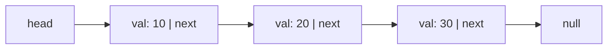

# Linked Lists

Linked-list problems aren't really about clever algorithms — they're about **pointer discipline**: rewiring `next` references without accidentally losing the rest of the list. Get comfortable with four little building blocks and you've basically covered the whole topic: **reverse a list in place**, **fast/slow pointers**, **merging with a dummy head**, and the **cycle math** behind Floyd's algorithm. One habit prevents most bugs: put a `dummy` node in front of the head so the head stops being a special case.

> [key] **Key Insight** — Almost every list problem reduces to carefully rewiring `next` while never losing your only reference to the rest of the list. Save `next` *before* you overwrite it.

## Why linked lists exist — the story

Imagine a music queue stored in an array. Inserting a new song at the front means shifting every existing song one position to the right. For 100,000 songs, one insertion can move 100,000 values. A linked list stores each song in its own node and connects nodes with references. Inserting at the front changes only two references, regardless of queue length:

```text
Before: head -> 20 -> 30 -> null
Insert 10:
        new.next = head
        head = new
After:  head -> 10 -> 20 -> 30 -> null
```

The trade-off is equally important: an array can jump directly to index `i`, but a linked list must follow references from `head` one node at a time. Linked lists exchange **O(1) local rewiring** for **O(n) positional access**.

| Operation | Array / ArrayList | Singly linked list |
|---|---:|---:|
| Read index `i` | O(1) | O(n) |
| Search by value | O(n) | O(n) |
| Insert/remove at front | O(n) | O(1) |
| Insert after a known node | O(n) | O(1) |
| Append with a maintained tail | amortized O(1) | O(1) |

> [note] **The interview reality** — Most linked-list questions do not ask you to implement a collection from scratch. They give you the first node, `head`, and ask you to return a node after traversing or rewiring the chain.

## Meet `ListNode` before using it

`ListNode` is not a Java built-in type. It is the conventional node class used by LeetCode and interview questions. LeetCode usually supplies the class for you; in a standalone program, define it yourself:

```java
class ListNode {
    int val;
    ListNode next;

    ListNode(int val) {
        this(val, null);
    }

    ListNode(int val, ListNode next) {
        this.val = val;
        this.next = next;
    }
}
```

Each node has two parts:

- `val` stores the payload.
- `next` stores a reference to the next node, or `null` when this is the tail.
- `head` is not a special node; it is the variable that references the first node.



<div class="readfig"><b>How to read it:</b> <code>head</code> references the node containing 10. That node's <code>next</code> references 20, then 30, and the final <code>next</code> is <code>null</code>. The arrows are references, not copied values.</div>

## Worked example — build and traverse `10 -> 20 -> 30`

This complete example defines the node type, builds a three-node list, and visits every value:

```java
class LinkedListExample {
    static class ListNode {
        int val;
        ListNode next;

        ListNode(int val) {
            this.val = val;
        }
    }

    public static void main(String[] args) {
        ListNode head = new ListNode(10);
        head.next = new ListNode(20);
        head.next.next = new ListNode(30);

        for (ListNode cur = head; cur != null; cur = cur.next) {
            System.out.println(cur.val);
        }
    }
}
```

```text
10
20
30
```

The traversal invariant is simple: at the start of each iteration, `cur` is the next unprocessed node. Reading `cur.val` processes it; assigning `cur = cur.next` advances exactly one link. The loop stops after the tail because its `next` is `null`.

> [trap] **Reference assignment does not copy a list** — `ListNode cur = head` creates a second reference to the same first node. Mutating `cur.next` changes the original chain. Advancing `cur = cur.next` changes only the local reference, not `head`.

## The four pointer moves

Most interview solutions are combinations of these operations:

| Move | Code shape | Why it is useful |
|---|---|---|
| Walk | `cur = cur.next` | traverse or search |
| Save the suffix | `ListNode next = cur.next` | keep the remainder reachable before rewiring |
| Rewire | `cur.next = prev` | reverse, delete, splice, or reorder |
| Skip a node | `prev.next = cur.next` | remove `cur` when `prev` is known |

For insertion or deletion near the first node, use a dummy node:

```java
ListNode dummy = new ListNode(0, head);
// Perform rewiring through dummy.next.
head = dummy.next;
```

The dummy gives every real node a predecessor, including the original head. That removes special-case branches such as "if deleting the first node."

## When to use a linked list

Use a linked list when the problem emphasizes local insertion/removal, stable node references, streaming one-way traversal, or explicit pointer manipulation. Prefer an array when you need random access, cache-friendly iteration, binary search, or frequent reads by index.

Before changing any `next` reference, ask:

1. What part of the list becomes unreachable after this assignment?
2. Have I saved a reference to that part?
3. Which node should be the head when the operation finishes?
4. Can an empty list, one-node list, or head change break this logic?

## Reverse a Linked List <span class="diff diff-e">Easy</span>


*[↗ LeetCode: Reverse Linked List](https://leetcode.com/problems/reverse-linked-list/)*

### Try it yourself

Edit the Java code below and click **▶ Run tests** to check it against real examples. Powered by [Judge0](https://ce.judge0.com); your code auto-saves in your browser.

<JavaRunner problemSlug="reverse-linked-list" :tests='[{ input: "5\n1 2 3 4 5", expected: "5 4 3 2 1" }, { input: "2\n1 2", expected: "2 1" }]' />


<ProgressCheck id="reverse-a-linked-list" />

### Problem

Reverse a singly linked list and return the new head.

**Constraints:** `0 ≤ nodes ≤ 5000`; do it iteratively in O(n) time, O(1) space.

**Example:** `1→2→3→null` → `3→2→1→null`.

**Example 1:** 1->2->3->null -> 3->2->1->null.

**Example 2:** null -> null, and a one-node list returns itself.

### Solution — brute force

Ignore the structural shortcut and scan/recompute from scratch for each decision.

```text
for each query or candidate:
  scan the relevant array/list/tree/graph state
  recompute the answer directly
```

Brute-force complexity: usually O(n) per operation or O(n^2)+ overall, with extra space when a copied structure is used.

### Solution — optimized

**Pattern:**
Iterative three-pointer reversal; the base primitive for most list manipulation.

> [inv] **Invariant** — `prev` heads the already-reversed prefix; `cur` heads the untouched suffix; the link between them is rewired each step.

<div class="figcap">Each step: <code>nxt = cur.next; cur.next = prev; prev = cur; cur = nxt</code> — flip one link, walk forward.</div>
<div class="readfig"><b>How to read it:</b> Compare the two rows. On top is the list before we touch it (`1→2→3→null`); on the bottom is the same list with every arrow flipped (`3→2→1→null`). We do it one node at a time: remember where `next` points *before* we overwrite it, redirect the current node's arrow backward to the previous node, then step forward. Saving `next` first is the whole trick — overwrite it too early and you lose the rest of the list.</div>

**Java:**
```java
ListNode reverse(ListNode head) {
    ListNode prev = null, cur = head;
    while (cur != null) {
        ListNode nxt = cur.next;
        cur.next = prev;
        prev = cur;
        cur = nxt;
    }
    return prev;
}
```

> [note] **Trace it** — `1→2→3→null`. Walking with `prev,cur`: flip `1`'s arrow to null, then `2→1`, then `3→2` → `3→2→1→null`.

<CodeTrace
  title="Reverse Linked List — 1→2→3→null"
  :values="[1,2,3]"
  :windowKeys="['cur']"
  :cellWidth="42"
  :steps='[
    { pointers: { prev: -1, cur: 0 }, vars: { list: "1→2→3" }, note: "start: prev=null, cur=head" },
    { pointers: { prev: 0, cur: 1 }, vars: { list: "1←null; 2→3 (moved)" }, note: "flip 1→null; advance", added: [0] },
    { pointers: { prev: 1, cur: 2 }, vars: { list: "2→1; 3 remains" }, note: "flip 2→1; advance", added: [0,1] },
    { pointers: { prev: 2, cur: -1 }, vars: { list: "3→2→1→null" }, note: "flip 3→2; cur=null → done", added: [0,1,2] }
  ]'
/>


> [trap] **Common Trap** — Losing `next` before rewiring. *Example:* nodes `1→2→3`. If you do `cur.next = prev;` before saving `cur.next` into a temp, the rest of the list is lost. Always: `next = cur.next; cur.next = prev; prev = cur; cur = next;`.

<TrapTrace title="Losing 'next' before rewiring" input="1→2→3" bug="nodes '1→2→3'. If you do 'cur.next = prev;' before saving 'cur.next' into a temp, the rest of the list is lost. Always: 'next = cur.next; cur.next = prev; prev = cur; cur = next;'." fix="See the guidance in the trap description and the code snippet." />

> [pat] **Pattern Connection** — Recursive reversal (O(n) stack) is the mental model for *Reverse Nodes in k-Group* and *Reverse Sublist II*, where you reverse bounded segments and reconnect.

### Time Complexity

O(n): each node is visited and rewired once.

Original summary: Time O(n) · Space O(1).

### Space Complexity

O(1) auxiliary space.

### Learning notes

- Why save nxt first? Otherwise the suffix is lost.
- Why prev starts null? Old head becomes the new tail.
- Why return prev? It is the new head when cur falls off.
- Why iterative? Avoids O(n) recursion stack.

#### Same pattern, new tweaks

The three-pointer flip is a building block you reconnect in different ways:

| Variation | The one thing that changes | Time |
|---|---|---|
| [Reverse Linked List II (sublist)](https://leetcode.com/problems/reverse-linked-list-ii/) | reverse only the nodes in `[left, right]`, then stitch the ends back | — |
| [Reverse Nodes in k-Group](https://leetcode.com/problems/reverse-nodes-in-k-group/) | reverse each block of `k` and reconnect blocks (leave a trailing remainder as-is) | — |
| [Swap Nodes in Pairs](https://leetcode.com/problems/swap-nodes-in-pairs/) | the `k = 2` special case | — |
| [Rotate List](https://leetcode.com/problems/rotate-list/) | find the new tail `k` from the end, then relink into a rotation | — |

## Reorder / Palindrome via Split-Reverse-Merge <span class="diff diff-e">Easy</span>


*[↗ LeetCode: Palindrome Linked List](https://leetcode.com/problems/palindrome-linked-list/)*

<ProgressCheck id="reorder-palindrome-via-split-reverse-merge" />

### Problem

*Palindrome Linked List:* check whether the list reads the same forwards and backwards, in O(1) space. (Sibling — *Reorder List:* rearrange `L0→L1→…→Ln` into `L0→Ln→L1→Ln-1→…`.)

**Constraints:** up to `10⁵` nodes; O(1) extra space expected.

**Example:** `1→2→2→1` → `true`; `1→2→3` → `false`.

**Example 1:** 1->2->2->1 -> true.

**Example 2:** 1->2->3->4 reorders as 1->4->2->3 in the sibling problem.

### Solution — brute force

Ignore the structural shortcut and scan/recompute from scratch for each decision.

```text
for each query or candidate:
  scan the relevant array/list/tree/graph state
  recompute the answer directly
```

Brute-force complexity: usually O(n) per operation or O(n^2)+ overall, with extra space when a copied structure is used.

### Solution — optimized

**Pattern:**
A composite trick: **find middle (fast/slow) → reverse second half → interleave/compare**. Solves *Reorder List* and *Palindrome Linked List* in O(1) space.

> [key] **Key Insight** — Combining the three primitives (middle, reverse, merge) turns "operate on both ends of a singly linked list" into an O(1)-space traversal despite no backward pointers.

**Java (palindrome check):**
```java
boolean isPalindrome(ListNode head) {
    ListNode slow = head, fast = head;
    while (fast != null && fast.next != null) { slow = slow.next; fast = fast.next.next; }
    ListNode second = reverse(slow);          // reverse 2nd half
    ListNode p1 = head, p2 = second;
    boolean ok = true;
    while (p2 != null) { if (p1.val != p2.val) { ok = false; break; } p1 = p1.next; p2 = p2.next; }
    return ok;                                 // (optionally restore by reversing again)
}
```

> [note] **Trace it** — palindrome check on `1→2→2→1`. Middle splits it into `1→2` and `2→1`; reverse the second to `1→2`; compare node-by-node — all equal → it's a palindrome.

<CodeTrace
  title="Palindrome Linked List — 1→2→2→1"
  :values="[1,2,2,1]"
  :windowKeys="['slow']"
  :cellWidth="42"
  :steps='[
    { pointers: { slow: 0, fast: 0 }, vars: { phase: "find middle" }, note: "start Floyd walk" },
    { pointers: { slow: 1, fast: 2 }, vars: { phase: "walk" }, note: "slow +1, fast +2" },
    { pointers: { slow: 2, fast: -1 }, vars: { phase: "middle found" }, note: "fast off-end → slow at middle", added: [2] },
    { pointers: { slow: 2, fast: 3 }, vars: { phase: "reverse right", right: "[1,2]" }, note: "reverse [2→1] into [1→2]" },
    { pointers: { slow: 0, fast: 3 }, vars: { phase: "compare", check: "1 vs 1 ✓" }, note: "compare heads: match", added: [0,3] },
    { pointers: { slow: 1, fast: 2 }, vars: { phase: "compare", check: "2 vs 2 ✓" }, note: "next: match → palindrome true", added: [1,2] }
  ]'
/>


> [inv] **Invariant** — After the split, `slow` heads the second half; reversing it lets a forward walk of the first half and a forward walk of the reversed second half compare mirror positions.

> [trap] **Common Trap** — Splitting on the wrong middle. *Example:* even-length list `1→2→3→4`. Fast/slow with `while (fast.next != null && fast.next.next != null)` gives the correct "first-half" middle at `2`, so the second half `3→4` reverses cleanly. Split at the geometric middle instead and the halves misalign.

<TrapTrace title="Splitting on the wrong middle" input="1→2→3→4" bug="even-length list '1→2→3→4'. Fast/slow with 'while (fast.next != null && fast.next.next != null)' gives the correct 'first-half' middle at '2', so the second half '3→4' reverses cleanly" fix="Split at the geometric middle instead and the halves misalign." />

> [pat] **Pattern Connection** — Decomposing a hard list task into the four primitives is the meta-skill; interviewers probe whether you restore the list afterward.

### Time Complexity

O(n): middle search, reverse, and compare/merge are linear.

Original summary: Time O(n) · Space O(1).

### Space Complexity

O(1) auxiliary space.

### Learning notes

- Why fast/slow? One-pass middle without length.
- Why reverse second half? Singly linked lists cannot walk backward.
- Why compare while p2 != null? The second half controls mirror pairs.
- Why optionally restore? Some callers expect the input unchanged.

#### Same pattern, new tweaks

"Find the middle, reverse a half, then walk both halves" powers the O(1)-space list tricks:

| Variation | The one thing that changes | Time |
|---|---|---|
| [Palindrome Linked List](https://leetcode.com/problems/palindrome-linked-list/) | reverse the second half and compare it against the first | — |
| [Reorder List](https://leetcode.com/problems/reorder-list/) | reverse the second half, then interleave it with the first | — |
| [Reverse Nodes in k-Group](https://leetcode.com/problems/reverse-nodes-in-k-group/) | the same reverse primitive applied to fixed-size blocks | — |

## LRU Cache (Design) <span class="diff diff-m">Medium</span>


*[↗ LeetCode: LRU Cache](https://leetcode.com/problems/lru-cache/)*

<ProgressCheck id="lru-cache-design" />

### Problem

Design a cache with `get(key)` and `put(key, value)` both in **O(1)**, evicting the **least-recently-used** entry whenever it exceeds capacity.

**Constraints:** `1 ≤ capacity ≤ 3000`; up to `2·10⁵` operations; every operation must be O(1).

**Example:** capacity 2 — after `put(1,1), put(2,2), get(1)→1, put(3,3)` (evicts key 2), `get(2)` → `-1`.

**Example 1:** capacity 2: put(1,1), put(2,2), get(1), put(3,3) evicts 2.

**Example 2:** put(1,1), put(2,2), put(1,10), put(3,3) evicts 2, not key 1.

### Solution — brute force

Ignore the structural shortcut and scan/recompute from scratch for each decision.

```text
for each query or candidate:
  scan the relevant array/list/tree/graph state
  recompute the answer directly
```

Brute-force complexity: usually O(n) per operation or O(n^2)+ overall, with extra space when a copied structure is used.

### Solution — optimized

**Pattern:**
`HashMap` for O(1) lookup + doubly linked list for O(1) recency reordering. Java's `LinkedHashMap` gives this for free.

> [inv] **Invariant** — List order = usage recency (front = most recent). Map points node references; every `get`/`put` moves the touched node to the front and evicts the tail when over capacity.

**Steps:**
1. Combine `HashMap<Key, Node>` + a doubly-linked list; the list keeps recency (front = MRU, back = LRU).
2. Add dummy `head` and `tail` sentinels to eliminate edge cases in linking.
3. `get(key)`: if absent → `-1`. Else unlink the node and re-insert at the front; return its value.
4. `put(key, value)`: if the key exists, update value and move to front. Otherwise, allocate a node, insert at front, `map.put`.
5. If `map.size() > capacity`, evict `tail.prev` — unlink it and `map.remove` its key.
6. Alternatively, extend `LinkedHashMap` with `accessOrder=true` and override `removeEldestEntry`.

**Java (LinkedHashMap in access order):**
```java
class LRUCache extends LinkedHashMap<Integer,Integer> {
    private final int cap;
    LRUCache(int capacity) { super(capacity, 0.75f, true); this.cap = capacity; }  // access-order
    public int get(int key) { return super.getOrDefault(key, -1); }
    public void put(int key, int value) { super.put(key, value); }
    @Override protected boolean removeEldestEntry(Map.Entry<Integer,Integer> e) { return size() > cap; }
}
```

**Common Mistakes:**
- **Not updating recency on `get`** — the whole point of LRU is that `get` is a mutation.
- **Forgetting head/tail sentinels** — you'll write null-checks in five places instead of zero.
- **Evicting before the size actually exceeds capacity** — evict only *after* inserting, only if `size > cap`.
- **Using the wrong map key on eviction** — remove the node's key from the map, not the node itself.
- **Not extending `LinkedHashMap` correctly** — must call `super(capacity, 0.75f, true)` and override `removeEldestEntry`.

> [pat] **Pattern Connection** — HashMap + auxiliary ordered structure is the universal O(1) design recipe; LFU adds a frequency bucket layer.

### Time Complexity

O(1) per get/put with LinkedHashMap access-order operations.

Original summary: O(1) per `get`/`put`.

### Space Complexity

O(capacity) for map entries and internal linked ordering.

> [trap] **Common Trap** — Not updating recency on `get`. *Example:* insert 1,2,3 (cap 3); `get(1)`; insert 4. Without moving 1 to the front on the read, 1 is still the LRU and gets evicted — but `1` was **just** used. `get` must be a mutation.

<TrapTrace title="Not updating recency on 'get'" input="get(1)" bug="insert 1,2,3 (cap 3); 'get(1)'; insert 4. Without moving 1 to the front on the read, 1 is still the LRU and gets evicted — but '1' was **just** used. 'get' must be a mutation." fix="See the guidance in the trap description and the code snippet." />

### Learning notes

- Why accessOrder=true? LinkedHashMap updates order on access.
- Why removeEldestEntry? It centralizes eviction after insert.
- Why get mutates? Reads refresh recency.
- Why know the manual map+DLL? It is the interview explanation behind LinkedHashMap.

#### Same pattern, new tweaks

"A hash map for O(1) lookup plus a second structure that maintains order/recency" is a whole design family:

| Variation | The one thing that changes | Time |
|---|---|---|
| [LFU Cache](https://leetcode.com/problems/lfu-cache/) | add frequency buckets (a map from frequency → ordered list) alongside the key map | — |
| [Insert Delete GetRandom O(1)](https://leetcode.com/problems/insert-delete-getrandom-o1/) | pair a hash map (value→index) with a dynamic array so random access is | O(1) |
| [Design Browser History](https://leetcode.com/problems/design-browser-history/) | a doubly linked list of pages with back/forward pointers | — |
| [All O`one Data Structure](https://leetcode.com/problems/all-oone-data-structure/) | buckets of equal-count keys threaded in a doubly linked list for O(1) min/max | O(1) |
