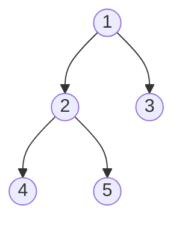

# Trees

A tree is just recursion you can see. The mindset that cracks almost every tree problem is a two-part question you ask at each node: *"what do I need from my children?"* — that becomes the value you **return**, computed *after* visiting them (post-order) — and *"what did my parent tell me?"* — that becomes the context you **pass down** (pre-order). Get comfortable steering those two directions and the nine classic tree skills — traversals, subtree aggregation, level-order BFS, BST ordering, lowest common ancestor, diameter, tree DP, serialize/deserialize, and construction — all turn out to be the same idea wearing different hats.


<div class="figcap">Sample tree. Traversal orders below flow directly from visit position.</div>
<div class="readfig"><b>How to read it:</b> This is just a shape to anchor the traversal orders in the table below. The only thing that changes between pre-, in-, and post-order is *when you record a node* relative to visiting its children: before them (pre), between left and right (in — which comes out sorted for a BST), or after both (post — perfect for combining child results). Level-order reads the tree row by row, top to bottom.</div>

| Traversal | Order | Yields |
|---|---|---|
| Preorder (node, L, R) | 1 2 4 5 3 | copy / serialize |
| Inorder (L, node, R) | 4 2 5 1 3 | **sorted** for a BST |
| Postorder (L, R, node) | 4 5 2 3 1 | subtree aggregates |
| Level-order (BFS) | 1 \| 2 3 \| 4 5 | shortest depth |

> [note] **🎬 Video walkthrough coming soon** — a 5-10 minute Loom will be embedded here once recorded. If you'd like to be notified, [subscribe on GitHub](https://github.com/abhisinghal/dsa-master-reference/subscription).

> [key] **Key Insight** — Ask two questions per problem: *what do I need from my children?* (defines the return value) and *what context do I inherit from my parent?* (defines the parameters). Post-order returns bubble up; pre-order parameters flow down.

## Traversals (iterative &amp; the recursion skeleton)

### Problem

Visit every node of a binary tree in the order the task requires: DFS preorder/inorder/postorder or BFS level order.

**Example 1:** For root 1 with children 2 and 3, level order is [[1],[2,3]].

**Example 2:** For BST 2 with children 1 and 3, inorder is [1,2,3].

### Solution — brute force

For level order, repeatedly rescan the tree for nodes at each depth instead of carrying a queue.

```text
for depth in 0..height:
  dfs(root, depth) and collect nodes at that depth
```

Brute-force complexity: O(nh) time (O(n^2) skewed) and O(h) recursion space.

### Solution — optimized

<p class="secgoal"><b>What & why:</b> the four tree walks (pre / in / post / level) and their iterative forms. Goal — pick the traversal whose visit-order matches the problem, and convert recursion↔stack when the interviewer bans recursion.</p>

Recursive traversal is trivial; interviewers probe the **iterative** forms (stack) and level-order (queue).

**Java (iterative inorder, level-order):**
```java
List<Integer> inorder(TreeNode root) {
    List<Integer> res = new ArrayList<>();
    Deque<TreeNode> st = new ArrayDeque<>();
    TreeNode cur = root;
    while (cur != null || !st.isEmpty()) {
        while (cur != null) { st.push(cur); cur = cur.left; }   // go left
        cur = st.pop(); res.add(cur.val);                        // visit
        cur = cur.right;                                         // go right
    }
    return res;
}

List<List<Integer>> levelOrder(TreeNode root) {
    List<List<Integer>> res = new ArrayList<>();
    if (root == null) return res;
    Queue<TreeNode> q = new ArrayDeque<>();
    q.offer(root);
    while (!q.isEmpty()) {
        int sz = q.size();                        // freeze this level's size
        List<Integer> level = new ArrayList<>();
        for (int i = 0; i < sz; i++) {
            TreeNode n = q.poll();
            level.add(n.val);
            if (n.left  != null) q.offer(n.left);
            if (n.right != null) q.offer(n.right);
        }
        res.add(level);
    }
    return res;
}
```

> [inv] **Invariant (level-order)** — Snapshotting `q.size()` before the inner loop guarantees you process exactly one level per outer iteration.

> [pat] **Pattern Connection** — Level-order is BFS on a tree; it yields *Right Side View* (last of each level), *Zigzag* (alternate direction), and min-depth (first leaf).

> [trap] **Common Trap** — Iterative in-order missing the "go-left first" phase. *Example:* tree `1←2→3`. Popping-and-printing before pushing all lefts prints in preorder, not in-order. Push lefts first, then pop-visit-descend-right.

### Time Complexity

O(n): each traversal visits every node once.

### Space Complexity

O(h) for DFS stack/recursion, or O(w) for BFS queue.

### Learning notes

- Why push all lefts for inorder? Left subtree is visited before node.
- Why snapshot queue size? It freezes one BFS layer.
- Why recursion for DFS? It mirrors tree structure naturally.
- Why ArrayDeque? Efficient stack and queue operations.

#### Same pattern, new tweaks

Process the tree one level at a time (snapshot `queue.size()`), then change *what you record per level*:

| Variation | The one thing that changes | Time |
|---|---|---|
| [Right Side View](https://leetcode.com/problems/binary-tree-right-side-view/) | keep the last node of each level | — |
| [Zigzag Level Order](https://leetcode.com/problems/binary-tree-zigzag-level-order-traversal/) | reverse the collected list on alternate levels | — |
| [Average of Levels](https://leetcode.com/problems/average-of-levels-in-binary-tree/) | sum ÷ count for each level | — |
| [Minimum Depth](https://leetcode.com/problems/minimum-depth-of-binary-tree/) | return as soon as you hit the first leaf (BFS finds it earliest) | — |

## Maximum Depth, Balanced, Diameter (post-order aggregation) <span class="diff diff-e">Easy</span>


*[↗ LeetCode: Diameter of Binary Tree](https://leetcode.com/problems/diameter-of-binary-tree/)*

<ProgressCheck id="maximum-depth-balanced-diameter-post-order-aggregation" />

### Problem

Compute the **diameter** of a binary tree — the number of edges on the longest path between any two nodes (it need not pass through the root).

**Constraints:** up to `10⁴` nodes.

**Example:** a root with left-subtree height 2 and right height 1 → diameter `3`.

**Example 1:** A root with left height 2 and right height 1 has diameter 3 edges.

**Example 2:** A three-node chain has diameter 2 edges, not 3 nodes.

### Solution — brute force

Ignore the structural shortcut and scan/recompute from scratch for each decision.

```text
for each query or candidate:
  scan the relevant array/list/tree/graph state
  recompute the answer directly
```

Brute-force complexity: usually O(n) per operation or O(n^2)+ overall, with extra space when a copied structure is used.

### Solution — optimized

**Pattern:**
Return an aggregate (height) from children; compute the node's answer during the return.

> [key] **Key Insight** — **Diameter** = longest path through any node = `leftHeight + rightHeight`. Compute height in post-order and update a global max with the through-node path — one O(n) pass, not O(n²).

> [inv] **Invariant** — `height(node)` returns the longest downward path; the diameter update uses those two returns *before* combining them into the parent's height.

**Java (diameter):**
```java
int diameter = 0;
int diameterOfBinaryTree(TreeNode root) { height(root); return diameter; }
int height(TreeNode n) {
    if (n == null) return 0;
    int l = height(n.left), r = height(n.right);
    diameter = Math.max(diameter, l + r);     // path through n (edge count)
    return 1 + Math.max(l, r);
}
```

> [note] **Trace it** — diameter of a tree whose root has left-height 2 and right-height 1: the longest path through the root is `2+1 = 3` edges. Each node reports its height up; the best `leftH+rightH` seen is the diameter.


> [trap] **Common Trap** — Edges vs nodes. *Example:* a 3-node linear tree `A-B-C`. Diameter measured in **edges** is 2 (`A→B→C`); in **nodes** is 3. LeetCode's *Diameter of Binary Tree* counts **edges** — return `max(leftDepth + rightDepth)`, not `+1`.

> [pat] **Pattern Connection** — "Return one thing, update a global with a richer combination" is the template for *Binary Tree Maximum Path Sum* (return best single-branch sum, update global with the two-branch sum; clamp negatives to 0).

### Time Complexity

O(n): one post-order pass computes each height once.

Original summary: Time O(n) · Space O(h).

### Space Complexity

O(h) recursion stack, O(n) worst case.

### Learning notes

- Why post-order? Child heights are needed first.
- Why global/field diameter? Helper returns height but answer is max path anywhere.
- Why left+right? LeetCode diameter counts edges.
- Why wrapper/field in Java? Primitives are passed by value.

#### Same pattern, new tweaks

Post-order returns one value up; the *answer* is a richer combination you stash in a global:

| Variation | The one thing that changes | Time |
|---|---|---|
| [Binary Tree Maximum Path Sum](https://leetcode.com/problems/binary-tree-maximum-path-sum/) | return the best single branch, but update the global with left+node+right (clamp negative branches to 0) | — |
| [Longest Univalue Path](https://leetcode.com/problems/longest-univalue-path/) | extend a branch only through children with the same value | — |
| [Balanced Binary Tree](https://leetcode.com/problems/balanced-binary-tree/) | return height, but short-circuit with `-1` the moment a subtree is unbalanced | — |
| [Diameter of an N-ary Tree](https://leetcode.com/problems/diameter-of-n-ary-tree/) | combine the two largest child depths instead of left/right | — |

## Lowest Common Ancestor <span class="diff diff-m">Medium</span>


*[↗ LeetCode: Lowest Common Ancestor of a Binary Tree](https://leetcode.com/problems/lowest-common-ancestor-of-a-binary-tree/)*

<ProgressCheck id="lowest-common-ancestor" />

### Problem

Given two nodes `p` and `q` in a binary tree, return their **lowest common ancestor** — the deepest node that has both in its subtree.

**Constraints:** up to `10⁵` nodes; `p` and `q` both exist and are distinct.

**Example:** tree rooted at 3 with children 5 and 1 → `LCA(5, 1) = 3`.

**Example 1:** Root 3 with children 5 and 1: LCA(5,1)=3.

**Example 2:** If 4 is under 5, LCA(5,4)=5.

### Solution — brute force

Ignore the structural shortcut and scan/recompute from scratch for each decision.

```text
for each query or candidate:
  scan the relevant array/list/tree/graph state
  recompute the answer directly
```

Brute-force complexity: usually O(n) per operation or O(n^2)+ overall, with extra space when a copied structure is used.

### Solution — optimized

**Pattern (general binary tree):**
Post-order: a node is the LCA if the two targets appear in different subtrees (or the node itself is a target).

> [key] **Key Insight** — Recurse; if `p` and `q` are found in different children, the current node is the LCA. If both surface from one side, propagate that side up.

**Java:**
```java
TreeNode lca(TreeNode root, TreeNode p, TreeNode q) {
    if (root == null || root == p || root == q) return root;
    TreeNode l = lca(root.left, p, q);
    TreeNode r = lca(root.right, p, q);
    if (l != null && r != null) return root;   // p, q split here -> LCA
    return l != null ? l : r;                   // both on one side (or none)
}
```

> [note] **Trace it** — in a tree rooted at 3 with children 5 and 1, `LCA(5,1)=3` (targets split across the two subtrees), while `LCA(5,4)` where 4 sits under 5 is `5` (a node that is itself an ancestor of the other).


> [key] **Key Insight (BST)** — With BST ordering, walk down: if both targets `< node`, go left; if both `>`, go right; otherwise the split point is the LCA. O(h) without recursion into both sides.

> [trap] **Common Trap** — BST logic on a general tree. *Example:* general-tree LCA(5,1) is 3 regardless of value order. Using BST comparisons (`p.val < root.val`) hunts one subtree and misses the split. For general trees, recurse both sides and combine.

> [pat] **Pattern Connection** — LCA underpins distance-between-nodes and *Binary Tree Maximum Width*/ancestor queries; with preprocessing (binary lifting / Euler tour + sparse table) it answers many queries in O(log n)/O(1).

### Time Complexity

O(n) for a general binary tree.

Original summary: Time O(n) · Space O(h).

### Space Complexity

O(h) recursion stack, O(n) worst case.

### Learning notes

- Why return root if root is p/q? A target can be ancestor.
- Why recurse both sides? General trees have no ordering.
- Why both sides non-null means LCA? Targets split here.
- Why BST variant differs? Ordering guides descent.

#### Same pattern, new tweaks

| Variation | The one thing that changes | Time |
|---|---|---|
| [LCA of a BST](https://leetcode.com/problems/lowest-common-ancestor-of-a-binary-search-tree/) | use the ordering — descend left/right until the two targets split, no full search | — |
| [LCA with Parent Pointers](https://leetcode.com/problems/lowest-common-ancestor-of-a-binary-tree-iii/) | walk up both ancestor chains and align lengths (like linked-list intersection) | — |
| [Distance Between Two Nodes](https://leetcode.com/problems/lowest-common-ancestor-of-a-binary-tree/) | `depth(p) + depth(q) − 2·depth(lca)` | — |
| [LCA of Deepest Leaves](https://leetcode.com/problems/lowest-common-ancestor-of-deepest-leaves/) | return `(depth, node)` upward and keep the node whose subtree holds the deepest leaves | — |

## Validate BST &amp; BST operations <span class="diff diff-m">Medium</span>


*[↗ LeetCode: Validate Binary Search Tree](https://leetcode.com/problems/validate-binary-search-tree/)*

<ProgressCheck id="validate-bst-amp-bst-operations" />

### Problem

Decide whether a binary tree is a valid **BST** — every node greater than all values in its left subtree and less than all in its right (not just its immediate children).

**Constraints:** up to `10⁴` nodes; values can span the full int range (use `long` bounds).

**Example:** root 5 with left 1 and right 4 (whose children are 3 and 6) → `false`.

**Example 1:** root 5 with left 1 and right 4(3,6) -> false.

**Example 2:** BST 2 with children 1 and 3 -> true.

### Solution — brute force

Ignore the structural shortcut and scan/recompute from scratch for each decision.

```text
for each query or candidate:
  scan the relevant array/list/tree/graph state
  recompute the answer directly
```

Brute-force complexity: usually O(n) per operation or O(n^2)+ overall, with extra space when a copied structure is used.

### Solution — optimized

**Pattern:**
Carry `(low, high)` bounds down; each node must lie strictly inside, tightening the bound for children. Equivalent: an in-order traversal of a BST is strictly increasing.

> [inv] **Invariant** — Every node in a subtree lies within the `(low, high)` window inherited from ancestors; left child inherits `(low, node.val)`, right inherits `(node.val, high)`.

**Java:**
```java
boolean isValidBST(TreeNode root) { return valid(root, Long.MIN_VALUE, Long.MAX_VALUE); }
boolean valid(TreeNode n, long low, long high) {
    if (n == null) return true;
    if (n.val <= low || n.val >= high) return false;
    return valid(n.left, low, n.val) && valid(n.right, n.val, high);
}
```

> [note] **Trace it** — root 5, left 1, right 4 with right's children 3 and 6. It *looks* fine locally, but 4 is under 5's right subtree, so its bound is `(5, ∞)` — 4 violates it → **not** a valid BST. (An in-order walk yields `1,5,3,4,6` — not increasing.)


> [trap] **Common Trap** — Local-only comparison. *Example:* `root=10, left=5, left.right=12`. Locally `5<10` and `12>5` — both pass — but `12` violates BST because it's under `10`'s left subtree. Pass an inclusive `(min, max)` bound down.

> [pat] **Pattern Connection** — In-order = sorted enables *Kth Smallest in BST* (in-order, stop at k), *Validate BST*, *Recover BST* (find the two swapped nodes), and *Convert BST to sorted DLL*.

### Time Complexity

O(n): every node is checked once.

Original summary: Time O(n) · Space O(h).

### Space Complexity

O(h) recursion stack, O(n) worst case.

### Learning notes

- Why long bounds? int sentinels can collide with real node values.
- Why strict bounds? Duplicates are invalid unless specified.
- Why ancestor bounds? Local child checks miss deep violations.
- Why inorder works? BST inorder is strictly increasing.

#### Same pattern, new tweaks

An in-order walk of a BST visits keys in sorted order — lean on that:

| Variation | The one thing that changes | Time |
|---|---|---|
| [Kth Smallest in a BST](https://leetcode.com/problems/kth-smallest-element-in-a-bst/) | do an in-order walk and stop after the kth node | — |
| [Recover BST](https://leetcode.com/problems/recover-binary-search-tree/) | the in-order sequence has exactly two out-of-order nodes; find and swap them | — |
| [Convert BST to Sorted Doubly Linked List](https://leetcode.com/problems/convert-binary-search-tree-to-sorted-doubly-linked-list/) | thread `prev`/`next` pointers as you visit in order | — |
| [Range Sum of BST](https://leetcode.com/problems/range-sum-of-bst/) | prune whole subtrees that fall entirely outside `[low, high]` | — |

## Serialize / Deserialize (structure encoding) <span class="diff diff-h">Hard</span>


*[↗ LeetCode: Serialize and Deserialize Binary Tree](https://leetcode.com/problems/serialize-and-deserialize-binary-tree/)*

<ProgressCheck id="serialize-deserialize-structure-encoding" />

### Problem

Design `serialize(root)` → string and `deserialize(string)` → tree so that any binary tree round-trips exactly.

**Constraints:** up to `10⁴` nodes; values fit in int; structure must be preserved.

**Example:** `1(2, 3(4,5))` → `"1,2,#,#,3,4,#,#,5,#,#"` → back to the same tree.

**Example 1:** 1(2,3) -> "1,2,#,#,3,#,#" -> same tree.

**Example 2:** An empty tree serializes as "#," and deserializes to null.

### Solution — brute force

Ignore the structural shortcut and scan/recompute from scratch for each decision.

```text
for each query or candidate:
  scan the relevant array/list/tree/graph state
  recompute the answer directly
```

Brute-force complexity: usually O(n) per operation or O(n^2)+ overall, with extra space when a copied structure is used.

### Solution — optimized

**Pattern:**
Pre-order with explicit null markers uniquely encodes shape and values; deserialize by consuming the same stream.

> [key] **Key Insight** — Null markers make the traversal reversible: without them, one traversal is ambiguous (many trees share a pre-order). With `#` sentinels, pre-order alone reconstructs the tree.

**Java:**
```java
String serialize(TreeNode root) {
    StringBuilder sb = new StringBuilder();
    build(root, sb);
    return sb.toString();
}
void build(TreeNode n, StringBuilder sb) {
    if (n == null) { sb.append("#,"); return; }
    sb.append(n.val).append(',');
    build(n.left, sb); build(n.right, sb);
}
TreeNode deserialize(String data) {
    return parse(new ArrayDeque<>(Arrays.asList(data.split(","))));
}
TreeNode parse(Deque<String> q) {
    String t = q.poll();
    if (t.equals("#")) return null;
    TreeNode n = new TreeNode(Integer.parseInt(t));
    n.left  = parse(q);
    n.right = parse(q);
    return n;
}
```

> [note] **Trace it** — the tree `1(2, 3(4,5))` serializes pre-order as `1,2,#,#,3,4,#,#,5,#,#` (`#`=null). Reading that stream left-to-right rebuilds the exact shape.


> [pat] **Pattern Connection** — The shared idea is **framing structure unambiguously so it can be rebuilt** — exactly the length-prefix trick from string encoding, here done with `#` null markers. Recognize it in any "serialize/rebuild a structure" task: the moment a traversal alone is ambiguous (many trees share a pre-order), add explicit markers. BFS/level-order serialization (LeetCode's format) is the same idea applied breadth-first.

> [trap] **Common Trap** — Ambiguity from missing null markers. *Example:* trees `[1,2]` (left-child only) and `[1,null,2]` (right-child only) serialize identically if you skip nulls. Emit an explicit sentinel (e.g. `#`) for null children; the pre-order stream then uniquely decodes.

### Time Complexity

O(n): each node/null marker is written and consumed once.

Original summary: Time O(n) · Space O(n).

### Space Complexity

O(n) for encoded data/tokens plus O(h) recursion.

### Learning notes

- Why null markers? They preserve shape.
- Why preorder? Parser creates node then consumes left/right.
- Why token queue? Each recursive call consumes one token.
- Why StringBuilder? Avoids repeated concatenation.

#### Same pattern, new tweaks

| Variation | The one thing that changes | Time |
|---|---|---|
| [Serialize/Deserialize BST](https://leetcode.com/problems/serialize-and-deserialize-bst/) | no null markers needed — rebuild using value bounds since it's ordered | — |
| [Serialize N-ary Tree](https://leetcode.com/problems/serialize-and-deserialize-n-ary-tree/) | prefix each node with its child count so the parser knows where children end | — |
| [Find Duplicate Subtrees](https://leetcode.com/problems/find-duplicate-subtrees/) | serialize every subtree to a string, hash them, and report repeats | — |
| [Construct String from Binary Tree](https://leetcode.com/problems/construct-string-from-binary-tree/) | parenthesised encoding `1(2)(3)` that stays reversible | — |

## Construct Tree from Traversals <span class="diff diff-m">Medium</span>


*[↗ LeetCode: Construct Binary Tree from Preorder and Inorder](https://leetcode.com/problems/construct-binary-tree-from-preorder-and-inorder-traversal/)*

<ProgressCheck id="construct-tree-from-traversals" />

### Problem

Rebuild the unique binary tree from its **preorder** and **inorder** traversals.

**Constraints:** up to `3000` nodes; values distinct.

**Example:** preorder `[3,9,20,15,7]`, inorder `[9,3,15,20,7]` → the tree rooted at 3.

**Example 1:** preorder [3,9,20,15,7] and inorder [9,3,15,20,7] reconstruct the tree.

**Example 2:** preorder [1,2], inorder [2,1] means 2 is the left child of 1.

### Solution — brute force

Ignore the structural shortcut and scan/recompute from scratch for each decision.

```text
for each query or candidate:
  scan the relevant array/list/tree/graph state
  recompute the answer directly
```

Brute-force complexity: usually O(n) per operation or O(n^2)+ overall, with extra space when a copied structure is used.

### Solution — optimized

**Pattern:**
Pre-order gives the root order; in-order splits left/right subtrees around the root. Use a value→index map on in-order for O(1) splits.

> [key] **Key Insight** — `preorder[0]` is the root; its position in `inorder` partitions the remaining nodes into left (before) and right (after) subtrees. Recurse with index ranges — no array copying.

**Java:**
```java
int pre = 0;
Map<Integer,Integer> idx = new HashMap<>();
TreeNode buildTree(int[] preorder, int[] inorder) {
    for (int i = 0; i < inorder.length; i++) idx.put(inorder[i], i);
    return build(preorder, 0, inorder.length - 1);
}
TreeNode build(int[] preorder, int inLo, int inHi) {
    if (inLo > inHi) return null;
    int rootVal = preorder[pre++];
    TreeNode root = new TreeNode(rootVal);
    int mid = idx.get(rootVal);
    root.left  = build(preorder, inLo, mid - 1);   // must build left before right (pre order)
    root.right = build(preorder, mid + 1, inHi);
    return root;
}
```

> [note] **Trace it** — preorder `[3,9,20,15,7]`, inorder `[9,3,15,20,7]`. Preorder's first `3` is the root; in inorder, `9` sits left of `3` (left subtree) and `15,20,7` right → recurse to rebuild.


> [trap] **Common Trap** — Repeated linear scans. *Example:* preorder `[3,9,20,15,7]`, inorder `[9,3,15,20,7]`. Locating `3` in inorder each call is O(n) → total O(n²). Precompute `Map<Integer,Integer>` from value → inorder index for O(1) lookup and O(n) total.

> [pat] **Pattern Connection** — Post-order + in-order works symmetrically (consume post-order from the back, right before left). Pre + post can build only *full* binary trees (ambiguous otherwise).

### Time Complexity

O(n): the inorder map makes each split O(1).

Original summary: Time O(n) · Space O(n).

### Space Complexity

O(n) for the index map plus O(h) recursion.

### Learning notes

- Why global preorder index? Preorder emits roots in construction order.
- Why inorder map? Root split lookup becomes O(1).
- Why build left first? Preorder lists left subtree next.
- Why bounds? They define the current subtree slice.

#### Same pattern, new tweaks

| Variation | The one thing that changes | Time |
|---|---|---|
| [Construct from Inorder + Postorder](https://leetcode.com/problems/construct-binary-tree-from-inorder-and-postorder-traversal/) | consume postorder from the **back**, building the right subtree before the left | — |
| [Construct BST from Preorder](https://leetcode.com/problems/construct-binary-search-tree-from-preorder-traversal/) | no inorder needed — split children using value bounds | — |
| [Construct from Preorder + Postorder](https://leetcode.com/problems/construct-binary-tree-from-preorder-and-postorder-traversal/) | works only for *full* trees; the second preorder value marks the left subtree's root | — |
| [Convert Sorted Array/List to BST](https://leetcode.com/problems/convert-sorted-array-to-binary-search-tree/) | the middle element is the root → balanced BST | — |

## Tree DP (House Robber III) <span class="diff diff-m">Medium</span>

*[↗ LeetCode: House Robber III](https://leetcode.com/problems/house-robber-iii/)*

### Problem

Houses form a binary tree; you **can't rob two directly-linked** (parent–child) houses. Maximize the total amount robbed.

**Constraints:** up to `10⁴` nodes; values `≥ 0`.

**Example:** root 3 (children 2 and 3; the left 2 has a right child 3, the right 3 has a right child 1) → `7`.

**Example 1:** [3,2,3,null,3,null,1] -> 7.

**Example 2:** single node 5 -> 5; empty tree -> 0.

### Solution — brute force

Ignore the structural shortcut and scan/recompute from scratch for each decision.

```text
for each query or candidate:
  scan the relevant array/list/tree/graph state
  recompute the answer directly
```

Brute-force complexity: usually O(n) per operation or O(n^2)+ overall, with extra space when a copied structure is used.

### Solution — optimized

**Pattern:**
Return a small tuple per node summarizing both decisions; the parent combines children's tuples.

> [key] **Key Insight** — For each node return `{rob, skip}`: `rob = node.val + left.skip + right.skip` (can't rob adjacent), `skip = max(left) + max(right)`. One post-order pass replaces exponential recomputation.

**Java:**
```java
int rob(TreeNode root) { int[] r = dfs(root); return Math.max(r[0], r[1]); }
int[] dfs(TreeNode n) {                       // {robThis, skipThis}
    if (n == null) return new int[]{0, 0};
    int[] l = dfs(n.left), r = dfs(n.right);
    int rob  = n.val + l[1] + r[1];
    int skip = Math.max(l[0], l[1]) + Math.max(r[0], r[1]);
    return new int[]{rob, skip};
}
```

> [note] **Trace it** — House Robber III: each node returns `(rob, skip)`. If a node robs, it must skip its children (`node.val + childrenSkip`); if it skips, it takes the best of each child. The root's `max(rob, skip)` is the answer.


> [pat] **Pattern Connection** — "Return a per-node state tuple, combine at the parent" is the general tree-DP shape: *Binary Tree Cameras*, *Longest Univalue Path*, *Distribute Coins in Binary Tree* all follow it.

> [trap] **Common Trap** — Returning a scalar instead of a state pair. *Example:* on subtree rooted at `v`, you need both "best with `v` robbed" and "best without" so the parent can combine — a single number forces recomputation. Return `int[]{robbed, notRobbed}`.

### Time Complexity

O(n): each node returns its two DP states once.

Original summary: Time O(n) · Space O(h).

### Space Complexity

O(h) recursion stack, O(n) worst case.

### Learning notes

- Why two states? Parent needs rob and skip cases.
- Why post-order? Node decisions depend on children.
- Why skip uses max child state? Children are free when parent skipped.
- Why no memo map? Returning both states solves each node once.

#### Same pattern, new tweaks

Each node returns a small tuple summarizing its subtree; the parent combines children's tuples:

| Variation | The one thing that changes | Time |
|---|---|---|
| [House Robber III](https://leetcode.com/problems/house-robber-iii/) | return `{rob, skip}`; robbing a node forbids robbing its children | — |
| [Binary Tree Cameras](https://leetcode.com/problems/binary-tree-cameras/) | return a 3-state (has-camera / covered / needs-cover) and place cameras greedily from the leaves up | — |
| [Distribute Coins in Binary Tree](https://leetcode.com/problems/distribute-coins-in-binary-tree/) | return each subtree's surplus/deficit; sum `|flow|` across edges for the move count | — |
| [Longest ZigZag Path](https://leetcode.com/problems/longest-zigzag-path-in-a-binary-tree/) | return `{leftLen, rightLen}` and update a global maximum | — |
