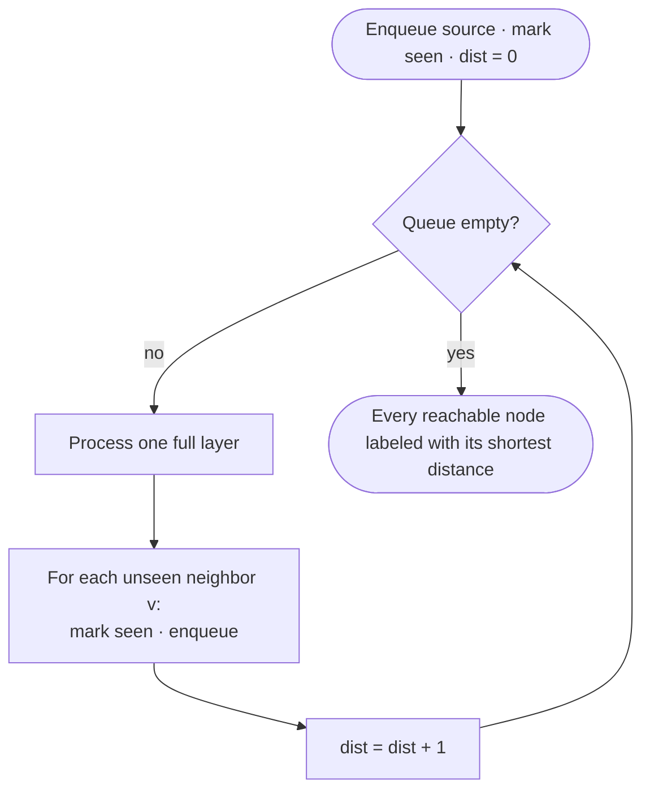
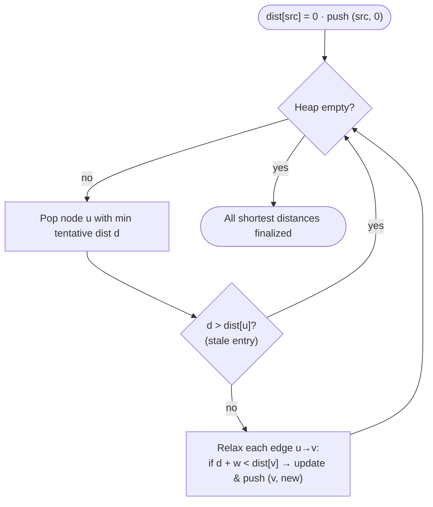

# Graphs

Most graph problems are one of a handful of algorithms wearing a disguise (a grid, a word ladder, a course schedule). The first move is always **representation**; the second is choosing the traversal that matches the question.

## Representation &amp; the choice map
<p class="secgoal"><b>What & why:</b> how to store a graph (adjacency list vs matrix) and which traversal each question wants. Goal — make the two decisions every graph problem opens with: representation first, then the matching traversal.</p>

- **Adjacency list** `List<int[]>[]` or `Map<Node,List<Edge>>` — default; O(V+E) space, iterate neighbors fast.
- **Adjacency matrix** — dense graphs, O(1) edge test, O(V²) space; used by Floyd–Warshall.
- **Grid = implicit graph** — cell `(r,c)` connects to 4 (or 8) neighbors; no explicit adjacency needed.
- **Union-Find** — connectivity/merging without building an explicit graph.

```text
Question                              -> Algorithm
reachable? components?                -> DFS / BFS / Union-Find
shortest path, unweighted             -> BFS (layers = distance)
shortest path, weights >= 0           -> Dijkstra (min-heap)
shortest path, negative edges         -> Bellman-Ford / SPFA
all-pairs shortest, small V           -> Floyd-Warshall  O(V^3)
order with prerequisites, cycle?      -> Topological sort (Kahn / DFS)
min cost to connect all nodes         -> MST (Kruskal + DSU, or Prim)
dynamic connectivity / grouping       -> Union-Find
```

> [key] **Key Insight** — Unweighted shortest path is **BFS**, not Dijkstra. BFS explores in distance layers, so the first time you reach a node is via a shortest path. Save Dijkstra for weighted edges.


<div class="figcap">BFS control flow — layer-by-layer expansion gives shortest distances in an unweighted graph.</div>
<div class="readfig"><b>How to read it:</b> Picture ripples spreading from where you drop a stone. BFS visits everything one "hop" away, then everything two hops away, and so on — one full ring at a time. The loop says: while the queue isn't empty, take the whole current ring, mark each unvisited neighbour and queue it for the next ring, then bump the distance by one. Because you reach each node on the earliest possible ring, the first time you see a node is via a shortest path.</div>

<BFSGridAnim />

> [note] **Video walkthrough coming soon** — a 5-10 minute Loom will be embedded here once recorded. If you'd like to be notified, [subscribe on GitHub](https://github.com/abhisinghal/dsa-master-reference/subscription).

## Number of Islands (grid flood fill) <span class="diff diff-m">Medium</span>


*[↗ LeetCode: Number of Islands](https://leetcode.com/problems/number-of-islands/)*

<ProgressCheck id="number-of-islands-grid-flood-fill" />

```svg
<svg viewBox="0 0 400 250" xmlns="http://www.w3.org/2000/svg">
  <rect x="0" y="0" width="400" height="250" rx="12" fill="var(--dsa-bg)"/>
  <text x="200" y="24" text-anchor="middle" font-family="var(--dsa-font)" font-size="13" font-weight="700" fill="var(--dsa-primary)">Flood-fill each unvisited '1' — count islands</text>
  <g font-family="var(--dsa-font)" text-anchor="middle" font-size="15" font-weight="700" fill="var(--dsa-ink)">
    <rect x="80" y="46" width="36" height="36" rx="6" fill="var(--dsa-success-soft)" stroke="var(--dsa-success)" stroke-width="1.6"/><text x="98" y="70">1</text>
    <rect x="120" y="46" width="36" height="36" rx="6" fill="var(--dsa-success-soft)" stroke="var(--dsa-success)" stroke-width="1.6"/><text x="138" y="70">1</text>
    <rect x="160" y="46" width="36" height="36" rx="6" fill="var(--dsa-neutral-soft)" stroke="var(--dsa-neutral-line)" stroke-width="1.6"/><text x="178" y="70">0</text>
    <rect x="200" y="46" width="36" height="36" rx="6" fill="var(--dsa-primary-soft)" stroke="var(--dsa-primary)" stroke-width="1.6"/><text x="218" y="70">1</text>
    <rect x="240" y="46" width="36" height="36" rx="6" fill="var(--dsa-neutral-soft)" stroke="var(--dsa-neutral-line)" stroke-width="1.6"/><text x="258" y="70">0</text>
    <rect x="80" y="86" width="36" height="36" rx="6" fill="var(--dsa-success-soft)" stroke="var(--dsa-success)" stroke-width="1.6"/><text x="98" y="110">1</text>
    <rect x="120" y="86" width="36" height="36" rx="6" fill="var(--dsa-neutral-soft)" stroke="var(--dsa-neutral-line)" stroke-width="1.6"/><text x="138" y="110">0</text>
    <rect x="160" y="86" width="36" height="36" rx="6" fill="var(--dsa-neutral-soft)" stroke="var(--dsa-neutral-line)" stroke-width="1.6"/><text x="178" y="110">0</text>
    <rect x="200" y="86" width="36" height="36" rx="6" fill="var(--dsa-neutral-soft)" stroke="var(--dsa-neutral-line)" stroke-width="1.6"/><text x="218" y="110">0</text>
    <rect x="240" y="86" width="36" height="36" rx="6" fill="var(--dsa-neutral-soft)" stroke="var(--dsa-neutral-line)" stroke-width="1.6"/><text x="258" y="110">0</text>
    <rect x="80" y="126" width="36" height="36" rx="6" fill="var(--dsa-neutral-soft)" stroke="var(--dsa-neutral-line)" stroke-width="1.6"/><text x="98" y="150">0</text>
    <rect x="120" y="126" width="36" height="36" rx="6" fill="var(--dsa-neutral-soft)" stroke="var(--dsa-neutral-line)" stroke-width="1.6"/><text x="138" y="150">0</text>
    <rect x="160" y="126" width="36" height="36" rx="6" fill="var(--dsa-neutral-soft)" stroke="var(--dsa-neutral-line)" stroke-width="1.6"/><text x="178" y="150">0</text>
    <rect x="200" y="126" width="36" height="36" rx="6" fill="var(--dsa-warning-soft)" stroke="var(--dsa-warning)" stroke-width="1.6"/><text x="218" y="150">1</text>
    <rect x="240" y="126" width="36" height="36" rx="6" fill="var(--dsa-warning-soft)" stroke="var(--dsa-warning)" stroke-width="1.6"/><text x="258" y="150">1</text>
    <rect x="80" y="166" width="36" height="36" rx="6" fill="var(--dsa-neutral-soft)" stroke="var(--dsa-neutral-line)" stroke-width="1.6"/><text x="98" y="190">0</text>
    <rect x="120" y="166" width="36" height="36" rx="6" fill="var(--dsa-neutral-soft)" stroke="var(--dsa-neutral-line)" stroke-width="1.6"/><text x="138" y="190">0</text>
    <rect x="160" y="166" width="36" height="36" rx="6" fill="var(--dsa-neutral-soft)" stroke="var(--dsa-neutral-line)" stroke-width="1.6"/><text x="178" y="190">0</text>
    <rect x="200" y="166" width="36" height="36" rx="6" fill="var(--dsa-warning-soft)" stroke="var(--dsa-warning)" stroke-width="1.6"/><text x="218" y="190">1</text>
    <rect x="240" y="166" width="36" height="36" rx="6" fill="var(--dsa-neutral-soft)" stroke="var(--dsa-neutral-line)" stroke-width="1.6"/><text x="258" y="190">0</text>
  </g>
  <rect x="290" y="50" width="86" height="30" rx="8" fill="var(--dsa-success-soft)" stroke="var(--dsa-success)" stroke-width="1.6"/>
  <text x="333" y="70" text-anchor="middle" font-family="var(--dsa-font)" font-size="12" font-weight="700" fill="var(--dsa-success)">island #1</text>
  <rect x="290" y="88" width="86" height="30" rx="8" fill="var(--dsa-primary-soft)" stroke="var(--dsa-primary)" stroke-width="1.6"/>
  <text x="333" y="108" text-anchor="middle" font-family="var(--dsa-font)" font-size="12" font-weight="700" fill="var(--dsa-primary)">island #2</text>
  <rect x="290" y="126" width="86" height="30" rx="8" fill="var(--dsa-warning-soft)" stroke="var(--dsa-warning)" stroke-width="1.6"/>
  <text x="333" y="146" text-anchor="middle" font-family="var(--dsa-font)" font-size="12" font-weight="700" fill="var(--dsa-warning)">island #3</text>
  <text x="200" y="222" text-anchor="middle" font-family="var(--dsa-font)" font-size="11.5" font-style="italic" fill="var(--dsa-neutral)">Each DFS/BFS from an unvisited '1' floods one component. Count = 3.</text>
</svg>
```

### Problem

Count the number of **islands** in a grid of `'1'` (land) and `'0'` (water); an island is land connected 4-directionally.

**Constraints:** grid up to `300×300`.

**Example:** a grid with one connected land block plus one separate land cell → `2`.

**Example 1:** One top-left land block plus one bottom-right land cell -> 2.

**Example 2:** All water -> 0.

### Solution — brute force

Ignore the structural shortcut and scan/recompute from scratch for each decision.

```text
for each query or candidate:
  scan the relevant array/list/tree/graph state
  recompute the answer directly
```

Brute-force complexity: usually O(n) per operation or O(n^2)+ overall, with extra space when a copied structure is used.

### Solution — optimized

**Pattern:**
Scan the grid; each unvisited land cell launches a DFS/BFS that sinks its whole component.

> [inv] **Invariant** — Once a component is flooded (marked), it is never revisited; the outer scan counts exactly one launch per component.

<DFSGridAnim />

**Java (DFS, in-place marking):**
```java
int numIslands(char[][] g) {
    int count = 0;
    for (int r = 0; r < g.length; r++)
        for (int c = 0; c < g[0].length; c++)
            if (g[r][c] == '1') { sink(g, r, c); count++; }
    return count;
}
void sink(char[][] g, int r, int c) {
    if (r < 0 || c < 0 || r >= g.length || c >= g[0].length || g[r][c] != '1') return;
    g[r][c] = '0';                                   // mark visited
    sink(g, r+1, c); sink(g, r-1, c); sink(g, r, c+1); sink(g, r, c-1);
}
```

> [note] **Trace it** — a 3×3 grid with land at the top-left block and one separate cell bottom-right forms **2** islands: the first DFS sinks the connected block, the second sinks the lone cell.

<CodeTrace
  title="Number of Islands — 3x3 grid, 2 components"
  :values="[1,1,0,1,0,0,0,0,1]"
  :windowKeys="['cell']"
  :cellWidth="42"
  :steps='[
    { pointers: { cell: 0 }, vars: { islands: 1, "sunk": "1 cell" }, note: "start DFS at (0,0)=1", added: [0] },
    { pointers: { cell: 1 }, vars: { islands: 1, "sunk": "2 cells" }, note: "spread right", added: [0,1] },
    { pointers: { cell: 3 }, vars: { islands: 1, "sunk": "3 cells" }, note: "spread down. block done", added: [0,1,3] },
    { pointers: { cell: 8 }, vars: { islands: 2, "sunk": "4 cells" }, note: "new DFS at (2,2)=1 → 2nd island. answer=2", added: [0,1,3,8] }
  ]'
/>

### Time Complexity

O(R*C): each cell is scanned/sunk at most once.

Original summary: Time O(R·C) · Space O(R·C) recursion worst case.

### Space Complexity

O(R*C) worst-case recursion/queue space.

> [trap] **Common Trap** — Marking after recursing. *Example:* grid `[[1,1],[1,1]]`. If you recurse into a neighbour before marking the current cell visited, it recurses back into you → stack overflow. Mark visited **before** the 4-way recursion.

> [pat] **Pattern Connection** — Flood fill also solves *Max Area of Island*, *Surrounded Regions* (flood from borders), *Rotting Oranges* (multi-source BFS), and *Pacific Atlantic Water Flow* (reverse flood from both oceans).

### Learning notes

- Why mark by mutating grid? It is a free visited set.
- Why four directions? Diagonals are not connected by definition.
- Why count launches? Each launch is one new component.
- Why mark before recursion? Prevents cycling back immediately.

#### Same pattern, new tweaks

"Scan the grid, and DFS/BFS each unvisited component" adapts to a whole family by changing *what you do with each component*:

| Variation | The one thing that changes | Time |
|---|---|---|
| [Max Area of Island](https://leetcode.com/problems/max-area-of-island/) | have the flood return the cells it sank, and keep the maximum instead of a count | — |
| [Surrounded Regions](https://leetcode.com/problems/surrounded-regions/) | first flood the safe cells inward **from the borders**, then flip everything else | — |
| [Rotting Oranges](https://leetcode.com/problems/rotting-oranges/) | seed the queue with *all* rotten cells and run a multi-source BFS, counting layers = minutes | — |
| [Pacific Atlantic Water Flow](https://leetcode.com/problems/pacific-atlantic-water-flow/) | flood **inward from each ocean's edge**, then take the intersection of the two reachable sets | — |
| [Number of Closed Islands](https://leetcode.com/problems/number-of-closed-islands/) | same island count, but discard any component that touches the border | — |

## Rotting Oranges (multi-source BFS) <span class="diff diff-m">Medium</span>


*[↗ LeetCode: Rotting Oranges](https://leetcode.com/problems/rotting-oranges/)*

<ProgressCheck id="rotting-oranges-multi-source-bfs" />

### Problem

In a grid, `2` = rotten orange, `1` = fresh, `0` = empty. Each minute a rotten orange rots its 4-neighbours. Return the minutes until none are fresh (or -1 if impossible).

**Constraints:** grid up to ~`10×10`+; values ∈ {0,1,2}.

**Example:** `[[2,1,1],[1,1,0],[0,1,1]]` → `4`.

**Example 1:** [[2,1,1],[1,1,0],[0,1,1]] -> 4.

**Example 2:** [[2,1,1],[0,1,1],[1,0,1]] -> -1.

### Solution — brute force

Ignore the structural shortcut and scan/recompute from scratch for each decision.

```text
for each query or candidate:
  scan the relevant array/list/tree/graph state
  recompute the answer directly
```

Brute-force complexity: usually O(n) per operation or O(n^2)+ overall, with extra space when a copied structure is used.

### Solution — optimized

**Pattern:**
Seed the queue with **all** sources at once; BFS expands them in lockstep, so layer count = time to reach the farthest cell.

> [key] **Key Insight** — When many starts spread simultaneously, enqueue every source at distance 0. The layered BFS then measures the minimum time for the whole front to cover the grid — no per-source repetition.

**Java (core loop):**
```java
int orangesRotting(int[][] g) {
    Queue<int[]> q = new ArrayDeque<>();
    int fresh = 0, R = g.length, C = g[0].length;
    for (int r = 0; r < R; r++) for (int c = 0; c < C; c++) {
        if (g[r][c] == 2) q.offer(new int[]{r, c});
        else if (g[r][c] == 1) fresh++;
    }
    int[][] dir = {{1,0},{-1,0},{0,1},{0,-1}};
    int minutes = 0;
    while (!q.isEmpty() && fresh > 0) {
        minutes++;
        for (int i = q.size(); i > 0; i--) {          // one minute = one layer
            int[] cell = q.poll();
            for (int[] d : dir) {
                int nr = cell[0]+d[0], nc = cell[1]+d[1];
                if (nr<0||nc<0||nr>=R||nc>=C||g[nr][nc]!=1) continue;
                g[nr][nc] = 2; fresh--; q.offer(new int[]{nr, nc});
            }
        }
    }
    return fresh == 0 ? minutes : -1;
}
```

> [note] **Trace it** — grid `[[2,1,1],[1,1,0],[0,1,1]]` (2=rotten). All rotten oranges spread simultaneously; the last fresh orange rots at minute **4** = the number of BFS layers.

<CodeTrace
  title="Rotting Oranges (BFS layers) — 3x3 grid"
  :values="[2,1,1,1,1,0,0,1,1]"
  :windowKeys="['t']"
  :cellWidth="42"
  :steps='[
    { pointers: { t: 0 }, vars: { queue: "[(0,0)]", fresh: 6 }, note: "minute 0: only rotten is (0,0)", removed: [0] },
    { pointers: { t: 1 }, vars: { queue: "[(0,1),(1,0)]", fresh: 4 }, note: "minute 1: rot spreads to right + below", removed: [0,1,3] },
    { pointers: { t: 2 }, vars: { queue: "[(0,2),(1,1)]", fresh: 2 }, note: "minute 2: further spread", removed: [0,1,3,2,4] },
    { pointers: { t: 3 }, vars: { queue: "[(2,1)]", fresh: 1 }, note: "minute 3: 4 rots at (2,1)", removed: [0,1,3,2,4,7] },
    { pointers: { t: 4 }, vars: { queue: "[(2,2)]", fresh: 0 }, note: "minute 4: last fresh rots. answer 4", removed: [0,1,3,2,4,7,8] }
  ]'
/>


> [pat] **Pattern Connection** — Multi-source BFS also answers *01 Matrix* (distance to nearest 0) and *Walls and Gates* — seed all zeros/gates, expand once.

> [trap] **Common Trap** — Single-source BFS on a multi-source problem. *Example:* two rotten oranges at opposite corners with fresh ones between. From one source, the middle rots at time `d`; from both simultaneously, at `d/2`. Queue **all** rotten cells at t=0.

### Time Complexity

O(R*C): each cell enters the queue at most once.

Original summary: Time O(R·C) · Space O(R·C).

### Space Complexity

O(R*C) for the BFS queue in the worst case.

### Learning notes

- Why enqueue all rotten first? They spread simultaneously.
- Why one minute per layer? BFS layers are time steps.
- Why fresh count? Avoids rescanning for completion.
- Why mark when enqueuing? Prevents duplicate queue entries.

#### Same pattern, new tweaks

Seed the queue with **every** source at distance 0, then expand once:

| Variation | The one thing that changes | Time |
|---|---|---|
| [01 Matrix](https://leetcode.com/problems/01-matrix/) | sources are all the 0-cells; each 1-cell gets its distance to the nearest 0 | — |
| [Walls and Gates](https://leetcode.com/problems/walls-and-gates/) | sources are all the gates; fill each room with its distance to the closest gate | — |
| [As Far From Land as Possible](https://leetcode.com/problems/as-far-from-land-as-possible/) | sources are all land cells; the answer is the last water cell reached (max distance) | — |
| [Shortest Bridge](https://leetcode.com/problems/shortest-bridge/) | flood one island first, then multi-source BFS outward until you hit the second | — |

## Dijkstra (weighted shortest path, non-negative) <span class="diff diff-m">Medium</span>


*[↗ LeetCode: Network Delay Time](https://leetcode.com/problems/network-delay-time/)*

<ProgressCheck id="dijkstra-weighted-shortest-path-non-negative" />

### Problem

From a source node, find the time for a signal to reach **all** `n` nodes across weighted directed edges (or -1 if any node is unreachable).

**Constraints:** `1 ≤ n ≤ 100`; up to `6000` edges; weights `≥ 0`.

**Example:** edges `A→B(1), A→C(4), B→C(2)` from A → shortest to C is `3`.

**Example 1:** A->B(1), A->C(4), B->C(2) gives dist(C)=3.

**Example 2:** A node left at infinity after the heap empties is unreachable.

### Solution — brute force

Ignore the structural shortcut and scan/recompute from scratch for each decision.

```text
for each query or candidate:
  scan the relevant array/list/tree/graph state
  recompute the answer directly
```

Brute-force complexity: usually O(n) per operation or O(n^2)+ overall, with extra space when a copied structure is used.

### Solution — optimized

**Pattern:**
Greedy BFS with a min-heap ordered by tentative distance; finalize a node the first time it's popped.

> [inv] **Invariant** — When a node is popped from the heap, its recorded distance is final and optimal (holds only because all edge weights ≥ 0).


<div class="figcap">Dijkstra — a greedy layered BFS by cost; the stale-entry skip replaces Java's missing decrease-key.</div>
<div class="readfig"><b>How to read it:</b> It's BFS, but instead of counting hops we always expand the *cheapest-so-far* node next — that's what the min-heap gives us. When we pop a node we lock in its distance as final (safe because all edge weights are ≥ 0, so nothing cheaper can arrive later). We then "relax" its neighbours: if going through this node is cheaper than their current best, we update and push a new entry. The `d > dist[u]` check throws away outdated heap entries, since Java's heap can't update a key in place.</div>

**Steps:**
1. Initialize `dist[]` to `∞` except `dist[src] = 0`.
2. Min-heap of `{node, distance}`. Offer `{src, 0}`.
3. Pop the top. If its `d > dist[u]`, it's a **stale** entry — skip.
4. Otherwise, relax each outgoing edge `(u, v, w)`: if `d + w < dist[v]`, update and push `{v, d+w}`.
5. Continue until the heap is empty. Distances are final on first pop (since edges are non-negative).
6. Time O(E log V) with lazy deletion.

**Java:**
```java
int[] dijkstra(int n, List<int[]>[] adj, int src) {   // adj[u] = {v, weight}
    int[] dist = new int[n];
    Arrays.fill(dist, Integer.MAX_VALUE);
    dist[src] = 0;
    PriorityQueue<int[]> pq = new PriorityQueue<>((a, b) -> a[1] - b[1]);  // {node, dist}
    pq.offer(new int[]{src, 0});
    while (!pq.isEmpty()) {
        int[] top = pq.poll();
        int u = top[0], d = top[1];
        if (d > dist[u]) continue;                     // stale entry (lazy deletion)
        for (int[] e : adj[u]) {
            int v = e[0], nd = d + e[1];
            if (nd < dist[v]) { dist[v] = nd; pq.offer(new int[]{v, nd}); }
        }
    }
    return dist;
}
```

> [note] **Trace it** — from `A`, edges `A→B(1), A→C(4), B→C(2)`. The heap pops `B` at distance 1, which relaxes `C` to `1+2=3` — beating the direct `A→C(4)` → shortest to `C` is **3**.

<CodeTrace
  title="Dijkstra — source A. edges A→B(1), A→C(4), B→C(2)"
  :values="['A','B','C']"
  :windowKeys="['popped']"
  :cellWidth="52"
  :steps='[
    { pointers: { popped: 0 }, vars: { dist: "{A:0, B:∞, C:∞}", heap: "[(0,A)]" }, note: "init: dist[A]=0", added: [0] },
    { pointers: { popped: 0 }, vars: { dist: "{A:0, B:1, C:4}", heap: "[(1,B),(4,C)]" }, note: "pop A. relax B=1, C=4", added: [0] },
    { pointers: { popped: 1 }, vars: { dist: "{A:0, B:1, C:3}", heap: "[(3,C),(4,C)]" }, note: "pop B. relax C = 1+2 = 3", added: [1] },
    { pointers: { popped: 2 }, vars: { dist: "{A:0, B:1, C:3}", heap: "[(4,C)]" }, note: "pop C at 3. stale 4 skipped. shortest A→C = 3", added: [2] }
  ]'
/>

**Common Mistakes:**
- **Skipping the stale-pop guard**: without `if (d > dist[u]) continue;`, popped-then-updated nodes re-relax with wrong distances.
- **Using it with negative edges**: greedy assumption breaks — use Bellman–Ford instead.
- **Storing `{node}` alone**: you need the distance in the heap for lazy deletion (Java has no decrease-key).
- **Overflow on `d + w`**: for large edge weights, widen the accumulator to `long`.
- **Undirected forgotten**: add both `(u, v, w)` and `(v, u, w)` to the adjacency list.

> [pat] **Pattern Connection** — *Network Delay Time*, *Path With Minimum Effort* (min over max-edge), *Cheapest Flights within K Stops* (Dijkstra with a stop budget or Bellman–Ford). **0-1 BFS** (deque) handles weights ∈ {0,1} in O(V+E).

### Time Complexity

O(E log V) with a binary heap and adjacency lists.

Original summary: Time O(E log V) · Space O(V+E).

### Space Complexity

O(V + E) for adjacency, distances, and heap entries.

> [trap] **Common Trap** — Skipping the stale-pop guard. *Example:* edges push `{v,10}` then `{v,3}` for the same node. When you pop `{v,10}` later, without `if (d > dist[v]) continue;` you re-relax neighbours with the wrong distance. Guard every pop.

### Learning notes

- Why adjacency list over matrix? O(V+E) space instead of O(V^2).
- Why PriorityQueue<int[]>? It carries node and distance together.
- Why stale-entry check? Lazy deletion replaces decrease-key.
- Why non-negative weights? Greedy finalization depends on it.
- Why beware subtraction comparator? Large distances can overflow.

#### Same pattern, new tweaks

"Expand the cheapest frontier node first" adapts by redefining what 'cheapest' means:

| Variation | The one thing that changes | Time |
|---|---|---|
| [Network Delay Time](https://leetcode.com/problems/network-delay-time/) | the answer is the max of all shortest distances from the source | — |
| [Path With Minimum Effort](https://leetcode.com/problems/path-with-minimum-effort/) | the path 'cost' is the **maximum** single edge on it, not the sum (relax with `max`) | — |
| [Swim in Rising Water](https://leetcode.com/problems/swim-in-rising-water/) | minimize the maximum cell height along a path (same min-of-max relaxation) | — |
| [Cheapest Flights Within K Stops](https://leetcode.com/problems/cheapest-flights-within-k-stops/) | add a stop-budget dimension, or run Bellman–Ford for exactly `K+1` rounds | — |
| [Dijkstra with weights ∈ {0,1}](https://leetcode.com/problems/01-matrix/) | use a deque (0-1 BFS): push 0-edges to the front, 1-edges to the back | — |

## Bellman–Ford (negative edges &amp; negative-cycle detection) <span class="diff diff-m">Medium</span>


*[↗ LeetCode: Cheapest Flights Within K Stops](https://leetcode.com/problems/cheapest-flights-within-k-stops/)* — **Medium**

<ProgressCheck id="bellman-ford-negative-edges-amp-negative-cycle-detection" />

### Problem

Single-source shortest paths when **edge weights may be negative** — where Dijkstra breaks. Also *detect* a negative cycle (a loop whose total weight is `< 0`, which makes "shortest" undefined).

**Example:** `A→B(4), A→C(5), C→B(−3)` → shortest `A→B` is `5−3 = 2`, not the direct `4`. Dijkstra finalizes `B=4` too early and misses it.

**Example 1:** A->B(4), A->C(5), C->B(-3) gives shortest A->B=2.

**Example 2:** If a V-th pass still relaxes an edge, a reachable negative cycle exists.

### Solution — brute force

Ignore the structural shortcut and scan/recompute from scratch for each decision.

```text
for each query or candidate:
  scan the relevant array/list/tree/graph state
  recompute the answer directly
```

Brute-force complexity: usually O(n) per operation or O(n^2)+ overall, with extra space when a copied structure is used.

### Solution — optimized

**Pattern:**
Relax **every** edge, `V−1` times. After `V−1` full passes every shortest path (at most `V−1` edges) is settled; if a `V`-th pass still relaxes something, a negative cycle is reachable.

> [key] **Key Insight** — Dijkstra's greed assumes "once popped, a node is final," which a later negative edge can violate. Bellman–Ford makes no such assumption: it just relaxes all edges enough times that every path length has been considered.

> [inv] **Invariant** — After pass `k`, `dist[v]` is the shortest distance using **at most `k` edges**. This is exactly why the *K-stops* variant caps the loop at `K+1` passes.

**Java:**
```java
int[] bellmanFord(int n, int[][] edges, int src) {   // edges = {u, v, w}
    int[] dist = new int[n];
    Arrays.fill(dist, Integer.MAX_VALUE);
    dist[src] = 0;
    for (int i = 1; i < n; i++)                       // V-1 passes
        for (int[] e : edges) {
            int u = e[0], v = e[1], w = e[2];
            if (dist[u] != Integer.MAX_VALUE && dist[u] + w < dist[v])
                dist[v] = dist[u] + w;
        }
    for (int[] e : edges)                             // one more pass ⇒ negative cycle
        if (dist[e[0]] != Integer.MAX_VALUE && dist[e[0]] + e[2] < dist[e[1]])
            throw new IllegalStateException("negative cycle");
    return dist;
}
```

> [note] **Trace it** — `A→B(4), A→C(5), C→B(−3)`, source `A`. Pass 1 sets `B=4, C=5`; still pass 1 (edge order dependent) or pass 2 relaxes `B` via `C` to `5−3=2`. After `V−1=2` passes nothing improves → done.

<CodeTrace
  title="Bellman-Ford — negative edge C→B(-3) improves B"
  :values="['A','B','C']"
  :windowKeys="['pass']"
  :cellWidth="52"
  :steps='[
    { pointers: { pass: 0 }, vars: { dist: "{A:0, B:∞, C:∞}" }, note: "init: dist[A]=0", added: [0] },
    { pointers: { pass: 1 }, vars: { dist: "{A:0, B:4, C:5}" }, note: "pass 1: relax A→B, A→C", added: [1,2] },
    { pointers: { pass: 2 }, vars: { dist: "{A:0, B:2, C:5}" }, note: "pass 2: C→B(-3): 5+(-3)=2 improves B", added: [1] },
    { pointers: { pass: 2 }, vars: { dist: "{A:0, B:2, C:5}" }, note: "V-1 passes done. no negative cycle" }
  ]'
/>

### Time Complexity

O(V*E): V-1 relaxation passes plus one detection pass.

Original summary: Time O(V·E) · Space O(V). Slower than Dijkstra's O(E log V) — use it only when weights can be negative.

### Space Complexity

O(V) for the distance array, excluding the edge list.

> [trap] **Common Trap** — Ignoring `∞ + w` overflow. *Example:* `dist[u] = Integer.MAX_VALUE`. Then `dist[u] + w` wraps negative and looks like an improvement — you relax the whole graph incorrectly. Skip any edge whose `dist[u]` is still `∞`.

> [pat] **Pattern Connection** — *Cheapest Flights Within K Stops* is Bellman–Ford with the loop bounded to `K+1` passes (shortest path using ≤ K+1 edges) — snapshot `dist` each pass so a single round can't chain multiple hops. **SPFA** is a queue-based speedup of the same relaxation.

### Learning notes

- Why V-1 passes? Shortest simple paths have at most V-1 edges.
- Why skip infinity? infinity + w can overflow.
- Why extra pass? Further improvement implies a negative cycle.
- Why snapshot for K stops? One pass must mean one more edge.

#### Same pattern, new tweaks

| Variation | The one thing that changes | Time |
|---|---|---|
| [Cheapest Flights Within K Stops](https://leetcode.com/problems/cheapest-flights-within-k-stops/) | cap at `K+1` passes; use a per-pass snapshot | O(K·E) |
| [Negative-cycle detection](https://leetcode.com/problems/find-if-path-exists-in-graph/) | run the extra `V`-th pass; a relaxation ⇒ cycle | O(V·E) |
| [All-pairs, small V](https://leetcode.com/problems/find-the-city-with-the-smallest-number-of-neighbors-at-a-threshold-distance/) | switch to **Floyd–Warshall** — `dp[i][j] = min(dp[i][j], dp[i][k]+dp[k][j])` | O(V³) |

## Clone Graph &amp; Bipartite (traversal bookkeeping) <span class="diff diff-m">Medium</span>


*[↗ LeetCode: Clone Graph](https://leetcode.com/problems/clone-graph/)*

<ProgressCheck id="clone-graph-amp-bipartite-traversal-bookkeeping" />

### Problem

Return a **deep copy** of a connected undirected graph, where each node holds a value and a list of neighbours.

**Constraints:** up to `100` nodes; values unique.

**Example:** a 4-cycle `1-2-3-4-1` → an identical but independent 4-cycle.

- [Clone Graph](https://leetcode.com/problems/clone-graph/) — BFS/DFS with a `Map<Node,Node>` from original to copy; create the clone on first visit, then wire neighbors. The map doubles as the visited set.
- **Is Graph Bipartite / Possible Bipartition** — 2-color via BFS/DFS; a conflict (neighbor same color) proves an odd cycle → not bipartite. DSU alternative: union each node with the "enemies of its enemies."

> [key] **Key Insight** — A `visited`/clone map that also stores derived state (color, copy reference, distance) is the recurring graph-traversal bookkeeping trick — one structure serves two purposes.

> [trap] **Common Trap** — Using a set-based visited map for the clone. *Example:* graph `1-2-1`. A plain `Set<Node>` marks `1` visited but can't return its clone when you re-encounter it via `2`. Use `Map<original, clone>` — it answers both "seen?" and "which copy?".

**Example 1:** A 4-cycle clones to an independent 4-cycle with new node objects.

**Example 2:** A triangle is not bipartite because a same-color edge appears.

### Solution — brute force

Clone recursively without a map. Cycles recurse forever, and shared neighbors get duplicated.

```text
clone(u):
  copy = new Node(u.val)
  for v in u.neighbors: copy.neighbors.add(clone(v))
```

Brute-force complexity: unbounded on cyclic graphs; exponential duplication on shared subgraphs.

### Solution — optimized

**Java (Clone Graph DFS):**
```java
Node cloneGraph(Node node) {
    return clone(node, new HashMap<>());
}
Node clone(Node node, Map<Node, Node> seen) {
    if (node == null) return null;
    if (seen.containsKey(node)) return seen.get(node);
    Node copy = new Node(node.val, new ArrayList<>());
    seen.put(node, copy);
    for (Node nei : node.neighbors) copy.neighbors.add(clone(nei, seen));
    return copy;
}
```

### Time Complexity

O(V + E): each node and edge is processed a constant number of times.

### Space Complexity

O(V) for maps plus traversal stack/queue.

### Learning notes

- Why Map<Node,Node>? It answers both seen? and which clone?.
- Why store copy before neighbors? Cycles need the placeholder immediately.
- Why same map pattern? It can store clone, color, distance, or state.
- Why two colors for bipartite? Odd cycles force a same-color edge.

#### Same pattern, new tweaks

| Variation | The one thing that changes | Time |
|---|---|---|
| [Clone Graph](https://leetcode.com/problems/clone-graph/) | a `Map<Node,Node>` original→copy doubles as the visited set; wire neighbours on first visit | — |
| [Is Graph Bipartite / Possible Bipartition](https://leetcode.com/problems/is-graph-bipartite/) | the map stores a 2-colouring; a same-colour neighbour means an odd cycle | — |
| [Evaluate Division](https://leetcode.com/problems/evaluate-division/) | a weighted DFS where the map carries the running product along the path | — |
| [Course Schedule (cycle detect)](https://leetcode.com/problems/course-schedule/) | the map stores a 3-colour state (unvisited / in-progress / done) to catch back-edges | — |

## Bridges &amp; Articulation Points (Tarjan) — Critical Connections <span class="diff diff-h">Hard</span>


*[↗ LeetCode: Critical Connections in a Network](https://leetcode.com/problems/critical-connections-in-a-network/)* — **Hard**

<ProgressCheck id="bridges-amp-articulation-points-tarjan-critical-connections" />

### Problem

In an undirected graph, find every **bridge** — an edge whose removal disconnects the graph (a "critical connection"). **Example:** servers `0-1-2` with an extra edge `0-2` — the triangle has no bridge; but edge `2-3` hanging off is critical.

**Example 1:** Triangle 0-1-2-0 has no bridge.

**Example 2:** Adding leaf edge 2-3 makes edge 2-3 a bridge.

### Solution — brute force

Ignore the structural shortcut and scan/recompute from scratch for each decision.

```text
for each query or candidate:
  scan the relevant array/list/tree/graph state
  recompute the answer directly
```

Brute-force complexity: usually O(n) per operation or O(n^2)+ overall, with extra space when a copied structure is used.

### Solution — optimized

**Pattern:**
One DFS with two timestamps per node: `disc[u]` (when first seen) and `low[u]` (the earliest node reachable from `u`'s subtree via one back-edge). Edge `u→v` is a **bridge** iff `low[v] > disc[u]` — the subtree at `v` has no back-route around this edge. (Articulation points use `low[v] >= disc[u]`.)

> [inv] **Invariant** — `low[u]` is the minimum of `disc[u]`, every child's `low`, and every back-edge target's `disc`. A child that can't reach above `u` proves the connecting edge is the only way in.

**Java:**
```java
int timer = 0;
List<List<Integer>> criticalConnections(int n, List<List<Integer>> conns) {
    List<Integer>[] g = new List[n];
    for (int i = 0; i < n; i++) g[i] = new ArrayList<>();
    for (var e : conns) { g[e.get(0)].add(e.get(1)); g[e.get(1)].add(e.get(0)); }
    int[] disc = new int[n], low = new int[n];
    Arrays.fill(disc, -1);
    List<List<Integer>> bridges = new ArrayList<>();
    dfs(0, -1, g, disc, low, bridges);
    return bridges;
}
void dfs(int u, int parent, List<Integer>[] g, int[] disc, int[] low, List<List<Integer>> out) {
    disc[u] = low[u] = timer++;
    for (int v : g[u]) {
        if (v == parent) continue;                 // don't bounce back over the tree edge
        if (disc[v] == -1) {                        // tree edge: recurse
            dfs(v, u, g, disc, low, out);
            low[u] = Math.min(low[u], low[v]);
            if (low[v] > disc[u]) out.add(List.of(u, v));   // no back-route → bridge
        } else {
            low[u] = Math.min(low[u], disc[v]);     // back edge: pull low down
        }
    }
}
```

### Time Complexity

O(V + E): one DFS processes each vertex and edge.

Original summary: Time O(V + E) · Space O(V + E).

### Space Complexity

O(V + E) for adjacency plus O(V) arrays/recursion.

> [trap] **Common Trap** — Treating the parent edge as a back-edge. *Example:* tree edge `u→v`. When DFS from `v` looks at neighbours, `u` is in the list — if you count `u` as a back-edge, `low[v]` drops to `disc[u]` and you miss real bridges. Skip the single parent edge.

> [pat] **Pattern Connection** — The same `disc`/`low` DFS finds **articulation points** (`low[child] >= disc[u]`, plus a root-with-2-children special case) and, on a **directed** graph, **strongly connected components** (Tarjan's SCC: nodes with `low == disc` close an SCC off a stack). SCCs power *2-SAT* and condensing a graph into a DAG.

### Learning notes

- Why disc/low? discovery time and earliest reachable ancestor are both needed.
- Why low[v] > disc[u]? v cannot reach above u without edge u-v.
- Why skip parent edge? It is the tree edge, not a back edge.
- Why timer? Ordered discovery makes low-link comparisons meaningful.

#### Same pattern, new tweaks

| Variation | The one thing that changes | Time |
|---|---|---|
| [Critical Connections](https://leetcode.com/problems/critical-connections-in-a-network/) | bridge test `low[v] > disc[u]` | O(V+E) |
| [Articulation points](https://leetcode.com/problems/critical-connections-in-a-network/) | cut-vertex test `low[v] >= disc[u]` (+ root case) | O(V+E) |
| [Strongly Connected Components](https://leetcode.com/problems/critical-connections-in-a-network/) | Tarjan/Kosaraju on a directed graph | O(V+E) |

## Eulerian Path (Hierholzer) — Reconstruct Itinerary <span class="diff diff-h">Hard</span>


*[↗ LeetCode: Reconstruct Itinerary](https://leetcode.com/problems/reconstruct-itinerary/)* — **Hard**

<ProgressCheck id="eulerian-path-hierholzer-reconstruct-itinerary" />

### Problem

Use **every edge exactly once** to form a trail. Given airline tickets `[from, to]`, reconstruct the itinerary starting at `JFK`, breaking ties in lexical order. **Example:** `[[JFK,SFO],[JFK,ATL],[ATL,JFK]]` → `JFK → ATL → JFK → SFO`.

**Example 1:** [[JFK,SFO],[JFK,ATL],[ATL,JFK]] -> JFK->ATL->JFK->SFO.

**Example 2:** Lexical order chooses the smallest valid next airport first.

### Solution — brute force

Ignore the structural shortcut and scan/recompute from scratch for each decision.

```text
for each query or candidate:
  scan the relevant array/list/tree/graph state
  recompute the answer directly
```

Brute-force complexity: usually O(n) per operation or O(n^2)+ overall, with extra space when a copied structure is used.

### Solution — optimized

**Pattern:**
An Eulerian trail visits every edge once. **Hierholzer's algorithm:** greedily walk edges (removing each as you use it) until stuck; then splice in sub-loops. Implemented with a stack — when a node has no unused outgoing edge, pop it to the **front** of the route. The route built in reverse is the Eulerian path.

> [inv] **Invariant** — an edge is deleted the moment it's traversed, so it's used exactly once. A node is emitted only when its outgoing edges are exhausted, which is why prepending yields the correct order.

**Java:**
```java
List<String> findItinerary(List<List<String>> tickets) {
    Map<String, PriorityQueue<String>> g = new HashMap<>();
    for (var t : tickets)                                    // min-heap gives lexical order
        g.computeIfAbsent(t.get(0), k -> new PriorityQueue<>()).add(t.get(1));
    LinkedList<String> route = new LinkedList<>();
    Deque<String> stack = new ArrayDeque<>();
    stack.push("JFK");
    while (!stack.isEmpty()) {
        String u = stack.peek();
        var out = g.get(u);
        if (out != null && !out.isEmpty()) stack.push(out.poll());   // walk an unused edge
        else route.addFirst(stack.pop());                            // stuck → prepend
    }
    return route;
}
```

### Time Complexity

O(E log E) with per-node min-heaps for lexical order.

Original summary: Time O(E log E) (heap for lexical order) · Space O(V + E).

### Space Complexity

O(V + E) for adjacency heaps, stack, and route.

> [trap] **Common Trap** — Emitting nodes in visit-order (appending). *Example:* tickets `[[JFK,SFO],[JFK,ATL],[ATL,JFK]]`. Appending gives `JFK,SFO,ATL,JFK` — wrong. Emit only when a node is stuck (no outgoing edges left), and **prepend** — the reversed exhaustion order is the Eulerian trail.

> [pat] **Pattern Connection** — An Eulerian trail exists iff 0 or 2 vertices have odd degree (undirected), or in/out-degrees match except one source/one sink (directed). The sibling — a **Hamiltonian** path (every *vertex* once) — has no such shortcut and is NP-hard, solved by [Bitmask DP](#dynamic-programming) for small n.

### Learning notes

- Why delete edges as used? Each ticket must appear exactly once.
- Why addFirst when stuck? Finish order is reverse route order.
- Why min-heap per airport? It enforces lexical tie-breaking.
- Why stack? It makes edge exhaustion explicit without recursion.

#### Same pattern, new tweaks

| Variation | The one thing that changes | Time |
|---|---|---|
| [Reconstruct Itinerary](https://leetcode.com/problems/reconstruct-itinerary/) | lexical tie-break via a per-node min-heap | O(E log E) |
| [Valid Arrangement of Pairs](https://leetcode.com/problems/valid-arrangement-of-pairs/) | pick a start with `out−in = 1`; Hierholzer | O(E) |
| [Cracking the Safe](https://leetcode.com/problems/cracking-the-safe/) | Eulerian circuit on a de Bruijn graph | O(kⁿ) |
