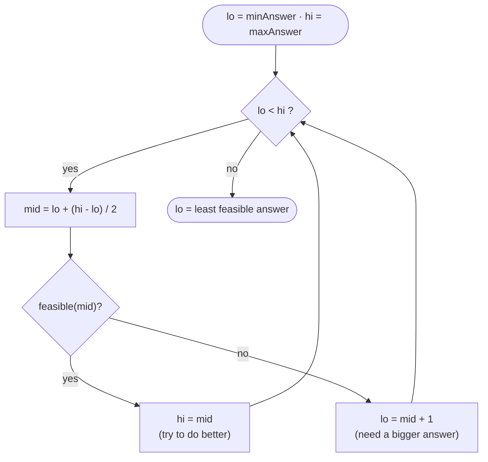

# Binary Search &amp; Search-on-Answer

Start with the motivating problem: find one target in a sorted list. Brute force checks every element from left to right, which is O(n) even though the ordering is screaming useful information at you.

Can we do better? Yes — one comparison at the middle tells you that half the search space is impossible. Repeat that discard-half move until the answer is forced.

The whole idea is embarrassingly simple: if your data is **ordered**, you never look at half of it. Guess the middle. If the middle is too small, the answer must be in the right half, so throw the left half away. Too big? Throw the right half away. Each guess **halves** what's left, so even a billion elements are settled in about 30 steps (`log₂ 10⁹ ≈ 30`).

<BinarySearchAnim />


<div class="svg-figure">
<svg preserveAspectRatio="xMidYMid meet" viewBox="0 0 720 176" xmlns="http://www.w3.org/2000/svg" font-family="Segoe UI, Arial, sans-serif">
  <rect x="0" y="0" width="720" height="176" fill="var(--dsa-bg)"/>
  <text x="20" y="26" font-size="13" font-weight="700" fill="var(--dsa-primary)">search for a value — each guess throws away half</text>
  <!-- step 1: whole range, mid in middle -->
  <text x="20" y="58" font-size="11" fill="var(--dsa-neutral)">step 1</text>
  <rect x="70"  y="44" width="580" height="24" rx="5" fill="var(--dsa-primary-soft)" stroke="var(--dsa-primary-line)"/>
  <rect x="350" y="42" width="30" height="28" rx="5" fill="var(--dsa-primary-soft)" stroke="var(--dsa-primary)" stroke-width="1.6"/>
  <text x="365" y="61" text-anchor="middle" font-size="11" font-weight="700" fill="var(--dsa-primary)">mid</text>
  <rect x="70" y="44" width="280" height="24" rx="5" fill="var(--dsa-danger-soft)" fill-opacity="0.55" stroke="none"/>
  <text x="210" y="61" text-anchor="middle" font-size="10" fill="var(--dsa-danger)">discard (target is bigger)</text>
  <!-- step 2: right half, new mid -->
  <text x="20" y="98" font-size="11" fill="var(--dsa-neutral)">step 2</text>
  <rect x="384" y="84" width="266" height="24" rx="5" fill="var(--dsa-primary-soft)" stroke="var(--dsa-primary-line)"/>
  <rect x="503" y="82" width="30" height="28" rx="5" fill="var(--dsa-primary-soft)" stroke="var(--dsa-primary)" stroke-width="1.6"/>
  <text x="518" y="101" text-anchor="middle" font-size="11" font-weight="700" fill="var(--dsa-primary)">mid</text>
  <rect x="533" y="84" width="117" height="24" rx="5" fill="var(--dsa-danger-soft)" fill-opacity="0.55" stroke="none"/>
  <text x="591" y="101" text-anchor="middle" font-size="10" fill="var(--dsa-danger)">discard</text>
  <!-- step 3: small range -->
  <text x="20" y="138" font-size="11" fill="var(--dsa-neutral)">step 3</text>
  <rect x="384" y="124" width="119" height="24" rx="5" fill="var(--dsa-success-soft)" stroke="var(--dsa-success)"/>
  <text x="443" y="141" text-anchor="middle" font-size="10" fill="var(--dsa-success)">found — range is tiny</text>
  <text x="20" y="170" font-size="11" fill="var(--dsa-neutral)" font-style="italic">3 steps have already shrunk the space to ~1/8 — that halving is why it's O(log n).</text>
</svg>
</div>


<div class="readfig"><b>How to read it:</b> Each blue bar is "what's still in play." You check the <b>mid</b> element; comparing it to the target tells you which half can't contain the answer (shaded red), so you drop it and repeat on the survivor. Three steps in, the search space is already down to about an eighth. Because every step halves it, you reach a single element in <code>log₂ n</code> steps.</div>

Here's the subtlety that unlocks the *hard* problems: the data doesn't have to be sorted **by value** — it only has to be **monotone by feasibility**. That is, there's some yes/no test that is false, false, …, false, then true, true, … and never flips back. Then you're just hunting for that single false→true boundary. That reframing is what turns "guess the answer and check it" problems (like *Koko Eating Bananas*) into binary search.

<Callout kind="key" title="Key Insight">

Stop thinking "find x in sorted array." Think: *there is a boundary where a boolean predicate `P` switches false→true; find it.* Every variant is "find the first index where `P` holds."

</Callout>





<div class="figcap">Binary search on the answer — feasibility is monotone, so the false→true boundary is the optimum.</div>
<div class="readfig"><b>How to read it:</b> We're not searching the array — we're searching over *possible answers*. Guess a middle value and ask a yes/no question: "does this value work?" (e.g. "can Koko finish in time at this speed?"). Because the answer flips from "no" to "yes" exactly once as the value grows, every "yes" lets us try something smaller and every "no" forces something bigger — halving the range each time until we land on the smallest value that works.</div>

### Recognize by
- "first / last index of x in a sorted array"
- "search rotated sorted array", "find peak", "minimum in rotated"
- "first true / last false" — any binary boundary in monotone data

### When NOT to use it
The data isn't sorted / monotone — you can't halve safely. Sort first (O(n log n)) or scan linearly. Also skip when random-access lookup is expensive (linked lists) — walking to `mid` is O(n) there, killing the log advantage.

---

## Canonical templates
<p class="secgoal"><b>What & why:</b> the two boundary-safe binary-search skeletons (lower-bound and upper-bound) you should write from muscle memory. Goal — never fumble the `lo/hi/mid` bookkeeping or the off-by-one at the boundary again.</p>

**Lower bound (first index with `P` true)** — the workhorse. Use half-open `[lo, hi)`:


```java
int firstTrue(int lo, int hi, IntPredicate P) {   // hi is exclusive; returns hi if none
    while (lo < hi) {
        int mid = lo + (hi - lo) / 2;
        if (P.test(mid)) hi = mid;      // P holds -> boundary at mid or left
        else             lo = mid + 1;  // P fails  -> boundary strictly right
    }
    return lo;
}
```


<Callout kind="inv" title="Invariant">

`P(lo-1)` is false and `P(hi)` is true throughout; the loop shrinks `[lo,hi)` while preserving that the answer lies in it. Terminates when `lo == hi`.

</Callout>

<Callout kind="trap" title="Common Trap">

Mixing conventions. Pick half-open `[lo,hi)` with `hi=mid`/`lo=mid+1` and never write `hi=mid-1` in the same template. Use `lo + (hi-lo)/2` to avoid overflow. For "last true", find first-false and step back.

</Callout>

## Search in Rotated Sorted Array <span class="diff diff-m">Medium</span>

*[↗ LeetCode: Search in Rotated Sorted Array](https://leetcode.com/problems/search-in-rotated-sorted-array/)*

<ProgressCheck id="search-in-rotated-sorted-array" />


<div class="svg-figure">
<svg preserveAspectRatio="xMidYMid meet" viewBox="0 0 400 250" xmlns="http://www.w3.org/2000/svg" font-family="var(--dsa-font)">
  <defs>
    <marker id="ar-rot-primary" markerWidth="9" markerHeight="9" refX="6" refY="3" orient="auto">
      <path d="M0,0 L6,3 L0,6 Z" fill="var(--dsa-primary)"/>
    </marker>
  </defs>
  <rect x="0" y="0" width="400" height="250" rx="12" fill="var(--dsa-bg)"/>
  <text x="200" y="28" text-anchor="middle" font-size="12" font-weight="700" fill="var(--dsa-primary)">rotated array: one half is still sorted</text>
  <rect x="28" y="69" width="204" height="62" rx="10" fill="var(--dsa-primary-soft)" stroke="var(--dsa-primary)" stroke-width="2.4" opacity="0.62"/>
  <rect x="232" y="69" width="156" height="62" rx="10" fill="var(--dsa-success-soft)" stroke="var(--dsa-success)" stroke-width="2.4" opacity="0.62"/>
  <text x="130" y="61" text-anchor="middle" font-size="12" font-weight="700" fill="var(--dsa-primary)">sorted 4..7</text>
  <text x="310" y="61" text-anchor="middle" font-size="12" font-weight="700" fill="var(--dsa-success)">target range</text>
  <g text-anchor="middle">
    <rect x="34" y="78" width="44" height="44" rx="7" fill="var(--dsa-primary-soft)" stroke="var(--dsa-primary-line)" stroke-width="1.6"/>
    <rect x="82" y="78" width="44" height="44" rx="7" fill="var(--dsa-primary-soft)" stroke="var(--dsa-primary-line)" stroke-width="1.6"/>
    <rect x="130" y="78" width="44" height="44" rx="7" fill="var(--dsa-primary-soft)" stroke="var(--dsa-primary-line)" stroke-width="1.6"/>
    <rect x="178" y="78" width="44" height="44" rx="7" fill="var(--dsa-primary-soft)" stroke="var(--dsa-primary)" stroke-width="1.6"/>
    <rect x="238" y="78" width="44" height="44" rx="7" fill="var(--dsa-success-soft)" stroke="var(--dsa-success)" stroke-width="1.6"/>
    <rect x="286" y="78" width="44" height="44" rx="7" fill="var(--dsa-success-soft)" stroke="var(--dsa-success-line)" stroke-width="1.6"/>
    <rect x="334" y="78" width="44" height="44" rx="7" fill="var(--dsa-success-soft)" stroke="var(--dsa-success-line)" stroke-width="1.6"/>
    <g font-size="17" font-weight="700" fill="var(--dsa-ink)">
      <text x="56" y="106">4</text><text x="104" y="106">5</text><text x="152" y="106">6</text><text x="200" y="106">7</text>
      <text x="260" y="106">0</text><text x="308" y="106">1</text><text x="356" y="106">2</text>
    </g>
    <g font-size="11" fill="var(--dsa-neutral)">
      <text x="56" y="142">0</text><text x="104" y="142">1</text><text x="152" y="142">2</text><text x="200" y="142">3</text>
      <text x="260" y="142">4</text><text x="308" y="142">5</text><text x="356" y="142">6</text>
    </g>
  </g>
  <line x1="200" y1="166" x2="200" y2="124" stroke="var(--dsa-primary)" stroke-width="2" marker-end="url(#ar-rot-primary)"/>
  <text x="200" y="184" text-anchor="middle" font-size="12" font-weight="700" fill="var(--dsa-primary)">mid = 3, value 7</text>
  <text x="200" y="216" text-anchor="middle" font-size="11.5" font-style="italic" fill="var(--dsa-neutral)">identify sorted half → binary-search there or the other</text>
</svg>
</div>


<div class="readfig"><b>How to read it:</b> The left half is sorted, but the target value 0 cannot lie between 4 and 7, so binary search discards that half and continues on the green side.</div>

### Problem
A sorted array was **rotated** at an unknown pivot. Find the index of `target` (or -1) in **O(log n)**.

**Constraints:** `1 ≤ n ≤ 5000`; all values distinct; must be O(log n).

**Example 1:** `[4,5,6,7,0,1,2], target = 0` → `4`.

&lt;ExamplePreview compact :input="['4', '5', '6', '7', '0', '1', '2', '|', '0']" :output="['4']" /&gt;

**Example 2:** `[4,5,6,7,0,1,2], target = 3` → `-1`.

&lt;ExamplePreview compact :input="['4', '5', '6', '7', '0', '1', '2', '|', '3']" :output="['-1']" /&gt;

### Solution — brute force
Brute force scans the array from left to right and returns the index whose value equals `target`. It is O(n) time and O(1) space, which is acceptable for tiny arrays but misses the required logarithmic guarantee. The optimized version keeps binary search alive by noticing that at least one half around `mid` is sorted, then discarding the half where the target cannot live.


```java
int searchBrute(int[] a, int target) {
    for (int i = 0; i < a.length; i++) {
        if (a[i] == target) return i;
    }
    return -1;
}
```


O(n) time, O(1) space — too slow when the prompt explicitly requires logarithmic search.

### Solution — optimized
One half of a rotated array is always sorted; decide which, then whether the target lies in it.

<Callout kind="key" title="Key Insight">

Compare `a[mid]` to `a[lo]`. If `a[lo] ≤ a[mid]`, the left half is sorted; check if target is inside `[a[lo], a[mid])`. Otherwise the right half is sorted. Discard the half that provably cannot contain the target.

</Callout>

The optimized version is still binary search, but each iteration first identifies the sorted half. Once you know which half is ordered, one range check tells you whether the target can be there; if not, safely discard that half.

#### Steps
1. Binary-search with a twist: at every `mid`, decide **which half is sorted**, then check if `target` falls in it.
2. `mid = lo + (hi - lo) / 2`. If `a[mid] == target`, return `mid`.
3. If `a[lo] <= a[mid]` — left half `[lo..mid]` is sorted. If `a[lo] <= target < a[mid]` → `hi = mid - 1`; else `lo = mid + 1`.
4. Otherwise the right half `[mid..hi]` is sorted. If `a[mid] < target <= a[hi]` → `lo = mid + 1`; else `hi = mid - 1`.
5. Loop while `lo <= hi`; return `-1` if not found.

The optimized Java implementation:


```java
int search(int[] a, int target) {
    int lo = 0, hi = a.length - 1;
    while (lo <= hi) {
        int mid = lo + (hi - lo) / 2;
        if (a[mid] == target) return mid;
        if (a[lo] <= a[mid]) {                       // left sorted
            if (a[lo] <= target && target < a[mid]) hi = mid - 1;
            else lo = mid + 1;
        } else {                                     // right sorted
            if (a[mid] < target && target <= a[hi]) lo = mid + 1;
            else hi = mid - 1;
        }
    }
    return -1;
}
```


<Callout kind="note" title="Trace it">

`[4,5,6,7,0,1,2], target=0`. `mid=7`; the left half `[4..7]` is sorted but `0` isn't inside it, so search right → find `0` at index 4.

</Callout>

<CodeTrace
  title="Search in Rotated Sorted Array — nums=[4,5,6,7,0,1,2], target=0"
  :values="[4,5,6,7,0,1,2]"
  :windowKeys="['lo', 'hi']"
  :cellWidth="38"
  :steps='[
    { pointers: { lo: 0, mid: 3, hi: 6 }, vars: { target: 0 }, note: "mid=7. left half [4..7] sorted, target not in it → lo=mid+1" },
    { pointers: { lo: 4, mid: 5, hi: 6 }, vars: { target: 0 }, note: "mid=1. right half [1..2] sorted, target not in it → hi=mid-1" },
    { pointers: { lo: 4, mid: 4, hi: 4 }, vars: { target: 0 }, note: "mid=0 == target → return 4", added: [4] }
  ]'
/>

### Time Complexity
O(log n), because every iteration discards one half of the current range after proving the target cannot be there.

### Space Complexity
O(1), because the algorithm keeps only `lo`, `hi`, and `mid` plus a few comparisons.

<Callout kind="note" title="Interview script">

"I first confirm values are distinct and the array is a sorted array rotated once. I start with brute force by scanning every index, which is O(n) time and O(1) space. I optimize by binary-searching the sorted half at each step, discarding half the array for O(log n) time and O(1) space."

</Callout>


<Callout kind="trap" title="Common Trap">

Wrong inclusivity on the "sorted-half" test. *Example:* `nums=[3,1]`, `target=1`, `lo=0, hi=1, mid=0`. With strict `a[lo] < a[mid]`, a single-element left half `[3]` isn't marked sorted and the algorithm misroutes. Use `a[lo] <= a[mid]`.

</Callout>

<CodeTrace
  title="Trap — Rotated BS inclusivity: nums=[3,1], target=1"
  :values="[3,1]"
  :windowKeys="['lo','hi']"
  :cellWidth="52"
  :steps='[
    { pointers: { lo: 0, hi: 1, mid: 0 }, vars: { "a[lo]": 3, "a[mid]": 3 }, note: "single-element left half. a[lo]==a[mid]" },
    { pointers: { lo: 0, hi: 1 }, vars: { "test a[lo] lt a[mid]": "3lt3 → FALSE" }, note: "BUG: strict → left half marked unsorted → search wrong side" },
    { pointers: { lo: 1, hi: 1 }, vars: { "test a[lo] lt= a[mid]": "3lt=3 → TRUE" }, note: "FIX: use lt= → left half correctly sorted → find 1", added: [1] }
  ]'
/>

### Learning notes
- **Strict vs inclusive** on the sorted-half test — use `a[lo] <= a[mid]` so a length-1 left half is treated as sorted.
- **Comparing target inclusively on the wrong endpoint** — the target-in-range checks must match the sorted-half boundary.
- **Overflow on `(lo+hi)/2`** for large indices — use `lo + (hi-lo)/2`.
- **Assumes no duplicates**; with duplicates (LC 81), shrink both ends when `a[lo]==a[mid]==a[hi]`.
- Why `while (lo <= hi)`? — this is a closed interval search, so `lo == hi` is still one valid candidate to check.
- Why return immediately on `a[mid] == target`? — unlike lower-bound search, this problem asks for any exact index.
- Why check the sorted half first? — rotation breaks global ordering, but at least one side around `mid` remains locally sorted.

<Callout kind="pat" title="Pattern Connection">

*Find Minimum in Rotated Sorted Array* is the same "which half is sorted" logic reduced to locating the inflection point.

</Callout>

### Same pattern, new tweaks

The engine is "one half is always sorted — decide which, then which half to keep":

| Variation | The one thing that changes | Time |
|---|---|---|
| [Find Minimum in Rotated Sorted Array](https://leetcode.com/problems/find-minimum-in-rotated-sorted-array/) | no target; steer toward the unsorted half, which is where the rotation point (the minimum) hides | — |
| [Search in Rotated Array II (with duplicates)](https://leetcode.com/problems/search-in-rotated-sorted-array-ii/) | when `a[lo] == a[mid] == a[hi]` you can't tell which half is sorted, so shrink both ends by one (worst case degrades to O(n)) | O(n) |
| [Find Peak Element](https://leetcode.com/problems/find-peak-element/) | no sorted array at all — just move toward the larger neighbour; you're guaranteed to climb to a peak | — |
| [Order-Agnostic Binary Search](https://leetcode.com/problems/binary-search/) | first peek at the ends to detect ascending vs descending, then flip the comparison accordingly | — |

---

## Check your understanding

<Quiz
  pattern-id="binary-search"
  :questions='[{"q": "What is the danger of using `mid = (lo + hi) / 2`?", "choices": [{"text": "Integer overflow when lo + hi > Integer.MAX_VALUE", "correct": true, "explanation": "Use `mid = lo + (hi - lo) / 2` to avoid this."}, {"text": "Off-by-one error", "correct": false}, {"text": "Nothing; it’s always safe", "correct": false}, {"text": "It divides by zero", "correct": false}]}, {"q": "In Rotated Sorted Array search, how do you decide which half is sorted?", "choices": [{"text": "Compare `nums[mid]` with `nums[lo]` (or nums[hi])", "correct": true, "explanation": "If `nums[mid] > nums[lo]`, the left half is sorted; else the right half is."}, {"text": "Always search the left half first", "correct": false}, {"text": "Random guess", "correct": false}, {"text": "Sort the array first", "correct": false, "explanation": "Defeats the log n requirement."}]}, {"q": "For Find Peak Element, which comparison guides the BS?", "choices": [{"text": "`nums[mid] < nums[mid+1]` → climb right; else → left", "correct": true, "explanation": "A climbing side must eventually peak (nums[n] = -∞)."}, {"text": "`nums[mid] < nums[0]`", "correct": false}, {"text": "`nums[mid] > target`", "correct": false}, {"text": "Nothing; use linear scan", "correct": false}]}, {"q": "Half-open BS returns `lo` after the loop. What does `lo` represent?", "choices": [{"text": "The lower_bound: smallest index i with nums[i] ≥ target", "correct": true, "explanation": "Extensible to first-true / first-occurrence variants."}, {"text": "Always the answer", "correct": false, "explanation": "Not for closed-interval BS."}, {"text": "The middle of the array", "correct": false}, {"text": "Nothing; the loop iterates forever", "correct": false}]}, {"q": "When can binary search NOT be applied?", "choices": [{"text": "When there is no monotonic property", "correct": true, "explanation": "BS requires that you can eliminate half the search space each step, which needs monotonicity."}, {"text": "When n is large", "correct": false, "explanation": "BS is BEST for large n."}, {"text": "When elements are integers", "correct": false}, {"text": "When there are duplicates", "correct": false, "explanation": "Duplicates change some variants but not the general applicability."}]}]'
/>
