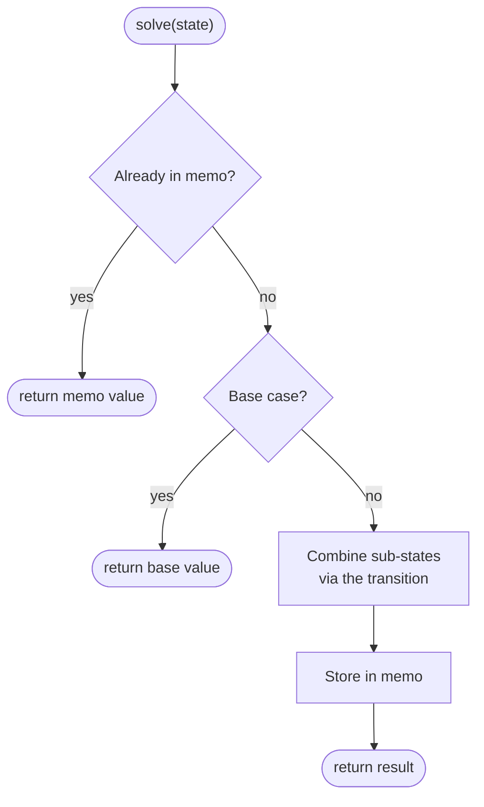

# Dynamic Programming

**Grokking arc:** The motivating problem is recursion that asks the same smaller question again and again. Brute force branches over choices. **Can we do better?** Name the repeated state, cache or tabulate it once, then choose an order where dependencies are already known.

DP is what you use when brute-force recursion keeps solving the *same* smaller problem over and over — you compute each little answer once, write it down, and reuse it. Two conditions have to hold for it to apply: **overlapping subproblems** (the same smaller question keeps recurring) and **optimal substructure** (a best overall answer is assembled from best sub-answers). The scary part is really just bookkeeping, and it always comes down to the same four decisions:


```text
1. STATE        what parameters uniquely identify a subproblem?  dp[...] = ?
2. TRANSITION   how does a state combine smaller states?         dp[i] = f(dp[<i])
3. BASE CASE    the smallest states, answered directly.
4. ORDER        iterate so every dependency is computed first (or memoize top-down).
   (+ SPACE     collapse dimensions the recurrence doesn't need.)
```





<div class="figcap">Top-down DP — memoization turns an exponential recursion into O(#states) by returning cached results.</div>
<div class="readfig"><b>How to read it:</b> This is ordinary recursion with one addition: a cache. Before doing any work for a state, we check the memo — if we've solved this exact subproblem before, we return the stored answer instantly. Otherwise we handle the base case or combine smaller states, then *store* the result before returning. Because each distinct state is computed only once, an otherwise exponential tree of repeated calls collapses to work proportional to the number of states.</div>

<Callout kind="note" title="🎬 Video walkthrough coming soon">

a 5-10 minute Loom will be embedded here once recorded. If you'd like to be notified, [subscribe on GitHub](https://github.com/abhisinghal/dsa-master-reference/subscription).

</Callout>

<Callout kind="key" title="Key Insight">

Design the **state** first and get it right: it must capture *everything* that distinguishes futures. If two situations with the same state can lead to different optimal continuations, the state is missing a dimension. Everything else (transition, order) follows mechanically.

</Callout>

<Callout kind="inv" title="Invariant">

A DP value is final once written; this requires an acyclic dependency graph among states. If states depend cyclically, DP order is impossible — rethink the state or use a different method.

</Callout>

**Top-down vs bottom-up** — memoized recursion mirrors the recurrence directly and computes only reachable states (great for sparse/irregular spaces); tabulation removes call overhead and enables rolling-array space cuts. Prefer whichever makes the transition clearest, then optimize.

### Recognize by
- "how many ways / min-max cost / can I reach" over discrete choices
- overlapping subproblems — the naive recursion re-solves f(n−1), f(n−2) exponentially
- families: 1D DP · knapsack · grid · subsequence (LIS/LCS/edit distance) · interval DP · state-machine · tree DP · bitmask DP

### When NOT to use it
Subproblems don't repeat — pure recursion is fine. Also skip when a **greedy** local choice is provably safe (simpler, same complexity). If state count blows up beyond ~10⁷, DP is too slow — look for structural insights or Kadane-style running-aggregate tricks.

---

## 1D DP — Climbing Stairs &amp; House Robber <span class="diff diff-m">Medium</span>

*[↗ LeetCode: House Robber](https://leetcode.com/problems/house-robber/)*

<ProgressCheck id="1d-dp-climbing-stairs-amp-house-robber" />

### Problem
Rob houses in a line to maximize loot, but you **can't rob two adjacent** houses.

**Constraints:** `1 ≤ n ≤ 100`; values `0…400`.

**Example 1:** `[2,7,9,3,1]` → `12` (rob 2, 9, 1).

**Example 2:** `[1,2,3,1]` → `4` (rob 1 and 3).

### Solution — brute force
Brute force recursion branches at each house: either skip it or rob it and jump over the adjacent house. That explores overlapping choices repeatedly, giving O(2ⁿ) time and O(n) recursion depth. The optimized DP stores the best answer up to each position, then collapses the recurrence to two rolling values because only `i-1` and `i-2` are needed.

**Brute-force sketch:**


```text
solve(i):
    if i >= n: return 0
    return max(solve(i + 1), a[i] + solve(i + 2))
```


**Baseline complexity:** O(2ⁿ) time and O(n) recursion depth without memoization.

### Solution — optimized
The optimized solution keeps the original Java intact and explains the pattern that removes the brute-force bottleneck.

#### Pattern
`dp[i]` depends on a constant window of earlier states; collapse to O(1) variables.

<Callout kind="key" title="Key Insight">

*House Robber*: at each house choose rob (`val + dp[i-2]`) or skip (`dp[i-1]`). The state is "best loot considering houses `0..i`"; the non-adjacency constraint is exactly why `dp[i-2]` (not `dp[i-1]`) feeds the rob branch.

</Callout>

#### Java


```java
int rob(int[] a) {
    int prev2 = 0, prev1 = 0;                 // dp[i-2], dp[i-1]
    for (int x : a) {
        int cur = Math.max(prev1, prev2 + x); // skip vs rob
        prev2 = prev1; prev1 = cur;
    }
    return prev1;
}
```


<Callout kind="note" title="Trace it">

House Robber on `[2,7,9,3,1]`. At each house, `dp[i] = max(skip = dp[i-1], rob = dp[i-2]+val)`. Best non-adjacent pick is `2+9+1 = 12`.

</Callout>

Time O(n) · Space O(1).

<Callout kind="note" title="Interview script">

"I first confirm adjacent houses cannot both be robbed and values are nonnegative. I start with brute force pick-or-skip recursion, which is O(2ⁿ) time and O(n) stack space. I optimize with `dp[i] = max(dp[i-1], dp[i-2] + value)` and roll it to O(n) time and O(1) space."

</Callout>


<Callout kind="pat" title="Pattern Connection">

The shared idea is **"at each position, pick or skip, where picking forbids the neighbour."** Recognize the family whenever a choice excludes its immediate neighbour: *Climbing Stairs* (`dp[i]=dp[i-1]+dp[i-2]`), *Min Cost Climbing Stairs*, *Delete and Earn* (bucket equal values → this becomes House Robber over value counts), *House Robber II* (circular → run the same 1-D DP twice, once excluding the first house, once the last, and take the max). Spotting "adjacent choices conflict" instantly gives you the `dp[i-2]` transition.

</Callout>

<Callout kind="trap" title="Common Trap">

Missing a base case. *Example:* `nums=[5]` for House Robber. If `dp[i-2]` is unseeded (e.g. `dp[-1]`), the transition breaks. Seed `prev1 = a[0]`, `prev2 = 0` — the single-house answer is `a[0]`.

</Callout>

#### Same pattern, new tweaks
| Variation | The one thing that changes | Time |
|---|---|---|
| [Climbing Stairs](https://leetcode.com/problems/climbing-stairs/) | `dp[i] = dp[i-1] + dp[i-2]` (count ways, no conflict) | — |
| [House Robber II](https://leetcode.com/problems/house-robber-ii/) | houses in a circle → run the linear DP twice (exclude first, exclude last) and take the max | — |
| [Delete and Earn](https://leetcode.com/problems/delete-and-earn/) | bucket the array by value, then it's House Robber over `value × count` | — |
| [Min Cost Climbing Stairs / Paint Fence](https://leetcode.com/problems/min-cost-climbing-stairs/) | the same 1-D recurrence with a per-step cost or an adjacency constraint | — |

### Time Complexity
O(n): one pass over houses, constant work per house.

### Space Complexity
O(1): only `prev2`, `prev1`, and `cur` are kept.

### Learning notes
- Why `prev2 = 0, prev1 = 0`? — before any house, the best loot from the previous two positions is zero.
- Why `Math.max(prev1, prev2 + x)`? — the only legal choices are skip this house or rob it with the best answer two houses back.
- Why update `prev2 = prev1` before `prev1 = cur`? — the rolling variables shift one position after each house.
- Why no full `dp[]` array? — the recurrence needs only the two previous states.
- Why `return prev1`? — after the last update, it represents the best loot through all houses.

## Maximum Subarray (Kadane) — the running-optimum DP <span class="diff diff-m">Medium</span>

*[↗ LeetCode: Maximum Subarray](https://leetcode.com/problems/maximum-subarray/)*

### Try it yourself

Edit the Java code below and click **▶ Run tests** to check it against real examples. Powered by [Judge0](https://ce.judge0.com); your code auto-saves in your browser.

&lt;JavaRunner problemSlug="maximum-subarray" :tests='[{ input: "9\n-2 1 -3 4 -1 2 1 -5 4", expected: "6" }, { input: "1\n1", expected: "1" }]' /&gt;
 — **Medium**

<ProgressCheck id="maximum-subarray-kadane-the-running-optimum-dp" />

### Problem
Find the contiguous subarray with the **largest sum** and return that sum (the array can contain negatives).

**Constraints:** `1 ≤ n ≤ 10⁵`; values `−10⁴…10⁴`; at least one element (the answer is never "empty").

**Example 1:** `[-2,1,-3,4,-1,2,1,-5,4]` → `6` (the subarray `[4,-1,2,1]`).

**Example 2:** `[5,4,-1,7,8]` → `23` (the whole array).

### Solution — brute force
Brute force checks every subarray sum and keeps the maximum. Recomputing each sum directly is O(n³); carrying a running sum for each start improves the baseline to O(n²) time and O(1) space, still too slow for `10⁵`. Kadane's optimization realizes the only state needed is the best subarray ending at the current index, so a negative prefix is dropped immediately.

**Brute-force sketch:**


```text
best = -∞
for start in 0..n-1:
    sum = 0
    for end in start..n-1:
        sum += a[end]; best = max(best, sum)
```


**Baseline complexity:** O(n²) with running sums, O(1) extra space.

### Solution — optimized
The optimized solution keeps the original Java intact and explains the pattern that removes the brute-force bottleneck.

#### Pattern
1-D DP where the state is "best subarray **ending at `i`**." This is the archetype of *running-optimum* — the single most reused DP shape.

<Callout kind="key" title="Key Insight">

Let `best[i]` = max sum of a subarray ending exactly at `i`. Either extend the previous run or start fresh at `i`: `best[i] = max(a[i], best[i-1] + a[i])`. You start fresh precisely when the prefix so far is negative — carrying it could only hurt. Track the global max over all `best[i]`.

</Callout>

<Callout kind="inv" title="Invariant">

`cur` always equals the maximum sum of a subarray that *ends at the current index*; `best` is the max of all `cur` seen so far.

</Callout>

#### Java


```java
int maxSubArray(int[] a) {
    int cur = a[0], best = a[0];
    for (int i = 1; i < a.length; i++) {
        cur = Math.max(a[i], cur + a[i]);   // extend the run, or restart at a[i]
        best = Math.max(best, cur);
    }
    return best;
}
```


<Callout kind="note" title="Trace it">

`[-2,1,-3,4,-1,2,1,-5,4]`. `cur` walks `-2,1,-2,4,3,5,6,1,5`; the running `best` climbs to **6** at the `[4,-1,2,1]` window. The restart happens at index 3 because the prefix sum had gone negative (`-2`).

</Callout>

#### Same pattern, new tweaks
| Variation | The one thing that changes | Time |
|---|---|---|
| [Maximum Subarray](https://leetcode.com/problems/maximum-subarray/) | max **sum**, restart when prefix &lt; 0 | O(n) |
| [Maximum Product Subarray](https://leetcode.com/problems/maximum-product-subarray/) | carry running **max and min** (a negative swaps them) | O(n) |
| [Maximum Sum Circular Subarray](https://leetcode.com/problems/maximum-sum-circular-subarray/) | answer = max(normal Kadane, total − **min**-subarray) | O(n) |
| [Best Time to Buy and Sell Stock](https://leetcode.com/problems/best-time-to-buy-and-sell-stock/) | Kadane on the difference array (track min-so-far) | O(n) |

<Callout kind="note" title="Interview script">

"I first confirm the subarray must be non-empty and contiguous, even if all numbers are negative. I start with brute force by evaluating all subarrays, which is O(n²) time with running sums and O(1) space. I optimize with Kadane's running best-ending-here state, giving O(n) time and O(1) space."

</Callout>

<Callout kind="trap" title="Common Trap">

Initializing `best = 0`. On an all-negative array like `[-3,-1,-2]` that wrongly returns `0`; seed both `cur` and `best` from `a[0]` so a single (least-negative) element can win.

</Callout>

<Callout kind="pat" title="Pattern Connection">

"Drop a prefix that can only hurt" is the same reset used by *Gas Station* (restart the tank when it dips below 0) and by the shrink step of a sliding window. The **product** variant (*Maximum Product Subarray*) must track **both** a running max and min, because a negative flips them.

</Callout>

### Time Complexity
Time O(n) · Space O(1).


O(n): each element updates the best-ending-here state once.


### Space Complexity
O(1): only `cur` and `best` are stored.

### Learning notes
- Why seed from `a[0]`? — the answer must be non-empty, so all-negative arrays cannot default to zero.
- Why `cur = Math.max(a[i], cur + a[i])`? — either extend the previous subarray or restart at the current value.
- Why can a negative prefix be dropped? — adding it to any future suffix only lowers that suffix sum.
- Why update `best` after `cur`? — the best subarray may end at the current index.
- Why no window shrink loop? — validity is not monotone; this is a DP choice to extend or restart.

## 0/1 Knapsack &amp; Subset-Sum family <span class="diff diff-m">Medium</span>

*[↗ LeetCode: Partition Equal Subset Sum](https://leetcode.com/problems/partition-equal-subset-sum/)*

<ProgressCheck id="0-1-knapsack-amp-subset-sum-family" />

### Problem
Can the array be split into **two subsets with equal sum**?

**Constraints:** `1 ≤ n ≤ 200`; values `1…100`.

**Example 1:** `[1,5,11,5]` → `true` (`11 = 5+5+1`).

**Example 2:** `[1,2,3,5]` → `false` because total is 11 (odd).

### Solution — brute force
Brute force chooses include or exclude for every number, then checks whether any selected subset reaches the target sum. That is O(2ⁿ) time and O(n) recursion space, and it repeats equivalent partial sums many times. The optimized boolean knapsack DP records which sums are reachable after each item; iterating capacities downward enforces the 0/1 rule that each item is used at most once.

**Brute-force sketch:**


```text
dfs(i, sum):
    if sum == target: return true
    if i == n or sum > target: return false
    return dfs(i+1, sum) or dfs(i+1, sum+nums[i])
```


**Baseline complexity:** O(2ⁿ) time and O(n) recursion depth.

### Solution — optimized
The optimized solution keeps the original Java intact and explains the pattern that removes the brute-force bottleneck.

#### Pattern
`dp[w]` = best value achievable with capacity `w`. Each item is used at most once → iterate capacity **descending** so an item can't be reused within the same pass.

<Callout kind="key" title="Key Insight">

The iteration direction encodes the constraint. **0/1** (each item once): capacity loop **downward**. **Unbounded** (unlimited copies): capacity loop **upward** (a fresh update may reuse the item just added).

</Callout>

#### Java (Partition Equal Subset Sum — boolean knapsack)


```java
boolean canPartition(int[] nums) {
    int sum = 0; for (int x : nums) sum += x;
    if ((sum & 1) == 1) return false;
    int target = sum / 2;
    boolean[] dp = new boolean[target + 1];
    dp[0] = true;                              // empty subset reaches 0
    for (int x : nums)
        for (int w = target; w >= x; w--)      // DOWNWARD => each item once
            dp[w] |= dp[w - x];
    return dp[target];
}
```


<Callout kind="note" title="Trace it">

Partition Equal Subset Sum on `[1,5,11,5]` (total 22 → target 11). A boolean `dp[w]` "is sum w reachable?" turns true at 11 via `5+5+1` → **true**, the set splits evenly.

</Callout>

#### Same pattern, new tweaks
The `dp[w] |= dp[w-item]` skeleton answers many "can we hit a total?" questions:

| Variation | The one thing that changes | Time |
|---|---|---|
| [Partition Equal Subset Sum](https://leetcode.com/problems/partition-equal-subset-sum/) | target = `sum/2`; the boolean knapsack asks if it's reachable | — |
| [Target Sum](https://leetcode.com/problems/target-sum/) | assigning ± signs reduces to "subset summing to `(sum+target)/2`" → count instead of boolean | — |
| [Last Stone Weight II](https://leetcode.com/problems/last-stone-weight-ii/) | minimize `|sum − 2·subset|` — subset-sum closest to `sum/2` | — |
| [Coin Change (min coins)](https://leetcode.com/problems/coin-change/) | unbounded items → loop capacity **upward**, take `min(dp[w], dp[w-coin]+1)` | — |

<Callout kind="note" title="Interview script">

"I first confirm each number can be used at most once and an odd total sum makes partition impossible. I start with brute force subset enumeration, which is O(2ⁿ) time and O(n) space. I optimize with boolean knapsack over target sum, iterating capacities downward, for O(n·target) time and O(target) space."

</Callout>

<Callout kind="trap" title="Common Trap">

Wrong capacity direction. *Example:* items=`[1]`, cap=2, 0/1 knapsack. Iterating capacity **ascending** lets `dp[2] = dp[1] + val`, using item 0 twice (illegal). Iterate **descending** for 0/1; ascending only for unbounded.

</Callout>

<Callout kind="pat" title="Pattern Connection">

*Target Sum* (assign ±) reduces to subset-sum; *Coin Change* (min coins, unbounded) and *Coin Change II* (count ways, unbounded) use the upward loop; *Last Stone Weight II* is subset-sum minimizing the gap.

</Callout>

### Time Complexity
Time O(n·target) · Space O(target).


O(n·target): every item scans possible sums up to half the total.


### Space Complexity
O(target): one boolean row of reachable sums.

### Learning notes
- Why return false when `(sum & 1) == 1`? — an odd total cannot split into two equal integer sums.
- Why `target = sum / 2`? — finding one subset of half the total proves the remaining numbers form the other half.
- Why `dp[0] = true`? — the empty subset always reaches sum zero and seeds all later transitions.
- Why iterate `w` downward? — each number may be used at most once; downward order prevents reusing it in the same item pass.
- Why `dp[w] |= dp[w - x]`? — sum `w` is reachable if it was already reachable or if `w-x` was reachable before this item.

## Coin Change (unbounded, min count) <span class="diff diff-m">Medium</span>

*[↗ LeetCode: Coin Change](https://leetcode.com/problems/coin-change/)*

### Try it yourself

Edit the Java code below and click **▶ Run tests** to check it against real examples. Powered by [Judge0](https://ce.judge0.com); your code auto-saves in your browser.

&lt;JavaRunner problemSlug="coin-change" :tests='[{ input: "3\n1 2 5\n11", expected: "3" }, { input: "1\n2\n3", expected: "-1" }]' /&gt;


<ProgressCheck id="coin-change-unbounded-min-count" />

### Problem
Given coin denominations (each reusable) and an amount, return the **fewest coins** that make the amount, or -1 if impossible.

**Constraints:** `1 ≤ #coins ≤ 12`; `amount ≤ 10⁴`.

**Example 1:** `coins = [1,2,5], amount = 11` → `3` (`5+5+1`).

**Example 2:** `coins=[2], amount=3` → `-1`.

### Solution — brute force
Brute force recursively tries every coin as the next pick until the remaining amount is zero or negative. Because the same remaining amounts recur through many orders, the search is exponential in the amount without memoization. The optimized DP treats each amount as a state, fills smaller amounts first, and uses each coin transition to compute the fewest coins for the current amount.

**Brute-force sketch:**


```text
solve(remain):
    if remain == 0: return 0
    if remain < 0: return infinity
    return 1 + min(solve(remain - coin) for each coin)
```


**Baseline complexity:** Exponential without memoization because the same remaining amounts repeat.

### Solution — optimized
The optimized solution keeps the original Java intact and explains the pattern that removes the brute-force bottleneck.

#### Pattern
`dp[a]` = fewest coins to make amount `a`; transition tries every coin.

<Callout kind="inv" title="Invariant">

`dp[a]` is optimal once all smaller amounts are; the upward loop over amounts guarantees `dp[a-coin]` is final before use.

</Callout>

#### Java


```java
int coinChange(int[] coins, int amount) {
    int[] dp = new int[amount + 1];
    Arrays.fill(dp, amount + 1);              // sentinel "infinity"
    dp[0] = 0;
    for (int a = 1; a <= amount; a++)
        for (int c : coins)
            if (c <= a) dp[a] = Math.min(dp[a], dp[a - c] + 1);
    return dp[amount] > amount ? -1 : dp[amount];
}
```


<Callout kind="note" title="Trace it">

coins `[1,2,5], amount=11`. Building up, `dp[11] = 1 + min(dp[10], dp[9], dp[6]) = 3` (that's `5+5+1`).

</Callout>

Time O(amount·coins) · Space O(amount).

<Callout kind="note" title="Interview script">

"I first confirm coins are reusable and I need the minimum number of coins, not the number of combinations. I start with brute force recursion over coin choices, which is exponential because the same remaining amounts repeat. I optimize with `dp[amount]` over all smaller amounts, giving O(amount·coins) time and O(amount) space."

</Callout>


<Callout kind="trap" title="Common Trap">

Sentinel overflow. *Example:* if `dp[i-c] = Integer.MAX_VALUE` and you compute `dp[i-c]+1`, you wrap to `Integer.MIN_VALUE` — looks like the smallest answer. Use `amount+1` as the sentinel: bigger than any real answer, safe to add 1.

</Callout>

<Callout kind="pat" title="Pattern Connection">

*Coin Change II* swaps the loop nesting (coins outer, amount inner) to count **combinations** not permutations — loop order controls whether order matters. *Perfect Squares* is Coin Change with square "coins".

</Callout>

#### Same pattern, new tweaks
The unbounded-knapsack recurrence `dp[a] = f(dp[a − coin])` bends to several questions just by changing what `dp` stores and how you loop:

| Variation | The one thing that changes | Time |
|---|---|---|
| [Coin Change II (count ways)](https://leetcode.com/problems/coin-change-ii/) | `dp[a] += dp[a−coin]`, with **coins in the outer loop** so each combination is counted once (order ignored) | — |
| [Combination Sum IV (count ordered sequences)](https://leetcode.com/problems/combination-sum-iv/) | same additive DP but with **amount in the outer loop**, so `1+2` and `2+1` count separately | — |
| [Perfect Squares](https://leetcode.com/problems/perfect-squares/) | the "coins" are the square numbers `1, 4, 9, 16, …`; minimize the count | — |
| **Minimum Cost / Number of ways with limits** | bound the copies per coin → it becomes bounded knapsack (loop capacity downward) | — |

### Time Complexity
O(amount · numberOfCoins): every amount tries every coin.

### Space Complexity
O(amount): one array stores the best answer for each amount.

### Learning notes
- Why `Arrays.fill(dp, amount + 1)`? — `amount+1` is a safe infinity bigger than any real coin count.
- Why `dp[0] = 0`? — zero coins are needed to make amount zero, and it seeds all reachable amounts.
- Why loop amounts upward? — `dp[a - c]` must already represent the best smaller amount.
- Why guard `if (c <= a)`? — negative indexes are invalid and a too-large coin cannot help this amount.
- Why return `-1` when `dp[amount] > amount`? — the sentinel survived, so no combination reached the amount.

## Grid DP — Unique Paths &amp; Minimum Path Sum <span class="diff diff-m">Medium</span>

*[↗ LeetCode: Unique Paths](https://leetcode.com/problems/unique-paths/)*

<ProgressCheck id="grid-dp-unique-paths-amp-minimum-path-sum" />

### Problem
Count the paths from the top-left to the bottom-right of an `m×n` grid, moving only **right or down**.

**Constraints:** `1 ≤ m, n ≤ 100`.

**Example 1:** `m = 3, n = 7` → `28`.

**Example 2:** `grid=[[1,2,3],[4,5,6]]` minimum path sum → `12` (`1→2→3→6`).

### Solution — brute force
Brute force enumerates every path from the top-left to the bottom-right, branching right or down at each cell. The number of paths is exponential in path length, about O(2^(R+C)) before considering pruning, and recursion uses O(R+C) stack space. The optimized DP observes that each cell depends only on the top and left neighbors, so a rolling row computes all cells once.

**Brute-force sketch:**


```text
dfs(r,c):
    if outside grid: return infinity
    if at goal: return grid[r][c]
    return grid[r][c] + min(dfs(r+1,c), dfs(r,c+1))
```


**Baseline complexity:** Exponential in R+C without memoization; O(R+C) recursion depth.

### Solution — optimized
The optimized solution keeps the original Java intact and explains the pattern that removes the brute-force bottleneck.

#### Pattern
`dp[r][c]` from top and left neighbors; a single rolling row suffices.

<Callout kind="key" title="Key Insight">

Each cell's answer combines the cell above and to the left. Because a row depends only on itself (left) and the previous row (above), one 1D array updated left-to-right captures both.

</Callout>

#### Java (Minimum Path Sum, rolling row)


```java
int minPathSum(int[][] grid) {
    int C = grid[0].length;
    int[] dp = new int[C];
    dp[0] = grid[0][0];
    for (int c = 1; c < C; c++) dp[c] = dp[c-1] + grid[0][c];   // first row
    for (int r = 1; r < grid.length; r++) {
        dp[0] += grid[r][0];                                     // first column
        for (int c = 1; c < C; c++)
            dp[c] = grid[r][c] + Math.min(dp[c], dp[c-1]);       // above=dp[c], left=dp[c-1]
    }
    return dp[C-1];
}
```


<Callout kind="note" title="Trace it">

Unique Paths on a 3×7 grid. Each cell sums the paths from above and from the left; the bottom-right accumulates to **28** distinct paths.

</Callout>

#### Same pattern, new tweaks
`dp[r][c]` built from `dp[r-1][c]` and `dp[r][c-1]` — only the combine changes:

| Variation | The one thing that changes | Time |
|---|---|---|
| [Unique Paths / Unique Paths II](https://leetcode.com/problems/unique-paths-ii/) | **add** the two neighbours to count paths (obstacles set the cell to 0) | — |
| [Minimum Path Sum / Minimum Falling Path Sum](https://leetcode.com/problems/minimum-falling-path-sum/) | **min** of the neighbours plus the cell | — |
| [Maximal Square](https://leetcode.com/problems/maximal-square/) | `dp = min(up, left, up-left) + 1` for the largest all-ones square | — |
| [Dungeon Game](https://leetcode.com/problems/dungeon-game/) | fill the grid **backwards** from the goal, because required health propagates in reverse | — |

<Callout kind="note" title="Interview script">

"I first confirm movement is restricted to right and down, so each cell only depends on earlier cells. I start with brute force by enumerating all paths, which is exponential in R+C and uses O(R+C) stack space. I optimize with grid DP from top and left, using a rolling row for O(R·C) time and O(C) space."

</Callout>

<Callout kind="pat" title="Pattern Connection">

*Unique Paths* (count), *Unique Paths II* (obstacles → 0), *Minimum Falling Path Sum*, *Maximal Square* (min of three neighbors + 1), *Dungeon Game* (DP **backwards** from the princess because health constraints propagate in reverse).

</Callout>

<Callout kind="trap" title="Common Trap">

Rolling-row overwritten in wrong order. *Example:* grid `[[1,2],[3,4]]`. When collapsing to one row, if you overwrite `dp[j]` before reading it for `dp[j+1]`, you lose the top-neighbour value. For sum-min, update `dp[j] = grid[i][j] + min(dp[j], dp[j-1])` left-to-right; for right-to-left transitions iterate the opposite way.

</Callout>

### Time Complexity
Time O(R·C) · Space O(C).


O(R·C): each cell is computed once.


### Space Complexity
O(C): the rolling row stores one value per column.

### Learning notes
- Why initialize `dp[0] = grid[0][0]`? — the start cell is the only cost/path seed.
- Why prefill the first row? — those cells can only be reached from the left.
- Why update `dp[0] += grid[r][0]` for each row? — the first column can only be reached from above.
- Why is `dp[c]` the above value? — before overwriting it, it still holds the previous row's answer for this column.
- Why is `dp[c-1]` the left value? — left-to-right iteration has already updated it for the current row.

## Subsequence DP — LIS, LCS, Edit Distance <span class="diff diff-h">Hard</span>

*[↗ LeetCode: Edit Distance](https://leetcode.com/problems/edit-distance/)*

<ProgressCheck id="subsequence-dp-lis-lcs-edit-distance" />

### Problem
Find the **minimum edits** (insert, delete, or replace one character) to turn word `A` into word `B`. (LIS and LCS are close cousins of this alignment DP.)

**Constraints:** `0 ≤ |A|, |B| ≤ 500`.

**Example 1:** `"horse" → "ros"` → `3`.

**Example 2:** `"intention" → "execution"` edit distance → `5`.

These three are the archetypes of "align/select over one or two sequences."

### Solution — brute force
Brute force for sequence problems enumerates choices or alignments: all subsequences for LIS/LCS, or all edit-operation paths for edit distance. That becomes exponential because the same prefix pairs are reconsidered repeatedly. The optimized approaches name the right state — `dp[i][j]` for two-prefix alignment, or `tails` plus binary search for LIS — so each subproblem or length boundary is handled once.

**Brute-force sketch:**


```text
for LIS: enumerate every subsequence
for edit distance: recursively try insert, delete, replace at each mismatch
for LCS: recursively include/skip characters
```


**Baseline complexity:** Exponential without memoization; O(n) or O(m+n) recursion depth depending on the variant.

### Solution — optimized
The optimized solution keeps the original Java intact and explains the pattern that removes the brute-force bottleneck.

#### Longest Increasing Subsequence
`dp[i]` = LIS ending at `i` (O(n²)); or patience sorting with binary search for **O(n log n)**.

<Callout kind="key" title="Key Insight">

The O(n log n) LIS keeps `tails[k]` = smallest possible tail of an increasing subsequence of length `k+1`. Binary-search the position to extend or replace. `tails` is not the LIS itself but its length is correct.

</Callout>

#### Java (LIS O(n log n))


```java
int lengthOfLIS(int[] a) {
    List<Integer> tails = new ArrayList<>();
    for (int x : a) {
        int lo = 0, hi = tails.size();
        while (lo < hi) {                     // lower_bound
            int mid = (lo + hi) >>> 1;
            if (tails.get(mid) < x) lo = mid + 1; else hi = mid;
        }
        if (lo == tails.size()) tails.add(x);
        else tails.set(lo, x);                // replace to keep tails minimal
    }
    return tails.size();
}
```


<Callout kind="note" title="Trace it">

`[10,9,2,5,3,7,101,18]`. The `tails` array evolves so its length tracks the LIS `2,3,7,101` → **4**.

</Callout>

#### Longest Common Subsequence
`dp[i][j]` over prefixes: if `a[i-1]==b[j-1]` then `1+dp[i-1][j-1]`, else `max(dp[i-1][j], dp[i][j-1])`.

#### Edit Distance
`dp[i][j]` = ops to turn `a[0..i)` into `b[0..j)`: match → carry `dp[i-1][j-1]`; else `1 + min(insert dp[i][j-1], delete dp[i-1][j], replace dp[i-1][j-1])`.

#### Java (Edit Distance)


```java
int minDistance(String a, String b) {
    int m = a.length(), n = b.length();
    int[][] dp = new int[m+1][n+1];
    for (int i = 0; i <= m; i++) dp[i][0] = i;    // delete all
    for (int j = 0; j <= n; j++) dp[0][j] = j;    // insert all
    for (int i = 1; i <= m; i++)
        for (int j = 1; j <= n; j++)
            dp[i][j] = (a.charAt(i-1) == b.charAt(j-1))
                ? dp[i-1][j-1]
                : 1 + Math.min(dp[i-1][j-1], Math.min(dp[i-1][j], dp[i][j-1]));
    return dp[m][n];
}
```


#### Same pattern, new tweaks
The two-string `dp[i][j]` grid (match → diagonal, else combine neighbours) covers a lot:

| Variation | The one thing that changes | Time |
|---|---|---|
| [Longest Common Subsequence](https://leetcode.com/problems/longest-common-subsequence/) | match → `dp[i-1][j-1]+1`, else `max(dp[i-1][j], dp[i][j-1])` | — |
| [Edit Distance](https://leetcode.com/problems/edit-distance/) | mismatch costs `1 + min(insert, delete, replace)` | — |
| [Longest Increasing Subsequence](https://leetcode.com/problems/longest-increasing-subsequence/) | single sequence → patience sorting with binary search for | O(n log n) |
| [Longest Palindromic Subsequence](https://leetcode.com/problems/longest-palindromic-subsequence/) | LCS of `s` and `reverse(s)` | — |
| [Regex / Wildcard Matching](https://leetcode.com/problems/regular-expression-matching/) | the same grid, with `*` allowing "skip" or "repeat" transitions | — |

<Callout kind="note" title="Interview script">

"I first confirm whether the problem is a single-sequence increasing subsequence or a two-sequence alignment. I start with brute force by enumerating subsequences or edit paths, which is exponential. I optimize with `dp[i][j]` for LCS/Edit in O(mn) time and rolling space, or LIS tails in O(n log n) time."

</Callout>

<Callout kind="trap" title="Common Trap">

Strict vs non-decreasing LIS. *Example:* `[1,3,3,5]`. Strict LIS = 3 (`1,3,5`); non-decreasing = 4. `Collections.binarySearch` returning the insertion point for `3` differs by one between strict (replace at first `≥`) and non-strict (replace at first `>`). Confirm the requirement.

</Callout>

<Callout kind="pat" title="Pattern Connection">

This grid recurrence spans *Distinct Subsequences*, *Longest Palindromic Subsequence* (LCS of `s` and reverse `s`), *Regex/Wildcard Matching*, and *Shortest Common Supersequence*.

</Callout>

### Time Complexity
LCS/Edit: O(mn) time, O(min(m,n)) space with a rolling row.


LIS optimized: O(n log n). LCS/Edit Distance: O(mn).


### Space Complexity
LIS optimized: O(n) for `tails`. LCS/Edit: O(mn), reducible to O(min(m,n)) with rolling rows.

### Learning notes
- Why `tails[k]` stores the smallest tail? — a smaller tail leaves more room to extend future increasing subsequences.
- Why binary-search lower_bound? — for strict LIS, the first tail `>= x` is the length slot `x` can improve.
- Why replace instead of append when `lo < tails.size()`? — the LIS length is unchanged, but future extension becomes easier.
- Why `dp[i][0] = i` in edit distance? — converting a prefix to empty requires deleting every character.
- Why use diagonal on matching characters? — equal last characters need no edit, so the answer is the smaller prefix pair.

## Interval DP — Matrix Chain / Burst Balloons <span class="diff diff-h">Hard</span>

*[↗ LeetCode: Burst Balloons](https://leetcode.com/problems/burst-balloons/)*

<ProgressCheck id="interval-dp-matrix-chain-burst-balloons" />

### Problem
Bursting balloon `i` earns `nums[left]·nums[i]·nums[right]` (its current neighbours). Maximize the total coins from bursting all balloons.

**Constraints:** `1 ≤ n ≤ 300`; values `0…100`.

**Example 1:** `[3,1,5,8]` → `167`.

**Example 2:** `[1,5]` → `10` (burst 1 then 5 with boundary 1s gives 5 + 5).

### Solution — brute force
Brute force tries every possible order of operations, such as every balloon bursting order or every parenthesization of a matrix product. That is exponential because choosing the first action changes the neighboring context and creates many repeated intervals. The optimized interval DP flips the thinking: choose the last action inside an interval, combine already-solved left and right subintervals, and iterate by increasing length.

**Brute-force sketch:**


```text
try every balloon as the first burst
recursively solve the remaining changing neighbour problem for each order
```


**Baseline complexity:** Exponential over operation orders.

### Solution — optimized
The optimized solution keeps the original Java intact and explains the pattern that removes the brute-force bottleneck.

#### Pattern
`dp[i][j]` over a subarray, choosing a split/last-action point `k` inside; iterate by **increasing interval length** so sub-intervals are ready.

<Callout kind="key" title="Key Insight">

When the cost of combining depends on which element is handled **last** (not first), think interval DP: `dp[i][j] = min/max over k of dp[i][k-1] + cost(k) + dp[k+1][j]`. *Burst Balloons* is the exemplar — fix `k` as the **last** balloon burst in `(i,j)` so its neighbors are the boundaries.

</Callout>

#### Java (Burst Balloons core)


```java
int maxCoins(int[] nums) {
    int n = nums.length;
    int[] a = new int[n + 2];
    a[0] = a[n + 1] = 1;
    for (int i = 0; i < n; i++) a[i + 1] = nums[i];
    int[][] dp = new int[n + 2][n + 2];
    for (int len = 1; len <= n; len++)
        for (int i = 1; i + len - 1 <= n; i++) {
            int j = i + len - 1;
            for (int k = i; k <= j; k++)              // k = last balloon burst in [i,j]
                dp[i][j] = Math.max(dp[i][j],
                    dp[i][k-1] + a[i-1]*a[k]*a[j+1] + dp[k+1][j]);
        }
    return dp[1][n];
}
```


<Callout kind="note" title="Trace it">

Burst Balloons `[3,1,5,8]`. Deciding which balloon in `[i,j]` bursts **last** (so its neighbours are the interval's borders) and solving shorter intervals first yields max coins **167**.

</Callout>

#### Same pattern, new tweaks
`dp[i][j]` over a range, split on the **last** action `k`, iterated by increasing length:

| Variation | The one thing that changes | Time |
|---|---|---|
| [Matrix Chain Multiplication](https://leetcode.com/problems/burst-balloons/) | `k` is the last multiplication point; cost combines the two sub-products | — |
| [Burst Balloons](https://leetcode.com/problems/burst-balloons/) | fix `k` as the **last** balloon burst in `(i,j)` so its neighbours are the boundaries | — |
| [Minimum Cost to Merge Stones](https://leetcode.com/problems/minimum-cost-to-merge-stones/) | merge in groups of `k`; the split respects `(len-1) % (k-1)` | — |
| [Palindrome Partitioning II](https://leetcode.com/problems/palindrome-partitioning-ii/) | min cuts via an interval palindrome table | — |

<Callout kind="note" title="Interview script">

"I first confirm the score of an action depends on its current interval boundaries, not just the original index. I start with brute force by enumerating all operation orders, which is exponential. I optimize with interval DP over `dp[i][j]`, trying each last action `k`, for O(n³) time and O(n²) space."

</Callout>

<Callout kind="pat" title="Pattern Connection">

Interval DP covers *Matrix Chain Multiplication*, *Minimum Cost to Merge Stones*, *Palindrome Partitioning II*, and *Strange Printer*. The "iterate by length" order is the shared mechanic.

</Callout>

<Callout kind="trap" title="Common Trap">

Iterating the outer loop over `l` (left endpoint) first. *Example:* Burst Balloons with `nums=[3,1,5,8]`. Outer over left leaves smaller intervals unsolved when you need them. Iterate over **length** first (smallest → largest), so any subinterval is already computed when you need it.

</Callout>

### Time Complexity
Time O(n³) · Space O(n²).


O(n³): O(n²) intervals and O(n) choices of last balloon per interval.


### Space Complexity
O(n²): the table stores every interval answer.

### Learning notes
- Why add boundary `1`s? — balloons outside the array behave as fixed neighbours of value 1.
- Why choose `k` as the last balloon? — then its neighbours are stable interval boundaries `i-1` and `j+1`.
- Why iterate `len` from small to large? — both subintervals around `k` must be solved before the parent interval.
- Why use `dp[i][k-1] + ... + dp[k+1][j]`? — the last burst splits the interval into independent left and right subproblems.
- Why `Math.max`? — this variant maximizes coins; matrix-chain variants often use `Math.min`.

## State-Machine DP — Stock trading with cooldown <span class="diff diff-m">Medium</span>

*[↗ LeetCode: Best Time to Buy and Sell Stock with Cooldown](https://leetcode.com/problems/best-time-to-buy-and-sell-stock-with-cooldown/)*

<ProgressCheck id="state-machine-dp-stock-trading-with-cooldown" />

### Problem
Maximize profit over many buy/sell transactions, but after selling you must **cool down one day** before buying again.

**Constraints:** `1 ≤ n ≤ 5000`; prices `0…1000`.

**Example 1:** `[1,2,3,0,2]` → `3` (buy 1, sell 3, cooldown, buy 0, sell 2).

**Example 2:** `[1]` → `0` because no sell can follow a buy.

### Solution — brute force
Brute force recursion considers every legal action each day: buy, sell, rest, or cool down depending on the previous action. That creates an exponential decision tree and repeatedly revisits the same `(day, mode)` situations. The optimized state-machine DP keeps the best profit for each mode after each price, then rolls the states because only the previous day matters.

**Brute-force sketch:**


```text
dfs(day, mode):
    try each legal action today (buy, sell, rest, cooldown)
    recurse to day + 1 with the resulting mode
```


**Baseline complexity:** Exponential without memoization; O(n) recursion depth.

### Solution — optimized
The optimized solution keeps the original Java intact and explains the pattern that removes the brute-force bottleneck.

#### Pattern
Model each day as a set of states (holding / sold / rested) with transitions; carry the max value per state.

<Callout kind="key" title="Key Insight">

When actions have modes and legal transitions between them, make the *mode* part of the state. *Best Time to Buy/Sell with Cooldown*: `hold`, `sold` (just sold, must cool down), `rest`. Transitions encode the cooldown rule directly.

</Callout>

#### Java


```java
int maxProfit(int[] prices) {
    int hold = Integer.MIN_VALUE, sold = 0, rest = 0;
    for (int p : prices) {
        int prevSold = sold;
        sold = hold + p;                       // sell today
        hold = Math.max(hold, rest - p);       // keep holding or buy from rest
        rest = Math.max(rest, prevSold);       // stay resting or cool down after selling
    }
    return Math.max(sold, rest);
}
```


<Callout kind="note" title="Trace it">

prices `[1,2,3,0,2]` with a 1-day cooldown after selling. The best route buys at 1, sells at 3, cools down, buys at 0, sells at 2 → profit **3**, tracked as the max `sold`-state value on the last day.

</Callout>

#### Same pattern, new tweaks
Make the current *mode* part of the state; transitions encode the rules:

| Variation | The one thing that changes | Time |
|---|---|---|
| [Best Time to Buy/Sell with Cooldown](https://leetcode.com/problems/best-time-to-buy-and-sell-stock-with-cooldown/) | states `hold / sold / rest`; selling forces a rest day | — |
| [Best Time with Transaction Fee](https://leetcode.com/problems/best-time-to-buy-and-sell-stock-with-transaction-fee/) | subtract the fee on each sell transition | — |
| [Best Time with at most k Transactions](https://leetcode.com/problems/best-time-to-buy-and-sell-stock-iv/) | add a transaction-count dimension to the state | — |
| [Paint House I/II](https://leetcode.com/problems/paint-house-ii/) | the state is the last colour used; the transition forbids repeating it | — |

<Callout kind="note" title="Interview script">

"I first confirm after selling I must wait one day before buying again. I start with brute force over daily buy/sell/rest decisions, which is exponential without memoization. I optimize by making `hold`, `sold`, and `rest` states and rolling them daily, giving O(n) time and O(1) space."

</Callout>

<Callout kind="pat" title="Pattern Connection">

State machines cover the whole *Best Time to Buy and Sell Stock* series (k transactions → add a transaction-count dimension) and *Paint House* (state = last color used).

</Callout>

<Callout kind="trap" title="Common Trap">

Not enumerating all states. *Example:* stock with cooldown. Two states (hold, not-hold) miss the cooldown day — the not-hold state must split into "just sold" and "free." Miss the split and cooldown gets ignored.

</Callout>

### Time Complexity
Time O(n) · Space O(1).


O(n): each day updates a constant number of states.


### Space Complexity
O(1): only `hold`, `sold`, `rest`, and `prevSold` are kept.

### Learning notes
- Why initialize `hold = Integer.MIN_VALUE`? — before buying, holding stock is impossible and should never win accidentally.
- Why save `prevSold`? — today's `rest` can come from yesterday's sold state, not the just-updated one.
- Why `sold = hold + p`? — selling today is only legal if you were holding before today.
- Why `hold = Math.max(hold, rest - p)`? — you either keep holding or buy only from a free/rest state.
- Why return `Math.max(sold, rest)`? — ending while holding stock leaves unrealized profit, so only not-holding states count.

## Tree DP &amp; Digit DP (pointers)
<p class="secgoal"><b>What & why:</b> signposts to two specialized DP flavours covered in their own chapters. Goal — recognize when a problem is tree-shaped DP or digit-constrained counting, and know where to turn for the full treatment.</p>

- **Tree DP** — return a per-node state tuple, combine at the parent (see *House Robber III* in the Trees chapter). Also *Binary Tree Cameras*, *Diameter*.
- **Digit DP** — count numbers ≤ N with a property by DPing over digit positions with a `tight` flag (prefix equals N's prefix) and carried state (sum, remainder, last digit). State: `(pos, tight, ...)`.

<Callout kind="key" title="Key Insight">

The `tight` flag is digit DP's crux: while tight, the current digit is capped by N's digit; once you place something smaller, all lower positions are free (0–9).

</Callout>

## Bitmask DP — Travelling Salesman / assignment <span class="diff diff-m">Medium</span>
*[↗ LeetCode: Partition to K Equal Sum Subsets](https://leetcode.com/problems/partition-to-k-equal-sum-subsets/)*

### Problem
Can the array be partitioned into **`k` subsets that all have equal sum**?

**Constraints:** `1 ≤ k ≤ n ≤ 16`; values `≥ 1`.

**Example 1:** `[4,3,2,3,5,2,1], k = 4` → `true` (each subset sums to 5).

**Example 2:** `n=1` cost matrix `[[0]]` → route cost `0`.

### Solution — brute force
Brute force tries every order of visiting or assigning the `n` items, which is O(n!) time for TSP-style problems and O(n) path space. That is quickly impossible even around `n = 15`. The optimized bitmask DP replaces permutation history with a mask of used items plus the current endpoint, so each subset/endpoint state is solved once and extended by one unused bit.

**Brute-force sketch:**


```text
try every ordering/permutation of nodes or assignments
compute the path/assignment cost and keep the best
```


**Baseline complexity:** O(n!) time and O(n) path space for TSP-style orderings.

### Solution — optimized
The optimized solution keeps the original Java intact and explains the pattern that removes the brute-force bottleneck.

#### Pattern
State `dp[mask][i]` = best over visiting the set `mask`, currently at node `i`. Feasible only for `n ≲ 20` (2ⁿ masks).

<Callout kind="key" title="Key Insight">

When `n ≤ 20` and the problem is "visit/assign every element exactly once with order-dependent cost," the subset of used elements is a bitmask state. Transitions add one unused bit at a time.

</Callout>

#### Java (TSP shortest Hamiltonian path core)


```java
int tsp(int[][] cost) {
    int n = cost.length, FULL = (1 << n) - 1;
    int[][] dp = new int[1 << n][n];
    for (int[] row : dp) Arrays.fill(row, Integer.MAX_VALUE / 2);
    dp[1][0] = 0;                              // start at node 0, only it visited
    for (int mask = 1; mask <= FULL; mask++)
        for (int u = 0; u < n; u++) {
            if ((mask & (1 << u)) == 0 || dp[mask][u] >= Integer.MAX_VALUE/2) continue;
            for (int v = 0; v < n; v++)
                if ((mask & (1 << v)) == 0)
                    dp[mask | (1<<v)][v] = Math.min(dp[mask|(1<<v)][v], dp[mask][u] + cost[u][v]);
        }
    int best = Integer.MAX_VALUE;
    for (int u = 0; u < n; u++) best = Math.min(best, dp[FULL][u]);
    return best;
}
```


<Callout kind="note" title="Trace it">

TSP over 4 cities. `mask=0111` at city 2 means "cities 0,1,2 visited, now at 2"; extending to city 3 sets `mask=1111`. The bitmask *is* the visited-set, so each subset is solved once.

</Callout>

#### Same pattern, new tweaks
Encode "which elements are used" as the bits of an integer (only viable for `n ≲ 20`):

| Variation | The one thing that changes | Time |
|---|---|---|
| [Travelling Salesman](https://leetcode.com/problems/find-the-shortest-superstring/) | `dp[mask][i]` = cheapest route visiting `mask`, ending at `i` | — |
| [Partition to K Equal Sum Subsets](https://leetcode.com/problems/partition-to-k-equal-sum-subsets/) | track the used-element mask plus the current bucket's remaining capacity | — |
| [Shortest Path Visiting All Nodes](https://leetcode.com/problems/shortest-path-visiting-all-nodes/) | BFS over `(node, mask)` states — shortest walk covering every node | — |
| [Number of Ways to Assign (hats/jobs)](https://leetcode.com/problems/number-of-ways-to-wear-different-hats-to-each-other/) | iterate the mask of assigned people, adding one compatible assignment at a time | — |

<Callout kind="note" title="Interview script">

"I first confirm `n` is small enough, usually at most about 20, to make subset states feasible. I start with brute force over all visit orders, which is O(n!) time and O(n) space. I optimize with `dp[mask][i]` transitions that add one unused item, giving O(2ⁿ·n²) time and O(2ⁿ·n) space."

</Callout>

<Callout kind="pat" title="Pattern Connection">

Bitmask DP covers *Partition to K Equal Sum Subsets*, *Shortest Path Visiting All Nodes* (BFS over `(node,mask)`), and job-assignment problems. The `n ≤ 20` constraint is the loudest possible hint.

</Callout>

<Callout kind="trap" title="Common Trap">

`n` too large. *Example:* `n=25` → `2²⁵ = 33M` masks × 25 = 800M ops, borderline. Bitmask DP scales as `O(n · 2ⁿ)`, so it caps at n≈20–22. Above that, name the alternative (branch-and-bound, DP with subset-sum precompute).

</Callout>

### Time Complexity
Time O(2ⁿ·n²) · Space O(2ⁿ·n).


O(2ⁿ·n²): each mask/end-node state tries each next node.


### Space Complexity
O(2ⁿ·n): one value for every visited-set mask and ending node.

### Learning notes
- Why `FULL = (1 << n) - 1`? — it is the mask with every node marked visited.
- Why fill with `Integer.MAX_VALUE / 2`? — it is a safe infinity that avoids overflow when adding a cost.
- Why `dp[1][0] = 0`? — the sample route starts at node 0 with only node 0 visited.
- Why test `(mask & (1 << u)) == 0`? — you can only be at `u` if `u` is already in the visited set.
- Why set `mask | (1 << v)`? — adding node `v` creates the next visited-set state.

## DP recognition summary
<p class="secgoal"><b>What & why:</b> a compact recap of the DP sub-families and their state shapes. Goal — map a new problem to its closest DP archetype (1-D, grid, subsequence, interval, state-machine, bitmask) fast.</p>

| Family | State | Transition tell |
|---|---|---|
| 1D linear | `dp[i]` | depends on `dp[i-1], dp[i-2]` |
| Knapsack | `dp[w]` | pick/skip; loop direction = reuse rule |
| Grid | `dp[r][c]` | from up/left (or reverse) |
| Subsequence | `dp[i][j]` | match → diagonal; else max of neighbors |
| Interval | `dp[i][j]` | split on last/first action `k`; length order |
| State machine | `dp[i][state]` | legal mode transitions |
| Tree | tuple per node | combine children at parent |
| Bitmask | `dp[mask][i]` | add one unused bit; `n ≤ 20` |

<Callout kind="inv" title="Invariant (debugging DP)">

If answers are wrong, verify in order: (1) does the state capture all future-relevant info? (2) are base cases seeded? (3) does the iteration order compute dependencies first? Most bugs are (1) or (3).

</Callout>

---

## 🧠 Check your understanding

&lt;Quiz patternId="dp" :questions='[
  {
    "q": "What should you design first in a dynamic programming solution?",
    "choices": [
      {
        "text": "The state",
        "correct": true,
        "explanation": "Yes. The state must capture all information that can affect future decisions."
      },
      {
        "text": "The final print statement"
      },
      {
        "text": "The random seed"
      },
      {
        "text": "The heap comparator"
      }
    ]
  },
  {
    "q": "In 0/1 knapsack with one-dimensional DP, which capacity direction prevents reusing an item?",
    "choices": [
      {
        "text": "Descending capacity",
        "correct": true,
        "explanation": "Correct. Going downward reads the previous item layer instead of the value just written."
      },
      {
        "text": "Ascending capacity",
        "explanation": "Ascending is for unbounded reuse, and would use the same item multiple times."
      },
      {
        "text": "Random capacity order"
      },
      {
        "text": "Only capacity zero"
      }
    ]
  },
  {
    "q": "Why should Kadane initialize best from the first element instead of zero?",
    "choices": [
      {
        "text": "To handle all-negative arrays",
        "correct": true,
        "explanation": "Right. An all-negative input should return the least negative element, not an empty sum of zero."
      },
      {
        "text": "To sort the subarray"
      },
      {
        "text": "To reduce memory below O(1)"
      },
      {
        "text": "To force positive answers"
      }
    ]
  }
]' /&gt;
