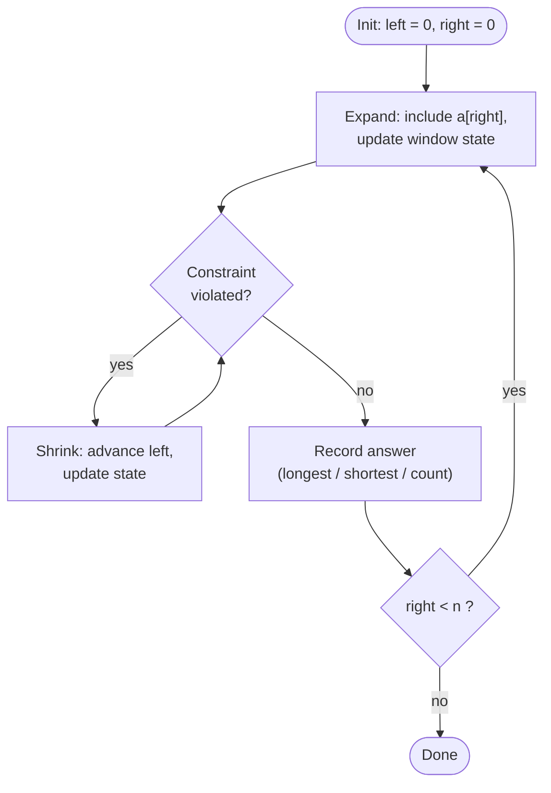

# Sliding Window


<PatternVideo pattern-name="Sliding Window" duration="8–12 min" />

<PatternProgress pattern-id="sliding-window" problems="sliding-window-longest-substring, minimum-window-substring, longest-repeating-character-replacement, max-consecutive-ones-iii, minimum-size-subarray-sum, permutation-in-string, find-all-anagrams-in-a-string, longest-substring-with-at-most-k-distinct-characters, fruit-into-baskets, subarrays-with-k-different-integers, binary-subarrays-with-sum, count-number-of-nice-subarrays, subarray-product-less-than-k, number-of-substrings-containing-all-three-characters, longest-palindromic-substring, trapping-rain-water, shortest-subarray-with-sum-at-least-k, jump-game-vi, constrained-subsequence-sum, diet-plan-performance, maximum-average-subarray-i, minimum-window-subsequence, replace-the-substring-for-balanced-string, get-equal-substrings-within-budget, substring-with-concatenation-of-all-words, frequency-of-the-most-frequent-element" />


## Why sliding window exists — the story

You're a network engineer at a CDN. Every millisecond, your edge servers process 50,000 requests. Your alert rule is: "in any 60-second window, if error-rate exceeds 5%, page the on-call." Simple to state — how do you compute it?

The obvious way: for each new millisecond, sum the last 60,000 error records and divide. That is `60,000` operations per millisecond × `1000` ms/sec = `6·10⁷` operations per second per edge server, just for one alert rule. Multiply by 200 rules × 500 edge servers, and you're at `6·10¹²` ops per second globally. Your alerting fleet melts. This isn't stupid, though: it's exactly how the reference implementation reads, and for windows of a few dozen it's the fastest option because branch predictors love the tight nested loop.

But at production scale — 60,000-element windows sliding one step every millisecond — you're doing 59,999 redundant additions on every step, because consecutive windows share 59,999 elements. The naive approach is *proven* to re-count almost everything it just counted. That waste is the tell.

The sliding-window pattern is: recognize that when the window slides one step, only *one* element enters on the right and *one* leaves on the left. Add the newcomer, subtract the leaver — **two ops instead of 60,000**. The O(n·k) grind becomes a single O(n) pass. Your alerting fleet runs on a fraction of the hardware. Meta, CloudFlare, and every real-time monitoring system on the planet uses this exact trick.

Let's make it concrete. Say we want the sum of every contiguous subarray of size 5. The first window covers indices 0–4; the next covers 1–5. Notice they share indices 1–4 — so the new sum is just the old sum, minus the element that slid out, plus the element that slid in:


<div class="svg-figure">
<svg preserveAspectRatio="xMidYMid meet" viewBox="0 0 720 220" xmlns="http://www.w3.org/2000/svg" font-family="Segoe UI, Arial, sans-serif">
  <defs>
    <marker id="ar-red" markerWidth="9" markerHeight="9" refX="5" refY="3" orient="auto"><path d="M0,0 L6,3 L0,6 Z" fill="var(--dsa-danger)"/></marker>
    <marker id="ar-grn" markerWidth="9" markerHeight="9" refX="5" refY="3" orient="auto"><path d="M0,0 L6,3 L0,6 Z" fill="var(--dsa-success)"/></marker>
    <filter id="s1" x="-10%" y="-10%" width="120%" height="140%"><feDropShadow dx="0" dy="1.2" stdDeviation="1.2" flood-color="var(--dsa-neutral)" flood-opacity="0.5"/></filter>
  </defs>
  <rect x="0" y="0" width="720" height="220" fill="var(--dsa-bg)"/>
  <!-- window A outline (indices 0..4) -->
  <rect x="6" y="70" width="278" height="52" rx="9" fill="none" stroke="var(--dsa-primary)" stroke-width="2.5"/>
  <text x="145" y="62" text-anchor="middle" font-size="12" fill="var(--dsa-primary)" font-weight="700">window at 0..4  (sum = 11)</text>
  <!-- window B outline (indices 1..5), dashed green -->
  <rect x="62" y="78" width="278" height="52" rx="9" fill="none" stroke="var(--dsa-success)" stroke-width="2.5" stroke-dasharray="6 4"/>
  <text x="360" y="150" text-anchor="middle" font-size="12" fill="var(--dsa-success)" font-weight="700">slides right → window at 1..5 (sum = 14)</text>
  <!-- cells -->
  <g filter="url(#s1)">
    <rect x="10"  y="76" width="50" height="40" rx="7" fill="var(--dsa-danger-soft)" stroke="var(--dsa-danger)" stroke-width="1.5"/>
    <rect x="66"  y="76" width="50" height="40" rx="7" fill="var(--dsa-primary-soft)" stroke="var(--dsa-primary-line)" stroke-width="1.5"/>
    <rect x="122" y="76" width="50" height="40" rx="7" fill="var(--dsa-primary-soft)" stroke="var(--dsa-primary-line)" stroke-width="1.5"/>
    <rect x="178" y="76" width="50" height="40" rx="7" fill="var(--dsa-primary-soft)" stroke="var(--dsa-primary-line)" stroke-width="1.5"/>
    <rect x="234" y="76" width="50" height="40" rx="7" fill="var(--dsa-primary-soft)" stroke="var(--dsa-primary-line)" stroke-width="1.5"/>
    <rect x="290" y="76" width="50" height="40" rx="7" fill="var(--dsa-success-soft)" stroke="var(--dsa-success)" stroke-width="1.5"/>
    <rect x="346" y="76" width="50" height="40" rx="7" fill="var(--dsa-neutral-soft)" stroke="var(--dsa-neutral-line)" stroke-width="1.5"/>
    <rect x="402" y="76" width="50" height="40" rx="7" fill="var(--dsa-neutral-soft)" stroke="var(--dsa-neutral-line)" stroke-width="1.5"/>
    <rect x="458" y="76" width="50" height="40" rx="7" fill="var(--dsa-neutral-soft)" stroke="var(--dsa-neutral-line)" stroke-width="1.5"/>
  </g>
  <g font-size="18" font-weight="700" fill="var(--dsa-ink)" text-anchor="middle">
    <text x="35"  y="102">1</text><text x="91"  y="102">3</text><text x="147" y="102">2</text>
    <text x="203" y="102">6</text><text x="259" y="102">-1</text><text x="315" y="102">4</text>
    <text x="371" y="102">1</text><text x="427" y="102">8</text><text x="483" y="102">2</text>
  </g>
  <g font-size="11" fill="var(--dsa-neutral)" text-anchor="middle">
    <text x="35" y="134">0</text><text x="91" y="134">1</text><text x="147" y="134">2</text>
    <text x="203" y="134">3</text><text x="259" y="134">4</text><text x="315" y="134">5</text>
    <text x="371" y="134">6</text><text x="427" y="134">7</text><text x="483" y="134">8</text>
  </g>
  <!-- leave / enter annotations -->
  <line x1="35" y1="170" x2="35" y2="120" stroke="var(--dsa-danger)" stroke-width="2" marker-end="url(#ar-red)"/>
  <text x="35" y="188" text-anchor="middle" font-size="11" font-weight="700" fill="var(--dsa-danger)">− leaves</text>
  <line x1="315" y1="170" x2="315" y2="120" stroke="var(--dsa-success)" stroke-width="2" marker-end="url(#ar-grn)"/>
  <text x="315" y="188" text-anchor="middle" font-size="11" font-weight="700" fill="var(--dsa-success)">+ enters</text>
  <!-- formula -->
  <rect x="524" y="74" width="188" height="60" rx="9" fill="var(--dsa-neutral-soft)" stroke="var(--dsa-neutral-line)"/>
  <text x="618" y="98" text-anchor="middle" font-size="12" font-weight="700" fill="var(--dsa-ink)">reuse, don't recompute</text>
  <text x="618" y="118" text-anchor="middle" font-size="12" fill="var(--dsa-neutral)">newSum = 11 − 1 + 4 = 14</text>
</svg>
</div>


<div class="readfig"><b>How to read it:</b> The solid blue box is the first window (indices 0–4, sum 11). Sliding one step gives the dashed green window (indices 1–5). The red cell (value <b>1</b>) drops out on the left, the green cell (value <b>4</b>) joins on the right, so the new sum is <b>11 − 1 + 4 = 14</b> — computed in O(1) instead of re-adding five numbers. Doing this across the array is the whole O(n) sliding window.</div>

**Why it matters in interviews.** The brute-force "for each start, scan k elements" is the naive answer to a *huge* family of interview questions on strings and arrays. The moment you recognize a sliding-window shape, you drop an entire nesting level of complexity — often n=10⁵ inputs that would time out at O(n²) fit comfortably at O(n).

<Callout kind="note" title="Video walkthrough coming soon">

a 5-10 minute Loom will be embedded here once recorded. If you'd like to be notified, [subscribe on GitHub](https://github.com/abhisinghal/dsa-master-reference/subscription).

</Callout>

## When to use it — the four flavors

Every sliding-window problem falls into one of four flavors. Naming the flavor in the first 30 seconds tells you which template to write.

| Flavor | Recognizer phrasing | What "record the answer" looks like |
|---|---|---|
| **Fixed size k** | *"every subarray of size k"*, *"max avg of size k"*, *"count anagrams of length k"* | one `for right`, record when `right >= k-1` |
| **Longest variable** | *"longest substring / subarray where …"*, *"…with at most K distinct"* | grow always; shrink **only while invalid**; record after the `while` |
| **Shortest variable** | *"shortest subarray with sum ≥ target"*, *"minimum window covering T"* | grow until valid; then shrink **greedily while still valid**; record inside the `while` |
| **Fixed size + extremum** | *"max / min of every window of size k"* | fixed loop + **monotonic deque** (sliding window ⊕ monotonic deque composed) |

<Callout kind="key" title="The one thing that determines the flavor">

the shape of the shrink rule. Longest-variable shrinks *lazily* (only when broken); shortest-variable shrinks *eagerly* (whenever valid). Get this wrong and the algorithm produces the right shape but the wrong answer.

</Callout>

<Callout kind="key" title="Count-of-subarrays trick">

"how many subarrays satisfy X?" often reduces to **exactly K = atMost(K) − atMost(K−1)**, where `atMost` is a longest-variable window that adds `right - left + 1` at each step. Powers *Subarrays with K Different Integers*, *Count Number of Nice Subarrays*, *Binary Subarrays With Sum*.

</Callout>

## How to use it — the two templates

Every sliding-window solution boils down to one of two loops. Memorize the shape; fill in the state.

**Template 1 — fixed size k:**


```java
long sum = 0; long best = Long.MIN_VALUE;              // any O(1) aggregate
for (int right = 0; right < a.length; right++) {
    sum += a[right];                                    // include newcomer
    if (right >= k - 1) {                               // window is exactly size k
        best = Math.max(best, sum);                     // record
        sum -= a[right - (k - 1)];                      // drop the leaver
    }
}
return best;
```


**Template 2 — variable size (longest / shortest / count):**


```java
int left = 0, best = 0;                                 // (Integer.MAX_VALUE for shortest)
// state: whatever tracks the rule — sum, count[], HashMap, ...
for (int right = 0; right < a.length; right++) {
    // 1. include a[right] in the state
    while (!isValid(/* state */)) {                     // 2. shrink until valid
        // exclude a[left] from the state
        left++;
    }
    // 3. record: longest → best = max(best, right-left+1) after the while
    //           shortest → best = min(best, right-left+1) inside the while
    //           count   → count += right - left + 1
}
return best;
```


The mermaid flow below is literally these two `for`/`while` loops as a picture:





<div class="readfig"><b>How to read it:</b> Start with an empty window. Each round you <b>grow</b> from the right (top box). If that breaks the rule (the diamond), you <b>shrink</b> from the left until it's valid again — the little loop back to the diamond. Whenever the window is valid you <b>record</b> the answer, then keep going until the right edge reaches the end. Every index enters once and leaves at most once → O(n) amortized.</div>

## When *not* to use it — the monotonicity test

Sliding window works only under one specific structural property, and interview problems love to violate it by exactly one word.

<Callout kind="inv" title="The monotonicity requirement">

*once the right pointer is fixed, extending the window further can never turn an invalid window valid again.* Equivalently: the "invalid → valid" boundary moves only in one direction as you scan.

</Callout>

Two 10-second tests before you write code:

1. **The extension test.** If `[left, right]` is invalid, can extending `right` fix it? If **yes**, sliding window is wrong for this problem.
2. **The shrink test.** If `[left, right]` is valid, does removing `a[left]` still leave a well-defined "validity" you can check in O(1)? If **no** (e.g. you'd have to recompute a max/min over the whole window from scratch), you probably need a monotonic deque or a segment tree, not a plain window.

## False friends — problems that *look* like sliding window but aren't

Every one of these has a "contiguous subarray with a rule" phrasing that pattern-matches to sliding window in the first read. Every one has a subtle property that breaks the monotonicity requirement — and each has a specific alternative to reach for instead.

| Problem | Why sliding window **fails** | What to use instead |
|---|---|---|
| [Subarray Sum Equals K](https://leetcode.com/problems/subarray-sum-equals-k/) with negatives | Adding a negative can lower the running sum below K after it was above → *invalid can become valid again by growing*. Extension test fails. | **Prefix sums + `HashMap<sum, count>`** — count how many prefix sums equal `runningSum − K`. |
| [Shortest Subarray with Sum ≥ K](https://leetcode.com/problems/shortest-subarray-with-sum-at-least-k/) with negatives | Same reason — negatives break the shortest-variable shrink rule. | **Prefix sums + monotonic deque** — enqueue prefix sums, maintain a deque of indices with increasing prefix values. |
| [Maximum Subarray](https://leetcode.com/problems/maximum-subarray/) (Kadane) | The "rule" here is "which subarray has max sum?" — there's no growing/shrinking validity, only a *choice*: keep extending or restart. | **1-D DP (Kadane)** — `cur = max(a[i], cur + a[i])`. |
| [Longest Substring with **exactly** K distinct](https://leetcode.com/problems/subarrays-with-k-different-integers/) | Exactly-K validity isn't monotone: a window with 3 distinct isn't "valid" for K=2 nor for K=4. | **atMost(K) − atMost(K−1)** — two sliding-window passes composed. |
| [Longest Palindromic Substring](https://leetcode.com/problems/longest-palindromic-substring/) | Adding a char at the right can turn a valid palindrome into an invalid one — but also into a *larger* valid one. Non-monotone. | **Expand around each center**, O(n²), or Manacher's O(n). |
| [Trapping Rain Water](https://leetcode.com/problems/trapping-rain-water/) | Water at each index depends on the max on **both** sides — not on a window that slides in one direction. | **Two pointers with left/right running max**, or a monotonic stack. |
| [Subarray Product Less Than K](https://leetcode.com/problems/subarray-product-less-than-k/) **with zeros or negatives** | The product argument (`product /= a[left]` restores validity) assumes strictly-positive integers. Zeros make the product 0 permanently; negatives flip the inequality direction. | **Prefix sums / logarithms**, or split the array at each zero and process pieces. |

<Callout kind="trap" title="The classic silent bug">

a plain sliding window on any of these problems runs, terminates, and returns *a* number. It just isn't the right one. Always run the extension test on a small negative-value / zero / non-monotone example before trusting the answer.

</Callout>

## Limitations — what sliding window can never do

Even when the problem is monotone, sliding window has hard limits worth naming out loud:

- **Contiguous only.** Any question about *subsequences* (order-preserving but not adjacent) is off-limits — that's DP or a different technique entirely.
- **One dimension.** 2-D "sliding windows" (submatrix problems) work but need a 2-D prefix sum or per-row/column reduction first — the raw slide idea doesn't extend directly.
- **O(1) update per side.** If including `a[right]` (or excluding `a[left]`) can't be done in O(1) or amortized O(1), the whole approach loses. That's why sliding-window **max/min** needs a deque — a naive `max()` per window would be O(k) each step.
- **Ordered progression only.** The window walks left-to-right. Problems that ask about the *k-th smallest* over sliding windows, or arbitrary re-orderings, need a multiset (`TreeMap`) alongside — not a plain window.
- **Doesn't handle "with modifications."** *"Any subarray after up to K swaps"* or *"any subarray of length ≥ L"* usually breaks the monotone extension test. Reach for DP.

Now let's walk through the canonical shapes, from the simplest fixed-size warm-up up through the composed sliding-window + monotonic-deque problem.


<SlidingWindowAnim />


## Maximum Average Subarray I (fixed-size warm-up) <span class="diff diff-e">Easy</span>

*[↗ LeetCode: Maximum Average Subarray I](https://leetcode.com/problems/maximum-average-subarray-i/)*

<ProgressCheck id="maximum-average-subarray-i-fixed-size-warm-up" />


<div class="svg-figure">
<svg preserveAspectRatio="xMidYMid meet" viewBox="0 0 400 250" xmlns="http://www.w3.org/2000/svg" font-family="var(--dsa-font)">
  <defs>
    <marker id="ar-mavg-danger" markerWidth="9" markerHeight="9" refX="6" refY="3" orient="auto"><path d="M0,0 L6,3 L0,6 Z" fill="var(--dsa-danger)"/></marker>
    <marker id="ar-mavg-success" markerWidth="9" markerHeight="9" refX="6" refY="3" orient="auto"><path d="M0,0 L6,3 L0,6 Z" fill="var(--dsa-success)"/></marker>
  </defs>
  <rect x="0" y="0" width="400" height="250" rx="12" fill="var(--dsa-bg)"/>
  <text x="200" y="28" text-anchor="middle" font-size="13" font-weight="700" fill="var(--dsa-primary)">Slide k=4: reuse the overlapping sum</text>
  <rect x="38" y="76" width="216" height="60" rx="10" fill="none" stroke="var(--dsa-primary)" stroke-width="var(--dsa-outline-stroke)"/>
  <text x="146" y="66" text-anchor="middle" font-size="12" font-weight="700" fill="var(--dsa-primary)">window 0..3  sum = 2</text>
  <rect x="90" y="84" width="216" height="60" rx="10" fill="none" stroke="var(--dsa-success)" stroke-width="var(--dsa-outline-stroke)" stroke-dasharray="7 5"/>
  <text x="266" y="156" text-anchor="middle" font-size="12" font-weight="700" fill="var(--dsa-success)">window 1..4  sum = 51</text>
  <g text-anchor="middle">
    <rect x="42" y="88" width="44" height="44" rx="7" fill="var(--dsa-danger-soft)" stroke="var(--dsa-danger)" stroke-width="var(--dsa-cell-stroke)"/>
    <rect x="94" y="88" width="44" height="44" rx="7" fill="var(--dsa-primary-soft)" stroke="var(--dsa-primary)" stroke-width="var(--dsa-cell-stroke)"/>
    <rect x="146" y="88" width="44" height="44" rx="7" fill="var(--dsa-primary-soft)" stroke="var(--dsa-primary)" stroke-width="var(--dsa-cell-stroke)"/>
    <rect x="198" y="88" width="44" height="44" rx="7" fill="var(--dsa-primary-soft)" stroke="var(--dsa-primary)" stroke-width="var(--dsa-cell-stroke)"/>
    <rect x="250" y="88" width="44" height="44" rx="7" fill="var(--dsa-success-soft)" stroke="var(--dsa-success)" stroke-width="var(--dsa-cell-stroke)"/>
    <rect x="302" y="88" width="44" height="44" rx="7" fill="var(--dsa-neutral-soft)" stroke="var(--dsa-neutral-line)" stroke-width="var(--dsa-cell-stroke)"/>
    <g font-size="17" font-weight="700" fill="var(--dsa-ink)">
      <text x="64" y="116">1</text><text x="116" y="116">12</text><text x="168" y="116">-5</text>
      <text x="220" y="116">-6</text><text x="272" y="116">50</text><text x="324" y="116">3</text>
    </g>
    <g font-size="11" fill="var(--dsa-neutral)">
      <text x="64" y="147">0</text><text x="116" y="147">1</text><text x="168" y="147">2</text>
      <text x="220" y="147">3</text><text x="272" y="147">4</text><text x="324" y="147">5</text>
    </g>
  </g>
  <line x1="64" y1="184" x2="64" y2="135" stroke="var(--dsa-danger)" stroke-width="var(--dsa-arrow-stroke)" marker-end="url(#ar-mavg-danger)"/>
  <text x="64" y="203" text-anchor="middle" font-size="12" font-weight="700" fill="var(--dsa-danger)">leaves: -1</text>
  <line x1="272" y1="184" x2="272" y2="135" stroke="var(--dsa-success)" stroke-width="var(--dsa-arrow-stroke)" marker-end="url(#ar-mavg-success)"/>
  <text x="272" y="203" text-anchor="middle" font-size="12" font-weight="700" fill="var(--dsa-success)">enters: +50</text>
  <text x="200" y="231" text-anchor="middle" font-size="11.5" font-style="italic" fill="var(--dsa-neutral)">newSum = oldSum - oldLeft + newRight = 2 - 1 + 50 = 51</text>
</svg>
</div>


<div class="readfig"><b>How to read it:</b> The next fixed-size window keeps the overlap and updates in O(1): add the entering <b>50</b>, subtract the leaving <b>1</b>, then compare the new sum.</div>

### Problem
Given an array and an integer `k`, find the contiguous subarray of length **exactly `k`** with the maximum average.

**Constraints:** `1 ≤ k ≤ n ≤ 10⁵`; values fit in `int`; return the max average as a `double`.

**Example 1:** `nums = [1,12,-5,-6,50,3], k = 4` → `12.75` (the window `[12,-5,-6,50]` has sum 51 → avg 51/4).

<ExamplePreview compact :input="['1', '12', '-5', '-6', '50', '3', '|', '4']" :output="['12.75']" />

**Example 2:** `nums = [-5,-1,-3], k = 2` → `-2.0` (best window `[-1,-3]`; all-negative inputs still need the least-bad sum).

<ExamplePreview compact :input="['-5', '-1', '-3', '|', '2']" :output="['-2.0']" />

### Solution — brute force
Start with the direct baseline: enumerate every candidate and compute the answer from scratch. It is correct, but it repeats the exact work that the pattern is meant to reuse.


```java
double findMaxAverageBrute(int[] nums, int k) {
    long best = Long.MIN_VALUE;
    for (int start = 0; start + k <= nums.length; start++) {
        long sum = 0;
        for (int i = start; i < start + k; i++) sum += nums[i];
        best = Math.max(best, sum);
    }
    return best / (double) k;
}
```


**Brute-force cost:** O(n·k) time (O(n²) when k grows with n), O(1) space — too slow for n ≥ 10⁴.

### Solution — optimized
Instead of re-adding the same k elements again and again, keep one running window sum. Har slide par right element add hota hai, left element nikalta hai, and the best sum updates only when the window is full.

**Pattern.**
The archetypal **fixed-size** window: compute the first window's sum, then each next window costs O(1) — add the entering element, subtract the leaving one. Divide by `k` at the end.

**Steps.**
1. Sum the first `k` elements into `windowSum`; seed `bestSum = windowSum`.
2. For each `right` from `k` to `n-1`: `windowSum += a[right] - a[right - k]` (slide by one).
3. Track `bestSum = max(bestSum, windowSum)`.
4. Return `bestSum / (double) k`.

**Java.**


```java
double findMaxAverage(int[] nums, int k) {
    int left = 0;
    long val = 0;
    long best = Long.MIN_VALUE;
    for (int right = 0; right < nums.length; right++) {
        val += nums[right];               // add incoming
        if (right >= k - 1) {             // window is now full (indices 0..k-1 = k elements)
            best = Math.max(best, val);   // compare
            val -= nums[left++];          // shrink from the left for next iter
        }
    }
    return best / (double) k;
}
```


Ek `if`, ek block. `right >= k - 1` ka matlab: 0-indexed loop mein `k`-va element aa chuka hai → window bhari hai. Uske baad hi compare + shrink hota hai.

#### Alternate — two-phase style (build then slide)

Kuch developers "build first window, then slide" prefer karte hain; slide loop mein zero conditionals rehte hain:


```java
long sum = 0;
for (int i = 0; i < k; i++) sum += a[i];
long best = sum;
for (int i = k; i < a.length; i++) {
    sum += a[i] - a[i - k];
    best = Math.max(best, sum);
}
```


Style choice — dono O(n), same output. Single-loop with `right >= k-1` guard usually most compact.

### Time Complexity
Existing summary: Time O(n) · Space O(1).

The optimized scan is O(n) because every index is added to `val` once as `right` reaches it, and removed once when `left` advances. The alternate two-phase style does the same total work: one build pass over k items plus one slide pass over the remaining items.

### Space Complexity
The optimized method is O(1) space because it keeps only `left`, `val`, and `best`; the input array is not copied and no per-window storage is created.

### Learning notes
- Why `long val`? — a k-window sum can get large, and using `long` is defensive for bigger constraints.
- Why `Long.MIN_VALUE` for `best`? — all numbers can be negative, so seeding with `0` would incorrectly prefer an empty window.
- Why `right >= k - 1`? — with 0-indexing, the first complete k-sized window ends at index `k-1`.
- Why update `best` before subtracting `nums[left]`? — the current full window must be scored before preparing the next window.
- Why divide by `(double) k`? — it forces floating-point division instead of truncating.

<Callout kind="inv" title="Invariant">

after step `i`, `windowSum` equals the sum of the k elements ending at index `i`.

</Callout>

<Callout kind="note" title="Watch the accumulator width">

`int[]` values up to 10⁴, `k` up to 10⁵ → `sum` can hit ~10⁹, fits in `int`, but a long is defensive and free.

</Callout>

<Callout kind="note" title="Trace it">

`[1,12,-5,-6,50,3], k=4`. First full window at `right=3`: `val = 1+12-5-6 = 2` → `best = 2`, shrink `-1`. Next at `right=4`: `1+50 = 51` → **max**, shrink `-12`. Next at `right=5`: `39+3 = 42`. Result 51 → avg `12.75`.

</Callout>

<Callout kind="trap" title="Common Trap">

Integer overflow on `windowSum`. *Example:* `k = 10⁴`, values near `10⁴` → sum near `10⁸` — fine in `int`, but two of those or a larger `k` overflows. Use `long`.

</Callout>


<CodeTrace
  title="Max Average Subarray I — nums=[1,12,-5,-6,50,3], k=4"
  :values="[1, 12, -5, -6, 50, 3]"
  :windowKeys="['left', 'right']"
  :steps='[
    { pointers: { left: 0, right: 3 }, vars: { sum: 2, best: 2 }, note: "first full window fills, best=2", added: [3] },
    { pointers: { left: 1, right: 4 }, vars: { sum: 51, best: 51 }, note: "slide: +50 in, -1 out — new best", added: [4], removed: [0] },
    { pointers: { left: 2, right: 5 }, vars: { sum: 42, best: 51 }, note: "slide: +3 in, -12 out — best holds", added: [5], removed: [1] }
  ]'
/>

<Callout kind="pat" title="Pattern Connection">

Any fixed-size aggregate — sum, product (with careful zero handling), min/max via monotonic deque, character-count vector — follows this same one-add-one-subtract slide.

</Callout>

### Same pattern, new tweaks

| Variation | The one thing that changes | Time |
|---|---|---|
| [Maximum Average Subarray I](https://leetcode.com/problems/maximum-average-subarray-i/) | plain sum, divide by k at the end | O(n) |
| [Find All Anagrams in a String](https://leetcode.com/problems/find-all-anagrams-in-a-string/) | slide a **char-count vector**; record `left` when it matches `need[]` | O(n) |
| [Permutation in String](https://leetcode.com/problems/permutation-in-string/) | same as above; return true on the first match | O(n) |
| [Diet Plan Performance](https://leetcode.com/problems/diet-plan-performance/) | classify each window by sum thresholds; sum score | O(n) |

## Smallest Subarray With Sum ≥ Target <span class="diff diff-m">Medium</span>

*[↗ LeetCode: Minimum Size Subarray Sum](https://leetcode.com/problems/minimum-size-subarray-sum/)*

<ProgressCheck id="smallest-subarray-with-sum-target" />

### Problem
Find the length of the **shortest contiguous subarray** whose sum is `≥ target`; return 0 if none exists. Values are positive, which is what keeps the window monotone.

**Constraints:** `1 ≤ n ≤ 10⁵`; values `≥ 1`; `target ≥ 1`.

**Example 1:** `target = 7, [2,3,1,2,4,3]` → `2` (the subarray `[4,3]`).

**Example 2:** `target = 15, nums = [1,2,3]` → `0` (no window can reach the target).

### Solution — brute force
Start with the direct baseline: enumerate every candidate and compute the answer from scratch. It is correct, but it repeats the exact work that the pattern is meant to reuse.


```java
int minSubArrayLenBrute(int target, int[] a) {
    int best = Integer.MAX_VALUE;
    for (int start = 0; start < a.length; start++) {
        long sum = 0;
        for (int end = start; end < a.length; end++) {
            sum += a[end];
            if (sum >= target) { best = Math.min(best, end - start + 1); break; }
        }
    }
    return best == Integer.MAX_VALUE ? 0 : best;
}
```


**Brute-force cost:** O(n²) time, O(1) space — too slow for n ≥ 10⁴.

### Solution — optimized
Positive numbers give the monotonicity we need: growing right can only increase the sum, and moving left can only decrease it. So once a window becomes valid, greedily shrink it and record every shorter valid candidate ending at that `right`.

**Pattern.**
The **shortest-window** shape: grow `right` until the window is valid, then greedily shrink `left` while it stays valid, recording the minimum length. (Positive numbers only — that's what keeps the sum monotone.)

**Java.**


```java
int minSubArrayLen(int target, int[] a) {
    int left = 0, best = Integer.MAX_VALUE;
    long windowSum = 0;
    for (int right = 0; right < a.length; right++) {
        windowSum += a[right];                       // grow
        while (windowSum >= target) {                // valid -> shrink to minimize
            best = Math.min(best, right - left + 1);
            windowSum -= a[left++];
        }
    }
    return best == Integer.MAX_VALUE ? 0 : best;
}
```


### Time Complexity
Existing summary: Time O(n) · Space O(1).

The optimized loop is O(n) because `right` visits each element once and `left` also advances only forward. Even though there is a nested `while`, each element can be subtracted from `windowSum` at most one time.

### Space Complexity
Space is O(1) because the algorithm stores a running sum, two pointers, and the best length; it does not allocate arrays or maps.

### Learning notes
- Why `long windowSum`? — repeated positive values can push the sum beyond comfortable int assumptions.
- Why shrink inside `while (windowSum >= target)`? — for shortest windows, every valid window should be minimized immediately.
- Why record before subtracting `a[left]`? — the current window is valid right now; after subtracting it may become invalid.
- Why `right - left + 1`? — both endpoints are included.
- Why return `0` when best stays `Integer.MAX_VALUE`? — that sentinel means no valid window was found.

<Callout kind="key" title="Key Insight">

Unlike the "longest" problems, here you shrink *aggressively the moment the window becomes valid*, because a shorter valid window is always better. Each index is still added once and removed once → O(n).

</Callout>

<Callout kind="inv" title="Invariant">

`windowSum` always equals the sum of `[left, right]`; whenever it reaches `target`, `[left, right]` is the smallest valid window **ending at `right`**.

</Callout>

<Callout kind="note" title="Trace it (step ledger)">

`target=7, a=[2,3,1,2,4,3]`:

| right | a[right] | windowSum | left | action | best |
|---|---|---|---|---|---|
| 0 | 2 | 2 | 0 | grow | ∞ |
| 1 | 3 | 5 | 0 | grow | ∞ |
| 2 | 1 | 6 | 0 | grow | ∞ |
| 3 | 2 | **8** → 6 → 5 | 0 → 1 → 2 | grow, then shrink twice while ≥ 7 | 4, then 3 |
| 4 | 4 | 9 → 5 | 2 → 3 | grow, shrink once | 3 |
| 5 | 3 | 8 → **7** → 4 | 3 → 4 → 5 | grow, shrink twice | 3, then **2** |

Answer: **2** (the window `[4, 3]`). Each index moves through `right` once and through `left` at most once → O(n).

</Callout>

<CodeTrace
  title="Minimum Size Subarray Sum — nums=[2,3,1,2,4,3], target=7"
  :values="[2,3,1,2,4,3]"
  :windowKeys="['left','right']"
  :cellWidth="42"
  :steps='[
    { pointers: { left: 0, right: 0 }, vars: { sum: 2, best: "∞" }, note: "grow to 2" },
    { pointers: { left: 0, right: 1 }, vars: { sum: 5, best: "∞" }, note: "grow to 5" },
    { pointers: { left: 0, right: 2 }, vars: { sum: 6, best: "∞" }, note: "grow to 6" },
    { pointers: { left: 2, right: 3 }, vars: { sum: 5, best: 3 }, note: "sum 8 ≥ 7 → shrink twice, best window [1,2,2,2] shrunk to [1,2,2] length 3", added: [2,3] },
    { pointers: { left: 3, right: 4 }, vars: { sum: 5, best: 3 }, note: "grow to 9, shrink once" },
    { pointers: { left: 4, right: 5 }, vars: { sum: 7, best: 2 }, note: "grow to 8, shrink twice: [4,3] sum=7 → best=2", added: [4,5] }
  ]'
/>

<Callout kind="trap" title="Common Trap">

Forgetting the "no window found" case. *Example:* `nums=[1,1,1]`, `target=100`. No window satisfies the sum; if you return `best` still at `Integer.MAX_VALUE`, the caller thinks a huge window exists. Return `0` when `best` was never updated.

</Callout>

<TrapTrace title="Forgetting the 'no window found' case" input="nums=[1,1,1]" bug="'nums=[1,1,1]', 'target=100'. No window satisfies the sum; if you return 'best' still at 'Integer.MAX_VALUE', the caller thinks a huge window exists" fix="Return '0' when 'best' was never updated." />

<Callout kind="pat" title="Pattern Connection">

The "shrink-to-minimize" twin of Minimum Window Substring (which minimizes over a character-coverage condition instead of a sum). Recognizing *longest vs shortest* decides whether you shrink lazily (only when invalid) or greedily (whenever valid).

</Callout>

### Same pattern, new tweaks

| Variation | The one thing that changes | Time |
|---|---|---|
| [Minimum Size Subarray Sum](https://leetcode.com/problems/minimum-size-subarray-sum/) | this exact shape (positive values, sum ≥ target) | — |
| [Minimum Window Substring](https://leetcode.com/problems/minimum-window-substring/) | validity is "covers all required characters," tracked with a have/need counter | — |
| [Replace the Substring for Balanced String](https://leetcode.com/problems/replace-the-substring-for-balanced-string/) | shrink while the outside-window counts are already balanced | — |
| [Shortest Subarray with Sum ≥ K (negatives allowed)](https://leetcode.com/problems/shortest-subarray-with-sum-at-least-k/) | the window breaks with negatives → switch to prefix sums + a monotonic deque | — |

## Longest Substring Without Repeating Characters <span class="diff diff-m">Medium</span>

*[↗ LeetCode: Longest Substring Without Repeating Characters](https://leetcode.com/problems/longest-substring-without-repeating-characters/)*

### Try it yourself

Edit the Java code below and click **▶ Run tests** to check it against real examples. Powered by [Judge0](https://ce.judge0.com); your code auto-saves in your browser.

<JavaRunner problemSlug="longest-substring-without-repeating-characters" :tests='[{ input: "abcabcbb", expected: "3" }, { input: "bbbbb", expected: "1" }, { input: "pwwkew", expected: "3" }]' />


<ProgressCheck id="longest-substring-without-repeating-characters" />


<div class="svg-figure">
<svg preserveAspectRatio="xMidYMid meet" viewBox="0 0 400 250" xmlns="http://www.w3.org/2000/svg" font-family="var(--dsa-font)">
  <defs>
    <marker id="ar-ls-primary" markerWidth="9" markerHeight="9" refX="6" refY="3" orient="auto"><path d="M0,0 L6,3 L0,6 Z" fill="var(--dsa-primary)"/></marker>
    <marker id="ar-ls-danger" markerWidth="9" markerHeight="9" refX="6" refY="3" orient="auto"><path d="M0,0 L6,3 L0,6 Z" fill="var(--dsa-danger)"/></marker>
  </defs>
  <rect x="0" y="0" width="400" height="250" rx="12" fill="var(--dsa-bg)"/>
  <text x="200" y="28" text-anchor="middle" font-size="13" font-weight="700" fill="var(--dsa-primary)">Keep a distinct window; jump left on duplicate</text>
  <rect x="6" y="76" width="148" height="60" rx="10" fill="none" stroke="var(--dsa-primary)" stroke-width="var(--dsa-outline-stroke)"/>
  <text x="80" y="66" text-anchor="middle" font-size="12" font-weight="700" fill="var(--dsa-primary)">best window: abc</text>
  <g text-anchor="middle">
    <rect x="10" y="84" width="44" height="44" rx="7" fill="var(--dsa-primary-soft)" stroke="var(--dsa-primary)" stroke-width="var(--dsa-cell-stroke)"/>
    <rect x="58" y="84" width="44" height="44" rx="7" fill="var(--dsa-primary-soft)" stroke="var(--dsa-primary)" stroke-width="var(--dsa-cell-stroke)"/>
    <rect x="106" y="84" width="44" height="44" rx="7" fill="var(--dsa-primary-soft)" stroke="var(--dsa-primary)" stroke-width="var(--dsa-cell-stroke)"/>
    <rect x="154" y="84" width="44" height="44" rx="7" fill="var(--dsa-danger-soft)" stroke="var(--dsa-danger)" stroke-width="var(--dsa-cell-stroke)"/>
    <rect x="202" y="84" width="44" height="44" rx="7" fill="var(--dsa-neutral-soft)" stroke="var(--dsa-neutral-line)" stroke-width="var(--dsa-cell-stroke)"/>
    <rect x="250" y="84" width="44" height="44" rx="7" fill="var(--dsa-neutral-soft)" stroke="var(--dsa-neutral-line)" stroke-width="var(--dsa-cell-stroke)"/>
    <rect x="298" y="84" width="44" height="44" rx="7" fill="var(--dsa-neutral-soft)" stroke="var(--dsa-neutral-line)" stroke-width="var(--dsa-cell-stroke)"/>
    <rect x="346" y="84" width="44" height="44" rx="7" fill="var(--dsa-neutral-soft)" stroke="var(--dsa-neutral-line)" stroke-width="var(--dsa-cell-stroke)"/>
    <g font-size="17" font-weight="700" fill="var(--dsa-ink)">
      <text x="32" y="112">a</text><text x="80" y="112">b</text><text x="128" y="112">c</text><text x="176" y="112">a</text>
      <text x="224" y="112">b</text><text x="272" y="112">c</text><text x="320" y="112">b</text><text x="368" y="112">b</text>
    </g>
    <g font-size="11" fill="var(--dsa-neutral)">
      <text x="32" y="143">0</text><text x="80" y="143">1</text><text x="128" y="143">2</text><text x="176" y="143">3</text>
      <text x="224" y="143">4</text><text x="272" y="143">5</text><text x="320" y="143">6</text><text x="368" y="143">7</text>
    </g>
  </g>
  <text x="176" y="103" text-anchor="middle" font-size="28" font-weight="700" fill="var(--dsa-danger)">×</text>
  <line x1="32" y1="178" x2="32" y2="132" stroke="var(--dsa-primary)" stroke-width="var(--dsa-arrow-stroke)" marker-end="url(#ar-ls-primary)"/>
  <text x="32" y="197" text-anchor="middle" font-size="12" font-weight="700" fill="var(--dsa-primary)">left</text>
  <line x1="176" y1="178" x2="176" y2="132" stroke="var(--dsa-danger)" stroke-width="var(--dsa-arrow-stroke)" marker-end="url(#ar-ls-danger)"/>
  <text x="176" y="197" text-anchor="middle" font-size="12" font-weight="700" fill="var(--dsa-danger)">right: duplicate a</text>
  <text x="200" y="229" text-anchor="middle" font-size="11.5" font-style="italic" fill="var(--dsa-neutral)">duplicate inside window → advance left past the old a</text>
</svg>
</div>


<div class="readfig"><b>How to read it:</b> The blue window is distinct until the next <b>a</b> repeats a character already inside it; jump <code>left</code> past the previous <b>a</b>, not back to zero.</div>

### Problem
Find the length of the **longest substring** (contiguous) that has **all distinct** characters.

**Constraints:** `0 ≤ n ≤ 5·10⁴`; any ASCII characters.

**Example 1:** `"abcabcbb"` → `3` (the substring `"abc"`).

<ExamplePreview compact :input="['a', 'b', 'c', 'a', 'b', 'c', 'b', 'b']" :output="['3']" />

**Example 2:** `s = ""` → `0` (empty string has no substring).

### Solution — brute force
Start with the direct baseline: enumerate every candidate and compute the answer from scratch. It is correct, but it repeats the exact work that the pattern is meant to reuse.


```java
int lengthOfLongestSubstringBrute(String s) {
    int best = 0;
    for (int start = 0; start < s.length(); start++) {
        boolean[] seen = new boolean[128];
        for (int end = start; end < s.length(); end++) {
            char c = s.charAt(end);
            if (seen[c]) break;
            seen[c] = true;
            best = Math.max(best, end - start + 1);
        }
    }
    return best;
}
```


**Brute-force cost:** O(n²) time, O(1) space for fixed ASCII — too slow for n ≥ 10⁴.

### Solution — optimized
The optimized window never restarts from scratch. It remembers the last index of every character and jumps `left` past the duplicate only when that duplicate is still inside the current window.

**Pattern.**
Longest window with a "no duplicate" invariant; jump `left` past the last occurrence.

**Steps.**
1. Maintain a `left` pointer and a map (or `int[128]`) from char → its last-seen index.
2. Scan `right` left to right. If `s[right]` was seen and its last index &gt;= `left`, clamp: `left = lastIndex[s[right]] + 1`.
3. Update `lastIndex[s[right]] = right`.
4. Update `best = max(best, right - left + 1)` each step.
5. O(n) time, O(alphabet) space.

**Java.**


```java
int lengthOfLongestSubstring(String s) {
    int[] last = new int[128];
    Arrays.fill(last, -1);
    int left = 0, best = 0;
    for (int right = 0; right < s.length(); right++) {
        char c = s.charAt(right);
        if (last[c] >= left) left = last[c] + 1;   // jump past duplicate
        last[c] = right;
        best = Math.max(best, right - left + 1);
    }
    return best;
}
```


### Time Complexity
Existing summary: Time O(n) · Space O(alphabet).

The scan is O(n) because `right` moves from left to right once, and `left` only jumps forward; no character can force a backward rescan.

### Space Complexity
The code uses O(1) space under the ASCII constraint because `last` has fixed size 128. If the character set were unbounded Unicode, the same idea with a map would be O(alphabet seen).

### Learning notes
- Why initialize `last` with `-1`? — index 0 is valid, so `0` cannot mean unseen.
- Why `if (last[c] >= left)`? — only duplicates still inside the window should move `left`.
- Why set `left = last[c] + 1`? — the new window starts just after the previous copy.
- Why update `last[c] = right` after the check? — future duplicates need the newest occurrence.
- Why `int[128]`? — ASCII is assumed; Unicode needs a map.

<Callout kind="inv" title="Invariant">

`[left,right]` contains distinct characters; `last[c]` stores the most recent index of `c`.

</Callout>

<Callout kind="note" title="Trace it">

`"abcabcbb"`. The window grows `a,b,c`; the next `a` collides, so `left` jumps past the old `a`. Longest clean window is `"abc"` → **3**.

</Callout>

<Callout kind="trap" title="Common Trap">

Not clamping `left` to its previous position. *Example:* `s="abba"`. At index 3 (`'a'`), the previous `a` was at 0, but `left` has already moved past 2. Without `left = max(left, prev+1)`, `left` retreats and the window contains two `a`s.

</Callout>

<CodeTrace
  title="Trap — s=&quot;abba&quot; without left-clamp, window retreats and gets duplicate a"
  :values="['a','b','b','a']"
  :windowKeys="['left','right']"
  :cellWidth="46"
  :steps='[
    { pointers: { left: 0, right: 0 }, vars: { last: "{a:0}" }, note: "a → last[a]=0" },
    { pointers: { left: 0, right: 1 }, vars: { last: "{a:0,b:1}" }, note: "b → new" },
    { pointers: { left: 2, right: 2 }, vars: { last: "{a:0,b:2}" }, note: "b collision → jump left past prev b (idx 1). left=2", removed: [0,1] },
    { pointers: { left: 1, right: 3 }, vars: { last: "{a:3,b:2}" }, note: "BUG: a collision at 0. left=max(2, 0+1)=1 wrong path → left retreats to 1!", removed: [1], added: [0,3] },
    { pointers: { left: 3, right: 3 }, vars: { last: "{a:3,b:2}" }, note: "FIX: left=max(left, prev+1) keeps left=2. correct len 2" }
  ]'
/>


<CodeTrace
  title="Longest Substring Without Repeating Chars — s=&quot;abcabcbb&quot;"
  :values="['a','b','c','a','b','c','b','b']"
  :windowKeys="['left', 'right']"
  :cellWidth="34"
  :steps='[
    { pointers: { left: 0, right: 0 }, vars: { best: 1 }, note: "a — new, window \"a\"", added: [0] },
    { pointers: { left: 0, right: 1 }, vars: { best: 2 }, note: "b — new, window \"ab\"", added: [1] },
    { pointers: { left: 0, right: 2 }, vars: { best: 3 }, note: "c — new, best=3, window \"abc\"", added: [2] },
    { pointers: { left: 1, right: 3 }, vars: { best: 3 }, note: "a collides at 0 — jump left past it", added: [3], removed: [0] },
    { pointers: { left: 2, right: 4 }, vars: { best: 3 }, note: "b collides at 1 — jump left past it", added: [4], removed: [1] },
    { pointers: { left: 5, right: 6 }, vars: { best: 3 }, note: "later: bb collision keeps window ≤ 3", added: [6], removed: [5] }
  ]'
/>

<Callout kind="pat" title="Pattern Connection">

"At most K distinct" and "longest with ≤ K replacements" are the same skeleton with a different validity test.

</Callout>

### Common Mistakes

- **Not clamping `left`** on the previous-index bump — `left = max(left, prev + 1)` is required.
- **Restarting `left` from prev+1 unconditionally** — you'll move `left` backwards on old-but-now-outside occurrences.
- **Off-by-one on window size**: `right - left + 1`, not `right - left`.
- **Alphabet assumption**: full unicode needs a `HashMap`, not `int[128]`.

### Same pattern, new tweaks

Once you own this "grow, and shrink when a rule breaks" loop, a whole family opens up — each is the *same* window with one small change to the rule:

| Variation | The one thing that changes | Time |
|---|---|---|
| [Longest Substring with At Most K Distinct](https://leetcode.com/problems/longest-substring-with-at-most-k-distinct-characters/) | allow up to `K` different characters instead of zero repeats; shrink while the distinct-count exceeds `K` (track counts in a small map) | — |
| [Fruits into Baskets](https://leetcode.com/problems/fruit-into-baskets/) | it's literally "at most **2** distinct" dressed up as picking fruit into two baskets | — |
| [Longest Repeating Character Replacement](https://leetcode.com/problems/longest-repeating-character-replacement/) | the window is valid while `windowLen − countOfMostFrequentChar ≤ K` (you may replace up to `K` of the minority) | — |
| [Max Consecutive Ones III](https://leetcode.com/problems/max-consecutive-ones-iii/) | over a 0/1 array, shrink only when the number of zeros in the window exceeds `K` (you may flip `K` zeros) | — |
| [Permutation in String / Find All Anagrams](https://leetcode.com/problems/find-all-anagrams-in-a-string/) | a **fixed-size** window plus exact character counts — slide a window the length of the pattern and check the counts match | — |

## Minimum Window Substring <span class="diff diff-h">Hard</span>

*[↗ LeetCode: Minimum Window Substring](https://leetcode.com/problems/minimum-window-substring/)*

<ProgressCheck id="minimum-window-substring" />

### Problem
Find the **shortest substring** of `S` that contains every character of `T`, including repeats. Return `""` if there is none.

**Constraints:** `1 ≤ |S|, |T| ≤ 10⁵`; any characters; duplicate letters in `T` must all be covered.

**Example 1:** `S = "ADOBECODEBANC", T = "ABC"` → `"BANC"`.

**Example 2:** `S = "a", T = "aa"` → `""` (duplicates in `T` must all be covered).

### Solution — brute force
Start with the direct baseline: enumerate every candidate and compute the answer from scratch. It is correct, but it repeats the exact work that the pattern is meant to reuse.


```java
String minWindowBrute(String s, String t) {
    int bestLen = Integer.MAX_VALUE, bestL = 0;
    int[] target = new int[128];
    for (char c : t.toCharArray()) target[c]++;
    for (int left = 0; left < s.length(); left++) {
        int[] have = new int[128];
        for (int right = left; right < s.length(); right++) {
            have[s.charAt(right)]++;
            boolean ok = true;
            for (int c = 0; c < 128; c++) if (have[c] < target[c]) { ok = false; break; }
            if (ok && right - left + 1 < bestLen) { bestLen = right - left + 1; bestL = left; }
        }
    }
    return bestLen == Integer.MAX_VALUE ? "" : s.substring(bestL, bestL + bestLen);
}
```


**Brute-force cost:** O(|S|²·alphabet) time, O(alphabet) space — too slow for |S| ≥ 10⁴.

### Solution — optimized
The optimized version keeps a live deficit table instead of rebuilding counts for every candidate substring. When `required` reaches zero, the window covers `t`; then we shrink from the left until removing one more required char would break coverage.

**Pattern.**
Shortest window covering all required characters; a `have/need` counter tells when the window is valid.

**Steps.**
1. Build `need[c]` = required count of each char in `t`; set `required = t.length()` (total chars to cover, including duplicates).
2. For each `right`: **before** decrementing `need[c]`, check if it was `> 0` — that means `c` was still needed, so decrement `required`.
3. `while (required == 0)` — the window covers `t` — try to shrink: record if this is the smallest window seen; then advance `left`, **incrementing** `need[c]` back and, if it goes back **to 0** (surplus → needed), `required++` to signal validity is about to break.
4. Return the substring `bestL..bestL+bestLen`, or `""` if `bestLen` was never updated.

**Java (line-by-line commentary).**


```java
String minWindow(String s, String t) {
    if (s.length() < t.length()) return "";
    int[] need = new int[128];
    for (char c : t.toCharArray()) need[c]++;             // need[c] > 0 => still deficit
    int required = t.length(), left = 0, bestLen = Integer.MAX_VALUE, bestL = 0;
    for (int right = 0; right < s.length(); right++) {
        // Compare the OLD value: if need[c] was > 0, we were still short on c, and
        // consuming one covers a required char → required--.
        // After the check, need[c] becomes ≤ 0 (0 = exactly covered, <0 = surplus).
        if (need[s.charAt(right)]-- > 0) required--;
        while (required == 0) {                            // valid: try to shrink
            if (right - left + 1 < bestLen) {
                bestLen = right - left + 1; bestL = left;
            }
            // Compare the OLD value: if need[c] was 0 (exactly covered), removing this
            // c makes the window under-covered → required++.
            // If need[c] was < 0 (surplus), we're only shedding surplus → validity intact.
            if (need[s.charAt(left)]++ == 0) required++;
            left++;
        }
    }
    return bestLen == Integer.MAX_VALUE ? "" : s.substring(bestL, bestL + bestLen);
}
```


### Time Complexity
Existing summary: Time O(|S| + |T|) · Space O(1) (fixed alphabet).

The optimized method is O(|S| + |T|): building `need` scans `T` once, and each character of `S` enters and leaves the window at most once. Count updates are constant-time array operations.

### Space Complexity
Space is O(1) for the fixed ASCII array `need[128]`; it does not grow with the length of `S` or `T`. With a general character map, it would be O(distinct chars in T).

### Learning notes
- Why return early when `s.length() < t.length()`? — a shorter source can never cover all target chars.
- Why decrement with `need[s.charAt(right)]-- > 0`? — the old positive value means this char was still missing.
- Why can `need[c]` go negative? — negative counts represent surplus chars.
- Why `while (required == 0)`? — shortest-window problems shrink greedily once valid.
- Why `need[s.charAt(left)]++ == 0`? — removing an exactly-satisfied char creates a deficit.

<Callout kind="inv" title="Invariant">

`formed` = number of distinct required chars currently met in full; window is valid iff `formed == required`.

</Callout>

<Callout kind="note" title="Trace it">

`S="ADOBECODEBANC", T="ABC"`. The first valid window is `"ADOBEC"`; shrinking as you scan lands on `"BANC"` — the shortest cover → answer `"BANC"`.

</Callout>

<Callout kind="key" title="Key Insight">

The counter trick: decrement on entry, increment on exit; `need[c]` goes negative for surplus chars, so `>0` and `==0` cleanly detect crossing the "exactly satisfied" boundary.

</Callout>


<CodeTrace
  title="Minimum Window Substring — S=&quot;ADOBECODEBANC&quot;, T=&quot;ABC&quot;"
  :values="['A','D','O','B','E','C','O','D','E','B','A','N','C']"
  :windowKeys="['left','right']"
  :cellWidth="30"
  :steps='[
    { pointers: { left: 0, right: 5 }, vars: { have: 3, need: 3, best: "ADOBEC (6)" }, note: "first cover: A,B,C all present", added: [0,3,5] },
    { pointers: { left: 1, right: 5 }, vars: { have: 3, need: 3, best: "DOBEC? no A" }, note: "shrink drops A → invalid, expand right" },
    { pointers: { left: 3, right: 10 }, vars: { have: 3, need: 3, best: "BECODEBA (8)" }, note: "next valid cover, but longer — keep prior best" },
    { pointers: { left: 5, right: 10 }, vars: { have: 3, need: 3, best: "CODEBA (6)" }, note: "shrink kept, still 6" },
    { pointers: { left: 9, right: 12 }, vars: { have: 3, need: 3, best: "BANC (4)" }, note: "final cover — new best BANC", added: [9,10,12] }
  ]'
/>

<Callout kind="pat" title="Pattern Connection">

Exact multiset coverage. Compare with *Permutation in String* / *Find All Anagrams* — fixed-size window variants of the same counting idea.

</Callout>

<Callout kind="trap" title="Common Trap">

Decrementing `formed` on every removal. *Example:* `s="AAAB"`, `t="AB"`. When you shrink past an extra `A`, `A`'s count stays ≥ needed, so `formed` shouldn't drop. Decrement only when the count falls **below** the required threshold.

</Callout>

<TrapTrace title="Decrementing 'formed' on every removal" input="s='AAAB'" bug="'s='AAAB'', 't='AB''. When you shrink past an extra 'A', 'A''s count stays ≥ needed, so 'formed' shouldn't drop. Decrement only when the count falls **below** the required threshold." fix="See the guidance in the trap description and the code snippet." />

### Same pattern, new tweaks

A `need`/`have` counter that tells you when the window "covers" a required set:

| Variation | The one thing that changes | Time |
|---|---|---|
| [Permutation in String](https://leetcode.com/problems/permutation-in-string/) | fixed window the size of the pattern; valid when all required counts hit zero | — |
| [Find All Anagrams in a String](https://leetcode.com/problems/find-all-anagrams-in-a-string/) | same fixed window, but record *every* start position that matches | — |
| [Minimum Window Subsequence](https://leetcode.com/problems/minimum-window-subsequence/) | the target must appear in order (not just as a multiset), so track progress through the pattern instead of counts | — |
| [Substring with Concatenation of All Words](https://leetcode.com/problems/substring-with-concatenation-of-all-words/) | the "characters" are whole words of equal length | — |

## Longest Repeating Character Replacement <span class="diff diff-m">Medium</span>

*[↗ LeetCode: Longest Repeating Character Replacement](https://leetcode.com/problems/longest-repeating-character-replacement/)*

<ProgressCheck id="longest-repeating-character-replacement" />

### Problem
You may replace **at most `k`** characters in the string. Find the length of the longest substring that can become **all one letter** after those replacements.

**Constraints:** `1 ≤ n ≤ 10⁵`; uppercase `A–Z`; `0 ≤ k ≤ n`.

**Example 1:** `"AABABBA", k = 1` → `4`.

<ExamplePreview compact :input="['1']" :output="['4']" />

**Example 2:** `s = "ABAB", k = 2` → `4` (replace two chars to make the whole string one letter).

### Solution — brute force
Start here in an interview to show you understand the problem. Then optimize.


```java
int characterReplacementBrute(String s, int k) {
    int n = s.length(), best = 0;
    for (int left = 0; left < n; left++) {
        int[] cnt = new int[26];
        int maxFreq = 0;
        for (int right = left; right < n; right++) {
            cnt[s.charAt(right) - 'A']++;
            maxFreq = Math.max(maxFreq, cnt[s.charAt(right) - 'A']);
            if (right - left + 1 - maxFreq <= k) {
                best = Math.max(best, right - left + 1);
            }
        }
    }
    return best;
}
```


Fix `left`, sweep `right`, maintain window counts incrementally. For each `[left..right]`, check `size − maxFreq ≤ k`.

**Complexity:** O(n²) time (per outer iteration, inner is O(n) since we reset `cnt` and reuse it). Space O(26).

*Why we optimize:* The outer loop resets the counter and re-does work each `left`. Sliding window shares state across all left values → O(n).

### Solution — optimized
The optimized window tracks the most frequent character count in the current candidate window. If `windowLen - maxFreq` exceeds `k`, too many characters would need replacement, so the left edge moves forward.

**Pattern.**
Longest window where `windowLen − maxFreq ≤ k` (replaceable minority).

**Java — Solution 1: Fast (stale-`maxFreq` optimization).**


```java
int characterReplacement(String s, int k) {
    int[] cnt = new int[26];
    int left = 0, maxFreq = 0, best = 0;
    for (int right = 0; right < s.length(); right++) {
        maxFreq = Math.max(maxFreq, ++cnt[s.charAt(right) - 'A']);
        while (right - left + 1 - maxFreq > k) cnt[s.charAt(left++) - 'A']--;
        best = Math.max(best, right - left + 1);
    }
    return best;
}
```


**Java — Solution 2: Safe (rescan current window max).**


```java
int characterReplacementSafe(String s, int k) {
    int[] cnt = new int[26];  // window ke ANDAR ke chars ka count (dynamic)
    int left = 0, best = 0;
    for (int right = 0; right < s.length(); right++) {
        cnt[s.charAt(right) - 'A']++;                  // char andar aaya
        while (right - left + 1 - windowMax(cnt) > k) {
            cnt[s.charAt(left++) - 'A']--;             // char bahar gaya
        }
        best = Math.max(best, right - left + 1);
    }
    return best;
}
// cnt[] holds ONLY current-window counts (add on right++, decrement on left++)
// → windowMax(cnt) is the true max of the current window.
private int windowMax(int[] cnt) {
    int m = 0;
    for (int c : cnt) if (c > m) m = c;
    return m;
}
```


### Time Complexity
Existing summary: | Variant | Per-iter cost | Time | Space | Interview use |
|---|---|---|---|---|
| Brute force | O(1) inner, O(n) outer | O(n²) | O(26) | Baseline / warm-up |
| Fast (stale `maxFreq`) | O(1) | O(n) | O(26) | Textbook optimal |
| Safe (rescan `windowMax`) | O(26) | O(26·n) = O(n) | O(26) | Easier to defend |

Fast and safe are same asymptotic; safe is easier to defend.

---

The fast optimized version is O(n) because each character is added once and removed at most once, with O(1) count updates. The safe version rescans a 26-cell array during shrink checks, so it is O(26·n), still linear with a small constant.

### Space Complexity
All variants use O(26) = O(1) space for uppercase letter counts; no data structure grows with the string length.

### Learning notes
- Why `int[] cnt = new int[26]`? — input is uppercase A–Z, so indexing is fixed-size.
- Why `++cnt[...]` inside `Math.max`? — add the incoming char first, then compare its new frequency.
- Why is stale `maxFreq` allowed? — it may overestimate validity, but never makes the recorded best smaller.
- Why shrink when `windowLen - maxFreq > k`? — that difference is the number of chars needing replacement.
- Why decrement `cnt` on the way out? — `cnt[]` must mirror the current window.

<Callout kind="key" title="Key Insight">

A window is valid if the count of characters *other than the most frequent* is ≤ k. Track `maxFreq`; you never need to decrease it — the answer only grows when a longer valid window appears.

</Callout>

<Callout kind="pat" title="Pattern Connection">

"Window with a boundedly-violated constraint" — same family as *Max Consecutive Ones III* (flip ≤ k zeros).

</Callout>

### Deep Dive Note (interview prep) — the stale-`maxFreq` question

*This is a longer discussion. Will be woven into the main narrative in a later revision.*

**The concern.** In Solution 1, when we shrink from the left, we do `cnt[leaving]--` but we never touch `maxFreq`. So `maxFreq` can become stale (larger than the true max in the current window). Why is the algorithm still correct?

**Why stale `maxFreq` doesn't break correctness — 3-line proof**

1. `maxFreq` is monotone non-decreasing (only `Math.max` into it, never `--`).
2. If we ever recorded a valid window of size `W` (i.e. `W − maxFreq_then ≤ k`), then forever after `maxFreq_now ≥ maxFreq_then`, so `W − maxFreq_now ≤ k` too — **any size-W window is always considered valid**.
3. Per iteration, `right` moves +1 and `left` moves at most +1 (the `while` never crosses below W by step 2). Therefore the **window is monotone non-shrinking**, and the final size equals the largest truly-valid window we ever grew to.

#### Alternate framing — the "candidate maximum window" pitch


```java
// Same idea, but the invariant is now visible in the code shape:
int characterReplacement(String s, int k) {
    int[] cnt = new int[26];
    int left = 0, maxFreq = 0;
    for (int right = 0; right < s.length(); right++) {
        maxFreq = Math.max(maxFreq, ++cnt[s.charAt(right) - 'A']);
        if (right - left + 1 - maxFreq > k) cnt[s.charAt(left++) - 'A']--;
    }
    return s.length() - left;   // window never shrinks → final size IS the answer
}
```


**Trace: `s = "ABBABCD", k = 2` (Solution 2, live output)**

| r | action | `cnt` (only non-zero) | window | size | `windowMax` | valid? | best |
|---|--------|----------------------|--------|------|-------------|--------|------|
| 0 | add A | A:1 | `A` | 1 | 1 | ✓ | 1 |
| 1 | add B | A:1, B:1 | `AB` | 2 | 1 | ✓ | 2 |
| 2 | add B | A:1, B:2 | `ABB` | 3 | 2 | ✓ | 3 |
| 3 | add A | A:2, B:2 | `ABBA` | 4 | 2 | ✓ | 4 |
| 4 | add B | A:2, B:3 | `ABBAB` | 5 | 3 | ✓ | **5** |
| 5 | add C | A:2, B:3, C:1 | `ABBABC` | 6 | 3 | ✗ | – |
|   | shrink A | A:1, B:3, C:1 | `BBABC` | 5 | 3 | ✓ | 5 |
| 6 | add D | A:1, B:3, C:1, D:1 | `BBABCD` | 6 | 3 | ✗ | – |
|   | shrink B | A:1, B:2, C:1, D:1 | `BABCD` | 5 | 2 | ✗ | – |
|   | shrink B | A:1, B:1, C:1, D:1 | `ABCD` | 4 | 1 | ✗ | – |
|   | shrink A | B:1, C:1, D:1 | `BCD` | 3 | 1 | ✓ | 5 |

**Answer = 5** (from `"ABBAB"`; the later shrinks never grow past this ceiling). Notice how `cnt[]` always matches the current window — when `A` exits, `cnt[A]` drops to 0.

**The "why doesn't `cnt[]` grow forever" answer** — because we decrement on the way out. `cnt[]` isn't a global counter of all chars ever seen; it's a **sliding counter** that mirrors `[left..right]`. So `windowMax(cnt)` is genuinely the current-window max.

**Interview script (Hinglish)**

&gt; "Sir, main window ko shrink nahi kar raha — main ek **candidate-maximum window** slide kar raha hoon. Ye kabhi chhoti nahi hoti kyunki `maxFreq` monotone hai — ek baar size W valid mila, toh future mein bhi size W automatically valid rahega. Isliye final `right − left + 1` hi answer hai."
&gt;
&gt; *If the interviewer isn't sold:* "Main safe version dikhaata hoon — har shrink pe `windowMax()` recompute karta hoon 26-array scan karke. Same O(n), koi stale variable nahi. Trade-off: 26× constant factor."
&gt;
&gt; **What to recognize** — this trick generalizes: whenever a window's "validity" depends on `size − someMonotoneQuantity ≤ budget`, you can often skip refreshing the quantity on shrinks, because the window will simply not shrink below the current best. See *Max Consecutive Ones III* for the same idea with `#zeros ≤ k`.

---

### Same pattern, new tweaks

"Longest window where at most `k` elements violate the rule" is a whole family:

| Variation | The one thing that changes | Time |
|---|---|---|
| [Max Consecutive Ones III](https://leetcode.com/problems/max-consecutive-ones-iii/) | shrink when the window holds more than `k` zeros (you may flip `k`) | — |
| [Longest Substring with At Most K Distinct](https://leetcode.com/problems/longest-substring-with-at-most-k-distinct-characters/) | shrink when the distinct-count exceeds `k` | — |
| [Get Equal Substrings Within Budget](https://leetcode.com/problems/get-equal-substrings-within-budget/) | shrink when the total change-cost inside the window exceeds the budget | — |
| [Frequency of the Most Frequent Element](https://leetcode.com/problems/frequency-of-the-most-frequent-element/) | sort, then window where `windowLen·max − windowSum ≤ k` operations | — |

## Subarray Product Less Than K (counting + at-most-K trick) <span class="diff diff-m">Medium</span>

*[↗ LeetCode: Subarray Product Less Than K](https://leetcode.com/problems/subarray-product-less-than-k/)*

<ProgressCheck id="subarray-product-less-than-k-counting-at-most-k-trick" />

### Problem
Given a positive-integer array and a `k`, count the number of **contiguous subarrays** whose product is **strictly less than `k`**.

**Constraints:** `1 ≤ n ≤ 3·10⁴`; `1 ≤ nums[i] ≤ 1000`; `0 ≤ k ≤ 10⁶`.

**Example 1:** `nums = [10,5,2,6], k = 100` → `8`. The 8 valid subarrays are `[10], [5], [2], [6], [10,5], [5,2], [2,6], [5,2,6]`.

<ExamplePreview compact :input="['10', '5', '2', '6', '|', '100']" :output="['8']" />

**Example 2:** `nums = [1,2,3], k = 0` → `0` (positive products are never below 0).

<ExamplePreview compact :input="['1', '2', '3', '|', '0']" :output="['0']" />

### Solution — brute force
Start with the direct baseline: enumerate every candidate and compute the answer from scratch. It is correct, but it repeats the exact work that the pattern is meant to reuse.


```java
int numSubarrayProductLessThanKBrute(int[] a, int k) {
    int count = 0;
    for (int start = 0; start < a.length; start++) {
        long product = 1;
        for (int end = start; end < a.length; end++) {
            product *= a[end];
            if (product < k) count++;
        }
    }
    return count;
}
```


**Brute-force cost:** O(n²) time, O(1) space — too slow for n ≥ 10⁴.

### Solution — optimized
Because all values are positive, once the product is too large, dropping elements from the left is the only way to restore validity. After the window is valid, every start between `left` and `right` gives a valid subarray ending at `right`.

**Pattern.**
The **counting** flavor of sliding window: the number of *new* valid subarrays ending at each `right` is `right - left + 1`. Grow `right`; while the window's product hits `k`, shrink `left`. Add the count on each step.

**Steps.**
1. Guard: if `k <= 1`, return 0 (all products of positive integers are ≥ 1).
2. Maintain `product = 1`, `left = 0`, `count = 0`.
3. For each `right`: `product *= a[right]`.
4. While `product >= k`, divide `product /= a[left++]` — shrink until valid.
5. Add `right - left + 1` to `count`.
6. Return `count`.

**Java.**


```java
int numSubarrayProductLessThanK(int[] a, int k) {
    if (k <= 1) return 0;
    int left = 0, count = 0;
    long product = 1;                                    // long — up to 10³⁰ product
    for (int right = 0; right < a.length; right++) {
        product *= a[right];
        while (product >= k) product /= a[left++];       // shrink to restore validity
        count += right - left + 1;                        // subarrays ending at right
    }
    return count;
}
```


### Time Complexity
Existing summary: Time O(n) · Space O(1). Each index enters and leaves once.

The optimized loop is O(n) amortized: each element multiplies into `product` once, and each element is divided out at most once as `left` moves forward.

### Space Complexity
Space is O(1) because the method keeps only `left`, `count`, and `product`; it does not store the subarrays it counts.

### Learning notes
- Why `if (k <= 1) return 0`? — with positive integers, every product is at least 1.
- Why `long product`? — temporary products can grow large before shrinking.
- Why `while (product >= k)`? — equality is invalid because the condition is strictly less than k.
- Why divide by `a[left++]`? — positive integers make division safely undo the outgoing element.
- Why add `right - left + 1`? — all starts from `left` through `right` form valid subarrays ending at `right`.

<Callout kind="key" title="Key Insight — counting-subarrays trick">

every step, all subarrays ending at `right` and starting from any index in `[left, right]` are valid → that's exactly `right - left + 1` new subarrays to add to the running total.

</Callout>

<Callout kind="inv" title="Invariant">

`product` is the product of `a[left..right]`, always `< k` at the moment you record.

</Callout>

<Callout kind="note" title="Trace it">

`nums=[10,5,2,6], k=100`. right=0 (`10`): product=10, add `1` → count=1. right=1 (`5`): product=50, add `2` → 3. right=2 (`2`): product=100, shrink until 100/10=10 (left=1), add `2` → 5. right=3 (`6`): product=60, add `3` → **8**. ✓

</Callout>

<Callout kind="trap" title="Common Trap">

Values with `0`s or **negatives** break the shrinkable-product argument (`product = 0` never divides back up; negatives flip the inequality direction). This template assumes strictly-positive integers.

</Callout>


<CodeTrace
  title="Subarray Product Less Than K — nums=[10,5,2,6], k=100"
  :values="[10,5,2,6]"
  :windowKeys="['left','right']"
  :cellWidth="40"
  :steps='[
    { pointers: { left: 0, right: 0 }, vars: { product: 10, count: 1 }, note: "add subarrays ending at 0: [10]" },
    { pointers: { left: 0, right: 1 }, vars: { product: 50, count: 3 }, note: "ending at 1: [5],[10,5] → +2" },
    { pointers: { left: 1, right: 2 }, vars: { product: 10, count: 5 }, note: "product 100 not ltk → shrink, then +2 for [2],[5,2]", removed: [0] },
    { pointers: { left: 1, right: 3 }, vars: { product: 60, count: 8 }, note: "ending at 3: [6],[2,6],[5,2,6] → +3. final=8" }
  ]'
/>

<Callout kind="pat" title="Pattern Connection — the at-most-K identity">

for problems of the form "count subarrays with **exactly** K …", write `exactly(K) = atMost(K) − atMost(K−1)`, where `atMost(K)` is a longest-variable sliding window that adds `right - left + 1` at each step. This unlocks *Subarrays with K Different Integers*, *Count Number of Nice Subarrays*, and *Binary Subarrays With Sum*.

</Callout>

### Same pattern, new tweaks

| Variation | The one thing that changes | Time |
|---|---|---|
| [Subarray Product Less Than K](https://leetcode.com/problems/subarray-product-less-than-k/) | positive ints, shrink while product ≥ k | O(n) |
| [Subarrays with K Different Integers](https://leetcode.com/problems/subarrays-with-k-different-integers/) | `exactlyK = atMost(K) - atMost(K-1)` | O(n) |
| [Count Number of Nice Subarrays](https://leetcode.com/problems/count-number-of-nice-subarrays/) | same trick, "K odd numbers" as the count | O(n) |
| [Binary Subarrays With Sum](https://leetcode.com/problems/binary-subarrays-with-sum/) | same trick, "sum = S" over a 0/1 array | O(n) |
| [Number of Substrings Containing All Three Characters](https://leetcode.com/problems/number-of-substrings-containing-all-three-characters/) | count from the *shrinking* side: `count += left` at each valid `right` | O(n) |

## Sliding Window Maximum (Monotonic Deque) <span class="diff diff-h">Hard</span>

*[↗ LeetCode: Sliding Window Maximum](https://leetcode.com/problems/sliding-window-maximum/)*

<ProgressCheck id="sliding-window-maximum-monotonic-deque" />

### Problem
Given a fixed window of size `k` sliding left-to-right across the array, output the **maximum** of each window position.

**Constraints:** `1 ≤ n ≤ 10⁵`; `1 ≤ k ≤ n`; target O(n).

**Example 1:** `[1,3,-1,-3,5,3,6,7], k = 3` → `[3,3,5,5,6,7]`.

<ExamplePreview compact :input="['1', '3', '-1', '-3', '5', '3', '6', '7', '|', '3']" :output="['3', '3', '5', '5', '6', '7']" />

**Example 2:** `nums = [1], k = 1` → `[1]` (single full window).

<ExamplePreview compact :input="['1', '|', '1']" :output="['1']" />

### Solution — brute force
Start with the direct baseline: enumerate every candidate and compute the answer from scratch. It is correct, but it repeats the exact work that the pattern is meant to reuse.


```java
int[] maxSlidingWindowBrute(int[] a, int k) {
    int[] res = new int[a.length - k + 1];
    for (int start = 0; start + k <= a.length; start++) {
        int mx = Integer.MIN_VALUE;
        for (int i = start; i < start + k; i++) mx = Math.max(mx, a[i]);
        res[start] = mx;
    }
    return res;
}
```


**Brute-force cost:** O(n·k) time (O(n²) when k grows with n), O(1) extra space beyond output — too slow for n ≥ 10⁴.

### Solution — optimized
The optimized solution keeps a deque of only useful max candidates. Smaller values behind a bigger incoming value are deleted because they can never become the maximum before the bigger value expires.

**Pattern.**
Fixed-size window maximum via a deque of **indices** in decreasing value order.

**Steps.**
1. Deque holds **indices**, front-to-back non-increasing in value.
2. For each `i`: while the back's value `<= nums[i]`, pop it — it can't be the max of any future window.
3. Push `i`.
4. If the front's index has fallen out of the window (`<= i - k`), pop it.
5. When `i >= k - 1`, record `nums[dq.peekFirst()]` as the current window max.
6. O(n) amortized — each index enters and leaves the deque at most once.

**Java.**


```java
int[] maxSlidingWindow(int[] a, int k) {
    Deque<Integer> dq = new ArrayDeque<>();     // indices, values decreasing
    int[] res = new int[a.length - k + 1];
    for (int i = 0; i < a.length; i++) {
        if (!dq.isEmpty() && dq.peekFirst() <= i - k) dq.pollFirst();   // expire
        while (!dq.isEmpty() && a[dq.peekLast()] <= a[i]) dq.pollLast(); // pop smaller
        dq.offerLast(i);
        if (i >= k - 1) res[i - k + 1] = a[dq.peekFirst()];
    }
    return res;
}
```


### Time Complexity
Existing summary: Time O(n) · Space O(k).

The optimized method is O(n) amortized because each index is offered to the deque once, can be popped from the back once, and can expire from the front once.

### Space Complexity
Space is O(k) because the deque stores indices from the current window only; the result array is the required output.

### Learning notes
- Why store indices instead of values? — indices let us expire elements that slide out.
- Why expire with `dq.peekFirst() <= i - k`? — any such index is outside `[i-k+1, i]`.
- Why pop while `a[dq.peekLast()] <= a[i]`? — the new value dominates weaker older candidates.
- Why record only when `i >= k - 1`? — before that, the first full window has not formed.
- Why `res[i - k + 1]`? — that is the start index of the current window.

<Callout kind="pat" title="Pattern composition — Sliding Window + Monotonic Deque.">

This is the archetypal *two patterns composed*: a fixed-size sliding window over the array, and a monotonic (decreasing) deque that maintains the running maximum. When you see "extremum of every window of size k," reach for this pair.

</Callout>

<Callout kind="inv" title="Invariant">

The deque holds indices of the current window whose values are candidates for the max, front = current maximum; smaller trailing values are discarded (they can never be the max while a larger, more-recent value lives).

</Callout>

<Callout kind="note" title="Trace it">

`[1,3,-1,-3,5,3,6,7], k=3`. As the window slides, the deque front always holds the current max → outputs `[3,3,5,5,6,7]`.

</Callout>

<Callout kind="trap" title="Common Trap">

Storing values, not indices. *Example:* `nums=[3,1,3]`, `k=2`. At `i=2`, the front `3` could be the old one that just exited the window — you can't tell without its index. Store indices; expire the front when `dq.peekFirst() <= i-k`.

</Callout>

<CodeTrace
  title="Trap — store values not indices: nums=[3,1,3], k=2"
  :values="[3,1,3]"
  :windowKeys="['i']"
  :cellWidth="46"
  :steps='[
    { pointers: { i: 0 }, vars: { dq: "[3]" }, note: "push 3 (as value)" },
    { pointers: { i: 1 }, vars: { dq: "[3,1]" }, note: "1 lt 3 → push (keep monotone)" },
    { pointers: { i: 2 }, vars: { dq: "[3,3]", output: "max=3?" }, note: "BUG: at i=2, front is 3 — is it the new 3 (still in window) or the old 3 (idx 0, expired)? unknown!", removed: [0] },
    { pointers: { i: 2 }, vars: { dq: "[2] (idx)", output: "max=3" }, note: "FIX: store indices. front idx 0 ≤ i-k=0 → pop stale. push idx 2. output correct 3", added: [2] }
  ]'
/>


<CodeTrace
  title="Sliding Window Maximum — nums=[1,3,-1,-3,5,3,6,7], k=3"
  :values="[1,3,-1,-3,5,3,6,7]"
  :windowKeys="['left','right']"
  :cellWidth="32"
  :steps='[
    { pointers: { left: 0, right: 2 }, vars: { deque: "[3(idx 1), -1(idx 2)]", output: "[3]" }, note: "first window fills. front=3" },
    { pointers: { left: 1, right: 3 }, vars: { deque: "[3(idx 1),-1,-3]", output: "[3,3]" }, note: "add -3 to back. front still 3" },
    { pointers: { left: 2, right: 4 }, vars: { deque: "[5(idx 4)]", output: "[3,3,5]" }, note: "5 pops all smaller. also expires 3" },
    { pointers: { left: 3, right: 5 }, vars: { deque: "[5,3]", output: "[3,3,5,5]" }, note: "3 keeps below 5" },
    { pointers: { left: 5, right: 7 }, vars: { deque: "[7]", output: "[3,3,5,5,6,7]" }, note: "final: 7 dominates" }
  ]'
/>

<Callout kind="pat" title="Pattern Connection">

Monotonic deque = sliding-window generalization of the monotonic stack; also underlies the O(nk) → O(n) speedups in some DP transitions (e.g., *Jump Game VI*, *Constrained Subsequence Sum*).

</Callout>

### Common Mistakes

- **Storing values, not indices** — you can't detect front-of-window expiry.
- **Wrong pop direction**: `<= nums[i]` (strictly weaker or equal) keeps the deque non-increasing.
- **Recording the max too early** (before the first full window forms) — wait until `i >= k - 1`.
- **Using `LinkedList` instead of `ArrayDeque`** — slower and higher memory.

### Same pattern, new tweaks

A deque that keeps only "still-useful" candidates in monotone order, dropping expired ones off the front:

| Variation | The one thing that changes | Time |
|---|---|---|
| [Jump Game VI](https://leetcode.com/problems/jump-game-vi/) | the deque holds the best `dp` value reachable within the jump range; front = best score to jump from | — |
| [Constrained Subsequence Sum](https://leetcode.com/problems/constrained-subsequence-sum/) | same windowed-max of a `dp` array, with the window being the allowed gap `k` | — |
| [Shortest Subarray with Sum ≥ K (with negatives)](https://leetcode.com/problems/shortest-subarray-with-sum-at-least-k/) | a monotonic deque over **prefix sums** — the window version fails here because of negatives | — |

---

## Check your understanding

<Quiz
  pattern-id="sliding-window"
  :questions='[{"q": "Which invariant characterizes a Sliding Window solution?", "choices": [{"text": "The array is sorted", "correct": false, "explanation": "That is Binary Search."}, {"text": "A monotone-in-window-length property holds", "correct": true, "explanation": "Sliding Window works when validity is monotone: once a window is valid, extending or shrinking preserves the invariant predictably."}, {"text": "The problem asks for shortest path", "correct": false, "explanation": "That is BFS."}, {"text": "Recursion is used", "correct": false, "explanation": "Sliding Window is iterative."}]}, {"q": "For \"exactly k distinct\" subarray count, what is the standard trick?", "choices": [{"text": "Sort and binary search", "correct": false}, {"text": "atMost(k) - atMost(k-1)", "correct": true, "explanation": "Direct \"exactly k\" is hard to slide. `atMost` slides cleanly; subtract to isolate exactly-k."}, {"text": "Brute force n²", "correct": false}, {"text": "Hash map of prefixes", "correct": false, "explanation": "That is Prefix Sum family."}]}, {"q": "Time complexity of the canonical variable-size sliding window template?", "choices": [{"text": "O(n²)", "correct": false}, {"text": "O(n log n)", "correct": false}, {"text": "O(n) amortized", "correct": true, "explanation": "Each index enters and leaves the window at most once, so total work is 2n."}, {"text": "O(σ · n)", "correct": false, "explanation": "Only if you scan the full alphabet each step; canonical uses O(1) per step."}]}, {"q": "Why does \"lazy maxCount\" work in Longest Repeating Character Replacement?", "choices": [{"text": "The window can only grow when a strictly-larger max appears — stale maxCount can never inflate the answer", "correct": true, "explanation": "Correctness is preserved because we only accept new bests when a new real max is seen."}, {"text": "It doesn’t work — you must recompute max every shrink", "correct": false}, {"text": "Character frequencies never decrease", "correct": false}, {"text": "Random luck", "correct": false}]}, {"q": "For \"shortest subarray with sum ≥ k\" WITH negatives, why does plain sliding fail?", "choices": [{"text": "Because sums are not monotone in window size once negatives are allowed", "correct": true, "explanation": "Sliding requires that shrinking left strictly decreases the running metric. Negatives break that; use monotonic deque on prefix sums."}, {"text": "Because k might be too large", "correct": false}, {"text": "Because the array might be empty", "correct": false}, {"text": "Because there might be no answer", "correct": false}]}]'
/>

<PrintButton />

<RelatedPatterns pattern-id="sliding-window" />
