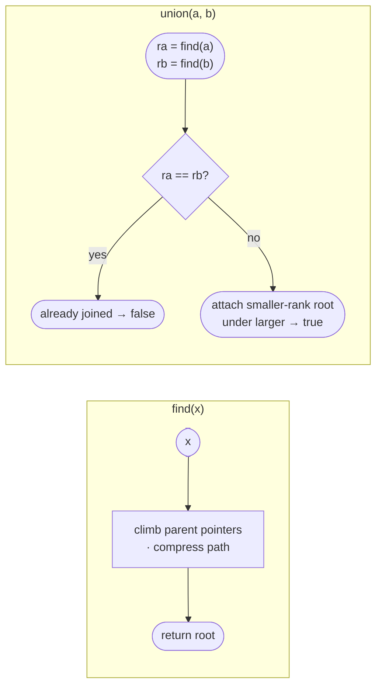

# Union-Find (Disjoint Set Union)

## Why union-find exists — the story

Imagine edges arriving one at a time: city 0 connects to city 1, account A shares an email with account B, stone x shares a row with stone y. The brute-force instinct is to rebuild the connected components with DFS/BFS after every new edge. That works for one static graph, but it repeats old work when all you need is “are these two already in the same group?”

Can we do better? Union-Find keeps one representative root per group. Each new edge either merges two roots or tells you the edge was redundant. Path compression and union by rank make those repeated membership checks nearly constant time.

*Dynamic connectivity as edges arrive.* Maintain a parent pointer per node. `find(x)` walks to the root (with path compression flattening the trail); `union(a,b)` attaches the shorter tree under the taller (union by rank). Both amortize to near-**O(1)** — inverse Ackermann.

<Callout kind="key" title="Key Insight">

Union-Find is not a *tree traversal* algorithm; it's a *set-membership* structure. When you need "are these two things in the same group?" or "how many groups?" as edges arrive, reach for it before BFS/DFS.

</Callout>


<div class="svg-figure">
<svg preserveAspectRatio="xMidYMid meet" viewBox="0 0 720 240" xmlns="http://www.w3.org/2000/svg" font-family="Segoe UI, Arial, sans-serif">
  <defs>
    <marker id="uf-ar-blue" markerWidth="9" markerHeight="9" refX="5" refY="3" orient="auto"><path d="M0,0 L6,3 L0,6 Z" fill="#2563eb"/></marker>
    <marker id="uf-ar-grn" markerWidth="9" markerHeight="9" refX="5" refY="3" orient="auto"><path d="M0,0 L6,3 L0,6 Z" fill="#16a34a"/></marker>
    <filter id="uf-s1" x="-10%" y="-10%" width="120%" height="140%"><feDropShadow dx="0" dy="1.2" stdDeviation="1.2" flood-color="#94a3b8" flood-opacity="0.5"/></filter>
  </defs>
  <rect x="0" y="0" width="720" height="240" fill="#fbfcfe"/>
  <rect x="18" y="32" width="320" height="178" rx="9" fill="#f8fafc" stroke="#d9dee7"/>
  <text x="178" y="56" text-anchor="middle" font-size="12" font-weight="700" fill="#dc2626">before compression: a long parent chain</text>
  <g stroke="#2563eb" stroke-width="2" marker-end="url(#uf-ar-blue)">
    <line x1="78" y1="152" x2="122" y2="124"/><line x1="140" y1="116" x2="184" y2="94"/><line x1="203" y1="88" x2="246" y2="74"/><line x1="267" y1="72" x2="294" y2="72"/>
  </g>
  <g filter="url(#uf-s1)" text-anchor="middle" font-size="14" font-weight="700">
    <circle cx="64" cy="160" r="21" fill="#fff" stroke="#93c5fd" stroke-width="1.5"/><text x="64" y="165" fill="#0b1220">a</text>
    <circle cx="128" cy="120" r="21" fill="#fff" stroke="#93c5fd" stroke-width="1.5"/><text x="128" y="125" fill="#0b1220">b</text>
    <circle cx="192" cy="90" r="21" fill="#fff" stroke="#93c5fd" stroke-width="1.5"/><text x="192" y="95" fill="#0b1220">c</text>
    <circle cx="256" cy="72" r="21" fill="#fff" stroke="#93c5fd" stroke-width="1.5"/><text x="256" y="77" fill="#0b1220">d</text>
    <rect x="292" y="51" width="36" height="42" rx="9" fill="#eff6ff" stroke="#2563eb" stroke-width="1.7"/><text x="310" y="77" fill="#0b1220">root</text>
  </g>
  <text x="178" y="196" text-anchor="middle" font-size="11" fill="#5b6472">find(a) walks a → b → c → d → root</text>
  <line x1="354" y1="118" x2="388" y2="118" stroke="#16a34a" stroke-width="2.4" marker-end="url(#uf-ar-grn)"/>
  <text x="371" y="101" text-anchor="middle" font-size="11" font-weight="700" fill="#16a34a">find(a)</text>
  <rect x="404" y="32" width="298" height="178" rx="9" fill="#f8fafc" stroke="#d9dee7"/>
  <text x="553" y="56" text-anchor="middle" font-size="12" font-weight="700" fill="#16a34a">after compression: everyone points to root</text>
  <g stroke="#16a34a" stroke-width="2" marker-end="url(#uf-ar-grn)">
    <line x1="474" y1="156" x2="534" y2="86"/><line x1="520" y1="156" x2="546" y2="88"/><line x1="586" y1="156" x2="564" y2="88"/><line x1="632" y1="156" x2="574" y2="86"/>
  </g>
  <g filter="url(#uf-s1)" text-anchor="middle" font-size="14" font-weight="700">
    <rect x="535" y="48" width="44" height="42" rx="9" fill="#eff6ff" stroke="#2563eb" stroke-width="1.7"/><text x="557" y="74" fill="#0b1220">root</text>
    <circle cx="462" cy="170" r="20" fill="#f0fdf4" stroke="#16a34a" stroke-width="1.5"/><text x="462" y="175" fill="#0b1220">a</text>
    <circle cx="514" cy="170" r="20" fill="#f0fdf4" stroke="#16a34a" stroke-width="1.5"/><text x="514" y="175" fill="#0b1220">b</text>
    <circle cx="592" cy="170" r="20" fill="#f0fdf4" stroke="#16a34a" stroke-width="1.5"/><text x="592" y="175" fill="#0b1220">c</text>
    <circle cx="644" cy="170" r="20" fill="#f0fdf4" stroke="#16a34a" stroke-width="1.5"/><text x="644" y="175" fill="#0b1220">d</text>
  </g>
  <text x="553" y="196" text-anchor="middle" font-size="11" fill="#5b6472">future finds jump straight to the representative</text>
</svg>
</div>


<div class="readfig"><b>How to read it:</b> Before compression, <code>find(a)</code> has to climb every parent pointer until it reaches the representative root. On the return trip, path compression rewrites each visited node's parent to the root. The set membership is unchanged, but future <code>find</code> calls on <b>a</b>, <b>b</b>, <b>c</b>, or <b>d</b> are nearly instant.</div>

## When to use it — dynamic connectivity

### Recognize by
- *dynamic connectivity* — edges arrive over time; answer "same group?" as they do
- "count connected components / groups / islands"
- "redundant connection" (find the edge that creates a cycle)

### When NOT to use it
You need to *walk* the components (traversal, distances, colouring) — Union-Find only tells you set membership, not adjacency. Also, if you must **remove** edges (not just add), Union-Find doesn't support that natively — either process events offline in reverse or use link-cut trees.

---

## Union-Find (Disjoint Set Union) <span class="diff diff-m">Medium</span>

*[↗ LeetCode: Number of Provinces](https://leetcode.com/problems/number-of-provinces/)*

<ProgressCheck id="union-find-disjoint-set-union" />


<div class="svg-figure">
<svg preserveAspectRatio="xMidYMid meet" viewBox="0 0 400 250" xmlns="http://www.w3.org/2000/svg" font-family="var(--dsa-font)">
  <defs>
    <marker id="ar-uf-primary" markerWidth="9" markerHeight="9" refX="6" refY="3" orient="auto">
      <path d="M0,0 L6,3 L0,6 Z" fill="var(--dsa-primary)"/>
    </marker>
  </defs>
  <rect x="0" y="0" width="400" height="250" rx="12" fill="var(--dsa-bg)"/>
  <text x="200" y="27" text-anchor="middle" font-size="12" font-weight="700" fill="var(--dsa-primary)">union links representatives, not every node</text>
  <text x="93" y="51" text-anchor="middle" font-size="11.5" font-weight="700" fill="var(--dsa-neutral)">before: {0,1,2} and {3}</text>
  <g stroke="var(--dsa-neutral)" stroke-width="2" fill="none">
    <line x1="93" y1="83" x2="62" y2="124"/><line x1="93" y1="83" x2="124" y2="124"/>
  </g>
  <g text-anchor="middle" font-size="15" font-weight="700" fill="var(--dsa-ink)">
    <circle cx="93" cy="70" r="18" fill="var(--dsa-primary-soft)" stroke="var(--dsa-primary)" stroke-width="1.6"/><text x="93" y="75">2</text>
    <circle cx="62" cy="142" r="18" fill="var(--dsa-neutral-soft)" stroke="var(--dsa-neutral-line)" stroke-width="1.6"/><text x="62" y="147">0</text>
    <circle cx="124" cy="142" r="18" fill="var(--dsa-neutral-soft)" stroke="var(--dsa-neutral-line)" stroke-width="1.6"/><text x="124" y="147">1</text>
    <circle cx="164" cy="98" r="18" fill="var(--dsa-success-soft)" stroke="var(--dsa-success)" stroke-width="1.6"/><text x="164" y="103">3</text>
  </g>
  <line x1="192" y1="112" x2="244" y2="112" stroke="var(--dsa-primary)" stroke-width="2" marker-end="url(#ar-uf-primary)"/>
  <text x="218" y="99" text-anchor="middle" font-size="11.5" font-weight="700" fill="var(--dsa-primary)">union(2,3)</text>
  <text x="310" y="51" text-anchor="middle" font-size="11.5" font-weight="700" fill="var(--dsa-neutral)">after: {0,1,2,3}</text>
  <g stroke="var(--dsa-neutral)" stroke-width="2" fill="none">
    <line x1="310" y1="83" x2="267" y2="136"/><line x1="310" y1="83" x2="310" y2="136"/><line x1="310" y1="83" x2="353" y2="136"/>
  </g>
  <g text-anchor="middle" font-size="15" font-weight="700" fill="var(--dsa-ink)">
    <circle cx="310" cy="70" r="18" fill="var(--dsa-primary-soft)" stroke="var(--dsa-primary)" stroke-width="1.6"/><text x="310" y="75">2</text>
    <circle cx="267" cy="154" r="18" fill="var(--dsa-neutral-soft)" stroke="var(--dsa-neutral-line)" stroke-width="1.6"/><text x="267" y="159">0</text>
    <circle cx="310" cy="154" r="18" fill="var(--dsa-neutral-soft)" stroke="var(--dsa-neutral-line)" stroke-width="1.6"/><text x="310" y="159">1</text>
    <circle cx="353" cy="154" r="18" fill="var(--dsa-success-soft)" stroke="var(--dsa-success)" stroke-width="1.6"/><text x="353" y="159">3</text>
  </g>
  <text x="200" y="224" text-anchor="middle" font-size="11.5" font-style="italic" fill="var(--dsa-neutral)">find compresses paths; union links by rank</text>
</svg>
</div>


<div class="readfig"><b>How to read it:</b> Union first finds each set's root, then attaches one root under the other; later finds can compress paths so all members jump straight to the representative.</div>

### Problem
Given an `n×n` friendship matrix, count the number of **provinces** — connected groups of directly or indirectly connected people.

**Constraints:** `1 ≤ n ≤ 200`; matrix symmetric with `1` on the diagonal.

**Example 1:** `[[1,1,0],[1,1,0],[0,0,1]]` → `2`.

**Example 2:** `[[1,0,0],[0,1,0],[0,0,1]]` → `3` because every city is isolated.

### Solution — brute force
Brute force for provinces is to run DFS/BFS over the friendship matrix, marking every connected city once. That solves this static problem in O(n²) time and O(n) space, which is fine for a single matrix but does not support many online connectivity checks elegantly. Union-Find turns each friendship into a merge and answers group membership through roots, with path compression and rank keeping operations effectively constant.


```text
visited = set()
provinces = 0
for each city i:
    if i is unvisited:
        provinces++
        DFS/BFS through every j where isConnected[i][j] == 1
return provinces
```


Brute force complexity: O(n²) time to scan the matrix and O(n) space for visited/search state.

### Solution — optimized
Forest of parent pointers with **path compression** + **union by rank/size** → α(n) amortized per operation.

<Callout kind="inv" title="Invariant">

Every element in a set points (eventually) to one canonical root; `find` returns and compresses toward it.

</Callout>





<div class="figcap">Union-Find — path compression flattens trees; union-by-rank keeps them shallow, giving ~O(1) ops.</div>
<div class="readfig"><b>How to read it:</b> Each group is a little tree, and the node at the top (the root) is the group's name. `find(x)` walks up parent links to that root, and along the way it re-points nodes straight at the root — "path compression" — so next time is instant. `union(a,b)` finds both roots; if they're the same, a and b are already together, otherwise it hangs the shorter tree under the taller one so things stay flat. These two tricks make every operation effectively constant time.</div>

#### Java


```java
class DSU {
    int[] parent, rank;
    DSU(int n) {
        parent = new int[n]; rank = new int[n];
        for (int i = 0; i < n; i++) parent[i] = i;
    }
    int find(int x) {
        while (parent[x] != x) { parent[x] = parent[parent[x]]; x = parent[x]; } // path compression
        return x;
    }
    boolean union(int a, int b) {
        int ra = find(a), rb = find(b);
        if (ra == rb) return false;                    // already connected (a cycle in undirected)
        if (rank[ra] < rank[rb]) { int t = ra; ra = rb; rb = t; }
        parent[rb] = ra;
        if (rank[ra] == rank[rb]) rank[ra]++;
        return true;
    }
}
```


<Callout kind="note" title="Trace it">

`isConnected=[[1,1,0],[1,1,0],[0,0,1]]`. Union cities 0 and 1 (they share an edge); city 2 stays alone → **2** provinces (2 disjoint sets).

</Callout>

### Time Complexity
Time O(n² · α(n)) for scanning the matrix and unioning friendships; each DSU operation is effectively constant.

### Space Complexity
Space O(n) for the parent and rank arrays.

### Learning notes
- Why initialize `parent[i] = i`? — every city starts as its own representative.
- Why path compression in `find`? — it flattens future root lookups.
- Why union by rank? — attaching shorter trees under taller ones keeps finds shallow.
- Why return `false` when roots match? — the two nodes were already in the same component.
- Why count roots/components after unions? — provinces are connected components, not direct friendships.
- Why DSU over traversal? — it shines when connectivity merges or repeated same-set checks arrive online.

Additional notes:

Near O(α(n)) per op ≈ O(1).

<Callout kind="note" title="Interview script">

"I first confirm the matrix represents undirected connectivity and I only need the number of connected groups. I start with brute force DFS or BFS over the matrix, which is O(n²) time and O(n) space. I optimize for repeated connectivity work with DSU path compression and union by rank, giving near O(1) amortized operations after scanning the O(n²) matrix."

</Callout>


<Callout kind="trap" title="Common Trap">

Union without rank/size. *Example:* union(1,2), union(2,3), union(3,4)... chains linearly if you always attach the same way → `find(1)` walks all n nodes. Union **by rank** (attach shorter to taller) keeps the tree flat.

</Callout>

<Callout kind="pat" title="Pattern Connection">

DSU is the engine for *Number of Provinces*, *Accounts Merge* (union by shared email), *Redundant Connection* (the edge that first connects an already-connected pair), and Kruskal's MST. A `union` that returns false in an undirected graph means you just closed a cycle.

</Callout>

#### Same pattern, new tweaks

"Merge things and ask 'are these two in the same group?' in near-O(1)":

| Variation | The one thing that changes | Time |
|---|---|---|
| [Number of Provinces](https://leetcode.com/problems/number-of-provinces/) | union adjacent friends; the answer is the count of distinct roots | — |
| [Accounts Merge](https://leetcode.com/problems/accounts-merge/) | union accounts that share any email, then group emails by root | — |
| [Redundant Connection](https://leetcode.com/problems/redundant-connection/) | the answer is the first edge whose two endpoints are *already* connected | — |
| [Number of Islands II](https://leetcode.com/problems/number-of-islands-ii/) | online — union each newly added land cell with its neighbours, tracking the component count | — |
| [Most Stones Removed](https://leetcode.com/problems/most-stones-removed-with-same-row-or-column/) | union stones sharing a row or column; removable = total − components | — |


## Minimum Spanning Tree — Kruskal + Union-Find <span class="diff diff-m">Medium</span>

*[↗ LeetCode: Min Cost to Connect All Points](https://leetcode.com/problems/min-cost-to-connect-all-points/)*

<ProgressCheck id="minimum-spanning-tree-kruskal-union-find" />

### Problem
Given points on a plane, connect **all** of them with minimum total cost, where an edge's cost is the Manhattan distance — i.e. build a minimum spanning tree.

**Constraints:** `1 ≤ n ≤ 1000`.

**Example 1:** choosing the cheapest cycle-free edges (e.g. weights `2,3,4,5`) → their sum.

**Example 2:** `points = [[3,12],[-2,5],[-4,1]]` → `18` for the minimum Manhattan connection cost.

### Solution — brute force
Brute force would try combinations of edges until it finds a connected cycle-free set of `V-1` edges with minimum total weight. That is exponential in the number of edges and only useful as a correctness definition. Kruskal's optimization sorts edges by weight and uses Union-Find to accept exactly the cheapest edges that connect different components, relying on the cut property instead of enumerating trees.


```text
best = infinity
for each subset of edges with V - 1 edges:
    if the subset connects all vertices and has no cycle:
        best = min(best, total weight)
return best
```


Brute force complexity: exponential in E because it enumerates candidate spanning trees.

### Solution — optimized
Sort edges ascending; add an edge iff it joins two different components (no cycle). Union-Find tests connectivity in near-O(1).

<Callout kind="inv" title="Invariant">

The chosen edges always form a forest; adding the globally-cheapest cross-component edge is safe (cut property).

</Callout>

#### Java


```java
int minCostMST(int n, int[][] edges) {                // edges: {u, v, w}
    Arrays.sort(edges, (a, b) -> a[2] - b[2]);
    DSU dsu = new DSU(n);
    int cost = 0, used = 0;
    for (int[] e : edges) {
        if (dsu.union(e[0], e[1])) { cost += e[2]; if (++used == n - 1) break; }
    }
    return used == n - 1 ? cost : -1;                 // -1 if disconnected
}
```


<Callout kind="note" title="Trace it">

points where the cheapest edges are `2, 3, 4, 5`. Kruskal adds them cheapest-first, skipping any edge whose two endpoints are already connected, until all points form one tree.

</Callout>

### Time Complexity
Time O(E log E). Sorting edges dominates; DSU checks are near O(1) amortized.

### Space Complexity
Space O(V) for DSU state, assuming the edge list is already materialized.

### Learning notes
- Why sort edges by weight? — Kruskal must consider the cheapest safe edge first.
- Why call `dsu.union` before adding cost? — a false return means the edge would create a cycle.
- Why stop at `n - 1` edges? — any connected tree on n vertices has exactly n−1 edges.
- Why return `-1` if not enough edges were used? — the graph was disconnected.
- Why Union-Find here? — it answers “already connected?” fast while the forest grows.
- Why the cut property matters? — the cheapest edge crossing any component cut is safe to add.

Additional notes:

Time O(E log E) · Space O(V).

<Callout kind="note" title="Interview script">

"I first confirm the graph is undirected and I need the minimum-cost way to connect all vertices. I start with brute force by enumerating possible spanning trees, which is exponential in the edge count. I optimize with Kruskal: sort edges and use DSU to skip cycles, giving O(E log E) time and O(V) space."

</Callout>


<Callout kind="pat" title="Pattern Connection">

*Min Cost to Connect All Points* (build a complete graph of Manhattan distances, then Kruskal/Prim). Prim (grow one tree with a min-heap) is the alternative, better on dense graphs.

</Callout>

<Callout kind="trap" title="Common Trap">

Adding before union-check. *Example:* edges `[(A,B,1),(B,C,2),(A,C,3)]`. After adding the first two, A-B-C are connected. If you add `(A,C,3)` without `find(A) != find(C)`, you form a cycle and inflate the total. Trust `union`'s return.

</Callout>

#### Same pattern, new tweaks

"Add the cheapest edge that joins two components" (Kruskal) or "grow one tree by its cheapest border edge" (Prim):

| Variation | The one thing that changes | Time |
|---|---|---|
| [Min Cost to Connect All Points](https://leetcode.com/problems/min-cost-to-connect-all-points/) | the graph is implicit — every pair of points is an edge weighted by Manhattan distance | — |
| [Connecting Cities With Minimum Cost](https://leetcode.com/problems/connecting-cities-with-minimum-cost/) | plain Kruskal on the given edge list; return −1 if it stays disconnected | — |
| [Optimize Water Distribution in a Village](https://leetcode.com/problems/optimize-water-distribution-in-a-village/) | model each well as an edge from a virtual node 0, then run MST | — |
| [Find Critical and Pseudo-Critical Edges](https://leetcode.com/problems/find-critical-and-pseudo-critical-edges-in-minimum-spanning-tree/) | rerun MST forcing each edge in / leaving it out to classify it | — |

---

## 🧠 Check your understanding

<Quiz patternId="union-find" :questions='[
  {
    "q": "You repeatedly ask whether two items are already in the same group. Which structure fits?",
    "choices": [
      {
        "text": "Union-Find",
        "correct": true,
        "explanation": "Yes. It maintains disjoint sets with fast find and union operations."
      },
      {
        "text": "Monotonic stack"
      },
      {
        "text": "K-way merge"
      },
      {
        "text": "Digit DP"
      }
    ]
  },
  {
    "q": "Which two optimizations make Union-Find nearly constant amortized time?",
    "choices": [
      {
        "text": "Path compression and union by rank",
        "correct": true,
        "explanation": "Correct. Together they keep trees shallow across many operations."
      },
      {
        "text": "Sorting and binary search"
      },
      {
        "text": "Memoization and tabulation"
      },
      {
        "text": "Pivoting and partitioning"
      }
    ]
  },
  {
    "q": "In Kruskal MST, when should an edge be added to the answer?",
    "choices": [
      {
        "text": "Whenever it is the largest edge"
      },
      {
        "text": "Only if union succeeds",
        "correct": true,
        "explanation": "Right. A failed union means the endpoints were already connected, so the edge would create a cycle."
      },
      {
        "text": "Before checking connectivity",
        "explanation": "That is the common cycle bug."
      },
      {
        "text": "Only after all edges are scanned"
      }
    ]
  }
]' />
